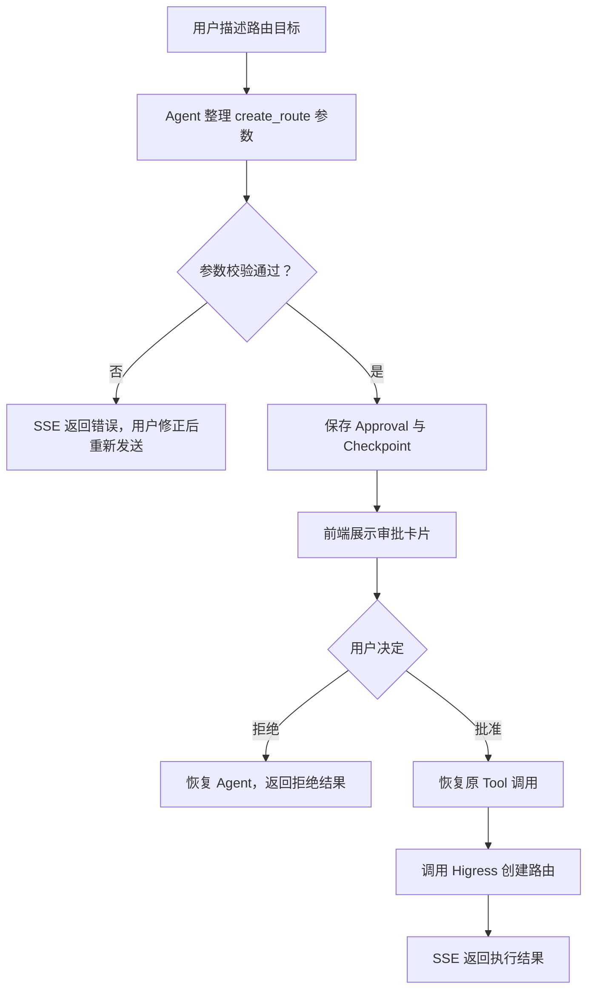

# 01 企业级 AI 网关运维智能体产品需求文档

## 1. 产品定义

Gateway Agent 是部署在企业环境中的 AI 网关运维助手。一套 Gateway Agent 只绑定一套逻辑 Gateway。用户通过对话描述查询或变更目标，Agent 使用受控 Tool 读取真实网关状态；涉及写入时，必须把完整参数展示给用户，并在用户明确批准后执行。

当前产品不是“能做所有事情的通用 Agent”，而是先把一条真实链路做正确：

> 查询 Higress 路由，并在对话审批后创建一条路由。

这条链路同时验证对话、模型配置、实时输出、Tool 调用、人工审批、运行状态恢复和真实网关适配器。后续能力必须建立在这条链路的真实反馈上，不提前建立没有调用方的表、接口或服务。

## 2. 客户问题

企业的网关运维信息通常分散在控制台、文档、群聊和个人经验中。一个看似简单的“给订单服务配条路由”可能要求用户完成以下工作：

- 找到正确的 Gateway 和环境；
- 确认域名、路径、服务名称、端口和权重；
- 了解控制台字段和约束；
- 避免把测试配置写入生产；
- 找同事确认具体变更内容；
- 执行后再回到控制台检查结果。

客户真正需要的不是一个“会聊天的控制台”，而是一个满足以下条件的受控操作入口：

1. 能读取真实状态，不依赖模型记忆猜测；
2. 能把自然语言转成结构化参数；
3. 在写入前让用户看清楚将要发生什么；
4. 未经批准绝不执行；
5. 能明确区分“用户批准”和“网关执行成功”；
6. 对话结束后仍保留完整消息和审批记录。

## 3. 目标用户

### 3.1 平台管理员

维护 Higress 和 Gateway Agent 的连接信息、默认模型和可选模型配置，关注凭证安全与服务可用性。

### 3.2 SRE 和网关运维人员

通过对话查询路由、创建路由并核对结果。他们了解业务目标，但不一定熟悉 Higress Console API 的每个字段。

### 3.3 应用研发人员

知道服务名、端口、域名和路径，希望用更低的沟通成本完成网关接入。当前版本没有身份和权限体系，因此还不能直接面向无约束的普通研发开放生产写入。

## 4. 当前产品目标

当前目标是让用户完成下面两个完整场景。

### 4.1 查询路由

用户可以按路由名称或域名询问当前网关配置。Agent 必须调用 `query_routes` Tool 获取 Higress 实时数据，再组织回答。

示例：

> 用户：`shop.example.com` 现在有哪些路由？
>
> Agent：调用 Higress 查询，并返回匹配路由、路径、后端和权重。

模型不得把训练数据、旧消息或臆测当作网关当前状态。

### 4.2 创建路由

用户可以通过多轮对话给出路由名称、域名、路径、方法和后端。模型提交 `create_route` 后，系统不能立即写 Higress，而是生成待审批操作。

审批卡片至少必须展示：

- 操作类型；
- 路由名称；
- 域名；
- 路径类型和值；
- HTTP 方法；
- 后端服务、端口和权重；
- 批准和拒绝入口。

## 5. 当前用户体验

### 5.1 创建 Chat

用户创建 Chat 时可以：

- 不传 `model_config_id`，使用服务端默认模型；
- 选择一个已保存的模型配置。

一个 Chat 在后续消息中固定使用创建时选择的模型配置。当前没有在同一 Chat 中切换模型的接口。

### 5.2 发送消息

发送消息接口直接返回 SSE，不需要先发送消息再建立独立订阅。这样浏览器的一次请求同时承担：

- 保存用户消息；
- 运行 Agent；
- 接收文本分片；
- 接收完整 Assistant 消息；
- 接收待审批卡片。

### 5.3 查看历史

用户消息和完整 Assistant 回复保存在 MySQL。模型生成中的 Token 分片只用于实时显示，不逐条写库。

如果一次运行在等待审批时暂停，该次回复不会伪造一条 Assistant 完成消息；前端通过 `approval_required` 事件展示待审批操作。

### 5.4 处理审批

用户批准或拒绝后，决定接口继续使用 SSE：

- 拒绝：Agent 收到拒绝结果，并生成最终回复；
- 批准：原来的 `create_route` Tool 执行，再由 Agent 生成最终回复；
- 重复决定同一审批：返回 `409 APPROVAL_ALREADY_DECIDED`；
- 执行失败：审批仍表示用户已经批准，具体失败通过 SSE `error` 返回。

## 6. 当前功能需求

### FR-01 Chat 管理

- 创建 Chat；
- 查询 Chat；
- Chat 可选择一个模型配置；
- 使用不存在的模型配置创建 Chat 时返回明确错误。

### FR-02 Message 管理

- 保存用户消息；
- Assistant 完整回复完成后保存；
- 按消息 ID 游标查询历史；
- 单条用户消息不能为空且不能超过 60 KiB；
- 单次历史查询数量为 1～200。

### FR-03 模型配置

- 创建、列表、详情、更新和删除模型配置；
- 单独替换或清除 API Key；
- API 响应永不返回 API Key 明文或密文；
- API Key 使用 AES-256-GCM 加密后写入 MySQL；
- 被 Chat 使用的模型配置不能删除；
- 支持 OpenAI、DeepSeek、Qwen、Claude、Gemini、Ollama 和 Ark。

### FR-04 Agent 回复

- 使用 Eino ADK 执行模型与 Tool 循环；
- 通过 SSE 输出文本增量；
- 最终完整消息写库成功后输出 `completed`；
- Agent 最大迭代次数由配置控制；
- 系统提示词必须禁止模型伪造网关实时状态和执行结果。

### FR-05 路由查询

- 支持按精确路由名称查询；
- 支持按域名分页查询；
- 未找到精确名称时返回空列表，不把它当作系统故障；
- Higress 依赖错误不能伪装成查询成功。

### FR-06 路由创建

- 路由名称不能为空；
- 路径类型只接受 `PRE`、`EQUAL`、`REGULAR`；
- 路径值不能为空；
- 后端至少一个；
- 端口范围为 1～65535；
- 每个后端权重大于 0，所有后端权重总和为 100；
- 参数校验通过后仍必须先审批，不能直接写 Higress。

### FR-07 审批与恢复

- 保存审批操作、完整参数、恢复目标和 Eino 运行状态；
- 只查询当前 Chat 的 `pending` 审批；
- 审批决定必须原子地从 `pending` 更新为 `approved` 或 `rejected`；
- 同一审批只能决定一次；
- Chat Service 重启后仍可以使用数据库中的运行状态恢复；
- 审批记录不暴露内部 Checkpoint。

## 7. 非功能要求

### 7.1 安全

- 未经批准的写 Tool 调用数必须为 0；
- 模型 API Key 不得出现在列表、详情、日志和模型上下文中；
- 服务端内部错误只记录在英文日志中，客户端只收到安全错误信息；
- Higress 凭证通过环境变量覆盖配置文件；
- 当前没有认证和 RBAC，部署方不得把接口直接暴露到不可信网络。

### 7.2 一致性

- 用户消息必须先写入 MySQL，再调用模型；
- Assistant 完整消息必须先写入 MySQL，再发送 `completed`；
- Approval 必须先写入 MySQL，再发送 `approval_required`；
- 审批状态只表达用户决定，不冒充执行结果。

### 7.3 可维护性

- HTTP 使用 Gin 绑定和 DTO `Validate`；
- Handler 不承载业务流程；
- Service 不暴露 Eino 或 Higress 私有类型；
- Store 只负责具体存储和外部系统适配；
- 不为未来功能创建空接口、空目录、占位表和多余中间结构。

## 8. 验收标准

当前垂直链路只有同时满足以下条件才算验收：

1. 用户能创建模型配置和 Chat；
2. 用户发送查询请求后看到实时文本，并能在历史中查到完整回复；
3. 查询答案来自真实 Higress；
4. 用户提出创建路由后收到包含完整参数的审批卡片；
5. 审批前 Higress 没有收到创建请求；
6. 拒绝后不会创建路由，并收到 Agent 的最终说明；
7. 批准后原 Tool 调用被恢复，Higress 收到且只收到一次创建请求；
8. Higress 成功时用户收到成功结果，失败时收到明确失败；
9. 服务重启后，待审批操作仍可查询并决定；
10. README、OpenAPI 和实现保持一致。

当前代码已经完成 1、2、4、5 的结构实现，并通过接口与持久化回归验证；使用真实模型和真实 Higress 完成 3、6、7、8、9 的端到端验收仍需有效环境凭证。

## 9. 明确未实现

以下能力是产品需求，但当前没有实现：

- Web 对话页面和审批卡片；
- 登录、身份、RBAC、审批人和审计日志；
- 独立的用户输入规范化器；
- 可解释的意图识别、置信度和追问策略；
- 版本化 Plan、Diff、风险和 Replan；
- Token 预算、上下文压缩和长期记忆召回；
- 文档、历史任务和指标的智能检索；
- Skill Registry 和 MCP；
- 路由更新、删除、回滚和执行后验证；
- 第二种网关 Adapter；
- OpenTelemetry 和 Prometheus。

这些条目不能通过增加空类型或预建表来“完成”。每项能力都要从一个可以验收的用户场景开始设计。

## 10. 产品非目标

- 共享数据库的多租户 SaaS；
- 同一实例集中管理大量异构 Gateway 的 Fleet Manager；
- 自研通用工作流引擎、消息队列或 IAM；
- 展示模型内部思考过程；
- 让模型绕过 Tool 直接请求 Higress；
- 为追求“企业级”而提前引入没有真实用途的组件。

## 11. 目标体验参考

下面的图片是长期产品工作台概念，不代表当前前端或当前字段已经实现。当前先验证对话、真实 Tool 和审批安全边界，再根据用户反馈决定是否需要 Plan、Diff、监控和回滚区域。

## 12. 下一项产品工作

当前最优先的工作不是继续增加 Agent 概念，而是：

1. 使用真实模型和 Higress 验收现有路由链路；
2. 实现最小对话页面和审批卡片，让真实用户完成操作；
3. 记录用户在哪些地方表达不完整、误触 Tool 或无法理解审批内容；
4. 根据真实问题决定先做输入规范化、上下文管理还是 Plan，而不是同时铺开。

完整的未实现能力、引入条件、开源参考和实现约束见[《06 未实现能力与实现原则》](./06-未实现能力与实现原则.md)。
