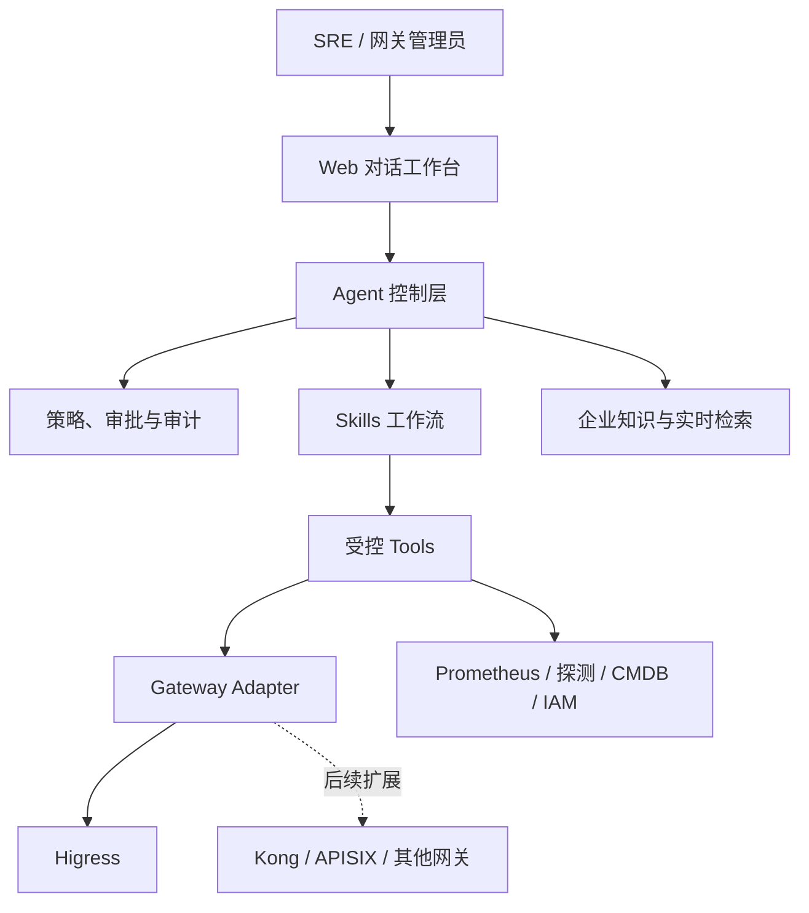
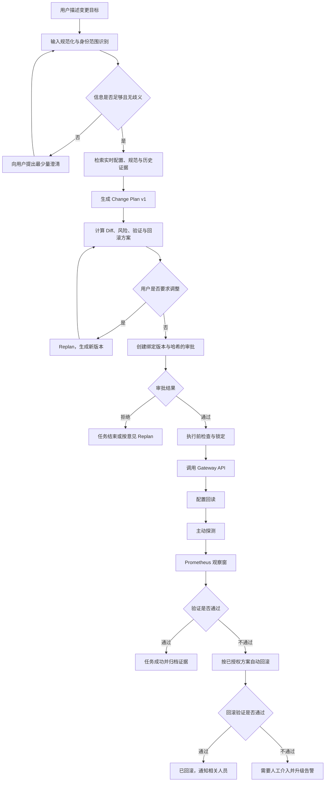
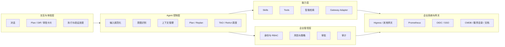
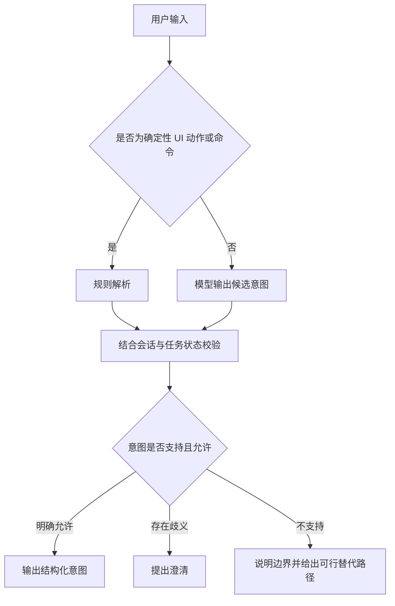
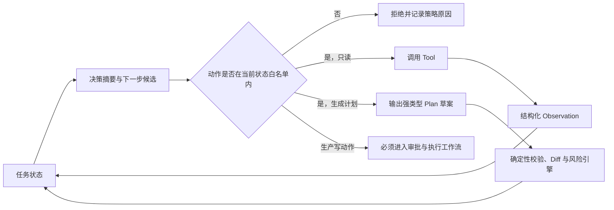
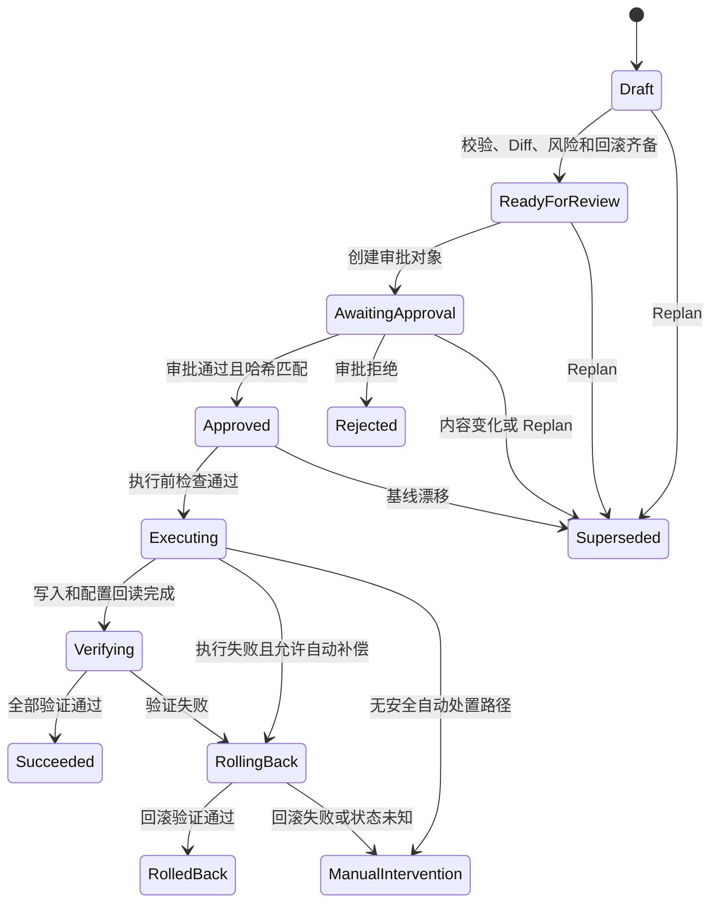
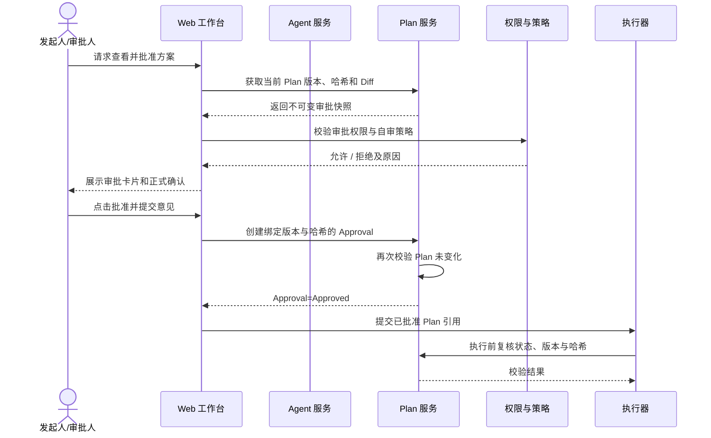
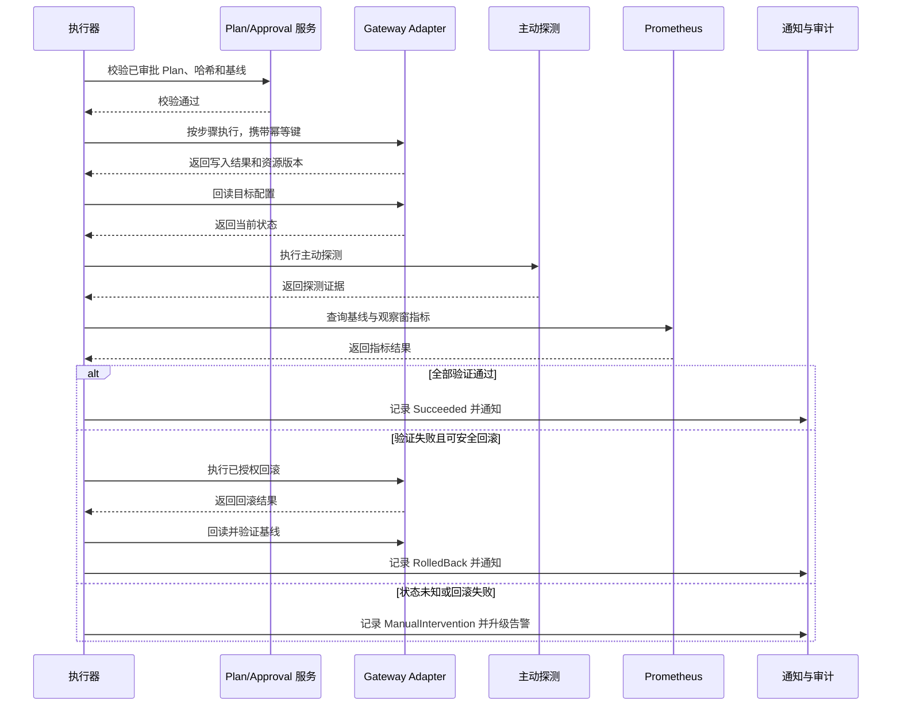
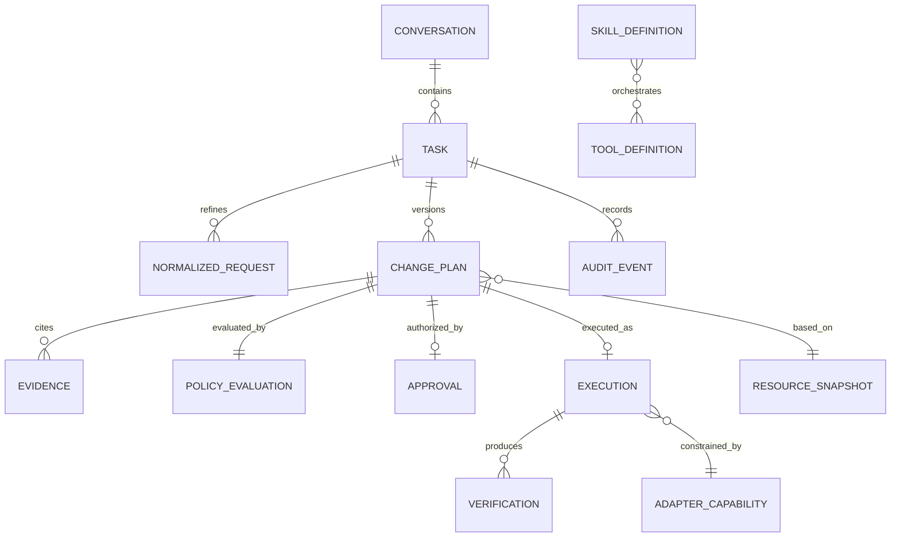
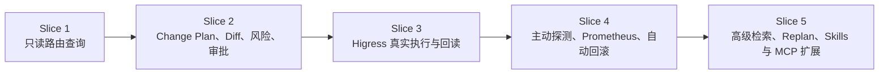

# 企业级 AI 网关运维 Agent 产品需求文档

> 当前用途：客户问题、产品能力和体验需求的详细说明。
> 设计边界：以《02-网关智能体目标产品与架构设计》为准。
> 注意：文末 Slice 路线属于早期讨论记录，不再指导实现。

> 文档版本：v0.1
> 文档状态：产品基线，待评审
> 更新日期：2026-07-16
> 目标读者：客户方网关平台负责人、SRE、安全与合规负责人、研发负责人、产品与交付团队
> 首期适配：Higress
> 实现语言：Go

---

## 1. 文档目的

本文档定义一款面向企业内网环境的 AI 网关运维 Agent。它不是一个能够绕过流程直接修改生产配置的聊天机器人，而是一套把自然语言需求转化为可检查、可审批、可执行、可验证、可回滚变更的受控运维系统。

本文档用于统一以下事项：

- 客户为什么需要该产品，以及第一阶段优先解决哪些问题；
- SRE 在产品中的操作路径、权限边界和责任边界；
- Agent 如何理解输入、识别意图、制定计划并在必要时重新规划；
- Tools、Skills、MCP 与网关 Adapter 分别承担什么职责；
- 生产写操作如何审批、执行、验证、回滚和审计；
- V1 的交付范围、成功指标、发布门槛及验收标准；
- 如何从首个可用切片扩展为支持多网关、多场景的企业级平台。

本文档不替代后续的系统架构设计、接口设计、数据模型设计和测试方案。所有技术设计必须满足本文档定义的产品规则与验收条件。

---

## 2. 已确认的产品决策

以下内容作为 v0.1 基线，不在本轮设计中反复讨论。如需变更，应记录决策原因、影响范围和迁移方案。

| 决策项 | 已确认结论 | 对产品设计的约束 |
|---|---|---|
| 主要用户 | SRE、网关平台管理员 | 交互必须提供专业信息，不把关键事实隐藏在自然语言摘要中 |
| 产品形态 | 受控 Agent + Skills | Agent 负责理解和编排，生产写操作由受控执行链完成 |
| 首要场景 | 路由创建与修改 | 首个写操作闭环围绕路由及常用治理策略展开 |
| 生产操作 | 允许，但全部写操作必须审批 | 任何绕过审批的生产变更均视为安全缺陷 |
| 审批方式 | 在对话中完成正式审批 | 自然语言仅表达意向，系统必须生成结构化审批对象 |
| 审批人 | 单人审批；具备权限的发起人可自审 | RBAC 决定是否允许自审；系统仍需留存完整审批记录 |
| 审批绑定 | Plan ID + Version + Content Hash | Plan 内容变化或 Replan 后原审批立即失效 |
| 回滚授权 | 原审批默认包含该 Plan 的自动回滚授权 | 满足回滚条件时无需再次等待人工审批，但必须通知和审计 |
| V1 治理能力 | 超时、重试、限流、认证、跨域 | 与路由配置一并纳入 Diff、风险检查、审批和验证 |
| 产品入口 | 独立 Web 对话控制台 | 对话区、证据区、计划区、Diff 区和审批区不能只靠纯文本呈现 |
| 发布方式 | 审批后直接调用 Gateway API | 不以人工复制 YAML 或登录网关控制台作为标准流程 |
| 首个 Adapter | Higress | 核心领域模型、Plan 和 Skill 不绑定 Higress CRD 或 API |
| 验证方式 | 配置回读 + 主动探测 + Prometheus | 三类证据应统一汇总为验证结论 |
| 验证规则 | 策略模板 + Agent 推荐，审批时可修改 | Agent 推荐不是最终规则，审批对象必须包含最终验证策略 |
| 身份权限 | OIDC/SSO + 多维 RBAC | 权限至少覆盖环境、实例、命名空间、资源类型和动作 |
| 部署方式 | 企业内网私有化、单租户 | 核心功能不得依赖无法替换的公网 SaaS |
| 模型策略 | 数据分级、脱敏，经 AI 网关路由到公有云或私有模型 | 敏感数据是否出域由策略决定，不由模型或用户随意决定 |
| 核心目标 | 在安全红线下提高端到端任务成功率 | 不能用“模型回答看起来合理”替代真实执行成功率 |

---

## 3. 执行摘要

企业网关变更的难点通常不在于“写出一段配置”，而在于找到正确对象、补齐上下文、判断影响、经过审批、准确执行、确认生效，并在异常时及时恢复。当前这些环节分散在工单、群聊、文档、控制台、Git 仓库、监控平台和个人经验中。一次看似简单的路由修改，经常需要多名人员反复核对。

本产品将这些环节收敛到一个对话式工作台。用户可以用自然语言提出目标，例如：

> 把生产环境 `orders-api` 的 `/v2/orders` 路由到 `orders-v2`，先放 10% 流量。超时 2 秒，只对该路径生效。变更后检查 5xx 和 P95 延迟，异常就回滚。

系统不会直接执行。它必须先完成：

1. 识别用户、环境、网关实例、目标资源与操作意图；
2. 从实时网关、内部文档、历史变更与策略库中获取证据；
3. 对缺失或冲突信息发起最少量的澄清；
4. 生成强类型、版本化、不可变的 Change Plan；
5. 展示资源 Diff、影响范围、风险、验证规则与回滚方案；
6. 创建绑定 Plan 内容哈希的正式审批对象；
7. 审批通过后调用网关 API 执行，并进行配置回读；
8. 主动探测业务路径，结合 Prometheus 指标判断是否成功；
9. 触发预设条件时自动回滚；
10. 留存从输入、证据、决策到执行结果的完整审计记录。

对客户而言，产品价值不是“少写几行 YAML”，而是缩短生产变更交付时间、降低误操作概率、把隐性经验固化为组织能力，并让每次变更都有一致、可追溯的质量标准。

---

## 4. 客户现状与业务损失

### 4.1 典型工作现状

一项生产网关变更通常经历以下过程：需求方在群聊或工单中描述目标；SRE 根据服务名、域名、路径和环境寻找对应配置；再到文档、代码仓库或监控系统补齐上下文；手工修改 YAML 或在控制台操作；找人审批；发布后查询日志和指标；发现异常时依赖个人经验回退。

这个流程存在四类长期问题：

| 问题 | 客户表现 | 直接损失 |
|---|---|---|
| 输入不完整 | 只说“给订单接口加个路由”，未说明环境、域名、路径、服务端口或验证标准 | SRE 反复追问，交付时间不可预测 |
| 信息分散 | 实时配置、负责人、服务目录、历史事故和监控面板分散在多个系统 | 容易引用过期文档或操作错误对象 |
| 变更质量依赖个人 | Diff、风险、验证和回滚由操作者自行判断 | 同类变更质量不一致，新人难以接手 |
| 过程难审计 | 群聊中的“可以”“上吧”无法证明批准的是哪一版内容 | 事故追责和合规检查缺乏可靠证据 |

### 4.2 业务损失的衡量方式

产品上线前应采集至少四周基线数据，避免用主观感受代替收益评估。

| 指标 | 定义 | 建议基线采集方式 |
|---|---|---|
| 变更前置时间 | 从需求首次提出到具备可审批 Plan 的时间 | 工单时间戳 + 发布系统记录 |
| 变更交付时间 | 从需求提出到验证结束的时间 | 对话任务记录或工单记录 |
| 人工往返次数 | 因缺少信息、理解冲突造成的问答轮次 | 抽样分析工单和群聊 |
| 变更失败率 | 执行失败、验证失败、回滚或需人工介入的变更占比 | 发布与事故系统 |
| 平均恢复时间 | 从发现变更异常到恢复稳定的时间 | 告警、回滚与恢复记录 |
| 审计证据完整率 | 能明确追溯需求、Plan、审批、执行和结果的变更占比 | 合规抽检 |

### 4.3 产品要解决的核心矛盾

客户既希望提高变更速度，也不能降低生产管控。产品必须同时满足：

- 对低风险、重复性任务减少手工步骤；
- 对高风险任务提供更多证据和更严格门禁；
- 无论模型是否稳定，生产执行边界都保持确定；
- 无论用户用什么方式表达，最终执行对象都必须结构化；
- 无论成功还是失败，系统都能给出可验证、可追溯的结果。

---

## 5. 产品愿景、定位与原则

### 5.1 产品愿景

让企业网关的每一次变更，都像一位经验丰富的 SRE 在操作：先理解目标，主动核对事实，说明风险，获得明确授权，小步执行，用数据验证，并为失败准备恢复路径。

### 5.2 产品定位

产品定位为“企业网关变更控制面之上的智能操作层”，而不是新的网关数据面，也不是替代现有 IAM、CMDB、监控和工单系统。

### 5.3 产品原则

1. **建议与执行分离。** 模型可以理解和推荐，但不能直接获得生产写权限。
2. **事实优先于推测。** 涉及目标资源、当前配置和执行结果时，以工具回读证据为准。
3. **变更必须可比较。** 所有写操作在审批前必须生成明确 Diff。
4. **审批必须绑定内容。** 审批的是具体 Plan 版本，不是一个模糊目标。
5. **执行必须可恢复。** 每个写计划必须说明回滚前置条件、恢复动作和不可逆风险。
6. **最小权限。** 用户、Agent、执行器和 Adapter 分别使用满足职责的最低权限。
7. **关键状态可确定。** Plan、审批、执行、验证和回滚由确定性状态机管理。
8. **过程可解释，证据可复核。** 保存决策摘要和引用证据，不保存模型原始思维链。
9. **网关实现可替换。** 业务计划使用统一领域模型，通过 Adapter 转换为 Higress 等具体实现。
10. **失败要显式。** 不把“请求已发送”表述为“变更成功”，不把“已回滚”混同为“执行成功”。

### 5.4 V1 非目标

- 不自动处理无法评估影响的任意 Kubernetes 资源变更；
- 不允许模型生成并直接执行任意 Shell、SQL 或脚本；
- 不在 V1 实现无人值守的生产自动审批；
- 不替代企业现有 IAM、CMDB、监控和事故管理平台；
- 不在 V1 覆盖证书全生命周期、WAF 规则管理、网关实例扩缩容和任意插件市场；
- 不承诺理解所有模糊业务术语，无法可靠消歧时必须向用户确认。

---

## 6. 用户角色与责任边界

### 6.1 核心角色

| 角色 | 目标 | 典型权限 | 最关心的问题 |
|---|---|---|---|
| SRE / 网关管理员 | 快速、安全地完成网关变更 | 查询、创建 Plan、审批、执行、回滚，范围受 RBAC 限制 | 改了什么、影响谁、失败怎么办 |
| 业务研发 | 提交变更目标、查看进度和结果 | 查询所属服务、发起请求，通常无生产执行权限 | 什么时候能生效、是否符合业务目标 |
| 平台负责人 | 维护网关规范和能力边界 | 管理策略模板、Skill、Adapter、环境和权限 | 平台是否稳定、能力能否扩展 |
| 安全与合规人员 | 确保权限、数据和审计符合制度 | 查看审计、配置策略、抽检审批 | 谁在什么依据下批准并执行了什么 |
| 系统管理员 | 管理部署、模型、身份和集成 | 系统级配置，但不默认拥有业务资源审批权 | 系统可用性、数据是否出域、集成是否正常 |

### 6.2 关键 JTBD

**当我收到一个描述不完整的网关变更需求时，**我希望系统帮我识别缺少的信息并找到可信上下文，**这样我不用在多个平台之间反复查找。**

**当我要修改生产路由时，**我希望在批准前看到当前配置、目标配置、影响对象、风险、验证和回滚方案，**这样我能够对具体内容负责，而不是对一句模糊描述负责。**

**当变更开始执行后，**我希望系统持续告诉我当前处于哪一步，并用配置和指标证明结果，**这样我不会把接口返回成功误判为业务已经稳定。**

**当验证不通过时，**我希望系统按已批准的方案及时回滚，并明确告诉我是否恢复成功，**这样故障不会因等待二次授权而扩大。**

**当需要复盘或审计时，**我希望通过任务编号还原输入、证据、各版 Plan、审批人、执行动作和结果，**这样组织可以改进规则，而不是依赖个人记忆。**

### 6.3 权责边界

- Agent 对信息归纳、方案建议和风险提示负责，但不代替审批人承担业务决策责任；
- 审批人对批准的 Plan 内容、验证阈值和回滚策略负责；
- 执行器对“只执行已审批内容”、幂等和结果记录负责；
- Gateway Adapter 对统一领域对象与具体网关实现的正确转换负责；
- 资源真实状态以目标系统回读为准；
- 若目标系统状态无法确认，任务不得标记为成功。

---

## 7. 场景优先级与版本范围

### 7.1 场景分级

| 优先级 | 场景 | V1 处理方式 |
|---|---|---|
| P0 | 查询路由、后端、治理策略和状态 | 支持自然语言查询与结构化结果 |
| P0 | 创建路由 | 完整 Plan、Diff、审批、执行、验证、回滚闭环 |
| P0 | 修改路由匹配、后端、权重 | 完整闭环；高影响修改提高风险等级 |
| P0 | 配置超时、重试、限流、认证、跨域 | 作为路由关联策略统一管理 |
| P0 | 变更后配置回读和主动探测 | 强制执行，不可由普通用户关闭 |
| P0 | Prometheus 指标验证与自动回滚 | 支持模板化规则和审批时调整 |
| P1 | 路由删除 | V1 可保留能力接口；默认不开放或采用更高风险规则 |
| P1 | 批量路由变更 | 先限制批量规模，并要求逐资源 Diff 和整体影响汇总 |
| P1 | 历史相似变更推荐 | 作为检索证据，不直接复制执行 |
| P2 | TLS、插件、WAF、全局策略 | 领域模型预留，后续独立 Skill 交付 |
| P2 | 网关实例管理、扩缩容和升级 | 不属于路由变更 Skill，后续单独设计 |
| P2 | 多租户 SaaS | V1 不支持；部署架构避免形成不可迁移障碍 |

### 7.2 V1 功能边界

V1 的“支持”必须指完整闭环支持，不能只做到模型能生成配置。完整闭环至少包括：查询、计划、Diff、风险、审批、执行、回读、探测、指标验证、回滚、审计。

V1 支持以下资源组合：

- 一个或多个域名；
- 精确、前缀及网关实现支持的标准路径匹配；
- HTTP/HTTPS 路由到已存在的后端服务；
- 后端权重调整；
- 路由级超时、重试、限流、认证与跨域策略；
- 在授权范围内创建和修改；
- 对关联资源的只读查询和影响分析。

V1 默认限制：

- 单个 Plan 最多修改 20 个逻辑资源；超过限制需拆分；
- 不允许通过文本工具注入未声明的底层网关字段；
- 不允许修改 Adapter 未声明支持的能力；
- 不允许将无法生成回滚快照的生产写操作提交审批；
- 不允许在目标网关健康状态未知时开始生产写操作。

---

## 8. 端到端客户旅程

### 8.1 标准变更流程

### 8.2 用户在每个阶段必须看到的信息

| 阶段 | 用户看到的核心内容 | 用户可做的动作 |
|---|---|---|
| 理解中 | 系统识别出的环境、网关、域名、路径、后端和目标 | 确认、补充或纠正 |
| 检索中 | 正在访问哪些数据源、是否存在不可用数据源 | 等待、取消或提供替代证据 |
| 待完善 | 缺失字段、冲突事实及其影响 | 回答澄清问题 |
| 待审批 | Plan 摘要、逐资源 Diff、风险、验证阈值、回滚方案、哈希 | 修改计划、批准或拒绝 |
| 执行中 | 当前步骤、已完成动作、执行对象、耗时 | 查看详情；高风险情况下可请求中止后续步骤 |
| 验证中 | 配置回读、探测结果、指标曲线、剩余观察时间 | 查看证据；有权限者可触发人工回滚 |
| 已结束 | `Succeeded`、`RolledBack` 或 `ManualIntervention`，以及原因 | 导出报告、发起后续任务 |

### 8.3 体验要求

- 用户不需要记住严格命令格式，但可以使用结构化快捷语法提高效率；
- 对话中的每个事实应标明来源或明确标记为用户输入、系统推断、实时回读；
- 关键对象名称不可只展示内部 ID，应同时展示环境、实例、命名空间等上下文；
- 审批前禁止折叠高风险 Diff、验证规则和回滚影响；
- 长任务刷新页面后可继续查看，不能因 WebSocket 断开而丢失状态；
- 所有任务拥有唯一编号，可复制链接交接给其他有权限人员。

---

## 9. 产品能力全景

能力划分遵循一个原则：模型可以参与不确定性较高的理解和推理，但越靠近生产执行，输入和状态必须越结构化、越可验证。

---

## 10. 用户输入规范化

### 10.1 客户问题

用户的输入通常混合目标、事实、假设和口语简称。例如“把线上订单切 10% 到新版，失败就撤”，其中“线上”“订单”“新版”“失败”都可能对应多个实际对象或不同判定标准。如果系统直接据此生成配置，会把语言歧义带入生产操作。

### 10.2 产品规则

系统必须将用户输入转换为 `NormalizedRequest`，至少包含：

| 字段 | 示例 | 规则 |
|---|---|---|
| request_type | `change_route` | 由意图识别输出，必须落在支持的类型集合中 |
| environment | `prod-cn` | 必须映射到系统登记的环境 |
| gateway_instance | `higress-prod-01` | 用户未指定时，可按权限和资源归属推荐，但须展示 |
| namespace / scope | `commerce` | 必须明确资源隔离范围 |
| resource_identity | 域名 + 路径 + 路由名 | 必须能唯一定位或进入澄清 |
| desired_state | 后端、权重、策略 | 仅保留领域模型支持的字段 |
| constraints | 变更窗口、不可中断等 | 用户明确限制不得在后续步骤中静默丢失 |
| validation_intent | 5xx、P95、业务探测 | 可由模板补齐，但必须在审批时确定 |
| rollback_intent | 自动回滚 | 生产写操作默认要求存在 |
| user_terms | “订单”“新版”等原始词 | 保存映射关系，便于用户复核 |

规范化过程必须区分四种信息状态：

- `Explicit`：用户明确提供；
- `Resolved`：通过权威数据源解析；
- `Inferred`：系统推断，必须展示置信度和依据；
- `Missing`：缺失且会阻止下一步。

系统不得把低置信度推断直接升级为已确认事实。涉及生产环境、目标资源、写入范围的字段，若无法通过唯一映射或权威数据源确认，必须澄清。

### 10.3 验收条件

- 给定包含别名的请求，系统能够展示别名到真实资源的映射及来源；
- 同一别名映射到多个生产资源时，系统不生成可审批 Plan，而是要求选择；
- 用户更正已解析字段后，后续 Plan 使用更正值，并保留更正记录；
- 不支持的底层字段不会被透传给执行器；
- 原始输入和规范化结果可以在审计记录中一一对应；
- 规范化失败时，系统明确指出失败字段，不能只回复“我不理解”。

---

## 11. 意图识别机制

### 11.1 意图体系

V1 的一级意图定义如下：

| 一级意图 | 二级意图示例 | 是否可能产生写操作 |
|---|---|---|
| 查询 | 查询路由、查询后端、查询策略、查询状态、查询历史 | 否 |
| 变更 | 创建路由、修改路由、调整权重、配置治理策略 | 是 |
| 审批 | 查看待审批、批准、拒绝、修改验证规则 | 是，改变审批状态 |
| 执行控制 | 执行、取消未执行任务、请求回滚 | 是 |
| 解释 | 解释 Diff、风险、失败原因、指标结论 | 否 |
| 帮助 | 查询能力、模板、支持范围 | 否 |

### 11.2 识别策略

意图识别采用“规则门禁 + 模型分类 + 上下文校正”的组合方式：

1. 对任务编号、审批按钮、固定动作等确定性输入优先使用规则识别；
2. 对自然语言目标使用模型输出结构化意图、候选意图和置信度；
3. 使用当前任务状态校正允许的动作，例如任务未审批时不能识别为“继续执行”；
4. 对可能产生写操作但置信度不足或对象不明确的输入，进入澄清；
5. 不允许用“最接近的支持意图”静默替代用户真实需求。

### 11.3 验收条件

- “查一下生产订单路由”不能触发任何写工具；
- “就按刚才的方案上吧”必须关联当前可审批 Plan，且仍需通过正式审批动作；
- 同一对话存在两个未结束任务时，“回滚一下”必须要求选择目标任务；
- 当前用户没有审批权限时，即使输入“批准”，系统也不能改变审批状态；
- 置信度低于配置阈值时，系统返回候选理解并提问，不能自行执行；
- 意图分类结果、置信度、规则校正结果和最终意图均进入审计。

---

## 12. 上下文管理

### 12.1 上下文分层

系统不能把所有历史对话无差别塞给模型。上下文按用途和生命周期分为：

| 层级 | 内容 | 生命周期 | 使用规则 |
|---|---|---|---|
| 当前输入 | 本轮用户文本、UI 动作、上传的结构化内容 | 单轮 | 原样保存，进入规范化 |
| 任务上下文 | 当前目标、已确认槽位、Plan 版本、执行状态 | 任务级 | 由结构化状态存储，不依赖模型记忆 |
| 会话摘要 | 已完成讨论、用户偏好、未决问题 | 会话级 | 定期压缩，保留引用与未决项 |
| 资源上下文 | 网关、路由、服务、环境、负责人 | 按资源更新 | 优先从实时或权威系统读取 |
| 组织知识 | 规范、Runbook、事故经验、模板 | 长期 | 带版本、权限和有效期 |
| 用户权限上下文 | 身份、角色、资源范围、数据级别 | 登录与策略级 | 每次关键操作重新校验，不由模型修改 |

### 12.2 上下文规则

- 任务状态以数据库中的结构化对象为准，对话文本不能覆盖状态机；
- 同一会话可存在多个任务，但前端必须明确当前焦点任务；
- 进入审批后冻结 Plan 所引用的关键证据版本或快照摘要；
- 资源实时状态在执行前必须重新读取，防止审批期间发生漂移；
- 会话摘要不得省略用户明确约束、未决问题和已批准内容；
- 涉及敏感信息时，按模型路由策略进行字段级脱敏或改用私有模型；
- 用户可以查看“系统当前记住了什么”，并纠正非权限类上下文。

### 12.3 上下文漂移处理

若审批后的当前配置与 Plan 基线不一致，系统必须：

1. 阻止原 Plan 执行；
2. 标记 `BaselineDrifted`；
3. 展示基线与最新状态的差异；
4. 触发 Replan；
5. 使原审批失效；
6. 要求对新版本重新审批。

### 12.4 验收条件

- 浏览器刷新或服务重启后，任务可以从持久化状态恢复；
- 切换焦点任务时，不会把 A 任务的资源或批准状态带入 B 任务；
- 审批后资源被外部修改，执行器会在写入前发现并阻止执行；
- 对话摘要压缩后，用户明确的“不得影响 `/health`”约束仍存在；
- 权限变化后，下一次审批或执行动作使用最新权限判断。

---

## 13. 智能检索与证据管理

### 13.1 检索目标

检索不是为了给回答增加引用数量，而是为了支持一个具体决策。V1 至少覆盖：

- 目标网关和路由的实时配置；
- 服务目录、负责人、环境和后端信息；
- 企业网关规范、变更策略和 Runbook；
- 监控指标目录与验证模板；
- 当前用户可访问的历史相似变更；
- Adapter 能力清单和版本限制。

### 13.2 检索优先级

对同一事实存在多个来源时，按以下优先级处理：

1. 目标系统实时回读；
2. 具有明确所有者和更新时间的权威系统；
3. 已发布、未过期的企业规范；
4. 已成功执行且环境相同的历史任务；
5. 普通知识库文档；
6. 模型通用知识，仅用于解释，不可作为生产资源事实。

### 13.3 证据对象

每条关键证据至少记录：来源类型、来源位置、查询时间、权限范围、内容摘要、内容哈希、有效期、与当前决策的关系。前端应允许用户查看原始证据或跳转到源系统，但不能因无权访问而泄露摘要。

### 13.4 冲突处理

当实时配置与文档冲突时，以实时配置作为当前状态，并提示文档可能过期；当两个权威系统冲突且无法自动判定时，系统不得自行选择，必须请求用户确认或要求数据所有者处理。

### 13.5 验收条件

- Plan 中的关键当前状态均可追溯到实时回读证据；
- 过期文档不会作为唯一依据生成生产写 Plan；
- 无权限用户无法通过检索摘要获知其他业务的敏感路由信息；
- 数据源不可用时，系统明确说明受影响的判断和是否允许继续；
- 相似历史变更必须标注环境、时间和执行结果，失败案例不能作为默认推荐模板。

---

## 14. Agent 调度：TAO、ReAct 与确定性工作流

### 14.1 采用方式

TAO（Thought–Action–Observation）和 ReAct 用于组织 Agent 在不确定环境中的“判断—行动—观察”循环，但产品不把整个生产流程交给一个无限循环的模型。

系统采用双层控制：

- **推理层**：模型根据当前任务状态，选择允许的只读工具、分析观察结果、决定继续检索、澄清或提出 Plan；
- **工作流层**：由确定性状态机控制审批、执行、验证、回滚、重试、超时和恢复。

不保存模型原始思维链。系统保存可审计的决策摘要，例如“因域名对应两个生产路由，无法唯一定位，要求用户选择”。

### 14.2 循环约束

- 单轮任务允许的模型决策步数、工具调用数和总耗时均可配置；
- 连续调用同一工具且输入等价时应检测循环并终止；
- 工具返回错误时按错误类型决定重试、替代数据源或向用户说明；
- 模型不能在 Observation 中夹带新的系统事实，所有事实必须来自工具或用户；
- 任何写 Tool 不进入开放式 ReAct 工具集合；
- 达到预算上限后，系统返回已获得信息、未解决问题和建议下一步，不得伪造结论。

### 14.3 验收条件

- Agent 无法通过提示词诱导直接调用生产写 API；
- 工具持续返回同一错误时，任务在配置次数内停止重试并给出明确原因；
- 每次工具选择均能关联到任务目标和决策摘要；
- 模型超时或切换后，任务状态不会丢失，且可从上一个确定性检查点继续；
- 审批、执行与回滚不依赖模型保持在线。

---

## 15. Plan 与 Replan

### 15.1 Change Plan 定义

Change Plan 是可审批、可执行、不可变的结构化变更合同，不是自然语言建议。每个版本至少包含：

- `plan_id`、`version`、`content_hash`；
- 发起人、创建时间、目标环境和网关实例；
- 基线资源版本与快照引用；
- 目标资源及期望状态；
- 有序执行步骤及步骤依赖；
- 逐资源 Diff 和整体影响摘要；
- 风险项、风险等级、命中策略及处置；
- 验证步骤、指标、阈值和观察窗口；
- 回滚快照、触发条件、回滚动作和回滚验证；
- 所需权限、执行凭证范围和幂等键；
- 证据引用与 Adapter 能力版本；
- 用户明确约束和未采用方案说明。

### 15.2 不可变与版本规则

- Plan 一经生成即不可原地修改；
- 用户修改任何执行、验证或回滚内容时，创建新版本；
- 新版本重新计算完整内容哈希；
- 旧版本保留但标记为 `Superseded`；
- 任意 Replan 都使旧版本审批失效；
- 执行器只接受状态为 `Approved` 且哈希匹配的版本；
- Plan 的自然语言摘要不参与执行，结构化内容才是执行依据。

### 15.3 Replan 触发条件

| 触发来源 | 示例 | 处理 |
|---|---|---|
| 用户修改 | 将权重从 10% 改为 5% | 创建新版本，原审批失效 |
| 审批意见 | 将观察窗从 5 分钟改为 15 分钟 | 创建新版本并重新审批 |
| 基线漂移 | 路由已被其他系统修改 | 重新读取、重新 Diff、重新评估风险 |
| 能力变化 | Adapter 发现目标版本不支持某字段 | 删除或替换不兼容方案，重新审批 |
| 验证前发现异常 | Prometheus 已处于告警状态 | 不执行原 Plan，建议延期或调整 |
| 执行中部分失败 | 多步骤中间状态与预期不一致 | 不允许模型随意改后续步骤；进入补偿或人工介入 |

### 15.4 Plan 状态

### 15.5 验收条件

- 任何会改变规范化结构内容的字段发生变化后，Plan 哈希随之变化；
- 已批准 Plan 修改验证阈值后不能继续执行，必须重新审批；
- 执行日志可证明实际执行的 Plan ID、版本和哈希；
- 旧版本在 UI 中可查看但不可再次批准或执行；
- Plan 缺少回滚快照或目标能力校验时不能进入待审批；
- 基线漂移自动产生清晰的新旧差异，不只显示通用错误。

---

## 16. Skills、Tools、MCP 与 Gateway Adapter

### 16.1 概念边界

| 概念 | 职责 | 示例 | 不应承担的职责 |
|---|---|---|---|
| Tool | 提供一个边界清晰、结构化输入输出的原子能力 | 查询路由、读取指标、主动探测 | 不自行决定完整业务流程 |
| Skill | 封装一个可复用的业务任务流程与规则 | 创建路由、调整权重、验证并回滚 | 不绕过审批和 RBAC |
| MCP | 作为可选标准协议接入外部工具和上下文 | 接入 CMDB、文档、监控工具 | 不等同于权限系统或执行安全边界 |
| Gateway Adapter | 发现具体网关能力并完成领域模型转换 | Higress Adapter | 不包含面向用户的对话逻辑 |

### 16.2 V1 Skills

| Skill | 输入 | 核心步骤 | 输出 |
|---|---|---|---|
| `route.query` | 环境、资源筛选条件 | 鉴权、解析、查询、聚合 | 路由及关联策略视图 |
| `route.create` | 目标路由和治理意图 | 查重、能力检查、Plan、Diff、审批、执行、验证 | 任务结果与证据 |
| `route.update` | 目标路由、期望变化 | 回读、基线快照、Plan、Diff、审批、执行、验证 | 任务结果与证据 |
| `traffic.adjust` | 路由、后端、权重 | 权重校验、风险判断、验证模板、执行与回滚 | 流量调整结果 |
| `policy.attach` | 路由与策略参数 | 兼容性校验、作用域检查、Plan 与完整闭环 | 策略变更结果 |
| `change.rollback` | 已执行任务 | 权限检查、回滚计划确认、执行、验证 | 回滚结果 |

### 16.3 Tool 设计要求

- 使用强类型 Schema，拒绝未知字段；
- 声明只读或写入、幂等性、超时、重试策略和敏感级别；
- 返回结构化错误码，不把底层异常原样暴露给模型和用户；
- 写 Tool 只对执行器开放，不直接暴露给通用 Agent；
- 每次调用携带任务 ID、用户身份、追踪 ID 和权限上下文；
- 工具结果含时间戳、来源和资源版本；
- 对返回内容做大小限制、提示注入隔离和敏感字段处理。

### 16.4 Gateway Adapter 能力模型

Adapter 必须通过能力发现接口声明：

- 支持的路由匹配类型；
- 支持的后端和权重能力；
- 超时、重试、限流、认证、跨域等策略的字段和限制；
- 读取、创建、更新、删除的支持情况；
- 乐观锁或资源版本能力；
- 幂等能力；
- 生效延迟和一致性特征；
- 可用的回滚方式；
- 具体网关版本兼容矩阵。

核心 Plan 不得包含 Higress CRD 原始结构。Higress Adapter 将统一领域对象转换为具体 API 请求，并将响应重新映射为统一 Observation。

### 16.5 MCP 使用边界

MCP 适合降低外部系统工具接入成本，但不应成为必选依赖。V1 内部关键网关执行能力优先使用进程内或受控 RPC 接口，保证性能、可靠性和权限边界。CMDB、文档、工单等扩展数据源可以通过 MCP 接入。

### 16.6 验收条件

- 替换模拟 Adapter 为 Higress Adapter 时，Plan 核心 Schema 不发生变化；
- 未声明支持的网关能力在生成 Plan 阶段即被拦截；
- 通用 Agent 的工具清单中不存在可直接写生产路由的 Tool；
- Tool 返回的网页或文档内容不能通过提示注入改变审批或执行规则；
- Skill 可以明确列出使用了哪些 Tools、策略和检查点；
- MCP 服务不可用时，不影响不依赖该服务的任务执行。

---

## 17. Diff、风险评估与策略门禁

### 17.1 Diff 要求

审批人必须同时看到三种 Diff：

1. **业务语义 Diff**：例如“`orders-v2` 流量从 0% 调整为 10%”；
2. **领域对象 Diff**：统一路由、后端和策略字段变化；
3. **目标网关预览**：Higress Adapter 预计创建或修改的具体资源摘要。

对删除、覆盖、作用域扩大、默认值变化等高风险变化必须单独突出，不能埋在完整 YAML 中。

### 17.2 风险维度

| 风险维度 | 典型判断 | 示例 |
|---|---|---|
| 环境 | 是否生产、是否核心环境 | 生产高于测试 |
| 资源影响 | 域名、路径和消费者范围 | 根路径高于精确路径 |
| 流量影响 | 权重变化幅度和流量规模 | 0% 到 100% 为高风险 |
| 治理影响 | 是否新增认证、限流或重试 | 错误认证可能造成全量拒绝 |
| 变更复杂度 | 资源数量、步骤数、跨资源依赖 | 批量变更风险更高 |
| 可恢复性 | 是否有可靠快照和回滚方式 | 不可回滚禁止自动执行 |
| 当前健康度 | 变更前是否已有告警 | 已异常时默认阻断 |
| 历史表现 | 相似变更是否曾失败 | 作为风险提示，不自动定罪 |

风险等级建议为 `Low`、`Medium`、`High`、`Critical`。V1 仍统一单人审批，但风险等级决定信息展示、必填验证、是否允许自审、是否阻断和通知范围。具体策略由企业管理员配置。

### 17.3 策略处理结果

- `Allow`：满足规则，可进入审批；
- `Warn`：可进入审批，但必须展示并要求审批人确认；
- `Require`：必须补充验证、回滚或说明后才能审批；
- `Deny`：当前方案禁止执行，必须修改 Plan；
- `Escalate`：V1 可映射为不允许自审或要求指定角色审批，为未来多级审批预留。

### 17.4 验收条件

- 将 `/api/orders` 改为 `/` 时，系统明确提示作用域扩大；
- 将生产后端从 10% 调到 100% 时，风险等级和验证要求相应提高；
- 策略引擎 `Deny` 的 Plan 无法创建审批对象；
- 用户可以查看风险结论命中了哪条策略、使用了哪些事实；
- Adapter 默认值导致的实际语义变化必须出现在 Diff 中；
- 策略版本与评估结果进入 Plan 和审计记录。

---

## 18. 对话内审批

### 18.1 审批不是一句自然语言

用户可以在对话中发起审批动作，但系统必须展示正式审批卡片，并要求用户针对当前 Plan 版本执行“批准”或“拒绝”。如果用户输入“可以”“就这样做”，系统可以识别其审批意向，但必须再次呈现具体 Plan 标识和正式确认动作，不能仅凭模糊文本将状态改为已批准。

### 18.2 审批对象

审批记录至少包含：

- Approval ID；
- Plan ID、Version、Content Hash；
- 发起人与审批人身份快照；
- 审批时的权限决策与策略版本；
- 审批结论、意见和时间；
- 最终验证规则；
- 自动回滚授权范围；
- 审批来源、客户端和追踪信息；
- 过期时间与失效原因。

### 18.3 自审规则

V1 允许具备权限的发起人自审，但必须满足：

- RBAC 与风险策略均允许自审；
- 审批页面完整展示 Diff、风险、验证和回滚；
- 用户执行显式确认动作；
- 自审在审计记录中单独标识；
- 企业可按环境、风险等级或资源范围禁用自审。

### 18.4 审批失效条件

- Plan 生成新版本或内容哈希变化；
- 目标基线配置漂移；
- 审批过期；
- 审批人权限被撤销，且企业策略要求执行时复核审批权限；
- Adapter 能力版本变化导致执行语义变化；
- 目标环境或网关实例发生变化。

### 18.5 审批时序

### 18.6 验收条件

- 在审批卡片打开后 Plan 发生变化，提交批准必须失败并提示查看新版本；
- 无权限用户输入“批准”不会创建有效 Approval；
- 审批人可在批准前修改验证规则，但该动作会生成新 Plan 版本；
- Approval 能证明批准时展示的内容与实际执行内容哈希一致；
- 自动回滚仅能恢复该 Plan 变更的资源，不得扩大授权范围；
- 审批拒绝原因可作为 Replan 输入，但不会被自动视为新方案已批准。

---

## 19. 执行、验证与自动回滚

### 19.1 执行前检查

执行器在写入前必须重新完成：

- Plan 与 Approval 状态、版本和哈希校验；
- 当前用户或服务身份的执行权限校验；
- 目标环境、实例和 Adapter 健康检查；
- 基线资源版本和配置漂移检查；
- 变更窗口、冻结期和并发冲突检查；
- Prometheus、探测服务等强制验证依赖可用性检查；
- 回滚快照完整性检查；
- 幂等键和任务锁检查。

任一强制检查失败，不得开始写入。

### 19.2 执行规则

- 执行步骤严格来自已批准 Plan；
- 每一步具有唯一幂等键，可安全重试；
- 对同一资源的冲突写任务进行串行化或乐观锁控制；
- Adapter 返回成功后必须回读，不以 HTTP 2xx 作为最终生效证据；
- 多步骤任务应定义检查点和补偿策略；
- 执行过程不调用模型决定下一条写操作；
- 网络超时导致结果未知时，先回读判断，不盲目重复写入；
- 用户请求取消时，只能停止尚未开始的安全步骤，不能中断到未知状态。

### 19.3 三层验证

| 验证层 | 目的 | 通过条件示例 |
|---|---|---|
| 配置回读 | 确认目标网关已接受并呈现期望状态 | 领域对象与 Plan 目标一致，资源版本更新 |
| 主动探测 | 确认指定域名、路径、认证和响应符合预期 | 状态码、响应头、证书、延迟符合规则 |
| Prometheus | 观察真实流量和系统健康 | 5xx、P95、请求量、网关错误在阈值内 |

配置回读为所有写任务强制项。主动探测和 Prometheus 在生产环境默认强制；若因业务特性确实不适用，必须通过策略允许，并在审批中明确替代验证方法。

### 19.4 验证模板与推荐

系统根据变更类型加载组织模板，再由 Agent 基于上下文提出补充建议。例如流量从 0% 调到 10% 时，推荐检查新后端请求量、5xx 和 P95；新增认证策略时，必须同时探测合法凭证和非法凭证场景。

审批人可以修改阈值和观察窗，但修改结果进入 Plan 新版本。系统应提示阈值是否显著宽松于组织基线。

### 19.5 自动回滚

满足以下任一条件时可触发自动回滚：

- 配置回读与目标状态不一致；
- 强制主动探测失败且超过容忍次数；
- 指标在观察窗内达到已批准的回滚阈值；
- 执行中部分步骤失败，且 Plan 定义了安全补偿；
- 操作员在授权范围内主动触发。

自动回滚使用审批时授权的基线快照和回滚步骤，不重新生成方案。若当前状态已被其他任务再次修改，系统不得盲目覆盖，应进入人工介入。

### 19.6 结果状态

| 状态 | 含义 | 对客户的表达 |
|---|---|---|
| `Succeeded` | 写入、回读、探测和指标验证均通过 | 变更成功，附验证证据 |
| `RolledBack` | 变更未达到成功标准，已恢复并验证基线 | 变更失败但已安全恢复，不表述为成功 |
| `ManualIntervention` | 当前状态未知、回滚失败或无法安全自动处理 | 明确影响对象、已完成动作和人工处置建议 |

### 19.7 执行与回滚时序

### 19.8 验收条件

- Gateway API 返回 2xx 但回读不一致时，任务不能标记成功；
- 执行请求超时后，系统通过回读判断是否已写入，避免重复创建；
- Prometheus 不可用且策略要求指标验证时，执行前阻断或按 Plan 进入失败处置；
- 达到回滚阈值后无需二次审批即可按原 Plan 回滚；
- 回滚完成后必须再次回读并验证，不能只记录回滚 API 成功；
- 回滚失败时立即进入 `ManualIntervention`，并提供资源、步骤、错误、快照和建议 Runbook；
- 所有步骤都能通过 trace ID 关联到 Adapter 调用和审计事件。

---

## 20. 异常处理与人工介入

### 20.1 异常分类

| 类型 | 示例 | 系统处理 |
|---|---|---|
| 用户输入异常 | 资源歧义、目标冲突、字段缺失 | 澄清，不生成可审批 Plan |
| 权限异常 | 无查看、审批或执行权限 | 拒绝动作，隐藏无权信息，记录审计 |
| 数据源异常 | CMDB 或文档检索失败 | 标注证据缺口，按强制程度阻断或降级 |
| 模型异常 | 超时、格式错误、低置信度 | 重试或切换模型；不影响确定性任务状态 |
| 网关异常 | API 不可用、版本冲突、结果未知 | 回读、有限重试、补偿或人工介入 |
| 验证异常 | 探测失败、指标恶化 | 按批准阈值回滚 |
| 回滚异常 | 快照不适用、资源再度漂移 | 停止覆盖，升级人工处理 |

### 20.2 人工介入包

进入 `ManualIntervention` 时，系统必须自动生成处置包，至少包含：

- 当前可能受影响的环境、实例、资源和业务；
- 原始目标、已批准 Plan 和实际执行到的步骤；
- 最近一次可信配置快照与当前回读状态；
- 已尝试的重试、补偿和回滚动作；
- 原始错误、归一化错误码和追踪链接；
- 推荐 Runbook 和安全的下一步检查；
- 禁止继续自动操作的原因；
- 建议通知的资源负责人和平台值班人员。

### 20.3 验收条件

- 模型服务不可用时，正在执行的已审批任务仍能完成或回滚；
- 目标状态未知时，系统不会自动重复覆盖；
- 人工介入页面可以一键复制任务摘要，但敏感字段按权限脱敏；
- 异常恢复后，操作者可从明确检查点继续，不能篡改原执行历史。

---

## 21. Web 对话工作台

### 21.1 信息架构

工作台建议由五个稳定区域组成：

1. **任务与会话列表**：按状态、环境、资源、发起人筛选；
2. **对话区**：提出目标、回答澄清问题、查看 Agent 解释；
3. **资源与证据区**：展示解析到的对象、实时配置和引用来源；
4. **Plan / Diff / 风险区**：以结构化卡片展示审批内容；
5. **执行与验证区**：展示步骤、日志摘要、探测、指标和回滚状态。

### 21.2 关键页面

| 页面 | 核心内容 | 关键动作 |
|---|---|---|
| 首页 | 最近任务、待审批、失败任务、常用 Skill | 新建任务、继续任务、进入审批 |
| 对话任务页 | 对话、资源上下文、Plan 版本、状态时间线 | 补充信息、Replan、审批、执行、回滚 |
| 审批详情页 | 完整 Diff、风险、验证、回滚、证据 | 批准、拒绝、修改后重新生成 |
| 执行详情页 | 步骤、实时状态、Adapter 结果、trace | 查看证据、请求安全取消、人工回滚 |
| 审计查询页 | 用户、资源、时间、动作、结果 | 检索、导出、关联事故 |
| 管理页 | 环境、Adapter、模型、策略、Skill、权限 | 配置、测试连接、发布版本 |

### 21.3 对话卡片

关键动作必须使用结构化卡片，而非仅用聊天气泡：

- 资源消歧卡片；
- 缺失信息表单；
- Plan 摘要卡片；
- 可展开 Diff 卡片；
- 风险与策略卡片；
- 审批卡片；
- 执行步骤卡片；
- 验证与指标卡片；
- 回滚结果和人工介入卡片。

### 21.4 状态可见性

任务页顶部始终展示：环境、网关实例、任务状态、当前 Plan 版本、是否已审批、发起人、审批人和最近更新时间。生产环境使用明确、统一的视觉标识，但不能只依赖颜色区分。

### 21.5 可用性要求

- 桌面端优先，适配 1440px 常见企业屏幕；
- 关键表格支持字段复制和 JSON/YAML 只读查看；
- Diff 支持语义视图与技术视图切换；
- 审批按钮附近展示 Plan 哈希短码、风险等级和环境；
- 所有危险动作均说明直接后果，不使用含糊按钮文案；
- 页面支持中文，领域对象和错误码保留稳定英文标识；
- 对长时间验证显示剩余观察窗口和最近一次指标刷新时间；
- 断线重连后从服务端状态恢复，前端不得自行推断任务成功。

### 21.6 验收条件

- 新用户能在不阅读技术文档的情况下完成一次只读路由查询；
- 审批人无需翻阅历史聊天即可看到完整审批对象；
- 同一页面可以确认业务语义 Diff 与目标网关资源变化；
- 生产、测试环境在文本和视觉上都清楚区分；
- 任务失败时首屏展示失败阶段、影响和下一步，而不是先展示大段底层日志；
- 页面刷新、切换设备后任务状态一致。

---

## 22. 身份、权限与安全

### 22.1 身份接入

- 使用企业 OIDC/SSO 登录；
- 服务账号与人员账号分离；
- 保存稳定用户 ID，不使用可变显示名作为授权依据；
- 支持用户组、岗位角色和临时授权；
- 高风险环境可要求近期登录或二次认证，作为后续策略能力预留。

### 22.2 多维 RBAC

授权至少考虑以下维度：

- 动作：查询、创建 Plan、审批、执行、回滚、管理策略；
- 环境：开发、测试、预发、生产；
- 网关实例；
- 命名空间或业务域；
- 资源类型与具体资源；
- 风险等级；
- 是否为发起人自审；
- 数据敏感级别。

权限判断由服务端完成。前端隐藏按钮只用于改善体验，不能作为安全控制。

### 22.3 服务间权限

- Agent 服务默认仅有只读工具权限；
- 执行器持有受限写凭证，凭证按环境和 Adapter 隔离；
- Adapter 不接收用户自由文本，只接收经过校验的领域命令；
- 写凭证不传给模型、不进入对话上下文、不写入日志；
- 执行器验证 Approval，而不是信任 Agent 传入的“已批准”布尔值；
- 凭证通过企业密钥系统管理并支持轮换。

### 22.4 数据分级与模型路由

建议数据分为四级：

| 级别 | 示例 | 模型处理策略 |
|---|---|---|
| L1 公开/低敏 | 通用网关概念、公开文档 | 可按成本和质量路由 |
| L2 内部 | 内部规范、非生产资源名称 | 脱敏后可按企业策略使用公有模型 |
| L3 敏感 | 生产域名、拓扑、指标、用户标识 | 默认私有模型；出域需明确策略许可和脱敏 |
| L4 高敏 | 凭证、密钥、Token、个人敏感数据 | 禁止进入模型上下文 |

所有模型调用经企业 AI 网关路由，执行模型选择、限额、审计和降级。模型路由失败不能改变生产执行安全规则。

### 22.5 提示注入与不可信内容

- 外部文档、网页、日志和工具结果均视为不可信数据，不视为系统指令；
- 工具返回内容与系统策略使用不同通道和结构传递；
- 检测到文档要求“忽略审批”“调用写工具”等内容时，标记风险并隔离；
- 模型输出必须通过 Schema 和策略校验；
- 不允许由检索内容扩展工具权限或改变任务状态机。

### 22.6 验收条件

- 用户有测试环境权限但无生产权限时，不能通过自然语言或接口修改生产；
- Agent 进程凭证泄露时，仍无法直接调用生产写 Adapter；
- L4 数据不会进入模型请求、对话日志或可观测性事件；
- 恶意文档中的指令不能绕过审批；
- 权限拒绝记录包含策略原因，但不会泄露无权资源详情；
- 管理员可查询一次模型调用使用了哪个模型、数据级别和脱敏策略。

---

## 23. 审计、合规与可追溯性

### 23.1 审计事件范围

必须记录：

- 登录、身份映射与权限决策；
- 用户原始输入和规范化结果；
- 意图识别结果和关键决策摘要；
- 检索请求、证据引用和数据源错误；
- Plan 的创建、版本变化、哈希和失效；
- 策略评估和风险结论；
- 审批、拒绝、过期和撤销；
- 执行前检查、每个写步骤、重试和结果；
- 配置回读、主动探测和 Prometheus 验证；
- 自动或人工回滚；
- 人工介入、导出和管理配置变更。

### 23.2 审计记录要求

- 使用不可变追加写语义，限制修改和删除；
- 统一包含 task ID、plan ID、approval ID、trace ID；
- 时间使用统一时钟并保存时区；
- 对敏感字段脱敏，但保留可关联的稳定摘要；
- 支持按用户、资源、环境、时间、结果和风险等级查询；
- 保存期限由企业策略配置；
- 支持导出一份可读的变更报告和机器可读事件包；
- 不保存模型原始思维链，仅保存必要的决策摘要、模型版本、输入数据分类和输出结构。

### 23.3 验收条件

- 通过任务 ID 可还原从需求到最终状态的完整时间线；
- 可证明实际执行内容与审批内容哈希一致；
- 审计人员可查到自审任务和相应策略依据；
- 删除普通会话展示数据后，法定保留期内的审计证据仍按策略存在；
- 审计导出不会包含密钥或完整 Token。

---

## 24. 核心领域对象

| 对象 | 作用 | 关键关联 |
|---|---|---|
| Conversation | 承载用户交互 | 可包含多个 Task |
| Task | 一个明确目标的生命周期容器 | 当前 Plan、状态、参与人 |
| NormalizedRequest | 规范化后的用户目标 | Task、意图、槽位与约束 |
| Evidence | 可追溯事实 | 数据源、哈希、有效期、Plan |
| ResourceSnapshot | 某时刻的资源基线 | 网关实例、资源版本、回滚 |
| ChangePlan | 不可变变更合同 | 版本、哈希、Diff、验证、回滚 |
| PolicyEvaluation | 风险和策略结果 | Plan、策略版本、结论 |
| Approval | 对具体 Plan 版本的授权 | 审批人、哈希、回滚授权 |
| Execution | 确定性执行实例 | Plan、幂等键、步骤、Adapter |
| Verification | 验证规则与证据 | 回读、探测、Prometheus |
| AuditEvent | 追加写审计事件 | 所有关键对象和 trace |
| SkillDefinition | 业务流程定义 | 版本、允许工具、输入输出 Schema |
| ToolDefinition | 原子能力定义 | 权限、Schema、超时、重试 |
| AdapterCapability | 网关能力声明 | 类型、版本、限制、转换器 |

---

## 25. 非功能性需求

### 25.1 可用性与可靠性

| 指标 | V1 目标 | 说明 |
|---|---:|---|
| 控制面月可用性 | ≥ 99.9% | 不含已公告维护窗口 |
| 已审批任务状态持久化 | 100% | 服务重启不丢失状态 |
| 写操作幂等覆盖率 | 100% | 所有 Adapter 写接口必须具备幂等策略 |
| 审批内容与执行内容哈希一致率 | 100% | 安全红线指标 |
| 审计关键事件完整率 | 100% | 缺失即阻止生产发布 |
| 回滚任务可追踪率 | 100% | 包含触发、步骤和验证 |

### 25.2 性能

在企业内网标准部署规模下：

- 普通页面 API P95 小于 500ms，不包含外部系统耗时；
- 单资源实时路由查询 P95 小于 3 秒；
- 从信息齐备到生成可审阅 Plan 的 P95 小于 15 秒；
- 审批动作服务端确认 P95 小于 1 秒；
- 执行状态更新到前端可见的延迟 P95 小于 2 秒；
- 告警阈值满足后到发起自动回滚的内部处理延迟 P95 小于 10 秒，不包含网关 API 耗时。

性能目标应在约定规模下验收，规模至少明确并发用户数、路由数、网关实例数和 Prometheus 查询范围。

### 25.3 扩展性

- 新增网关 Adapter 不修改核心 Plan 语义；
- 新增 Skill 通过版本化定义、Schema、策略和允许工具注册；
- Agent 模型提供商可替换；
- 检索数据源和 MCP 服务可插拔；
- 工作流执行与 Web 服务可独立扩缩容；
- 数据存储支持后续高可用部署和备份恢复。

### 25.4 可观测性

- 全链路使用 OpenTelemetry trace；
- 关键指标覆盖任务漏斗、模型、工具、审批、执行、验证和回滚；
- 日志为结构化日志，包含稳定错误码和关联 ID；
- 监控 Agent 自身延迟、错误、队列积压、数据源健康和 Adapter 健康；
- 对执行器、审批服务和审计存储设置独立 SLO；
- 模型质量问题与基础设施错误分开统计。

### 25.5 灾备与恢复

- 定义数据库备份、恢复点目标和恢复时间目标；
- 执行工作流节点故障后可由其他节点接管；
- 恢复时先核对目标网关真实状态，再决定继续、验证或人工介入；
- 禁止仅凭本地状态认为外部写操作未发生；
- 审计存储与业务数据采用相适应的备份与防篡改策略。

---

## 26. 产品指标与质量门槛

### 26.1 北极星指标

**安全约束下的端到端任务成功率**：在没有违反审批、权限、审计和回滚红线的前提下，从用户提出目标到业务验证通过的任务占比。

该指标必须排除演示环境虚假成功，按环境、Skill、风险等级和 Adapter 版本分层分析。

### 26.2 结果指标

| 指标 | 定义 | V1 试点目标 |
|---|---|---:|
| 端到端任务成功率 | 最终为 `Succeeded` 的有效任务 / 进入 Plan 的有效任务 | ≥ 85%，并持续提升 |
| 只读查询成功率 | 正确定位并返回可信结果的查询占比 | ≥ 95% |
| 首次 Plan 可接受率 | 无需 Replan 即获批准的 Plan 占比 | ≥ 70% |
| 变更前置时间下降 | 相对人工基线的中位数下降比例 | ≥ 40% |
| 自动回滚成功率 | 触发自动回滚后恢复并验证成功的占比 | ≥ 95% |
| 人工介入率 | 进入 `ManualIntervention` 的执行任务占比 | < 2% |

试点目标需根据客户基线校准，安全红线不因试点阶段降低。

### 26.3 安全红线

以下指标必须为 0 或 100%，不与效率指标权衡：

- 未审批生产写操作数：0；
- 审批内容与执行内容不一致数：0；
- 越权查询或写操作数：0；
- 密钥进入模型上下文次数：0；
- 关键审计事件完整率：100%；
- 执行成功但未完成强制验证仍标记 `Succeeded` 的次数：0。

### 26.4 过程指标

- 平均澄清轮次及主要缺失字段；
- 意图识别低置信度率；
- 各数据源命中率、过期率和失败率；
- Plan 生成、策略评估、审批等待、执行和验证各阶段耗时；
- Replan 原因分布；
- Adapter 错误率和基线漂移率；
- 用户对风险提示的采纳率；
- 每千任务模型成本与工具调用量。

---

## 27. V1 发布门槛

### 27.1 进入测试环境试点

- P0 只读查询和路由变更主流程完成；
- Higress Adapter 通过兼容版本测试；
- 所有写接口完成幂等、超时、重试和回读测试；
- OIDC、RBAC、审计、Plan 哈希与审批绑定完成；
- 至少覆盖创建、修改、失败回滚、基线漂移和权限拒绝场景；
- 具备运行手册、告警和人工介入流程。

### 27.2 进入生产受控试点

- 测试环境连续运行不少于两周，无安全红线问题；
- 生产仅开放给指定用户、指定网关实例和指定业务范围；
- 初期限制低到中风险路由变更；
- 每次生产任务均有人跟踪，且具备平台值班支持；
- 回滚演练通过，包括网关 API 超时和控制面重启；
- 审计、安全与客户网关负责人共同签署试点准入。

### 27.3 扩大生产范围

- 端到端成功率、人工介入率和回滚成功率达到约定目标；
- 没有未关闭的 P0/P1 安全和数据一致性问题；
- 已完成失败案例复盘并更新 Skill 或策略；
- Adapter 版本兼容策略和升级流程得到验证；
- 客户确认支持与责任边界。

---

## 28. Slice 1：只读路由查询详细需求

Slice 1 是第一个可运行垂直切片。它不进行任何生产写入，但必须建立后续写闭环所需的领域模型、权限、Adapter、上下文、证据和可观测性基础。不得将其实现成一次性聊天 Demo。

### 28.1 用户故事

> 作为一名有权限的 SRE，我希望在 Web 对话中输入域名、路径、服务名或路由别名，快速查到指定环境中的真实路由、后端和关联治理策略，并看到信息来源，这样我能确认当前状态并为后续变更做准备。

### 28.2 支持的查询表达

- “查一下生产环境 `api.example.com/orders` 现在路由到哪里”；
- “`orders-service` 在 Higress 上有哪些入口”；
- “这条路由有没有超时、重试、限流和认证”；
- “展示 `commerce` 命名空间最近更新的路由”；
- “比较测试和生产的订单路由差异”；
- 选择查询结果后继续问“它的后端权重呢”。

### 28.3 功能范围

1. OIDC 登录和用户身份映射；
2. 环境、网关实例、命名空间和资源级查询权限；
3. 自然语言输入规范化；
4. 查询意图识别与资源消歧；
5. Higress Adapter 能力发现和只读查询；
6. 统一 Route 领域模型；
7. 关联后端及超时、重试、限流、认证、跨域策略展示；
8. 证据来源、查询时间和资源版本展示；
9. 多轮上下文中的指代解析；
10. 结构化审计、指标和 trace；
11. 数据源错误、权限错误和资源不存在的明确处理；
12. 为 Slice 2 预留“基于当前结果发起变更”入口，但按钮默认仅创建草稿意图，不写网关。

### 28.4 页面结果要求

查询结果至少包含：

- 环境、网关实例、命名空间；
- 路由名称、域名、路径和匹配类型；
- 后端服务、端口和权重；
- 关联治理策略及有效作用域；
- Adapter 原始资源引用；
- 资源版本、更新时间和查询时间；
- 信息是否完整、是否存在 Adapter 不认识的字段；
- 可复制的统一领域 JSON；
- 审计任务编号和 trace 链接。

### 28.5 客户问题—产品规则—验收条件

| 客户问题 | 产品规则 | 验收条件 |
|---|---|---|
| 同一域名可能有多条路由 | 按环境、实例、命名空间、域名和路径逐步消歧 | 多结果时展示候选，不擅自选择 |
| 服务名与网关后端名不一致 | 支持 CMDB 映射；无 CMDB 时按 Adapter 可查字段搜索 | 展示映射来源和置信状态 |
| 网关配置有实现特有字段 | 保留原始引用，同时映射已支持的统一字段 | 未识别字段明确标记，不静默丢失 |
| 用户无权查看某业务 | 查询前和结果返回前均做权限过滤 | 不泄露资源是否存在及敏感摘要 |
| 网关接口慢或不可用 | 设置超时、有限重试和健康状态 | 用户看到错误数据源、重试情况和建议 |
| 上一轮说“这条路由” | 仅在当前焦点结果唯一时解析指代 | 结果不唯一时要求选择 |
| 用户怀疑结果过期 | 所有结果展示查询时间和资源版本 | 刷新后重新调用网关，不使用旧缓存冒充实时 |

### 28.6 Slice 1 验收场景

#### 场景 A：按域名和路径精准查询

- Given：用户有 `prod/commerce` 查询权限，路由存在；
- When：输入“查生产 `api.example.com/orders`”；
- Then：系统唯一定位路由，展示后端、权重、关联策略、来源、资源版本和查询时间；
- And：全流程不调用任何写接口；
- And：审计中可看到规范化请求和 Adapter 查询。

#### 场景 B：资源歧义

- Given：域名在两个生产网关实例均存在；
- When：用户只输入域名；
- Then：系统展示用户有权访问的候选实例和区分信息；
- And：用户选择前不声称已定位唯一资源。

#### 场景 C：越权查询

- Given：用户无目标命名空间权限；
- When：输入具体域名和路径；
- Then：系统返回统一权限提示；
- And：不返回后端、策略、负责人或“资源确实存在”等旁路信息；
- And：记录权限拒绝审计。

#### 场景 D：网关数据源不可用

- Given：Higress API 超时；
- When：用户查询路由；
- Then：系统按策略有限重试；
- And：仍失败时明确说明无法获得实时状态；
- And：不使用历史缓存回答“当前配置是”；
- And：展示 trace ID 供平台人员排查。

#### 场景 E：多轮指代

- Given：上一轮返回唯一一条路由；
- When：用户问“它有没有限流”；
- Then：系统绑定上一轮唯一资源并返回限流策略；
- And：在结果顶部再次展示目标环境和资源，防止误解。

#### 场景 F：对比环境

- Given：用户同时有测试和生产查询权限；
- When：要求比较两环境路由；
- Then：系统分别实时查询并生成语义 Diff；
- And：不会把测试环境缺省值套用到生产；
- And：两侧都展示数据来源和版本。

### 28.7 Slice 1 完成定义

- 所有上述验收场景自动化通过；
- 查询流程具备单元、Adapter 契约、集成和端到端测试；
- 没有写网关凭证和写接口依赖；
- 领域对象和 Adapter 接口经过 Slice 2 需求反向审查，确认可承载 Plan/Diff；
- 关键路径 trace、指标和结构化日志齐全；
- 完成面向客户 SRE 的部署说明、权限配置说明和故障排查手册；
- 由至少三名目标用户完成可用性走查，严重问题关闭。

---

## 29. 后续垂直切片路线图

### 29.1 Slice 2：计划与审批

交付统一 Change Plan、版本与哈希、资源快照、语义 Diff、风险策略、对话审批卡片和完整审计。使用模拟执行器验证“未经审批绝不执行”和“Replan 后审批失效”。

### 29.2 Slice 3：Higress 真实执行

交付 Higress 创建和修改路由、常用治理策略、幂等、执行前漂移检查、配置回读、并发控制及错误归一化。先在测试环境和限定生产范围上线。

### 29.3 Slice 4：验证和自动回滚

交付主动探测、Prometheus 指标模板、观察窗口、阈值判断、自动回滚、回滚验证和人工介入包。

### 29.4 Slice 5：智能化与生态扩展

在生产闭环可靠后，增强智能检索、历史相似任务、上下文压缩、Plan/Replan 策略、TAO/ReAct 效率、Skill 注册与版本治理、MCP 数据源，以及第二个网关 Adapter。

每个切片都必须交付可运行、可观测、可审计的纵向能力，不能只交付孤立框架或演示页面。

---

## 30. 开源项目参考与借鉴边界

开源项目用于借鉴成熟理念和实现经验，不进行不加判断的拼装。正式选型前应完成许可证、维护活跃度、安全记录、Go 生态适配和二次开发成本评估。

| 项目/领域 | 建议借鉴内容 | 不直接照搬的部分 |
|---|---|---|
| [CloudWeGo Eino](https://github.com/cloudwego/eino) | Go 中的模型、Tool、组件编排与可观测集成思路 | 不让通用编排直接控制生产写流程 |
| [Google ADK-Go](https://github.com/google/adk-go) | Agent、Tool、Session 和评测设计 | 产品状态机和审批模型仍由本项目定义 |
| [MCP Go SDK](https://github.com/modelcontextprotocol/go-sdk) | 外部上下文与工具的标准接入协议 | MCP 不承担内部授权和生产写安全边界 |
| [OpenTofu](https://github.com/opentofu/opentofu) / Terraform | Plan/Apply 分离、Provider、Diff、状态与漂移思想 | 网关任务需要更短反馈和在线指标验证，不能只照搬 IaC 流程 |
| [Temporal Go SDK](https://github.com/temporalio/sdk-go) | 持久化工作流、重试、超时、补偿和恢复 | 是否引入需权衡部署复杂度；领域状态不能完全藏在工作流实现中 |
| [Argo Rollouts](https://github.com/argoproj/argo-rollouts) / [Flagger](https://github.com/fluxcd/flagger) | 指标门禁、观察窗口、渐进式发布和回滚 | V1 不扩展为完整应用发布平台 |
| [Open Policy Agent](https://github.com/open-policy-agent/opa) | 策略即代码、可解释决策和版本化 | 风险事实准备和用户体验需由产品层补充 |
| [OpenTelemetry Go](https://github.com/open-telemetry/opentelemetry-go) | trace、metric、log 关联 | 需制定统一语义约定，不能只接 SDK |
| [Higress](https://github.com/alibaba/higress) / [APISIX](https://github.com/apache/apisix) / [Kong](https://github.com/Kong/kong) | 网关能力模型、API 差异和 Adapter 验证 | 核心领域模型不得被某一网关资源结构锁定 |
| [LangGraph](https://github.com/langchain-ai/langgraph) | 状态图、检查点、Replan 和人工介入思想 | Go 主系统不必为复刻 Python 框架而增加跨语言复杂度 |

### 30.1 技术选型评审问题

每项依赖进入架构基线前至少回答：

- 它解决的是核心差异化能力，还是通用基础设施问题？
- 失败时是否会阻断生产执行或回滚？
- 是否支持私有化、离线部署和企业安全扫描？
- 版本升级是否会改变 Plan 或执行语义？
- 能否通过接口隔离，未来替换而不迁移核心领域数据？
- 许可证是否允许产品化和客户私有部署？
- 团队是否具备长期维护能力？

---

## 31. 外部依赖与客户待确认项

以下事项不阻止 Slice 1 启动，但必须在对应切片进入生产前确认。

| 事项 | 需要客户提供或确认 | 最晚时间 |
|---|---|---|
| Higress 环境 | 支持版本、访问方式、认证、测试实例、资源规模 | Slice 1 联调前 |
| 身份系统 | OIDC 元数据、用户组和角色映射 | Slice 1 集成测试前 |
| 权限模型 | 环境、实例、命名空间和业务域的授权规则 | Slice 1 验收前 |
| 服务目录 | 是否有 CMDB、服务名与网关后端映射方式 | Slice 1 增强检索前 |
| Prometheus | 地址、认证、指标命名和查询限制 | Slice 4 设计前 |
| 验证模板 | 各类路由变更的必查指标、阈值和观察窗 | Slice 2 评审前 |
| 变更制度 | 生产窗口、冻结期、自审限制、通知要求 | Slice 2 评审前 |
| 数据分级 | 域名、配置、日志、指标的敏感等级和出域规则 | 模型联调前 |
| 审计制度 | 保存期限、导出格式、防篡改和审计角色 | 生产试点前 |
| 告警与值班 | 人工介入通知渠道、负责人和升级时限 | Slice 3 生产试点前 |
| 部署标准 | Kubernetes、数据库、密钥系统、镜像和网络策略 | 架构设计评审前 |

---

## 32. 产品风险与缓解措施

| 风险 | 可能后果 | 缓解措施 |
|---|---|---|
| 用户过度信任模型 | 未认真查看 Diff 即审批 | 强制结构化审批、风险突出、关键变化二次确认、试点培训 |
| 企业数据质量差 | 资源映射错误、反复澄清 | 权威源优先、证据分级、冲突显式、数据质量指标 |
| 网关版本差异大 | Adapter 转换错误 | 能力发现、兼容矩阵、契约测试、灰度开放 |
| 验证指标不合理 | 误回滚或漏报 | 模板治理、基线对比、审批可修改、持续复盘 |
| 工作流过度复杂 | 简单任务耗时反而增加 | 按风险裁剪展示和步骤，但不取消安全红线 |
| Skills 无序增长 | 重复、冲突和不可维护 | 注册审核、版本化、Owner、依赖和弃用机制 |
| MCP 或外部工具被攻击 | 提示注入、数据泄露 | 不可信内容隔离、Schema 校验、最小权限和数据分级 |
| 自动回滚覆盖后续变更 | 扩大故障 | 资源版本检查、任务锁、基线漂移时人工介入 |
| 模型或供应商不可用 | 任务无法规划或解释 | 多模型路由、私有模型、确定性工作流不依赖模型完成执行 |

---

## 33. 评审清单

### 33.1 客户价值

- 是否覆盖客户最频繁、最耗时的网关变更？
- 是否明确减少了哪些人工步骤，而不是仅增加聊天入口？
- 成功指标能否从现有系统采集基线？

### 33.2 安全与责任

- 是否存在任何未经正式 Approval 的生产写路径？
- 审批人是否能够准确知道批准的是哪一版内容？
- Replan、基线漂移和权限变化是否都会阻断旧授权？
- 回滚授权是否严格限制在原 Plan 的资源和步骤内？

### 33.3 可交付性

- Slice 1 是否形成后续 Plan 和执行需要的稳定领域基础？
- Higress Adapter 边界是否足够清晰？
- 外部依赖是否有可测试的替代或模拟方案？
- 每个切片是否可以独立部署、演示和验收？

### 33.4 运营与持续改进

- 能否从失败任务中定位是输入、检索、规划、策略、执行还是验证问题？
- Skill、策略、模型和 Adapter 是否都有版本和 Owner？
- 是否有明确的人工介入、值班和事故复盘机制？

---

## 34. 术语表

| 术语 | 含义 |
|---|---|
| Agent | 根据目标和上下文进行理解、推理和能力编排的系统组件 |
| Tool | 结构化的原子能力接口 |
| Skill | 面向具体业务任务、组合多个步骤和规则的可复用流程 |
| MCP | Model Context Protocol，用于标准化接入外部上下文和工具的协议 |
| Plan | 可审批、可执行、不可变、版本化的结构化变更合同 |
| Replan | 因用户修改、审批意见、基线漂移等创建 Plan 新版本的过程 |
| TAO | Thought–Action–Observation，判断、行动、观察循环 |
| ReAct | 将推理与行动交替组织的 Agent 方法 |
| Adapter | 将统一网关领域模型转换为具体网关 API 的适配层 |
| Baseline Drift | Plan 生成或审批后，目标资源当前状态偏离 Plan 基线 |
| Diff | 当前状态与目标状态之间的可审阅差异 |
| Approval | 绑定具体 Plan 版本与内容哈希的正式授权对象 |
| Active Probe | 由系统主动向业务入口发起请求并判断响应的验证方式 |
| ManualIntervention | 系统无法安全自动处理，需要人工接管的终态 |

---

## 35. 下一步

1. 客户和产品团队评审本 PRD，确认 V1 范围、角色权限、验证模板和 Slice 1 验收场景；
2. 基于本文档输出系统总体架构设计，明确服务边界、领域模型、数据存储、工作流和安全架构；
3. 单独输出 Slice 1 详细设计，包括 Go 工程结构、API、Higress Adapter 契约、领域 Schema、错误码和测试矩阵；
4. 先实现一条端到端路径：登录 → 输入查询 → 资源消歧 → Higress 回读 → 结构化展示 → 审计与 trace；
5. 用真实用户和真实只读数据验证领域模型，再进入 Change Plan 与审批实现。

> 本产品的第一条质量标准：系统可以承认“不确定”和“没有权限”，但不能把未经证实的判断包装成生产事实。
