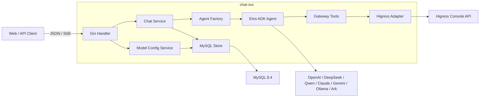
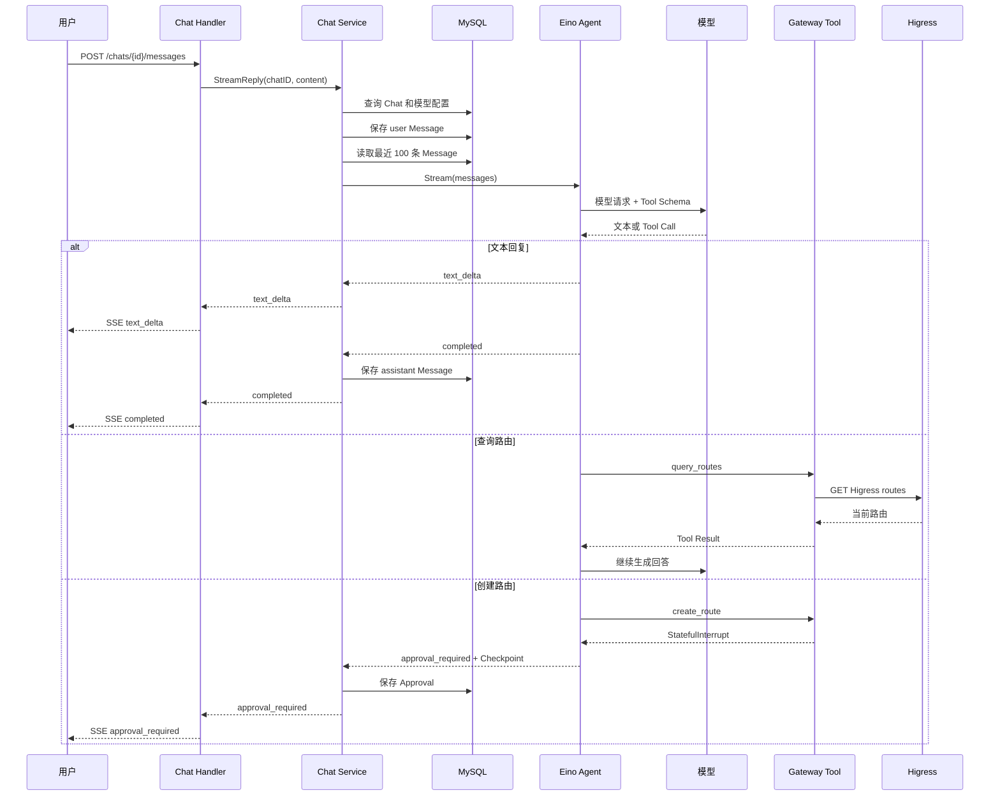
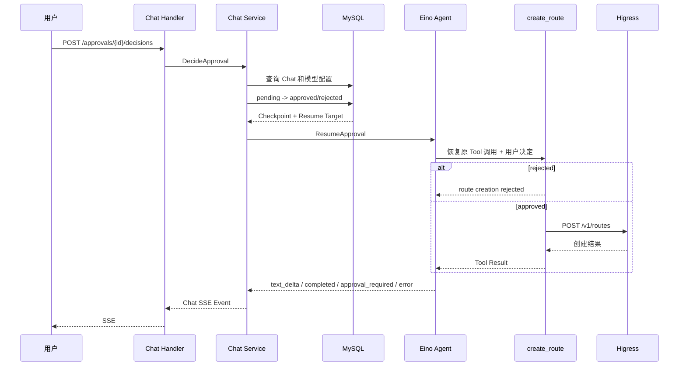

# 02 系统架构设计

## 1. 设计目标

当前系统只为一套逻辑 Gateway 提供对话式运维能力。架构首先保证四件事：

1. 用户消息和完整回复可查询；
2. 网关实时状态必须通过 Tool 获取；
3. 写操作必须经过对话审批；
4. 审批等待期间服务可以重启，之后仍能恢复原来的 Agent 调用。

当前没有足够用例证明需要拆分 Worker、消息队列或工作流引擎，因此系统保持为一个进程和一个业务数据库。

## 2. 当前组件



### 2.1 `chat-svc`

当前唯一可执行程序，入口是 `cmd/chat-svc/main.go`。它负责：

- 加载 YAML 和环境变量；
- 通过 Wire 装配依赖；
- 启动 Gin HTTP Server；
- 管理 MySQL 连接池；
- 响应退出信号并优雅关闭。

Agent 并不是独立服务。它是 Chat Service 在处理一条消息或审批决定时创建的运行时对象。

### 2.2 MySQL

MySQL 是当前唯一持久化组件，保存：

- Chat；
- 用户与 Assistant 完整消息；
- 模型配置和加密 API Key；
- 待审批操作与 Eino Checkpoint。

模型 Token 分片不写入 MySQL。分片只存在于当前 SSE 连接中；完整 Assistant 消息完成后才写入 `chat_messages`。

### 2.3 Eino ADK

Eino 提供 Agent Runner、模型流、Tool Calling、ReAct 循环、中断和恢复能力。本项目没有复制 Eino 的 Agent Loop，而是在外围提供：

- Chat 历史转换；
- 模型配置选择；
- Gateway Tool；
- 稳定的 SSE 事件；
- Approval 和 Checkpoint 持久化。

### 2.4 Higress Adapter

`internal/chatsvc/store/higress` 负责调用 Higress Console API。上层只依赖 `service/gateway` 中的 `RouteReader` 和 `RouteWriter`，不会直接使用 Higress 私有请求结构。

这一边界使未来增加另一个 Gateway Adapter 成为可能，但当前没有第二个实现，也没有为它预建配置表或插件系统。

## 3. 代码目录

```text
cmd/chat-svc/                       程序入口
configs/                            YAML 配置
db/migrations/                      MySQL 表结构
db/chatsvc/queries/                 sqlc 查询
api/openapi/                        HTTP 契约
internal/chatsvc/
├── config/                         配置加载与校验
├── dto/                            HTTP 请求和响应结构
├── handler/                        Gin 路由、绑定、SSE 输出
├── middleware/                     Request ID 与 Recovery
├── server/                         HTTP Server 生命周期
├── service/
│   ├── agent/                      Eino Agent、事件、Checkpoint
│   │   └── tool/                   当前 Agent Tools
│   ├── chat/                       Chat、Message、Approval 用例
│   ├── gateway/                    与具体网关无关的路由类型
│   └── modelconfig/                模型配置用例
└── store/
    ├── higress/                    Higress Console Adapter
    └── mysql/                      MySQL 与 sqlc
internal/pkg/                       跨业务的少量基础包
```

目录按 `chat-svc` 自身的 Handler、Service、Store 组织。不会为了形式统一，把并不存在的 Worker 或独立微服务提前建出来。

## 4. 分层职责

### 4.1 Handler

Handler 只处理 HTTP 协议：

- 使用 Gin 绑定 URI、Query 和 JSON；
- 调用 DTO 的 `Validate`；
- 调用 Service；
- 输出统一 JSON 或 SSE。

Handler 不创建 SQL、不理解 Eino Checkpoint，也不直接调用 Higress。

### 4.2 Service

Service 表达产品用例：

- 创建或查询 Chat；
- 保存消息并运行 Agent；
- 把 Agent 事件转换为 Chat 事件；
- 创建、查询和决定 Approval；
- 管理模型配置。

Service 可以协调 MySQL 和 Agent，但不暴露 HTTP DTO。

### 4.3 Store

Store 是技术适配层：

- MySQL Store 执行 sqlc 查询，并把数据库错误映射成应用错误；
- Higress Store 构造 HTTP 请求，并在边界处转换网关结构。

数据库超时和 HTTP 超时都在 Store 内部设置，避免 Handler 重复处理依赖细节。

### 4.4 Agent 与 Tool

Agent 负责运行 Eino；Tool 是模型可以选择的能力。当前 Tool 只有：

| Tool | 类型 | 作用 |
|---|---|---|
| `query_routes` | 只读 | 查询 Higress 路由列表或单条路由 |
| `create_route` | 写入 | 审批后创建 Higress 路由 |

写 Tool 自己声明中断点。Service 不通过字符串判断“这个 Tool 是否危险”，也不在 Agent 外再造一套执行循环。

## 5. 发送消息数据流



最重要的提交顺序是：

- user Message 写库成功后才能开始 Agent；
- assistant Message 写库成功后才能发送 `completed`；
- Approval 写库成功后才能发送 `approval_required`。

## 6. 审批恢复数据流



Approval 的状态在恢复执行前更新。这是有意设计：它记录用户已经作出的不可重复决定。Higress 随后失败时，Approval 仍是 `approved`，失败由 SSE 表达，用户可以重新发起一条新消息。

## 7. 并发与一致性边界

### 7.1 消息

消息使用自增 ID，按 `(chat_id, id)` 查询。当前没有同 Chat 的运行锁；客户端应避免对同一 Chat 同时发起多条 Agent 请求。需要支持并发输入时，应先定义产品交互，再决定排队还是拒绝，不提前增加队列。

### 7.2 审批

审批决定 SQL 带有 `status = 'pending'` 条件。两个请求同时决定同一 Approval 时，只有一个能更新成功，另一个返回 `409`。

### 7.3 Checkpoint

Checkpoint 属于一次被中断的 Eino Runner 状态，以二进制形式保存在 Approval 中。恢复时，新创建的 Agent 将这份状态加载到进程内 Checkpoint Store，再调用 Eino `ResumeWithParams`。

## 8. 为什么当前没有额外组件

| 组件 | 当前不引入的原因 | 何时重新评估 |
|---|---|---|
| Redis | SSE 只服务当前 HTTP 请求，没有跨实例广播需求 | 出现多副本断线续传或共享实时事件需求 |
| Temporal | Eino Checkpoint + MySQL 已满足当前人工审批恢复 | 出现跨多天、多步骤、定时等待和可靠补偿任务 |
| Qdrant | 当前检索目标是结构化 Higress 实时数据 | 出现大量非结构化文档和语义召回用例 |
| Outbox | 当前没有跨数据库与消息系统的双写 | 引入必须可靠发布的外部事件系统 |
| 独立 Worker | 当前 Agent 生命周期与 HTTP SSE 一致 | 任务需要脱离客户端连接长期运行 |

组件不是“企业级清单”。只有当现有边界无法满足明确需求时，才引入新的运行依赖。

## 9. 当前限制

- 没有认证、RBAC 和审批人身份；
- 没有同 Chat 并发请求控制；
- SSE 断开会取消当前 Agent 调用，没有事件重放；
- 上下文只是最近 100 条消息，没有 Token 预算和压缩；
- 没有版本化 Plan，Approval 直接绑定 Tool 参数；
- 只支持 Higress 路由查询和创建；
- 没有执行后验证、更新、删除和回滚；
- 尚未用真实凭证完成端到端验收。

这些限制应该在产品用例出现时逐项设计，而不是一次性加入通用框架。

## 10. 必须保持的架构原则

1. Eino 是依赖，不出现在数据库表名和外部 HTTP 领域模型中；
2. Gateway Service 类型隔离具体 Higress 协议；
3. 未审批写操作不能到达 Gateway Adapter；
4. Token 分片不是持久业务事实；
5. API Key 不进入响应、日志和模型上下文；
6. 新组件必须有当前调用方和故障语义；
7. 不为未来兼容保留当前没有数据的旧结构；
8. 代码和文档只保留一套正在使用的概念。
