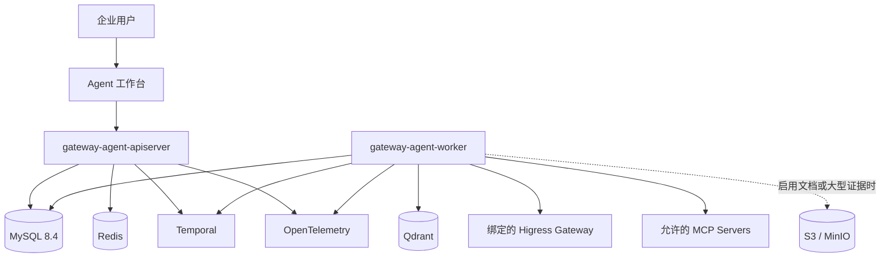
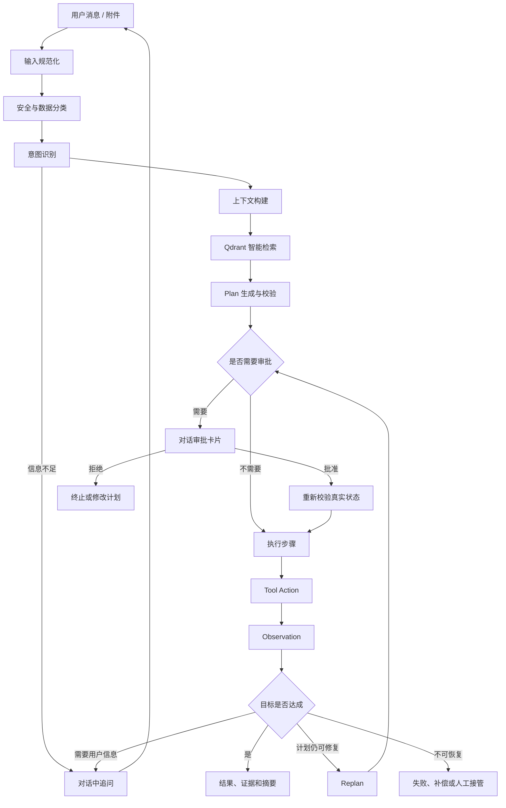
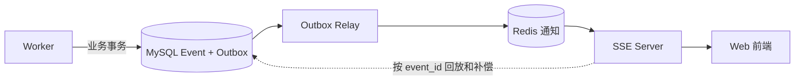

# Gateway Agent 目标产品与架构设计 v1.0

> 状态：已确认，作为后续设计和实现的权威基线
> 更新日期：2026-07-20
> 适用仓库：`gateway-agent`
> 代码标识符使用英文，代码注释和数据库注释使用中文

## 1. 文档结论

Gateway Agent 是部署在企业内网、通过对话帮助用户查询和变更 AI Gateway 的运维 Agent。

本产品采用明确的一对一边界：

> 一套 Gateway Agent 绑定一套逻辑 Gateway 控制面。

这里的“一套 Gateway”指一个逻辑 Higress Gateway 部署或控制面，可以包含多个 Pod 和数据面节点，不是单个进程或单个 Kubernetes Pod。

Gateway Agent 不承担以下职责：

- 多企业共享数据库的 SaaS 多租户平台；
- 集中管理大量 Gateway 的 Fleet Manager；
- 企业用户、组织和角色管理平台；
- 通用工作流平台、通用消息平台或通用知识库产品；
- 代理 Gateway 的业务请求流量。

它必须把以下能力做好：

- 理解用户输入并识别真实意图；
- 管理长对话和长任务上下文；
- 使用 Plan、Replan、TAO 和 ReAct 完成复杂任务；
- 通过 Tool、Skill 和 MCP 扩展专业能力；
- 在对话中展示变更计划并等待审批；
- 审批后可靠执行、验证和必要时回滚；
- 保留完整事件、证据和审计记录；
- 在进程重启、网络抖动和重复请求下保持正确。

## 2. 产品边界


### 2.1 为什么采用一对一绑定

Gateway Agent 会接触 Kubernetes 凭证、Higress 管理接口、模型密钥、生产配置和企业内部知识。将 Agent 与目标 Gateway 在部署时绑定，可以获得更小的故障半径和更清晰的权限边界。

用户不需要在每次对话中选择 Gateway，模型也不能临时改变执行目标。Gateway 身份、环境和连接方式由部署配置确定。

```yaml
gateway:
  name: prod-higress
  environment: production
  cluster: cn-shanghai-prod
  adapter: higress
```

开发、测试和生产是不同 Gateway 时，应分别部署对应的 Gateway Agent。生产 Agent 可以使用更严格的审批、凭证和审计策略。

### 2.2 多用户但不做多租户

系统支持企业内部多个用户使用，但不建立自研 IAM 和共享数据库多租户模型。

- 身份来自企业 OIDC；
- 角色来自 OIDC Group 映射；
- 审计日志保存操作主体和角色快照；
- 不建立 `tenants`、`workspaces`、`tenant_members` 等表；
- 不在所有业务表中机械增加 `tenant_id`。

推荐的角色映射：

```yaml
authorization:
  groupMappings:
    gateway-viewers: viewer
    gateway-operators: operator
    gateway-admins: admin
```

## 3. 非功能基线

Gateway Agent 是控制面，不承载 Gateway 的业务流量。容量基线必须符合真实管理场景，而不是照搬数据面吞吐指标。

| 指标 | 单套 Gateway Agent 基线 |
|---|---:|
| 在线管理用户 | 500 |
| SSE 长连接 | 500 |
| 并发 Agent Task | 100 |
| 事件突发 | 1000 条/秒 |
| Tool 并发 | 100 |
| 核心 API 可用性目标 | 99.9% |
| 已提交业务数据 RPO | 0 |
| 单可用区故障 RTO | 不超过 5 分钟 |

系统采用至少一次投递和幂等消费，不承诺不切实际的端到端“绝对只执行一次”。

## 4. 技术决策

| 领域 | 决策 |
|---|---|
| 开发语言 | Go 1.26.x |
| HTTP | Gin |
| 依赖注入 | Google Wire |
| SQL | sqlc + `database/sql` |
| 产品数据库 | MySQL 8.4 |
| 长任务 | Temporal Go SDK |
| Agent 编排 | Eino |
| 实时通知与缓存 | Redis |
| 语义检索 | Qdrant |
| 文件与大型证据 | S3/MinIO，可选 |
| 模型访问 | 通过 Higress AI Gateway |
| 外部工具协议 | MCP |
| 可观测性 | OpenTelemetry、Prometheus、结构化日志 |
| gRPC | 只有出现明确接口时才引入，并使用 Buf |

明确不引入 Kafka、NATS、Elasticsearch/OpenSearch、OPA、自研 IAM、服务注册中心和独立配置中心。

### 4.1 为什么使用 sqlc，不使用 GORM

本项目继续采用 `database/sql + sqlc`，不同时引入 GORM。

原因不是排斥 ORM，而是关键数据访问以显式 SQL 和事务为主：

- Outbox 使用 `FOR UPDATE SKIP LOCKED` 批量认领；
- Task 状态推进使用版本条件实现乐观锁；
- SSE 使用 Event ID 游标查询和顺序回放；
- Idempotency、Approval、Audit 和 Event 必须处在明确事务边界；
- 关键查询需要稳定执行计划、可审查索引和可预测性能；
- sqlc 在编译期生成强类型 Go 代码，数据库行为不会隐藏在反射、Association 或 Hook 中。

GORM 适合以普通 CRUD 为主、需要快速搭建后台管理页面的系统。本项目即使使用 GORM，关键链路仍然需要 Raw SQL，最终会同时维护 ORM 语义和手写 SQL，整体反而更复杂。

Migration 继续使用独立 Migration 工具，不使用 GORM AutoMigrate 管理生产 Schema。

## 5. 部署架构

仓库保持模块化单体，只提供两个核心程序：

```text
gateway-agent-apiserver
gateway-agent-worker
```



### 5.1 apiserver

apiserver 负责：

- Gin HTTP API 和统一错误响应；
- OIDC 认证、Group 到角色的映射；
- Conversation、Message、Task 和 Approval 命令；
- Task、Plan、事件和审计查询；
- SSE 回放、心跳和实时事件推送；
- Idempotency Key；
- Transactional Outbox Relay；
- 配置、依赖装配、健康检查和优雅停机。

apiserver 不运行模型推理，不执行 Tool，不直接修改 Higress，也不在 HTTP 请求生命周期中等待 Agent 完成。

### 5.2 worker

worker 负责：

- Temporal Workflow 和 Activity；
- Eino Agent Engine；
- 输入规范化、意图识别和上下文管理；
- Plan、Replan、TAO 和 ReAct；
- Skill 加载和 Tool 注册；
- Native Tool 和 MCP Tool 执行；
- 风险判断、审批等待、执行验证和回滚；
- 文档切分、Embedding 和 Qdrant 索引；
- Higress、Kubernetes、模型和 MCP Adapter。

SSE、Outbox Relay 和索引器都是所属程序内部的 Service，不拆成额外微服务。

## 6. Agent 内核

### 6.1 处理流水线



### 6.2 输入规范化

系统保留原始 Message，不擅自改写用户语义。规范化结果保存在 Task 中，用于后续识别和规划。

规范化至少包含：

- Unicode、空白和不可见字符处理；
- 语言、附件和引用消息识别；
- Gateway 资源、路由、服务、模型等实体提取；
- 敏感数据和提示词注入风险标记；
- 输入大小和附件类型限制；
- 明确命令与自然语言请求区分。

### 6.3 意图识别

意图识别采用确定性规则和模型分类的混合方式：

1. 显式协议字段和明确命令优先；
2. 语义模型识别自然语言意图；
3. 业务实体、目标资源和风险提示同时提取；
4. 低置信度或信息冲突时要求用户澄清；
5. 意图识别结果不能直接绕过 Plan 调用 Tool。

Task 保存：

```text
intent
intent_confidence
intent_data
normalized_input
```

不单独建立意图识别管理表。

### 6.4 上下文管理

Context Builder 按优先级和 Token 预算组装：

1. 系统安全政策；
2. 固定 Gateway 身份和环境；
3. 当前 Task、Plan、审批和执行状态；
4. 当前用户输入；
5. 必要的近期对话；
6. Conversation 摘要；
7. Qdrant 召回的历史细节和知识；
8. 已压缩的 Tool Observation。

每段上下文都记录来源、Token 数、敏感级别和选择原因。模型不能访问超过当前权限和数据分类限制的内容。

### 6.5 Plan 与 Replan

Plan 是版本化数据，不是一段可以覆盖修改的自然语言。Plan Step 至少包含：

```text
step_id
objective
dependencies
capability
expected_observation
risk_level
approval_required
timeout
compensation
```

以下情况触发 Replan：

- 用户补充或修改目标；
- Tool Observation 与预期不一致；
- Gateway 实际状态已经变化；
- 权限或策略拒绝当前动作；
- Tool 失败且原计划无法继续；
- 出现循环、重复动作或预算超限；
- 已审批动作的内容发生实质变化。

Replan 创建新 Plan 版本。审批绑定旧版本时自动失效。

### 6.6 TAO 与 ReAct

TAO 是步骤级原子循环：Decision、Action、Observation。ReAct 是需要探索时连续执行多个 TAO 的策略，不能脱离 Plan 无限循环。

系统不保存模型原始思维链，只保存可审计的结构化结果：

```text
decision_summary
selected_action
policy_decision
tool_request
tool_observation
evidence
failure_reason
```

## 7. Tool、Skill 与 MCP

### 7.1 Tool

Tool 是可执行能力。Gateway 核心操作使用 Go Native Tool：

```text
gateway.routes.list
gateway.routes.get
gateway.routes.validate
gateway.routes.apply
gateway.config.diff
gateway.config.snapshot
gateway.config.rollback
gateway.backends.health
kubernetes.resources.get
```

每个 Tool 必须声明稳定名称、版本、输入输出 Schema、只读属性、风险等级、权限、审批要求、幂等性、超时、重试、验证和补偿能力。

LLM 不能直接调用 Adapter。执行顺序固定为：

```text
模型选择 Tool
→ Schema 校验
→ 权限和风险检查
→ 必要时审批
→ Temporal Activity 执行
→ 读取真实状态验证
→ 返回 Observation
```

### 7.2 Skill

Skill 保存为仓库文件并使用 Git 版本管理：

```text
skills/
├── configure-route/SKILL.md
├── diagnose-5xx/SKILL.md
├── configure-model-upstream/SKILL.md
└── rollback-gateway-change/SKILL.md
```

Skill 描述专业流程、信息要求、可用 Tool、验证方式和失败处理，但不授予额外权限。

### 7.3 MCP

MCP 用于接入 Prometheus、CMDB、Git、工单系统和企业知识服务等外围系统。Higress 核心写操作不依赖 MCP。

MCP Server 必须在配置中明确允许；发现的 Tool 必须经过允许列表、Schema、风险、超时、结果大小和敏感数据检查。MCP Tool 与 Native Tool 进入同一 Tool Registry 和审批链路。

Tool、Skill 和 MCP 的运行能力从一开始存在，但不建设数据库管理平台和在线编辑后台。

## 8. 对话内审批

审批绑定不可变对象：

```text
task_id
plan_id
plan_version
action_digest
risk_summary
affected_resources
requested_by
expires_at
```

流程：

1. SSE 在当前 Conversation 中推送审批卡片；
2. 前端展示变更内容、Diff、风险、影响资源、验证和回滚方案；
3. 用户通过 HTTP API 批准或拒绝；
4. worker 执行前重新读取 Gateway 真实状态；
5. 状态或 Action Digest 变化时，原审批失效；
6. 执行、验证和回滚事件继续进入同一 Conversation。

审批命令不通过 SSE 提交。SSE 只负责服务器向前端推送，用户决定通过 HTTP API 提交。

## 9. 数据架构

### 9.1 数据表按业务用例设计

本设计不提前冻结尚未实现功能的表和字段。一个概念出现在架构图中，不代表现在就必须创建对应数据表。

当前已经完成详细设计、允许创建的表只有：

```text
chats
chat_messages
```

| 表 | 当前能够证明的用途 |
|---|---|
| `chats` | 保存一个持续对话及其创建、最后活跃时间 |
| `chat_messages` | 保存对话中的不可变用户或 Agent 消息 |

这两张表只保留当前接口、事务和查询真正使用的字段。字段不能仅因为“以后可能用到”而加入。

以下概念暂时只保留业务和架构定义，不提前创建表：

```text
Message Attachment
Agent Run
Chat Event
Audit Event
Idempotency Record
Outbox Message
Plan / Plan Step
Approval
Tool Execution
Document / Document Chunk
长期 Memory
```

当对应能力开始详细设计时，必须先回答以下问题，再决定是否建表以及字段：

1. 用户操作和业务状态机是什么；
2. 哪些数据必须事务性保存；
3. 实际需要哪些写入、查询和排序；
4. 哪些数据不可变，哪些允许更新；
5. 唯一约束、外键和幂等键是什么；
6. 数据保留、归档和删除策略是什么；
7. 是否已有表或对象存储可以合理承载；
8. 对应字段是否能写出明确中文说明。

不建立通用 `core_tables`、万能 `events` 表或只有未来设想、没有当前读写链路的空表。

### 9.2 MySQL 规范

- MySQL 8.4、InnoDB、`utf8mb4`；
- 时间使用 `DATETIME(6)`，应用统一写 UTC；
- ID 类型根据真实部署和查询需求决定；当前 Chat 和 Message 使用 `BIGINT UNSIGNED AUTO_INCREMENT`；
- 可变业务记录是否需要 `version`，由并发更新用例决定；
- JSON 只保存无需频繁查询的扩展数据；
- 所有表和字段必须有中文数据库注释；
- Migration 按明确业务职责命名，不使用 `core`、`slice_1a` 等名称；
- 不给所有表机械增加 `deleted_at`。

### 9.3 一致性边界

当前确认的事务是追加消息并更新 Chat 最后活跃时间：

```text
确认 Chat 存在
写 chat_message
更新 chats.updated_at
COMMIT
```

当前不创建 Agent Run、Event、Audit、Idempotency 和 Outbox 表。进入异步执行、SSE、审计或可靠消息用例时，再分别确认它们的数据结构和事务边界。

## 10. Redis、SSE 与事件补偿

Redis 只负责低延迟通知、缓存和限流，不是业务事实来源。



Redis 通知只携带 Gateway Agent 内部的 Conversation ID、Event ID 和 Event Type，不传用户原文、密钥和完整 Tool 结果。

SSE 需要使用持久化 Event ID 作为 `Last-Event-ID`。具体事件表名、字段和索引在 SSE 用例进入详细设计时确定。浏览器断线重连后按 Event ID 从 MySQL 补发；Redis 通知丢失时，由持久化事件游标完成一致性恢复。

事件采用至少一次投递，前端和后端消费者按 Event ID 幂等处理。

## 11. Qdrant 与上下文召回

MySQL 保存已经落地业务对象的事实；Qdrant 只保存向量和过滤字段。Qdrant 发生故障或数据丢失时，必须能够从 MySQL 或对象存储中的来源数据重建。

当前可以先索引 Message 和已经确认的 Task 摘要。文件知识库启用前，再详细设计 Document、Chunk、对象存储和索引状态，不提前创建相关表。

默认使用一套 Gateway Agent 的独立 Collection。Point ID 根据来源稳定生成：

```text
source_type + source_id + chunk_id + embedding_version
```

检索流程：

```text
查询改写
→ Dense Semantic Search
→ Sparse Keyword Search
→ 融合排序
→ Rerank
→ source_id 回 MySQL 读取原文
→ 来源和时效性检查
```

Qdrant 不保存密钥和完整执行凭证。检索结果必须携带来源，Agent 不能把无来源召回内容当作事实。

## 12. Temporal 与 Eino

Temporal 和 Eino 的职责不能重叠：

| 组件 | 职责 |
|---|---|
| Temporal | 持久化流程、审批等待、超时、重试、恢复和任务调度 |
| Eino | 模型、Prompt、Retriever、Tool 和 Agent 节点的组织 |

Temporal Workflow 中不直接执行模型、数据库、网络或 Gateway 调用。所有非确定性操作通过 Activity 完成。

Workflow 历史过长时使用 Continue-As-New。用户可见的 Task 状态以 MySQL 为准，Temporal Search Attribute 不保存原始 Prompt、密钥和敏感正文。

## 13. 安全设计

- 通过企业 OIDC 认证；
- OIDC Group 映射为 `viewer`、`operator`、`admin`；
- Tool 在执行前检查角色、风险和审批；
- Gateway 凭证来自 Kubernetes Secret、Vault 或企业 Secret Manager；
- 数据库、日志、Trace 和 Redis 不保存明文凭证；
- 生产写操作默认需要审批；
- Approval 必须绑定 Plan 版本和 Action Digest；
- MCP Server 使用允许列表和最小权限凭证；
- Tool Observation 在进入模型前进行大小限制和敏感信息处理；
- 不保存模型原始思维链；
- 所有关键命令、审批、Tool 和策略决定写入 Audit Log。

## 14. 执行保护和失败处理

每个 Task 必须配置：

- 最大 Plan 版本数；
- 最大步骤数；
- 最大连续失败数；
- 最大重复 Tool 调用数；
- 最大 Token 和模型费用；
- 最大运行时间；
- 最大并行 Tool 数；
- 用户取消和管理员终止；
- 循环检测和人工接管。

非幂等写操作超时后不能直接重试，必须先查询 Gateway 真实状态，再决定继续、补偿或人工处理。

Redis 故障只影响通知延迟；Qdrant 故障时禁用语义增强但不允许伪造结果；Temporal 故障时不接受新的长任务；MySQL 故障时 Readiness 失败并停止业务写入。

## 15. API 边界

API 使用清晰资源名，不引入 `route-queries` 之类动作化集合。

```text
GET    /healthz
GET    /readyz

POST   /api/v1/chats
GET    /api/v1/chats/{chat_id}
POST   /api/v1/chats/{chat_id}/messages
GET    /api/v1/chats/{chat_id}/messages
```

这是当前已确认的 API。Agent Run、SSE、Approval 和 Audit API 等相应用例详细设计后再加入，不提前占用路径。

## 16. 工程结构

```text
cmd/
├── gateway-agent-apiserver/
└── gateway-agent-worker/

internal/
├── apiserver/
│   ├── handler/
│   ├── service/
│   ├── store/
│   └── middleware/
├── worker/
│   ├── handler/
│   ├── service/
│   ├── store/
│   ├── workflow/
│   ├── activity/
│   └── adapter/
├── task/
├── workflow/
└── pkg/

skills/
configs/
db/
├── migrations/
├── apiserver/queries/
└── worker/queries/
```

约束：

- apiserver 和 worker 各自拥有 Handler、Service 和 Store；
- Handler 只处理协议、校验和错误映射；
- Service 负责业务事务和编排；
- Store 负责 sqlc、事务和数据库类型转换；
- Adapter 负责 Higress、Kubernetes、MCP、模型和外部系统；
- `internal/pkg` 只放通用技术能力；
- `internal/task` 和 `internal/workflow` 只保存明确的跨进程协议；
- 不创建 `core`、`platform`、`common/domain` 等宽泛目录；
- 不为简单结构体编写大量 Getter；
- 注释用中文，代码、JSON、事件名和错误码用英文。

## 17. 可观测性

每个请求和 Task 使用统一 Trace ID，贯穿：

```text
HTTP Request
→ MySQL Transaction
→ Outbox
→ Temporal Workflow/Activity
→ Model Invocation
→ Tool Execution
→ Higress Adapter
→ Audit Log
```

核心指标：

- HTTP 延迟和错误率；
- SSE 当前连接数、断线率、回放数量和推送延迟；
- Task 各状态数量和运行时长；
- Temporal Queue 延迟和 Activity 重试；
- Outbox 积压、投递延迟和失败数量；
- Tool 调用延迟、错误率和验证失败率；
- 模型 Token、费用、延迟和结构化输出失败率；
- Qdrant 检索延迟、命中率和索引积压；
- 审批等待时间和过期数量。

日志必须结构化，不打印 DSN、Authorization、Token、密钥、完整 Prompt 和未经处理的 Tool 输出。

## 18. 配置与版本追踪

Agent、Tool、Skill、MCP 和策略不建立数据库管理平台，使用配置文件和 Git 管理：

```text
configs/
├── gateway-agent-apiserver.yaml
├── agent.yaml
├── tools.yaml
├── policies.yaml
└── mcp-servers.yaml

skills/
└── */SKILL.md
```

历史执行必须能够追踪 Agent 配置、Skill、Tool、MCP、Prompt、模型和 Embedding 的版本。具体保存在哪张表、使用独立列还是结构化快照，在对应执行与审计用例设计时确定，不提前给当前表增加一组暂时不会读取的字段。

## 19. 实现约束

本设计描述稳定的产品与技术边界，不把产品能力拆成互相推翻的临时架构。实际编码按业务用例和依赖顺序完成；尚未进入详细设计的功能不预建表、不预填字段、不创建空 Service。

当前基础实现已经切换到 MySQL 8.4，并按 03 设计只创建 `chats` 和 `chat_messages`。后续引入 Agent Run、Plan、Approval、Event、Outbox、Tool Execution 或检索索引前，必须先明确对应业务流程、查询方式和事务边界，再补充数据结构与实施计划。

Redis 通知、Temporal Workflow、Qdrant 索引、Tool、Skill 和 MCP 仍按本设计保留能力边界，但不得通过空接口、假实现或预建数据表提前占位。

## 20. 已确认决策清单

1. 一套 Gateway Agent 绑定一套逻辑 Gateway；
2. 不做共享数据库多租户和 Gateway Fleet 管理；
3. OIDC 提供身份，Group Mapping 提供角色；
4. 只部署 apiserver 和 worker 两个程序；
5. MySQL 是业务事实来源；
6. Redis 是通知和缓存，不是事实来源；
7. Temporal 负责可靠长任务，Eino 负责 Agent 编排；
8. Qdrant 负责可重建的语义索引；
9. Gateway 核心操作使用 Native Tool；
10. Skill 使用文件和 Git 管理；
11. MCP 用于受控接入外围系统；
12. 审批在对话中展示，通过 HTTP 提交；
13. Plan 版本和 Action Digest 绑定审批；
14. SSE 使用持久化 Event ID 断线续传；
15. Transactional Outbox 解决 MySQL、Temporal、Redis 和索引任务的可靠投递；
16. 不引入 Kafka、NATS、OPA、自研 IAM 和不必要微服务；
17. 不保存模型原始思维链；
18. 所有数据库表和字段使用中文注释；
19. 所有文档保存在 `.codex/docs`；
20. 后续实施不得重新引入已经删除的多租户和阶段性临时架构；
21. 表和字段必须由当前业务用例、查询和事务证明，不为未来设想预建。
