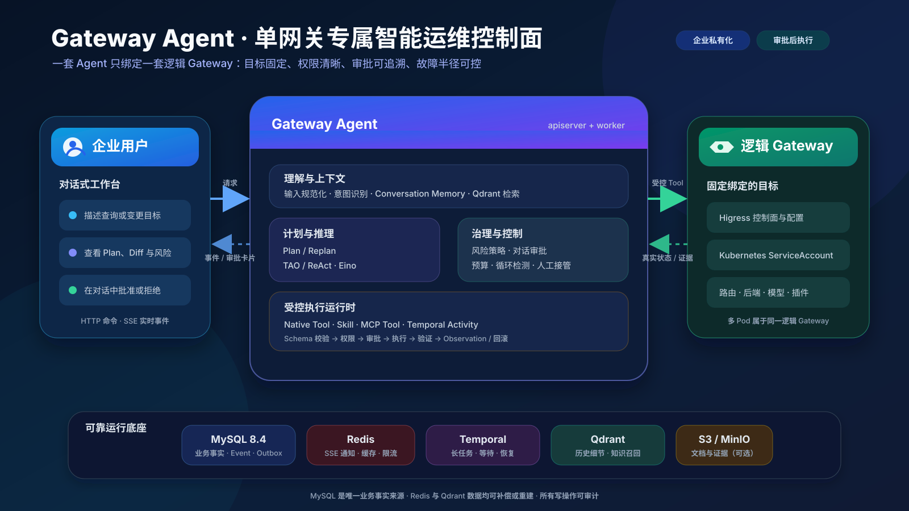
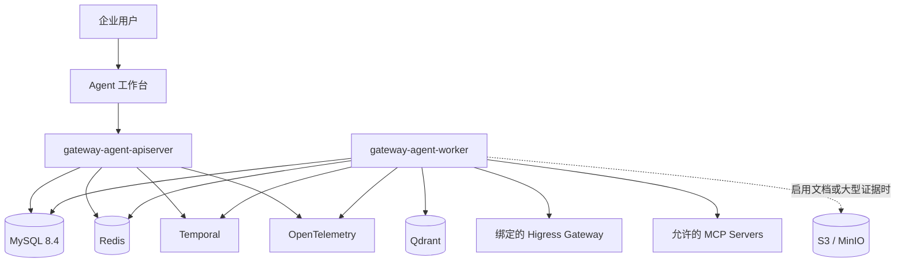
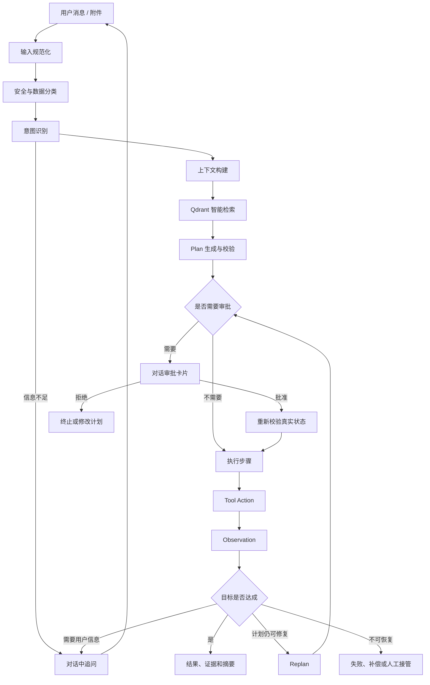
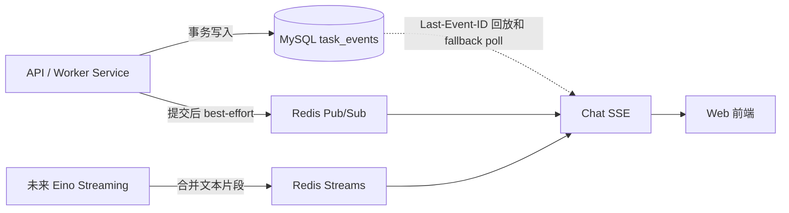

# Gateway Agent 目标产品与架构设计 v1.1

> 状态：已确认，作为产品边界和总体架构的权威基线
> 更新日期：2026-07-22
> 适用仓库：gateway-agent
> 代码标识符使用英文，代码注释和数据库注释使用中文

## 1. 文档结论

Gateway Agent 是部署在企业内网、通过对话帮助用户查询和变更 AI Gateway 的运维 Agent。

本产品采用明确的一对一边界：

> 一套 Gateway Agent 绑定一套逻辑 Gateway 控制面。

这里的“一套 Gateway”指一个逻辑 Higress Gateway 部署或控制面，可以包含多个 Pod 和数据面节点，不是单个进程或单个 Kubernetes Pod。

Gateway Agent 不承担：

- 多企业共享数据库的 SaaS 多租户平台；
- 集中管理大量 Gateway 的 Fleet Manager；
- 企业用户、组织和角色管理平台；
- 通用工作流平台、通用消息平台或通用知识库产品；
- 代理 Gateway 的业务请求流量。

它必须把以下能力做好：

- 理解用户输入并识别真实意图；
- 管理长对话和长任务上下文；
- 使用 Plan、Replan、TAO 和 ReAct 完成复杂任务；
- 通过 Tool、Skill 和 MCP 扩展专业能力；
- 在对话中展示变更计划并等待审批；
- 审批后可靠执行、验证和必要时回滚；
- 保留完整事件、证据和审计记录；
- 在进程重启、网络抖动和重复请求下保持正确。

## 2. 产品边界



### 2.1 为什么采用一对一绑定

Gateway Agent 会接触 Kubernetes 凭证、Higress 管理接口、模型密钥、生产配置和企业内部知识。将 Agent 与目标 Gateway 在部署时绑定，可以获得更小的故障半径和更清晰的权限边界。

用户不需要在每次对话中选择 Gateway，模型也不能临时改变执行目标。Gateway 身份、环境和连接方式由部署配置确定。

```yaml
gateway:
  name: prod-higress
  environment: production
  cluster: cn-shanghai-prod
  adapter: higress
```

开发、测试和生产是不同 Gateway 时，应分别部署对应的 Gateway Agent。生产 Agent 可以使用更严格的审批、凭证和审计策略。

### 2.2 多用户但不做多租户

系统支持企业内部多个用户使用，但不建立自研 IAM 和共享数据库多租户模型。

- 身份来自企业 OIDC；
- 角色来自 OIDC Group 映射；
- 一套 Gateway Agent 是一个共享运维 Workspace，授权成员可以查看该 Gateway 的 Chat、Task 和事件；
- 不提供个人私有 Chat，因此当前业务表不增加 owner_id；
- 审计日志保存操作主体和角色快照；
- 不建立 tenants、workspaces、tenant_members 等表；
- 不在所有业务表中机械增加 tenant_id。

推荐的角色映射：

```yaml
authorization:
  groupMappings:
    gateway-viewers: viewer
    gateway-operators: operator
    gateway-admins: admin
```

## 3. 非功能基线

Gateway Agent 是控制面，不承载 Gateway 的业务流量。容量基线必须符合真实管理场景，而不是照搬数据面吞吐指标。

| 指标 | 单套 Gateway Agent 基线 |
|---|---:|
| 在线管理用户 | 500 |
| SSE 长连接 | 500 |
| 并发 Agent Task | 100 |
| 事件突发 | 1000 条/秒 |
| Tool 并发 | 100 |
| 核心 API 可用性目标 | 99.9% |
| 已提交业务数据 RPO | 0 |
| 单可用区故障 RTO | 不超过 5 分钟 |

系统采用至少一次投递和幂等消费，不承诺不切实际的端到端“绝对只执行一次”。

## 4. 技术决策

| 领域 | 决策 |
|---|---|
| 开发语言 | Go 1.26.x |
| HTTP | Gin |
| 依赖注入 | Google Wire |
| SQL | sqlc + database/sql |
| 产品数据库 | MySQL 8.4 |
| 长任务 | Temporal Go SDK |
| Agent 编排 | CloudWeGo Eino |
| 实时通知与短期流 | Redis |
| 语义检索 | Qdrant |
| 文件与大型证据 | S3/MinIO，可选 |
| 模型访问 | 通过 Higress AI Gateway |
| 外部工具协议 | MCP |
| 可观测性 | OpenTelemetry、Prometheus、结构化日志 |
| gRPC | 只有出现明确接口时才引入，并使用 Buf |

明确不引入 Kafka、NATS、Elasticsearch/OpenSearch、OPA、自研 IAM、服务注册中心和独立配置中心。

### 4.1 为什么使用 sqlc，不使用 GORM

本项目继续采用 database/sql + sqlc，不同时引入 GORM。

原因不是排斥 ORM，而是关键数据访问以显式 SQL 和事务为主：

- Outbox 使用 FOR UPDATE SKIP LOCKED 批量认领；
- Run 需要按确定顺序领取并做条件状态更新；
- SSE 使用 Event ID 游标查询和顺序回放；
- Message、Task、Run、Event 和 Outbox 必须处在明确事务边界；
- 关键查询需要稳定执行计划、可审查索引和可预测性能；
- sqlc 在编译期生成强类型 Go 代码，数据库行为不会隐藏在反射、Association 或 Hook 中。

GORM 适合以普通 CRUD 为主、需要快速搭建后台管理页面的系统。本项目即使使用 GORM，关键链路仍然需要 Raw SQL，最终会同时维护 ORM 语义和手写 SQL，整体反而更复杂。

Migration 继续使用独立 Migration 工具，不使用 GORM AutoMigrate 管理生产 Schema。

## 5. 部署架构

仓库保持模块化单体，只提供两个核心程序：

```text
gateway-agent-apiserver
gateway-agent-worker
```



### 5.1 apiserver

apiserver 负责：

- Gin HTTP API 和统一错误响应；
- OIDC 认证、Group 到角色的映射；
- Chat、Message、Task、Run 和 Approval 命令；
- Task、Run、Input、Plan、事件和审计查询；
- 一条 Chat 级 SSE 的回放、心跳和实时推送；
- Message/Task/Run/Event/Outbox 原子写事务；
- Message API Idempotency-Key 校验、相同资源 ID 和当前 DTO 的 201 重放；
- Outbox Publisher 通过 SignalWithStart 启动或唤醒 Temporal Workflow；
- Redis Pub/Sub 订阅和 Streams 读取；
- 配置、依赖装配、健康检查和优雅停机。

apiserver 不运行模型推理，不执行 Tool，不直接修改 Higress，也不在 HTTP 请求生命周期中等待 Agent 完成。

### 5.2 worker

worker 负责：

- Temporal Workflow 和 Activity；
- 按数据库顺序领取 Agent Run；
- Eino Graph、ChatModelAgent 和未来 Agent Engine；
- 输入规范化、意图识别和上下文管理；
- Plan、Replan、TAO 和 ReAct；
- Skill 加载和 Tool 注册；
- Native Tool 和 MCP Tool 执行；
- 风险判断、审批等待、执行验证和回滚；
- Task Event 写入和提交后的 Redis Pub/Sub 通知；
- 未来模型 Response Composer 或探索性 Agent 的用户可见文本合并后写 Redis Streams；
- 文档切分、Embedding 和 Qdrant 索引；
- Higress、Kubernetes、模型和 MCP Adapter。

SSE、Outbox Publisher 和索引器都是所属程序内部的 Service，不拆成额外微服务。

## 6. Agent 内核

### 6.1 处理流水线



### 6.2 输入规范化

系统保留原始 Chat Message，不擅自改写用户语义。规范化采用两层处理：

1. 确定性处理 UTF-8、Unicode、换行、空白、非法控制字符和长度；
2. Eino Graph 调用 ChatModel，输出固定的 goal、constraints、missing_information。

missing_information 不是模型自由文本，而是 `normalization-fields.yaml` 中受控、可扩展的稳定 Code；确定性 Composer 只使用 Catalog 中经过评审的中文 label/question，未知 Code 必须校验失败，不能直接展示给用户。

规范化结果不直接保存在 tasks 中，而是作为不可变版本写入 task_inputs。

每个 Run 最多生成一个 Input 版本。新的版本使用“上一个 Task Input + 当前 Run 的触发消息”，不反复把整个 Chat 交给模型。

模型在这一阶段不能输出 Intent、Plan、Tool、执行命令或私有思维链。

详细流程、字段、失败恢复和 Eino 概念见：

[05-输入规范化与可靠执行设计.md](./05-输入规范化与可靠执行设计.md)

### 6.3 意图识别

意图识别采用确定性协议、业务规则和模型分类的混合方式：

1. 显式 HTTP 命令和审批动作优先；
2. 语义模型识别自然语言意图；
3. 业务实体、目标资源和风险提示同时提取；
4. 低置信度或信息冲突时要求用户澄清；
5. 意图识别结果不能直接绕过 Plan 调用 Tool。

后续有可靠对话行为识别后，只有补充、纠正或改变目标的 Run 才调用 Normalizer；审批、取消和状态查询不重新规范化。

意图识别的数据模型在对应详细设计中按真实查询和审计需要确定，不把 intent、intent_confidence、intent_data 机械塞进 tasks。

### 6.4 上下文管理

Context Builder 按优先级和 Token 预算组装：

1. 系统安全政策；
2. 固定 Gateway 身份和环境；
3. 当前 Task、Plan、审批和执行状态；
4. 当前 Task Input 和本次用户消息；
5. 必要的近期 Chat Message；
6. Chat 摘要；
7. Qdrant 召回的历史细节和知识；
8. 已压缩的 Tool Observation。

每段上下文都记录来源、Token 数、敏感级别和选择原因。模型不能访问超过当前权限和数据分类限制的内容。

### 6.5 Plan 与 Replan

Plan 是版本化数据，不是一段可以覆盖修改的自然语言。Plan Step 至少包含：

```text
step_id
objective
dependencies
capability
expected_observation
risk_level
approval_required
timeout
compensation
```

以下情况触发 Replan：

- 用户补充或修改目标；
- Tool Observation 与预期不一致；
- Gateway 实际状态已经变化；
- 权限或策略拒绝当前动作；
- Tool 失败且原计划无法继续；
- 出现循环、重复动作或预算超限；
- 已审批动作的内容发生实质变化。

Replan 创建新 Plan 版本。审批绑定旧版本时自动失效。

### 6.6 TAO 与 ReAct

TAO 是步骤级原子循环：Decision、Action、Observation。ReAct 是需要探索时连续执行多个 TAO 的策略，不能脱离 Plan 无限循环。

系统不保存模型原始思维链，只保存可审计的结构化结果：

```text
decision_summary
selected_action
policy_decision
tool_request
tool_observation
evidence
failure_reason
```

## 7. Tool、Skill 与 MCP

### 7.1 Tool

Tool 是可执行能力。Gateway 核心操作使用 Go Native Tool：

```text
gateway.routes.list
gateway.routes.get
gateway.routes.validate
gateway.routes.apply
gateway.config.diff
gateway.config.snapshot
gateway.config.rollback
gateway.backends.health
kubernetes.resources.get
```

每个 Tool 必须声明稳定名称、版本、输入输出 Schema、只读属性、风险等级、权限、审批要求、幂等性、超时、重试、验证和补偿能力。

LLM 不能直接调用 Adapter。执行顺序固定为：

```text
模型选择 Tool
→ Schema 校验
→ 权限和风险检查
→ 必要时审批
→ Temporal Activity 执行
→ 读取真实状态验证
→ 返回 Observation
```

### 7.2 Skill

Skill 保存为仓库文件并使用 Git 版本管理：

```text
skills/
├── configure-route/SKILL.md
├── diagnose-5xx/SKILL.md
├── configure-model-upstream/SKILL.md
└── rollback-gateway-change/SKILL.md
```

Skill 描述专业流程、信息要求、可用 Tool、验证方式和失败处理，但不授予额外权限。

### 7.3 MCP

MCP 用于接入 Prometheus、CMDB、Git、工单系统和企业知识服务等外围系统。Higress 核心写操作不依赖 MCP。

MCP Server 必须在配置中明确允许；发现的 Tool 必须经过允许列表、Schema、风险、超时、结果大小和敏感数据检查。MCP Tool 与 Native Tool 进入同一 Tool Registry 和审批链路。

Tool、Skill 和 MCP 的运行能力从一开始保留边界，但不建设数据库管理平台和在线编辑后台。

## 8. 对话内审批

审批绑定不可变对象：

```text
task_id
plan_id
plan_version
action_digest
risk_summary
affected_resources
requested_by
expires_at
```

流程：

1. Chat SSE 推送审批卡片；
2. 前端展示变更内容、Diff、风险、影响资源、验证和回滚方案；
3. 用户通过 HTTP API 批准或拒绝；
4. worker 执行前重新读取 Gateway 真实状态；
5. 状态或 Action Digest 变化时，原审批失效；
6. 执行、验证和回滚事件继续进入同一 Chat。

审批命令不通过 SSE 提交。SSE 只负责服务器向前端推送，用户决定通过 HTTP API 提交。

## 9. 数据架构

### 9.1 数据表按业务用例设计

基础实现已经建立 chats 和 chat_messages。输入规范化与可靠执行用例已经完成详细设计，目标业务表扩展为：

```text
chats
tasks
chat_messages
agent_runs
task_inputs
task_events
outbox_messages
```

| 表 | 唯一主要职责 |
|---|---|
| chats | 保存持续对话及最后活跃时间 |
| tasks | 保存长期业务目标的生命周期 |
| chat_messages | 保存不可变用户和 Assistant 消息；user Message 同时承载消息写入幂等键和请求指纹 |
| agent_runs | 保存一条用户消息触发的一次推进 |
| task_inputs | 保存规范化输入的不可变版本 |
| task_events | 保存用户可见、可回放的业务事实 |
| outbox_messages | 可靠启动或唤醒 Temporal Workflow |

详细字段、状态、事务和 Migration 命名以 05 文档为准。

以下概念仍未进入详细数据设计，不提前创建表：

```text
Message Attachment
Plan / Plan Step
Approval
Tool Execution
Audit Event
Document / Document Chunk
长期 Memory
```

不建立 core_tables、万能 events 表或只有未来设想、没有当前读写链路的空表。

### 9.2 MySQL 规范

- MySQL 8.4、InnoDB、utf8mb4；
- 时间使用 DATETIME(6)，应用统一写 UTC；
- 当前业务 ID 使用 BIGINT UNSIGNED AUTO_INCREMENT；
- JSON 只保存无需按子字段高频查询的结构化数据；
- 所有表和字段必须有中文数据库注释；
- Migration 按明确业务职责命名；
- 不使用 core、slice_1a 等名称；
- 不给所有表机械增加 deleted_at；
- 不创建数据库外键、CHECK 和 ENUM；
- 关联关系由 Service 在事务中校验；
- 不可变表不机械增加 updated_at。
- 所有同 Chat 写事务在插入 Message/Event 前锁 Chat；
- 所有同 Task 的 Run 写入在分配 ID 前锁 Task；
- 统一锁顺序为 Chat → Task → Run；
- 关键唯一约束和索引由 05 冻结。

### 9.3 一致性边界

发送第一条 Task 消息时，一个 MySQL 事务提交：

```text
Idempotency + Task + User Message + Agent Run + Task Event + Outbox + Chat updated_at
```

继续 Task 时，一个 MySQL 事务提交：

```text
Idempotency + User Message + Agent Run + Task Event + Outbox + Chat updated_at
```

完成输入规范化时，一个 MySQL 事务提交：

```text
Task Input + Task 状态 + Task Event + Assistant Message + Run 状态 + Chat updated_at
```

Outbox 与业务数据同事务保存，但 Temporal 调用在事务提交后异步完成。

## 10. Redis、SSE 与事件补偿

MySQL 是事实来源，Redis 只改善实时体验。



职责：

- MySQL task_events：持久业务事实和断线重放；
- Redis Pub/Sub：低延迟提醒“有新事件”；
- Redis Streams：未来模型 Response Composer 或探索性 Agent 的用户可见文本片段短期缓冲；
- MySQL chat_messages：最终完整 Assistant Message。

Task Event 通知不经过 Outbox。API 或 Worker 在 MySQL 提交后直接 best-effort Publish；通知丢失由 MySQL cursor poll 补偿。

Token Chunk 写入：

```text
gateway-agent:run:{run_id}:response:{response_id}:output
```

每次模型生成尝试使用新的 generation、response_id 和独立 Stream，sequence 从 1 重新开始。默认近似 MAXLEN 8192；生成中 TTL 刷新为 2 小时，终态后收缩为 30 分钟。重放发现 sequence 缺段时不展示残缺正文，等待 MySQL 最终 Message。

当前 Normalizer 使用确定性 Response Composer，完整回复一次写入 MySQL，不产生 Token Chunk。上述 Redis Streams 协议在真实模型流式回复用例进入实施时启用，不提前创建空代码。

系统只提供一条 Chat 级长期 SSE：

```text
GET /api/v1/chats/{chat_id}/events
```

Run 结束时 SSE 不关闭。持久事件带 SSE id；Redis Token Delta 不带 id。重连先按 Last-Event-ID 分页排空 MySQL 事件，再对 Chat 内所有活动 Response 发送 response.reset，并以每连接独立 XREAD 游标重放连续片段。response.completed 携带 message_id，最终 Message 覆盖草稿和迟到 Delta。

SSE 使用有界发送队列、写 Deadline、15 秒心跳和慢客户端断开重连策略，不能让一个浏览器阻塞共享事件读取。

详细时序和故障恢复见 05 文档。

## 11. Qdrant 与上下文召回

MySQL 保存已经落地业务对象的事实；Qdrant 只保存向量和过滤字段。Qdrant 发生故障或数据丢失时，必须能够从 MySQL 或对象存储中的来源数据重建。

当前可以先索引 Chat Message 和已经确认的 Task 摘要。文件知识库启用前，再详细设计 Document、Chunk、对象存储和索引状态，不提前创建相关表。

默认使用一套 Gateway Agent 的独立 Collection。Point ID 根据来源稳定生成：

```text
source_type + source_id + chunk_id + embedding_version
```

检索流程：

```text
查询改写
→ Dense Semantic Search
→ Sparse Keyword Search
→ 融合排序
→ Rerank
→ source_id 回 MySQL 读取原文
→ 来源和时效性检查
```

Qdrant 不保存密钥和完整执行凭证。检索结果必须携带来源，Agent 不能把无来源召回内容当作事实。

## 12. Temporal、Task、Run 与 Eino

### 12.1 长期 Task 与一次 Run

- Task 是长期业务目标；
- 每条用户消息创建一个 Agent Run；
- 一个 Task 对应一个长期 Temporal Workflow；
- Workflow ID 为 gateway-agent-task/{task_id}；
- ClaimNextRun 先返回该 Task 已有的 running Run；不存在时才按 MySQL Run ID 顺序领取 queued Run；
- Signal 只负责唤醒，重复或乱序不改变处理顺序。
- Chat → Task → Run 锁顺序保证同一作用域内 ID 分配顺序等于提交可见顺序；
- running Run 通过固定 run_id 重试，不能在重试时跳去领取下一个 Run；
- Claim 事务提交后即使 Activity 响应丢失，重试也返回同一个 running run_id；
- completed Run 在 Activity 重试时按幂等成功处理。

新 Task 使用 Outbox task.start；已有 Task 使用 task.run_requested。Publisher 对两类消息都使用稳定 Workflow ID 的 SignalWithStart，并通过 Reconciler 恢复异常关闭但仍有 queued/running Run 的 Workflow。waiting_for_input 或 ready 且没有待处理 Run 的 Task 是正常稳定等待点，不参与 Reconciler 扫描。

### 12.2 Temporal 与 Eino 的职责

| 组件 | 职责 |
|---|---|
| Temporal | 长期 Workflow、Signal、审批等待、超时、重试、恢复和任务调度 |
| Eino | ChatModel、Prompt、Graph、Retriever、Tool、Agent、Streaming 和 Callback |
| MySQL | Task、Run、Input、Event 和 Message 的用户可见业务事实 |

Temporal Workflow 中不直接执行模型、数据库、网络或 Gateway 调用。所有非确定性操作通过 Activity 完成。

Eino v0.9.12 也提供 Checkpoint、Interrupt 和 Resume，但它们不替代 Temporal 的分布式长任务职责，也不替代 MySQL 业务状态。

输入规范化优先使用路径固定的 Eino Graph；探索性诊断后续可以使用 ChatModelAgent/ReAct；DeepAgent 和多 Agent 只有被真实需求证明后才引入。

Workflow 历史过长时使用 Continue-As-New。Temporal Search Attribute 不保存原始 Prompt、密钥和敏感正文。

## 13. 安全设计

- 通过企业 OIDC 认证；
- OIDC Group 映射为 viewer、operator、admin；
- Tool 在执行前检查角色、风险和审批；
- Gateway 凭证来自 Kubernetes Secret、Vault 或企业 Secret Manager；
- 数据库、日志、Trace 和 Redis 不保存明文凭证；
- 生产写操作默认需要审批；
- Approval 必须绑定 Plan 版本和 Action Digest；
- MCP Server 使用允许列表和最小权限凭证；
- Tool Observation 在进入模型前进行大小限制和敏感信息处理；
- 不保存模型原始思维链；
- 原始用户输入不能直接成为写 Tool 参数；
- Temporal Payload 和 Redis 不放完整 Prompt、密钥和大型敏感结果。
- Redis Stream 的全部 Delta 可以重建完整回答，必须按敏感正文保护并启用 ACL、必要时 TLS 和严格 TTL；
- 原生 EventSource 使用同源 OIDC Session Cookie，Bearer Token 场景使用 fetch-based SSE，禁止把 Token 放 URL；
- auth.disabled 只允许本地 loopback 开发，不能用于企业网络。

## 14. 执行保护和失败处理

每个 Task 必须配置：

- 最大 Plan 版本数；
- 最大步骤数；
- 最大连续失败数；
- 最大重复 Tool 调用数；
- 最大 Token 和模型费用；
- 最大运行时间；
- 最大并行 Tool 数；
- 用户取消和管理员终止；
- 循环检测和人工接管。

非幂等写操作超时后不能直接重试，必须先查询 Gateway 真实状态，再决定继续、补偿或人工处理。

依赖故障边界：

- Redis 故障：实时体验降级，最终状态和 Message 不丢；
- Qdrant 故障：禁用语义增强，不伪造结果；
- Temporal 故障：Outbox 保留 queued Run，恢复后继续投递；
- MySQL 故障：Readiness 失败并停止业务写入；
- 模型输出格式持续非法：受控修复一次后让当前 Run 明确失败。

## 15. API 边界

API 使用清晰资源名，不引入 route-queries 之类动作化集合。

当前已实现：

```text
GET    /healthz
GET    /readyz

POST   /api/v1/chats
GET    /api/v1/chats/{chat_id}
POST   /api/v1/chats/{chat_id}/messages
GET    /api/v1/chats/{chat_id}/messages
```

05 完成规格审查并经用户确认后需要实现：

```text
GET /api/v1/chats/{chat_id}/events
GET /api/v1/tasks/{task_id}
GET /api/v1/tasks/{task_id}/runs
GET /api/v1/tasks/{task_id}/inputs
GET /api/v1/agent-runs/{run_id}
```

发送消息 Body 支持可选 task_id。不带时创建新 Task，带上时继续已有 Task；两种情况都创建新的 Run 并返回 201 Created。

POST Message 必须恰好携带一个 Idempotency-Key Header；缺失、重复或非法统一返回 400 INVALID_IDEMPOTENCY_KEY。相同 Key 和请求指纹返回相同 Message/Task/Run 资源 ID、重试时的当前 DTO 和 Idempotency-Replayed: true；相同 Key 对应不同命令返回 409 IDEMPOTENCY_CONFLICT。GET Message DTO 必须返回 task_id。

REST 继续使用 code、message、data Envelope。SSE 使用标准 id、event、data，不包装 REST Envelope。

不提供 Run 级 SSE。

Approval 和 Audit API 在相应用例完成详细设计后再加入。

## 16. 工程结构

```text
cmd/
├── gateway-agent-apiserver/
└── gateway-agent-worker/

internal/
├── apiserver/
│   ├── handler/
│   ├── dto/
│   ├── service/
│   ├── store/
│   │   ├── mysql/
│   │   └── redis/
│   ├── config/
│   ├── server/
│   └── wire.go
├── worker/
│   ├── handler/
│   ├── service/
│   ├── store/
│   │   ├── mysql/
│   │   └── redis/
│   ├── agent/
│   ├── config/
│   ├── server/
│   └── wire.go
├── task/
├── realtime/
├── workflow/
└── pkg/

skills/
configs/
db/
├── migrations/
├── apiserver/queries/
└── worker/queries/
```

约束：

- apiserver 和 worker 各自拥有 Handler、Service 和 Store；
- Handler 只处理协议、校验和错误映射；
- Service 负责业务事务和用例编排；
- Store 负责 sqlc、事务、Redis 和基础设施类型转换；
- Eino 只位于 worker/agent 及其内部边界；
- internal/task、internal/realtime、internal/workflow 只保存明确的跨程序稳定协议；
- internal/pkg 只放 errorsx、requestctx 等技术通用能力；
- 不创建 bootstrap、core、platform、common、utils、apperror；
- 不为简单结构体编写大量 Getter；
- 注释用中文，代码、JSON、事件名和错误码用英文；
- 扩展型技术包使用 x 后缀。

## 17. 可观测性

一次用户消息使用统一 Trace 串联：

```text
HTTP Request
→ MySQL Message/Task/Run/Event/Outbox Transaction
→ Outbox Publisher
→ Temporal Workflow/Activity
→ Eino Graph 或 Agent
→ Model / Retriever / Tool
→ Redis 实时流
→ Chat SSE
→ Higress Adapter
```

核心关联标识：

```text
request_id
chat_id
task_id
message_id
run_id
workflow_id
response_id
trace_id
```

核心指标：

- HTTP 延迟和错误率；
- SSE 当前连接数、断线率、回放数量和推送延迟；
- Task 和 Run 各状态数量及运行时长；
- Temporal Queue 延迟和 Activity 重试；
- Outbox 积压、最老消息年龄、投递延迟和失败数量；
- Redis Pub/Sub 发布失败和 Streams 写入失败；
- Idempotency 重放和冲突；
- SSE 慢客户端断开；
- Outbox Reconciler 唤醒；
- Tool 调用延迟、错误率和验证失败率；
- 模型 Token、费用、延迟、结构化输出修复率和失败率；
- Qdrant 检索延迟、命中率和索引积压；
- 审批等待时间和过期数量。

日志必须结构化，不打印 DSN、Authorization、Token、密钥、完整 Prompt、完整用户正文和未经处理的 Tool 输出。

## 18. 配置与版本追踪

Agent、Tool、Skill、MCP 和策略不建立数据库管理平台，使用配置文件和 Git 管理：

```text
configs/
├── gateway-agent-apiserver.yaml
├── gateway-agent-worker.yaml
├── agent.yaml
├── normalization-fields.yaml
├── tools.yaml
├── policies.yaml
└── mcp-servers.yaml

skills/
└── */SKILL.md
```

历史执行必须能够追踪 Agent 配置、Skill、Tool、MCP、Prompt、模型和 Embedding 的版本。具体保存在哪张表、使用独立列还是结构化快照，在对应执行与审计用例设计时确定，不提前给当前表增加一组暂时不会读取的字段。

## 19. 实现约束

本设计描述稳定的产品与技术边界，不把产品能力拆成互相推翻的临时架构。实际编码按业务用例和依赖顺序完成；尚未进入详细设计的功能不预建表、不预填字段、不创建空 Service。

当前代码已经按 03/04 完成 Chat 和 Message 基础实现。05 已经完成下一步 Task、Run、Input、Event、Outbox、Temporal、Redis 和 SSE 的详细设计。

用户批准 05 的书面规格后，必须先编写文件级实施计划，再修改代码。项目未发布且当前业务表无数据时，可以清理数据并重写 Migration；正式发布后，已经执行的 Migration 必须冻结。

Tool、Skill、MCP、Plan、Approval、Qdrant 和审计仍按本设计保留边界，但不得通过空接口、假实现或未被用例证明的表提前占位。

## 20. 已确认决策清单

1. 一套 Gateway Agent 绑定一套逻辑 Gateway；
2. 不做共享数据库多租户和 Gateway Fleet 管理；
3. OIDC 提供身份，Group Mapping 提供角色；
4. 只部署 apiserver 和 worker 两个程序；
5. MySQL 是业务事实来源；
6. Redis Pub/Sub 负责低延迟事件提醒，Redis Streams 负责短期用户可见文本片段；
7. Redis 不是业务事实来源，最终 Assistant Message 写 MySQL；
8. Temporal 负责可靠长任务，Eino 负责模型和 Agent 编排；
9. 一个 Task 对应一个长期 Temporal Workflow；
10. 每条用户消息创建一个 Agent Run；
11. ClaimNextRun 先恢复已有 running Run，否则按 MySQL Run ID 领取 queued Run；Signal 只负责唤醒；
12. Chat → Task → Run 固定锁顺序保证同一作用域内 ID 与提交可见顺序一致；
13. Claim 和 Process 都围绕固定 run_id 幂等恢复，completed Run 视为幂等成功；
14. Outbox 只负责可靠启动或唤醒 Temporal，不负责 Redis；
15. Outbox 对两类消息都使用 SignalWithStart，Reconciler 只根据长时间未推进的 queued/running Run 补偿异常关闭 Workflow；
16. Message 写入使用 Idempotency-Key、请求指纹和唯一约束；
17. 输入规范化结果写入版本化 task_inputs，不塞进 tasks；
18. 当前详细设计包含 chats、tasks、chat_messages、agent_runs、task_inputs、task_events、outbox_messages；
19. Gateway 核心操作使用 Native Tool；
20. Skill 使用文件和 Git 管理；
21. MCP 用于受控接入外围系统；
22. 审批在对话中展示，通过 HTTP 提交；
23. Plan 版本和 Action Digest 绑定审批；
24. 一个 Chat 只有一条长期 SSE，Run 结束时不关闭；
25. SSE 使用 MySQL Event ID 断线续传，Token Delta 不带持久 ID；
26. Redis Stream 缺段时不展示残缺正文，最终 Message 覆盖草稿；
27. Qdrant 负责可重建的语义索引；
28. 不引入 Kafka、NATS、OPA、自研 IAM 和不必要微服务；
29. 不保存模型原始思维链；
30. 所有数据库表和字段使用中文注释；
31. 所有文档保存在 .codex/docs；
32. 后续实施不得重新引入已经删除的多租户和阶段性临时架构；
33. 表和字段必须由当前业务用例、查询和事务证明，不为未来设想预建。
