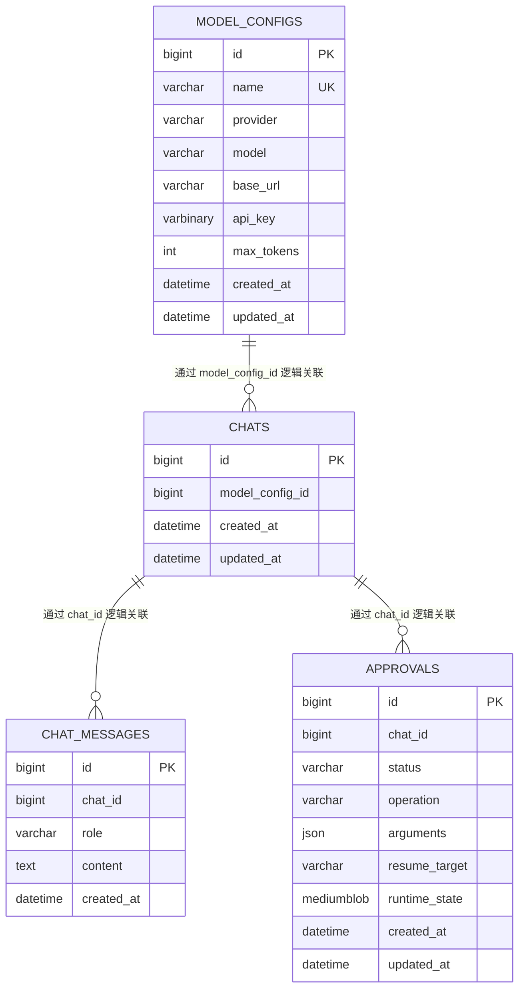

# 03 接口与数据模型

## 1. 接口约定

Chat Service 默认监听 `http.host:http.port`，业务接口统一使用 `/api/v1` 前缀。健康检查不带版本前缀。

普通 JSON 响应统一包含三个字段：

```json
{
  "code": "OK",
  "message": "success",
  "data": {}
}
```

失败响应的 `data` 始终为 `null`：

```json
{
  "code": "CHAT_NOT_FOUND",
  "message": "Chat 不存在",
  "data": null
}
```

所有响应都带有 `X-Request-ID`。调用方可以传入 1～128 字节、只包含字母、数字、点、下划线或连字符的值；缺失、重复或不合法时服务端重新生成。

发送消息和决定审批是 SSE 接口。它们在开始流之前遇到错误时返回普通 JSON；SSE 已开始后遇到错误时发送 `event: error`。

完整机器可读契约见 [`api/openapi/gateway-agent.v1.yaml`](../../api/openapi/gateway-agent.v1.yaml)。本文用于解释接口意图，不重复所有 OpenAPI 字段。

## 2. 健康检查

| 方法 | 路径 | 作用 |
|---|---|---|
| GET | `/healthz` | 只检查进程能否响应 |
| GET | `/readyz` | 检查 MySQL 是否可用 |

`/healthz` 不访问依赖。`/readyz` 失败时返回 `503`，供容器编排系统判断实例是否能承接业务请求。

## 3. 模型配置 API

### 3.1 接口清单

| 方法 | 路径 | 作用 |
|---|---|---|
| POST | `/api/v1/model-configs` | 创建模型配置 |
| GET | `/api/v1/model-configs` | 查询全部模型配置 |
| GET | `/api/v1/model-configs/{model_config_id}` | 查询单个模型配置 |
| PUT | `/api/v1/model-configs/{model_config_id}` | 更新基本信息，不修改 API Key |
| PUT | `/api/v1/model-configs/{model_config_id}/api-key` | 替换或清除 API Key |
| DELETE | `/api/v1/model-configs/{model_config_id}` | 删除未被 Chat 使用的配置 |

### 3.2 创建请求

```json
{
  "name": "production-deepseek",
  "provider": "deepseek",
  "model": "deepseek-chat",
  "base_url": "",
  "api_key": "sk-...",
  "max_tokens": 4096
}
```

支持的 `provider`：

- `openai`
- `deepseek`
- `qwen`
- `claude`
- `gemini`
- `ollama`
- `ark`

`base_url` 为空时使用对应 Provider 的默认行为。Ollama 默认使用 `http://localhost:11434`，Qwen 默认使用阿里云兼容地址。

### 3.3 响应

```json
{
  "code": "OK",
  "message": "success",
  "data": {
    "id": 1,
    "name": "production-deepseek",
    "provider": "deepseek",
    "model": "deepseek-chat",
    "base_url": "",
    "max_tokens": 4096,
    "api_key_configured": true,
    "created_at": "2026-07-26T12:00:00Z",
    "updated_at": "2026-07-26T12:00:00Z"
  }
}
```

API Key 永远不会出现在响应中。`api_key_configured` 只说明是否保存了密钥。

### 3.4 更新 API Key

替换密钥：

```json
{
  "api_key": "new-secret"
}
```

清除密钥：

```json
{
  "api_key": ""
}
```

请求体必须明确包含 `api_key` 字段。JSON `null` 和缺失字段都不表示清除。

## 4. Chat 与 Message API

### 4.1 创建 Chat

```http
POST /api/v1/chats
Content-Type: application/json
```

使用系统默认模型：

```json
{}
```

使用保存的模型配置：

```json
{
  "model_config_id": 1
}
```

响应中的 `model_config_id` 为 `null` 表示该 Chat 使用启动配置中的默认模型。

### 4.2 查询 Chat

```http
GET /api/v1/chats/{chat_id}
```

当前 Chat 只有 ID、模型配置和时间字段。没有 Task、Run、状态机或标题字段。

### 4.3 发送消息

```http
POST /api/v1/chats/{chat_id}/messages
Accept: text/event-stream
Content-Type: application/json
```

```json
{
  "content": "帮我查询 shop.example.com 的路由"
}
```

该接口直接返回 SSE，不返回 `201` Message JSON。用户消息在 Agent 开始前已经写入 MySQL。

### 4.4 查询消息历史

```http
GET /api/v1/chats/{chat_id}/messages?after_id=0&limit=50
```

- `after_id`：只返回 ID 大于该值的消息，默认 0；
- `limit`：1～200，默认 50；
- `next_after_id`：本次最后一条消息 ID；没有数据时保持传入的 `after_id`。

响应：

```json
{
  "code": "OK",
  "message": "success",
  "data": {
    "items": [
      {
        "id": 10,
        "chat_id": 1,
        "role": "user",
        "content": "帮我查询 shop.example.com 的路由",
        "created_at": "2026-07-26T12:00:00Z"
      }
    ],
    "next_after_id": 10
  }
}
```

## 5. SSE 事件

### 5.1 `text_delta`

模型新生成的一段文本：

```text
event: text_delta
data: {"content":"当前匹配到"}
```

客户端按收到顺序追加显示。分片不是消息，不写入 `chat_messages`。

### 5.2 `completed`

完整 Assistant 消息已经写入 MySQL：

```text
event: completed
data: {"id":11,"chat_id":1,"role":"assistant","content":"当前匹配到 2 条路由。","created_at":"2026-07-26T12:00:02Z"}
```

收到该事件后，客户端可以把临时流式文本替换为返回的完整 Message。

### 5.3 `approval_required`

写操作已经暂停且 Approval 已写入 MySQL：

```text
event: approval_required
data: {"id":3,"chat_id":1,"status":"pending","operation":"create_route","arguments":{"name":"shop-route","domains":["shop.example.com"],"path":{"type":"PRE","value":"/api"},"backends":[{"name":"shop-service","port":8080,"weight":100}]},"created_at":"2026-07-26T12:00:02Z"}
```

客户端应停止显示“正在生成”，并在同一对话中展示审批卡片。

### 5.4 `error`

SSE 开始后发生错误：

```text
event: error
data: {"code":"INTERNAL_ERROR","message":"服务器内部错误","data":null}
```

错误事件是本次流的终点。内部错误详情只写服务端日志。

## 6. Approval API

### 6.1 查询待审批操作

```http
GET /api/v1/chats/{chat_id}/approvals?status=pending
```

当前 `status` 只接受 `pending`。接口不返回已经批准或拒绝的历史审批，也不返回内部恢复状态。

### 6.2 决定审批

```http
POST /api/v1/chats/{chat_id}/approvals/{approval_id}/decisions
Accept: text/event-stream
Content-Type: application/json
```

批准：

```json
{
  "decision": "approved",
  "reason": "参数确认无误"
}
```

拒绝：

```json
{
  "decision": "rejected",
  "reason": "域名填写错误"
}
```

该接口在保存决定后恢复 Agent，所以仍使用与发送消息相同的 SSE 契约：`text_delta`、`completed`、`approval_required` 或 `error`。它不会返回一份普通 Approval JSON。

## 7. 稳定错误码

| Code | 常见 HTTP 状态 | 含义 |
|---|---:|---|
| `INVALID_REQUEST` | 400 | URI、Query 或 JSON 不符合接口要求 |
| `INVALID_MESSAGE_CONTENT` | 400 | 消息为空或超过 60 KiB |
| `CHAT_NOT_FOUND` | 404 | Chat 不存在 |
| `MODEL_CONFIG_NOT_FOUND` | 404 | 模型配置不存在 |
| `APPROVAL_NOT_FOUND` | 404 | Approval 不属于该 Chat 或不存在 |
| `MODEL_CONFIG_NAME_CONFLICT` | 409 | 模型配置名称重复 |
| `MODEL_CONFIG_IN_USE` | 409 | 模型配置仍被 Chat 使用 |
| `APPROVAL_ALREADY_DECIDED` | 409 | Approval 已经批准或拒绝 |
| `INTERNAL_ERROR` | 500 | 不能安全暴露给客户端的内部错误 |

必要依赖不可用时 HTTP 状态为 `503`，客户端仍收到安全的 `INTERNAL_ERROR` Code 和“服务暂时不可用”消息；`DEPENDENCY_UNAVAILABLE` 只用于服务端内部分类，不直接暴露。

## 8. 数据模型

当前只有四张业务表。



项目当前不使用数据库外键和 CHECK 约束。关系由 Service 和查询条件维护，索引用于主要访问路径。

### 8.1 `chats`

| 字段 | 作用 |
|---|---|
| `id` | Chat ID |
| `model_config_id` | 可空；为空时使用系统默认模型 |
| `created_at` | 创建时间 |
| `updated_at` | 最近一条消息写入时间 |

### 8.2 `chat_messages`

| 字段 | 作用 |
|---|---|
| `id` | 全局递增消息 ID，也是历史查询游标 |
| `chat_id` | 所属 Chat |
| `role` | 当前只写入 `user` 或 `assistant` |
| `content` | 完整消息正文 |
| `created_at` | 消息创建时间 |

表中没有 `updated_at`，因为当前消息写入后不允许修改。

### 8.3 `model_configs`

| 字段 | 作用 |
|---|---|
| `id` | 模型配置 ID |
| `name` | 用户可读名称，全局唯一 |
| `provider` | Eino Provider 名称 |
| `model` | Provider 中的模型名称 |
| `base_url` | 可选自定义服务地址 |
| `api_key` | AES-256-GCM 密文，可空 |
| `max_tokens` | 单次生成最大 Token 数 |
| `created_at` | 创建时间 |
| `updated_at` | 最近更新时间 |

Service 在写 Store 前加密 API Key。普通查询不读取该列；只有创建 Agent 模型客户端时才单独读取并解密。

### 8.4 `approvals`

| 字段 | 作用 |
|---|---|
| `id` | Approval ID |
| `chat_id` | 发起审批的 Chat |
| `status` | `pending`、`approved` 或 `rejected` |
| `operation` | Tool 名称，当前为 `create_route` |
| `arguments` | 展示给用户并等待决定的完整 Tool 参数 |
| `resume_target` | Eino 中需要恢复的具体 Tool 调用标识 |
| `runtime_state` | Eino Checkpoint 二进制内容 |
| `created_at` | 创建时间 |
| `updated_at` | 决定时间；未决定时等于创建时间 |

列表查询刻意不读取 `resume_target` 和 `runtime_state`，避免把大字段带到普通审批页面。

## 9. 启动配置

服务使用 `--config` 指定 YAML：

```bash
./_output/bin/chat-svc --config configs/chat-svc.yaml
```

YAML 包含：

- `http.host`、`http.port`；
- `mysql.host`、`mysql.port`、`mysql.database`、`mysql.username`、`mysql.password`；
- `higress.endpoint`、`higress.username`、`higress.password`；
- `model.provider`、`model.base_url`、`model.api_key`、`model.model`、`model.max_tokens`；
- `agent.max_iterations`。

所有字段都可以由对应的大写环境变量覆盖。除此之外，`MODEL_CONFIG_ENCRYPTION_KEY` 必须单独提供：它是 32 字节 AES 密钥的 Base64 编码，不写入 YAML 结构。

生产环境至少应通过 Secret 注入 MySQL 密码、Higress 密码、默认模型 API Key 和模型配置加密主密钥。
