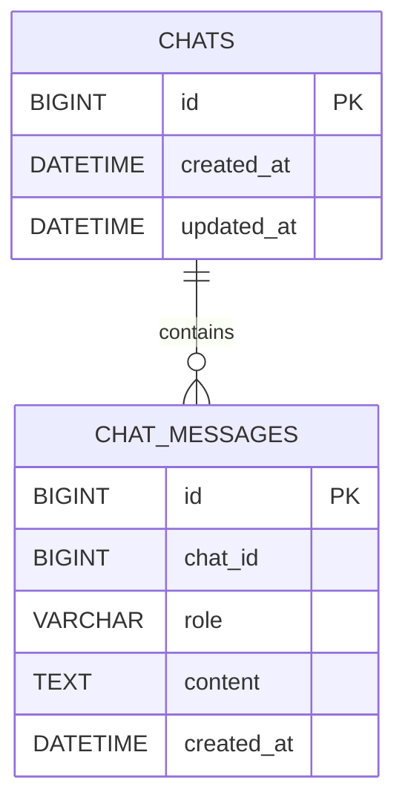
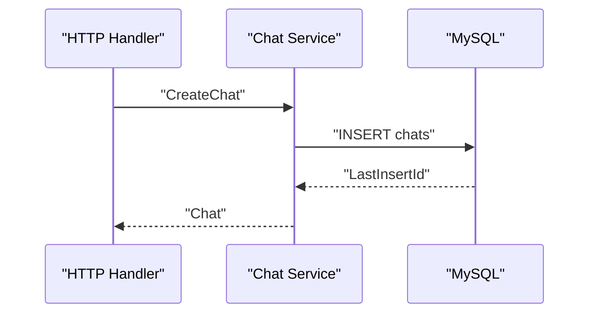
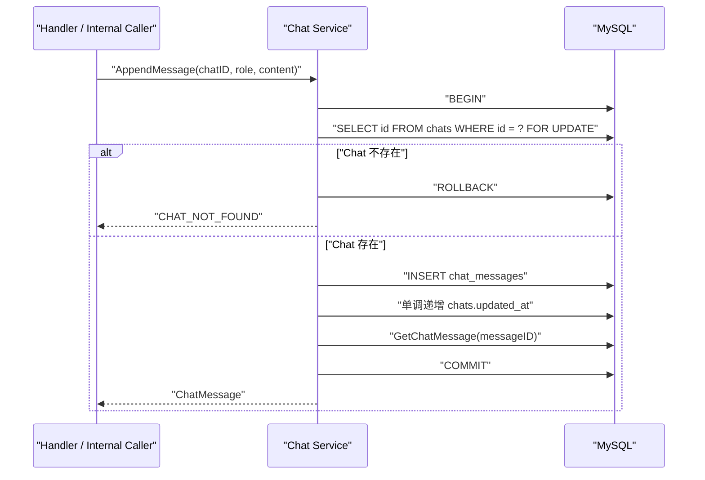

# 聊天与消息基础设计

> 状态：已确认
> 更新日期：2026-07-21
> 上位设计：[02-网关智能体目标产品与架构设计](./02-网关智能体目标产品与架构设计.md)

## 1. 设计结论

当前只实现用户与 Gateway Agent 的聊天容器和消息持久化，只创建两张表：

```text
chats
chat_messages
```

本设计不创建 Agent Run、Event、Audit、Idempotency、Outbox、Approval、Plan、Tool Execution 和 Knowledge 相关表。

这些对象仍然属于产品目标，但必须等对应业务流程、查询和事务明确后再详细设计。

## 2. 当前业务能力

本设计只支持以下操作：

1. 创建 Chat；
2. 查询 Chat 是否存在；
3. 用户向 Chat 追加 Message；
4. 按游标顺序读取 Chat Message。

明确不支持：

- 修改 Message 正文；
- 删除 Chat 或 Message；
- Chat 标题和自动摘要；
- 用户归属和权限；
- 附件；
- 异步 Agent 执行状态；
- SSE；
- 审批和 Tool 调用。

## 3. 数据关系



数据库不创建外键。`chat_id` 的合法性由 Chat Service 在事务内校验。

## 4. chats

### 4.1 用途

`chats` 表示用户与 Gateway Agent 的一个持续对话。

当前没有标题、创建人和状态，因此只保存标识和时间。

### 4.2 表结构

```sql
CREATE TABLE chats (
    id BIGINT UNSIGNED NOT NULL AUTO_INCREMENT COMMENT '对话唯一标识',
    created_at DATETIME(6) NOT NULL DEFAULT CURRENT_TIMESTAMP(6) COMMENT '对话创建时间',
    updated_at DATETIME(6) NOT NULL DEFAULT CURRENT_TIMESTAMP(6) COMMENT '对话最后活跃时间',

    PRIMARY KEY (id)
) ENGINE=InnoDB COMMENT='用户与 Gateway Agent 的持续对话';
```

### 4.3 字段依据

| 字段 | 写入方 | 读取方 | 保留原因 |
|---|---|---|---|
| `id` | MySQL | API、Message 查询 | Chat 的稳定标识 |
| `created_at` | MySQL | API | 表达创建时间 |
| `updated_at` | Chat Service | API、后续最近对话排序 | 表达最后一次消息活动时间 |

当前不为 `updated_at` 建索引，因为还没有 Chat 列表和按活跃时间排序的查询。

`updated_at` 由 Service 显式更新，不使用 `ON UPDATE CURRENT_TIMESTAMP`，避免其他字段变化时自动改变业务时间。

## 5. chat_messages

### 5.1 用途

`chat_messages` 保存 Chat 中不可变的消息。消息写入后不允许覆盖正文，因此不需要 `updated_at`。

### 5.2 表结构

```sql
CREATE TABLE chat_messages (
    id BIGINT UNSIGNED NOT NULL AUTO_INCREMENT COMMENT '消息唯一标识',
    chat_id BIGINT UNSIGNED NOT NULL COMMENT '消息所属对话',
    role VARCHAR(16) NOT NULL COMMENT '消息角色',
    content TEXT NOT NULL COMMENT '消息正文',
    created_at DATETIME(6) NOT NULL DEFAULT CURRENT_TIMESTAMP(6) COMMENT '消息创建时间',

    PRIMARY KEY (id),
    INDEX idx_chat_messages_chat_id_id (chat_id, id)
) ENGINE=InnoDB COMMENT='对话中的消息';
```

### 5.3 字段依据

| 字段 | 写入方 | 读取方 | 保留原因 |
|---|---|---|---|
| `id` | MySQL | API、游标分页 | 消息标识，同时作为稳定排序游标 |
| `chat_id` | Chat Service | Message 列表查询 | 确定消息属于哪个 Chat |
| `role` | Chat Service | 上下文构建、API | 区分用户和 Agent 消息 |
| `content` | Chat Service | 上下文构建、API | 保存消息原文 |
| `created_at` | MySQL | API | 表达消息创建时间 |

当前不增加 `metadata`、`status`、`task_id`、`sequence`、`updated_at` 和 `deleted_at`。

## 6. Message Role

数据库不使用 `CHECK` 或 `ENUM` 限制 Role。Role 由 Go 代码定义和校验：

```go
type MessageRole string

const (
    MessageRoleUser      MessageRole = "user"
    MessageRoleAssistant MessageRole = "assistant"
)

func (r MessageRole) Valid() bool {
    switch r {
    case MessageRoleUser, MessageRoleAssistant:
        return true
    default:
        return false
    }
}
```

外部 HTTP API 只能创建 `user` Message，不允许客户端自行提交 Role。`assistant` 是后续 Agent 输出需要的协议角色，本次只定义角色边界，不提供写入入口。

以后真正需要 `system` 或 `tool` Message 时，再扩展 Go 协议，不需要修改数据库结构。

## 7. 写入事务

### 7.1 创建 Chat



### 7.2 追加 Message



事务保持 `READ COMMITTED` 隔离级别，并在分配 Message 自增 ID 前使用 `SELECT ... FOR UPDATE` 锁定对应 Chat 行。锁持续到事务提交或回滚，因此同一 Chat 的并发追加会串行进入 `INSERT chat_messages`：先获得锁的事务先分配 ID 并先提交，后获得锁的事务再分配更大的 ID 并提交。这样 Message ID 的分配顺序与提交顺序一致，客户端推进 `after_id` 时不会越过尚未提交的较小 ID；不同 Chat 锁定不同数据行，仍可并发追加。

锁行查询查不到记录时仍返回 `CHAT_NOT_FOUND`。当前没有删除 Chat 的功能，因此不需要处理确认 Chat 存在后被另一个事务删除的竞态。

`TouchChat` 使用 `GREATEST(CURRENT_TIMESTAMP(6), TIMESTAMPADD(MICROSECOND, 1, updated_at))` 更新活跃时间，保证 `updated_at` 每次至少增加 1 微秒。这样即使连续写入落在同一数据库微秒内，MySQL 的 `RowsAffected` 也仍为 `1`，不会被误判为更新失败并回滚合法 Message。

## 8. 查询和分页

Message 使用自增 ID 作为游标，不增加单独的 `sequence` 字段。

```sql
SELECT id, chat_id, role, content, created_at
FROM chat_messages
WHERE chat_id = ?
  AND id > ?
ORDER BY id
LIMIT ?;
```

规则：

- `after_id` 省略时按 `0` 处理；
- 默认 `limit=50`；
- 最大 `limit=200`；
- 返回顺序始终为 ID 升序；
- 返回最后一条 Message ID 作为下一页游标；
- 空结果返回空数组，不返回 `null`。

索引 `idx_chat_messages_chat_id_id(chat_id, id)` 直接服务该查询，不创建没有查询依据的其他索引。

## 9. HTTP API

### 9.1 统一响应格式

所有 JSON 响应固定包含三个字段：

```json
{
  "code": "OK",
  "message": "success",
  "data": {}
}
```

字段职责：

| 字段 | 说明 |
|---|---|
| `code` | 稳定的机器可读代码，成功固定为 `OK` |
| `message` | 可读说明，客户端不能用它判断业务分支 |
| `data` | 业务数据；错误响应固定为 `null` |

HTTP 状态码仍然表达标准协议语义，不能把全部结果包装成 HTTP 200。请求追踪 ID 通过 `X-Request-ID` 响应头返回，不增加第四个 JSON 字段。

当前错误码：

```text
OK
INVALID_REQUEST
CHAT_NOT_FOUND
INVALID_MESSAGE_CONTENT
INTERNAL_ERROR
```

### 9.2 创建 Chat

```http
POST /api/v1/chats
Content-Type: application/json

{}
```

响应：

```json
{
  "code": "OK",
  "message": "success",
  "data": {
    "id": 1,
    "created_at": "2026-07-21T00:00:00.000000Z",
    "updated_at": "2026-07-21T00:00:00.000000Z"
  }
}
```

成功时使用 HTTP `201 Created`。

### 9.3 查询 Chat

```http
GET /api/v1/chats/1
```

Chat 不存在时返回：

```json
{
  "code": "CHAT_NOT_FOUND",
  "message": "Chat 不存在",
  "data": null
}
```

错误时使用 HTTP `404 Not Found`。

### 9.4 追加用户 Message

```http
POST /api/v1/chats/1/messages
Content-Type: application/json

{
  "content": "帮我查看当前网关路由"
}
```

HTTP Handler 不接受 `role` 字段，Service 固定写入 `user`。

### 9.5 查询 Message

```http
GET /api/v1/chats/1/messages?after_id=0&limit=50
```

响应：

```json
{
  "code": "OK",
  "message": "success",
  "data": {
    "items": [
      {
        "id": 1,
        "chat_id": 1,
        "role": "user",
        "content": "帮我查看当前网关路由",
        "created_at": "2026-07-21T00:00:01.000000Z"
      }
    ],
    "next_after_id": 1
  }
}
```

## 10. 输入校验

- `chat_id` 必须是大于零的整数；
- `content` 去除首尾空白后不能为空；
- 当前 Message 正文最大 60 KiB，确保不超过 MySQL `TEXT` 的字节上限；
- HTTP 请求不能指定 `role`；
- Cursor 必须大于等于零；
- Limit 必须在 1～200 之间。

系统保存用户原始正文，不进行意图改写和内容摘要。输入规范化属于后续 Agent 输入处理，不在本设计中实现。

## 11. sqlc Query Set

当前只建立 apiserver 使用的 MySQL Query Set，不创建尚未使用的 worker Query Set。

```text
db/apiserver/queries/chat.sql
db/apiserver/queries/chat_message.sql
```

需要的查询：

```text
InsertChat
GetChat
GetChatForUpdate
InsertChatMessage
GetChatMessage
TouchChat
ListChatMessagesAfter
```

`GetChatForUpdate` 在追加 Message 的事务中锁定目标 Chat 行，保证同一 Chat 的 Message ID 分配顺序与事务提交顺序一致。MySQL 不支持 PostgreSQL 风格的 `INSERT ... RETURNING`；`InsertChat` 和 `InsertChatMessage` 使用 sqlc `:execresult`，Store 通过 `sql.Result.LastInsertId()` 获取 ID，再按 ID 查询完整记录。

## 12. Go 代码边界

```text
internal/apiserver/
├── handler/chat/
├── service/chat/
└── store/mysql/
```

职责：

- Handler：HTTP 参数、DTO、状态码和错误映射；
- Service：正文校验、角色选择和 Chat/Message 用例；
- Store：sqlc 调用、事务和数据库模型转换。

当前不为 Store 定义只有一个实现的接口，也不创建 Repository、Domain Aggregate 或 Getter-heavy Model。

## 13. Migration

只创建：

```text
db/migrations/
├── 000001_create_chats_table.up.sql
├── 000001_create_chats_table.down.sql
├── 000002_create_chat_messages_table.up.sql
└── 000002_create_chat_messages_table.down.sql
```

Down Migration 按依赖顺序先删除 `chat_messages`，再删除 `chats`。虽然没有外键，仍保持清晰的业务删除顺序。

## 14. 验收标准

- MySQL 8.4 可以完整执行 `up → down → up`；
- 数据库只存在 `chats`、`chat_messages` 和 Migration 工具自身的版本表；
- 两张表及全部字段都有中文注释；
- sqlc 使用 MySQL Engine 和 `database/sql`；
- 工程不存在 pgx、PostgreSQL 和 `pg_notify` 运行时代码；
- 创建 Chat 后能够取得自增 ID；
- 能向存在的 Chat 追加用户 Message；
- 向不存在的 Chat 追加 Message 返回 `CHAT_NOT_FOUND`；
- 同一 Chat 并发追加 Message 时，Message ID 分配顺序与事务提交顺序一致，游标不会永久漏消息；
- 追加 Message 后 `chats.updated_at` 被显式且单调地更新，同微秒写入不会因 `RowsAffected=0` 被误回滚；
- Message 能使用 `(chat_id, id)` 索引按游标读取；
- 不提供修改或删除 Message 的 API、Service 方法和 SQL Query；
- 不创建任何尚未使用的业务表和字段。
