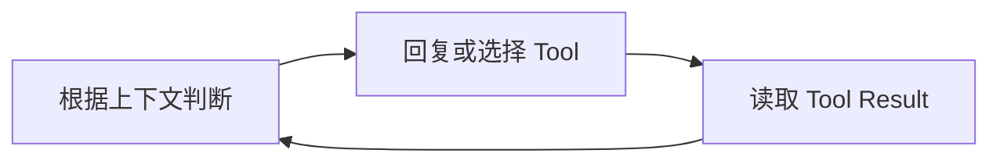
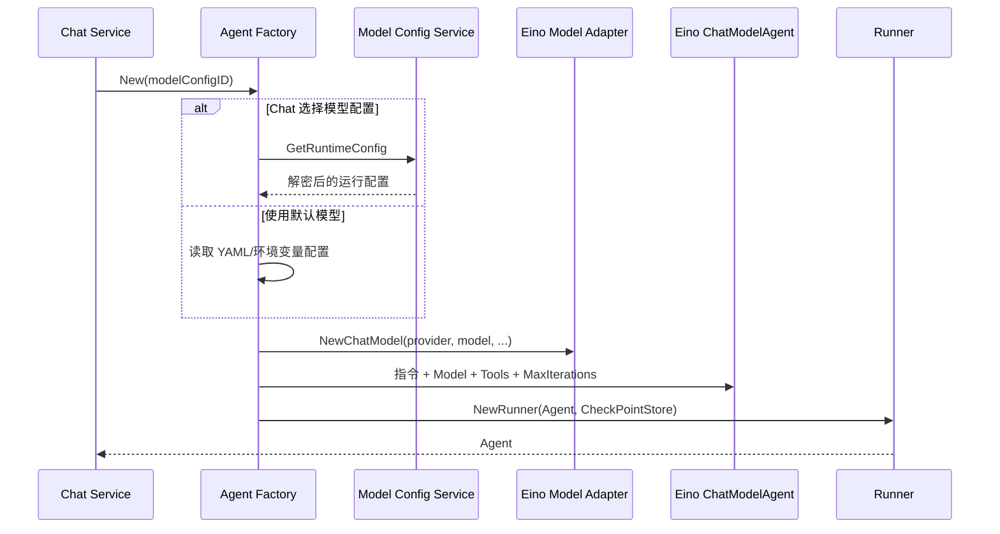

# 04 Agent 运行与工具设计

## 1. 先理解当前 Agent 是什么

当前 Gateway Agent 不是一张自研状态机，也不是一个永远运行的后台任务。它是 Chat Service 在处理一条用户消息时创建的一次 Eino ADK 运行：

```text
最近的 Chat Message
        ↓
Eino ChatModelAgent
        ↓
模型决定回复文本或调用 Tool
        ↓
Tool Result 回到模型
        ↓
模型生成最终回复
```

一次 HTTP 请求对应一次 Agent 运行。运行结束、发生审批中断或客户端断开后，这次运行就结束。下一条用户消息会根据数据库中的消息历史创建新的 Agent。

## 2. 基础概念

### 2.1 Agent

Agent 是“模型 + 指令 + Tools + 运行规则”的组合。模型负责判断下一步，Tool 提供模型无法凭空完成的外部能力。

本项目的 Agent 指令要求：

- 网关实时状态必须通过 Tool 查询；
- 写操作只能产生待审批变更；
- 只有收到真实执行成功结果后才能宣称生效；
- 不向用户展示内部思考过程。

### 2.2 Runner

Runner 是 Eino 执行 Agent 的运行器。它负责：

- 把输入交给 Agent；
- 驱动模型和 Tool 多轮交互；
- 按执行顺序输出事件；
- 在发生 Stateful Interrupt 时保存 Checkpoint；
- 根据 Checkpoint 和恢复参数继续执行。

本项目没有名为 “Eino Runner” 的业务层。`runner` 只是 `Agent` 内部依赖，HTTP 和数据库不会出现 Eino 类型。

### 2.3 ReAct

ReAct 可以理解为模型重复执行以下循环：



例如用户问“`shop.example.com` 有哪些路由”：

1. 模型发现需要当前网关数据；
2. 调用 `query_routes(domain=shop.example.com)`；
3. Tool 返回 Higress 实时结果；
4. 模型根据结果生成用户可读回答。

这个循环由 Eino ADK 实现。本项目不再写一套 Plan/Execute `for` 循环。

### 2.4 TAO

TAO 常用来概括 Thought、Action、Observation，与 ReAct 表达的循环接近。当前代码没有单独的 TAO 类型或引擎，也不需要为了术语完整再封装一层。

### 2.5 Tool

Tool 是提供给模型的具名能力，包含：

- 名称；
- 给模型看的描述；
- JSON Schema；
- Go 执行函数。

模型只能提交 Tool 参数，真正的 HTTP 请求由服务端 Go 代码执行。模型无法直接获得 Higress 用户名和密码。

## 3. Agent 创建过程



Factory 在服务启动时构造当前 Tool 列表，在每次请求时根据 Chat 的模型配置创建模型客户端和 Agent。

## 4. 模型 Provider

Eino 已经为常见模型提供适配器，本项目直接使用这些适配器，不再为每个模型发明统一 HTTP 客户端。

| Provider | Eino 适配器 | Base URL 行为 |
|---|---|---|
| OpenAI | `openai.NewChatModel` | 空值交给适配器默认处理 |
| DeepSeek | `deepseek.NewChatModel` | 可配置 |
| Qwen | `qwen.NewChatModel` | 空值使用 DashScope 兼容地址 |
| Claude | `claude.NewChatModel` | 可配置 |
| Gemini | `genai.Client` + Eino Gemini | 可配置 |
| Ollama | `ollama.NewChatModel` | 空值使用 `localhost:11434` |
| Ark | `ark.NewChatModel` | 可配置 |

配置文件中的模型只是默认值。用户可以通过模型配置 API 保存自己的 Provider、模型、Base URL、API Key 和 Max Tokens，再在创建 Chat 时选择。

## 5. 当前 Tool Registry

Factory 当前注册两个 Tool：

### 5.1 `query_routes`

只读 Tool，支持：

- 按路由名称精确查询；
- 按域名分页查询；
- 默认页码 1、每页 20 条；
- 每页最多 100 条。

已知路由名称时优先调用单条查询。Higress 返回 404 时，Tool 返回空结果，让模型告诉用户未找到，而不是把正常业务结果当作系统错误。

### 5.2 `create_route`

写 Tool，输入包括：

- `name`；
- `domains`；
- `path.type`、`path.value`、`path.case_sensitive`；
- `methods`；
- `backends[].name`、`port`、`weight`。

首次执行时，它只完成规范化和确定性校验，然后调用 Eino `StatefulInterrupt`。只有恢复时收到 `approved` 决定，它才调用 `RouteWriter.CreateRoute`。

Tool 内部控制审批边界的好处是：即使模型直接选择写 Tool，也无法绕过中断点。

## 6. 为什么代码中有两个循环

Agent 流式代码中可以看到两个不同的读取循环，它们处理的不是同一层数据。

### 6.1 `iterator.Next()`

`Runner.Run` 返回 Agent 事件迭代器。一次 Agent 运行可能依次产生：

- 模型消息；
- Tool 调用和结果；
- 新一轮模型消息；
- 中断事件；
- 最终消息。

外层循环使用 `iterator.Next()` 读取这些“Agent 执行步骤”。

### 6.2 `stream.Recv()`

某一个 Agent 事件可能包含一条正在流式生成的 Assistant 消息。这条消息本身又由多个模型分片组成，所以内层循环使用 `stream.Recv()` 读取 Token/文本分片。

```text
Agent Event Iterator
├── Tool Call Event
├── Tool Result Event
└── Assistant Message Event
    ├── Chunk 1
    ├── Chunk 2
    └── Chunk 3
```

外层循环处理“发生了哪一步”，内层循环处理“这条模型消息的文本如何逐段到达”。把它们合成一个循环会丢失协议层次。

## 7. `yield` 是什么

Go 1.23 之后的 `iter.Seq2[T, error]` 用一个回调函数逐条交付结果。项目使用它把 Agent 事件传给 Service，再传给 SSE Handler。

概念上可以理解为：

```go
yield(event, nil)
```

表示“把当前事件交给调用方”。返回值含义是：

- `true`：调用方还要继续读取；
- `false`：调用方已经停止，生产方应尽快结束。

因此用户关闭浏览器后，SSE Handler 停止迭代，Agent 运行使用的 Context 被取消，模型请求也随之取消。

## 8. Agent 事件与 Chat 事件

Eino 原始事件不会直接暴露给 HTTP。`service/agent` 先把它们收敛成三个稳定事件：

| Agent Event | 含义 |
|---|---|
| `text_delta` | Assistant 新增文本 |
| `completed` | Agent 得到不包含 Tool Call 的最终消息 |
| `approval_required` | 根中断已经产生可恢复的写操作 |

Chat Service 再完成持久化：

- `completed`：保存 Assistant Message；
- `approval_required`：保存 Approval；
- `text_delta`：直接转发，不写库。

这样 Eino 可以升级或替换内部事件结构，而对前端的 SSE 契约不必跟着变化。

## 9. 当前上下文管理

当前上下文逻辑很简单：

1. 保存本次用户消息；
2. 从 MySQL 读取最近 100 条 Chat Message；
3. 转换成 Eino `schema.Message`；
4. 交给 Agent。

这里的 100 是消息条数，不是 Token 预算。当前没有：

- 自动摘要；
- 上下文压缩 Checkpoint；
- 对工具结果的裁剪策略；
- 长期记忆检索；
- 语义向量召回；
- 系统状态差量注入。

因此长对话可能超过模型上下文窗口。这是当前明确限制，不通过“模型可能自己处理”掩盖。

下一步设计上下文时，应借鉴成熟 Agent 的共同做法：完整消息是持久事实，发给模型的是受 Token 预算控制的投影；先保留最近消息和重要 Tool 结果，必要时生成可追溯摘要。是否需要向量数据库，要由真实召回数据决定。

## 10. 参数规范化与意图识别现状

当前有两种不同层次，不能混称：

### 已实现：Tool 参数规范化

`create_route` 会裁剪字符串、统一路径类型和 HTTP 方法大小写，并校验端口与权重。这保证展示给用户审批的参数可以被确定性代码检查。

### 未实现：用户需求规范化

系统尚未把用户原话独立转换成版本化的 Normalized Request，也没有字段完整度、来源和置信度模型。

### 未实现：独立意图识别

当前由大模型根据 Tool Schema 自然选择 `query_routes`、`create_route` 或直接回答。没有独立分类器、置信度阈值和意图冲突处理。

是否需要独立意图节点，应根据真实失败案例决定。例如模型频繁把“解释路由”误判成“创建路由”时，才有充分理由加入更明确的意图和追问机制。

## 11. Plan、Skill 和 MCP 现状

- 没有 Plan/Replan；当前写操作审批绑定一份 Tool Arguments；
- 没有 Skill；当前两个 Tool 在 Factory 中静态注册；
- 没有 MCP Client、Server 或配置表；
- 没有自研 Agent Loop。

未来接入 Skill 或 MCP 时，它们仍然只是 Agent 可见能力的来源，不能绕过 Tool Schema、审批和 Gateway Adapter。Eino 提供合适实现时应优先复用，不套一层只为改名的空封装。

## 12. 取消与错误

- 客户端停止读取 SSE 时取消 Agent Context；
- 模型流读取失败时停止当前运行；
- Tool 参数或执行返回错误时，当前 Eino 事件携带该错误并结束本次运行；
- SSE 开始前的错误返回普通 JSON；
- SSE 开始后的错误使用 `error` 事件；
- 内部错误写英文日志，客户端不看到凭证、URL 响应正文或堆栈。

当前没有自动重试状态机。模型或 Higress 调用失败后，本次请求结束，由用户决定是否重新发送消息。这符合当前短请求边界，也避免加入难以解释的重复副作用。

## 13. 开源实现参考与取舍

当前设计不是从术语开始拼装，而是把成熟项目中已经有实现的边界应用到本项目：

| 项目 | 借鉴内容 | 本项目的取舍 |
|---|---|---|
| [CloudWeGo Eino](https://github.com/cloudwego/eino) | Go 模型适配器、ADK Runner、Tool Calling、流式消息、Checkpoint 和中断恢复 | 当前直接依赖；不在外面复制第二套 Agent Loop |
| [Google ADK Go](https://github.com/google/adk-go) | Agent、Tool、Session 和人工介入的边界 | 当前已有 Eino 实现，不同时维护另一套 Runtime |
| [pi-mono](https://github.com/badlogic/pi-mono) | 模型分片只服务实时 UI，完整 Assistant Message 才进入持久会话 | 借鉴事件语义，不复制 TypeScript Runtime 和本地 JSONL Session |
| [OpenAI Codex](https://github.com/openai/codex) | Tool Schema 与执行边界、审批、安全策略、上下文投影 | 借鉴约束，不复制 Rust Agent Loop、CLI Tool 和本地存储格式 |
| [kagent](https://github.com/kagent-dev/kagent) | Agent 与 Gateway/Kubernetes Tool 集成、MCP 和可观测性实践 | 当前不采用 A2A Task、中央多 Agent 管理和 Kubernetes Controller |

判断一个开源实现是否复用时遵循三条规则：

1. 已经完全满足需求的库直接依赖，例如 Eino Provider 和 ADK；
2. 协议语义适合、运行时不适合时复制边界思想，例如“分片瞬时、完整消息持久”；
3. 当前没有真实调用方的能力不移植，例如 MCP、复杂 Session Event、A2A Task 和多 Agent Controller。

后续能力的触发条件、验收标准和更完整的源码参考见[《06 未实现能力与实现原则》](./06-未实现能力与实现原则.md)。
