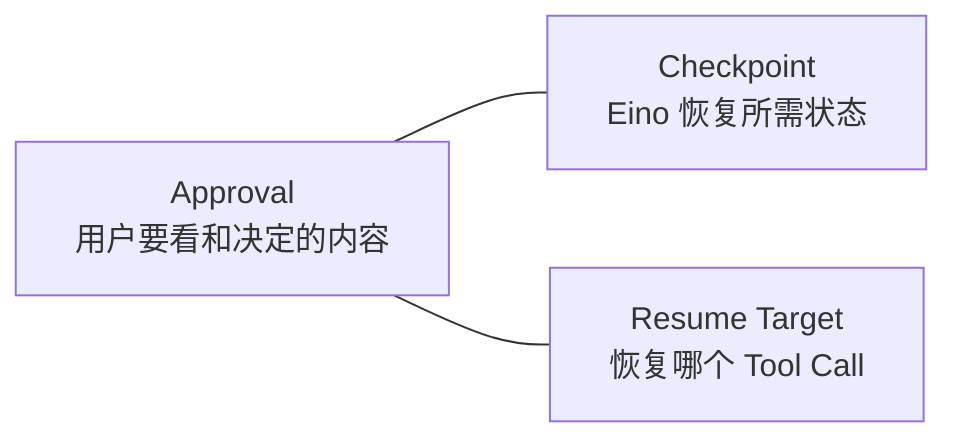
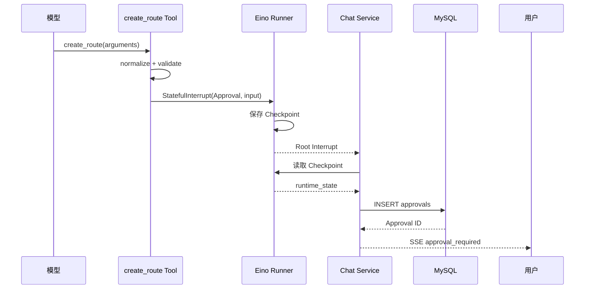
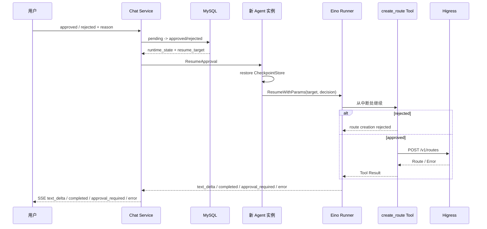
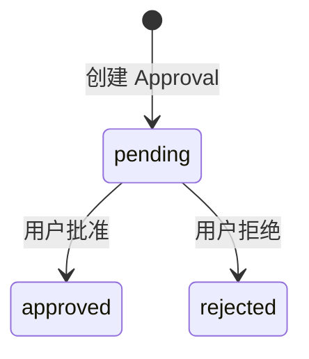

# 05 路由审批与恢复设计

## 1. 要解决的问题

模型可以根据用户对话生成创建路由的参数，但它不能自行决定把这些参数写入生产网关。系统必须在真正调用 Higress 前暂停，让用户看到完整内容并明确批准或拒绝。

审批可能持续几秒，也可能持续很久。在等待期间：

- HTTP 请求已经结束；
- 原来的 Agent 对象已经释放；
- Chat Service 可能重启；
- 用户稍后从待审批列表重新进入。

因此不能只在 Go 内存中保存一个“等待确认”的回调。当前实现使用 Eino Stateful Interrupt 和 Checkpoint 保存可恢复的 Agent 状态，并把它与 Approval 一起写入 MySQL。

## 2. Approval 与 Checkpoint 的区别

### 2.1 Approval

Approval 是产品概念，回答：

- 用户需要决定什么操作；
- 展示给用户的参数是什么；
- 当前决定是 pending、approved 还是 rejected；
- 该操作属于哪个 Chat。

前端只需要理解这部分。

### 2.2 Checkpoint

Checkpoint 是 Eino 运行时概念，回答：

- Agent 在哪个模型/Tool 执行位置暂停；
- 恢复时需要重建哪些运行状态；
- 用户决定应该发送给哪个被中断的 Tool Call。

Checkpoint 不展示给用户，也不进入 OpenAPI。它只是让服务器能够继续原来的 Agent 运行。

### 2.3 二者关系



当前一条 Approval 保存一份 Checkpoint 和一个 Resume Target。它不是通用工作流任务，也没有额外 Task/Run 表。

## 3. `create_route` 的输入

```json
{
  "name": "shop-route",
  "domains": ["shop.example.com"],
  "path": {
    "type": "PRE",
    "value": "/api",
    "case_sensitive": false
  },
  "methods": ["GET", "POST"],
  "backends": [
    {
      "name": "shop-service",
      "port": 8080,
      "weight": 100
    }
  ]
}
```

在创建 Approval 前，Tool 做确定性规范化和校验：

- 路由名称裁剪首尾空白且不能为空；
- 域名逐个裁剪，已提供的域名不能为空；
- 路径类型转成大写，只接受 `PRE`、`EQUAL`、`REGULAR`；
- 路径值裁剪后不能为空；
- HTTP 方法转成大写，已提供的方法不能为空；
- 至少有一个后端；
- 后端名称不能为空；
- 端口为 1～65535；
- 权重大于 0，总和必须是 100。

这层校验不是“多余防御”。它保证用户批准的参数符合 Higress 请求所需的确定性约束，不能只依赖模型遵守 JSON Schema。

## 4. 首次执行：创建 Approval



关键顺序：

1. `create_route` 先校验参数；
2. Tool 调用 `StatefulInterrupt`，不访问 Higress；
3. Eino Runner 先保存 Checkpoint，再发出中断事件；
4. Agent 读取根中断中的 Approval 信息和 Checkpoint；
5. Chat Service 把 Approval 写入 MySQL；
6. 写库成功后才发送 `approval_required`。

如果写库失败，前端不会收到一个无法恢复的审批卡片。

## 5. Approval 表中的字段

| 字段 | 对审批链路的意义 | 是否返回前端 |
|---|---|---|
| `id` | 用户决定时使用的审批 ID | 是 |
| `chat_id` | 防止跨 Chat 查询或决定 | 是 |
| `status` | `pending`、`approved`、`rejected` | 是 |
| `operation` | 当前为 `create_route` | 是 |
| `arguments` | 用户审查的完整 Tool 参数 | 是 |
| `resume_target` | Eino 被中断 Tool Call 的标识 | 否 |
| `runtime_state` | 序列化 Checkpoint | 否 |
| `created_at` | 审批创建时间 | 是 |
| `updated_at` | 用户决定时间 | 当前接口不返回 |

待审批列表只查询展示字段，不读取 `runtime_state` 大字段。决定审批时才读取完整记录。

## 6. 前端审批卡片

当前仓库只有后端，前端尚未实现。前端收到下面的 SSE 后应在对话中插入卡片：

```text
event: approval_required
data: {"id":3,"chat_id":1,"status":"pending","operation":"create_route","arguments":{...},"created_at":"..."}
```

建议卡片按业务含义展示，而不是只输出一段 JSON：

```text
┌──────────────────────────────────────────┐
│ 创建 Higress 路由                        │
│                                          │
│ 名称      shop-route                     │
│ 域名      shop.example.com               │
│ 路径      前缀匹配 /api                   │
│ 方法      GET, POST                      │
│ 后端      shop-service:8080  权重 100     │
│                                          │
│ [拒绝]                         [批准执行] │
└──────────────────────────────────────────┘
```

用户刷新页面后，前端通过待审批列表重新获取卡片：

```http
GET /api/v1/chats/1/approvals?status=pending
```

## 7. 用户决定

### 7.1 原子更新

决定接口执行的核心 SQL 等价于：

```sql
UPDATE approvals
SET status = ?, updated_at = CURRENT_TIMESTAMP(6)
WHERE id = ?
  AND chat_id = ?
  AND status = 'pending';
```

`status = 'pending'` 是并发保护。即使两个浏览器同时点击：

- 第一个请求更新一行并继续恢复；
- 第二个请求更新零行，查询到记录已存在后返回 `409 APPROVAL_ALREADY_DECIDED`。

不需要为这一个状态转换建立额外锁表或重试状态机。

### 7.2 恢复 Agent



恢复时不是“重新让模型生成一次 create_route 参数”。系统把原 Checkpoint 装入新的进程内 Store，并把决定发给原来的 Resume Target，所以批准的仍是用户看到的那次 Tool 调用。

## 8. Tool 恢复后的三种结果

### 8.1 拒绝

Tool 不调用 Higress，返回普通 Tool Result：

```text
route creation rejected: 域名填写错误
```

模型根据结果生成面向用户的最终回复。拒绝原因是可选的。

### 8.2 批准并执行成功

Tool 把保存的输入转换成统一 `gateway.Route`，再由 Higress Adapter 调用：

```http
POST /v1/routes
```

成功后 Tool 返回创建的路由名称，模型生成最终回复，Chat Service 保存完整 Assistant Message。

### 8.3 批准但执行失败

Higress 网络错误、HTTP 非 2xx、响应解析失败或业务 `success=false` 都会结束当前流并发送 `error`。

Approval 仍保持 `approved`。原因是它记录的是“用户已经授权这次尝试”，不是“网关已经成功变更”。当前没有 Execution 表，也不把 Approval 扩展成执行状态机。

用户可以查看错误后重新发送一条消息，再产生新的 Tool Call 和新的 Approval。系统不会自动重放可能产生副作用的写请求。

## 9. 服务重启恢复

待审批链路没有依赖原进程内存：

- Approval 参数在 MySQL；
- Checkpoint 在 MySQL；
- Resume Target 在 MySQL；
- 模型配置 ID 在 Chat；
- 模型凭证密文在 `model_configs` 或默认配置中。

服务重启后，决定接口会：

1. 查询 Chat；
2. 根据 Chat 模型配置创建新的 Agent；
3. 原子更新 Approval；
4. 把数据库中的 Checkpoint 恢复到新 Agent；
5. 调用 Eino Resume。

这就是当前“可靠恢复”的边界。系统不承诺恢复任意进程指令位置，也不自动恢复已经开始但结果未知的外部副作用。

## 10. 审批状态语义



只有三个状态，没有 `executing`、`completed`、`failed`：

- `pending`：用户尚未决定；
- `approved`：用户已经批准；
- `rejected`：用户已经拒绝。

执行结果属于恢复后的 Agent 请求，通过 SSE 和最终 Message 表达。等未来出现“脱离 HTTP 长期执行、重试、验证、回滚”等真实需求时，再设计独立 Execution 概念。

## 11. 失败边界

| 失败位置 | Approval 结果 | 用户看到什么 |
|---|---|---|
| 参数校验失败 | 不创建 | SSE `error`，用户修正后重新发送 |
| Checkpoint 读取失败 | 不创建 | SSE `error` |
| Approval 写库失败 | 不创建 | SSE `error` |
| 决定前 Chat/Approval 不存在 | 不变化 | 404 JSON |
| 重复决定 | 保持原状态 | 409 JSON |
| 创建 Agent 失败 | 保持 `pending` | 普通 JSON 错误 |
| 决定写库后恢复失败 | `approved`/`rejected` | SSE `error` |
| Higress 创建失败 | `approved` | SSE `error` |
| 用户关闭恢复 SSE | 已保存用户决定 | Agent Context 取消 |

Service 在更新决定前创建 Agent。这样模型配置无效或模型客户端无法创建时，Approval 仍保持 `pending`，用户可以修复配置后再次决定。

## 12. 当前安全保证

已实现：

- 未经批准，`create_route` 不调用 RouteWriter；
- 前端审批参数来自实际 Tool 输入；
- 决定只作用于 URL 中 Chat 所属的 Approval；
- 同一 Approval 只允许决定一次；
- API 不返回 Checkpoint 和 Resume Target；
- 模型看不到 Higress 凭证。

尚未实现：

- 用户身份和审批人记录；
- RBAC 和环境权限；
- Plan 版本/Hash 与 Approval 绑定；
- Approval 过期、撤销和转交；
- 执行审计、验证和回滚；
- 同一资源上的并发变更检测。

因此当前链路适合受信网络内的功能验证，不应在没有外围身份和网络控制的情况下直接开放生产写入。

## 13. 为什么没有 Temporal、Redis 和 Outbox

当前审批等待只需要保存一份 Checkpoint，并在用户请求到来时恢复：

- 没有后台定时器；
- 没有跨服务消息；
- 没有执行队列；
- 没有需要可靠投递的领域事件；
- 没有离线长任务。

MySQL + Eino Checkpoint 已经满足当前场景。引入 Temporal、Redis 或 Outbox 只会增加新的状态、重试和故障语义，却不能提高这条链路的用户价值。

只有当出现明确需求，例如审批跨多天且有超时升级、批准后必须脱离浏览器后台执行、执行包含多个可补偿步骤，才重新评估持久工作流引擎。

## 14. 端到端验收用例

使用真实模型和真实 Higress 时，至少验证：

1. 用户用自然语言描述完整路由，模型产生正确 Tool 参数；
2. 收到 Approval 后，Higress 中尚不存在该路由；
3. 重启 Chat Service，待审批列表仍能查询该 Approval；
4. 拒绝后 Higress 中仍不存在路由，Agent 返回拒绝说明；
5. 重新发起并批准后，Higress 创建一次路由；
6. Agent 最终回复与 Higress 实际状态一致；
7. 重复提交同一个决定返回 409；
8. 使用错误 Higress 凭证时，审批为 approved，但 SSE 明确失败；
9. Message 历史中只保存用户消息和完整 Assistant 回复，没有 Token 分片和内部 Checkpoint。
