# Gateway Agent 输入规范化与可靠执行设计

> 状态：设计已确认，等待实施
> 更新日期：2026-07-22
> 适用仓库：gateway-agent
> 详细范围：Task、Agent Run、Task Input、Task Event、Temporal、Outbox、Redis、SSE
> 代码标识符使用英文，代码注释和数据库注释使用中文

## 0. 先看结论

这份设计解决的不是“调用一次大模型”，而是下面这个更真实的问题：

> 用户通过多轮对话逐步说清楚需求；系统每收到一条新消息，就可靠地向前推进一次；即使 API、Worker、Temporal、Redis 或浏览器中途重启，也不能忘记用户说过什么、不能重复执行、不能把未审批的变更直接发到生产网关。

核心结论如下：

- Chat 是用户看到的一段持续对话；
- Task 是这段对话里一个长期业务目标；
- Agent Run 是一条用户消息触发的一次推进；
- 每条用户消息创建一个新的 Run；
- POST Message 使用稳定幂等键，HTTP 重试不会重复创建 Run；
- 一个 Task 对应一个长期运行的 Temporal Workflow；
- Eino 负责模型、Prompt、Graph、Retriever、Tool 和 Agent 编排；
- Temporal 负责可靠唤醒、重试、等待、恢复和长任务生命周期；
- MySQL 是业务事实来源；
- Outbox 只负责把 MySQL 中已经提交的 Run 可靠通知给 Temporal；
- Redis Pub/Sub 只提醒 SSE“有新持久事件”；
- Redis Streams 只短期保存用户可见的模型文本片段；
- 最终完整 Assistant Message 仍写入 MySQL；
- 一个 Chat 只有一条长期 SSE，Run 结束时不会关闭；
- 同一 Chat 的 Message/Event 和同一 Task 的 Run 在分配 ID 前串行化，游标不会越过尚未提交的数据；
- 系统不保存也不展示模型私有思维链。

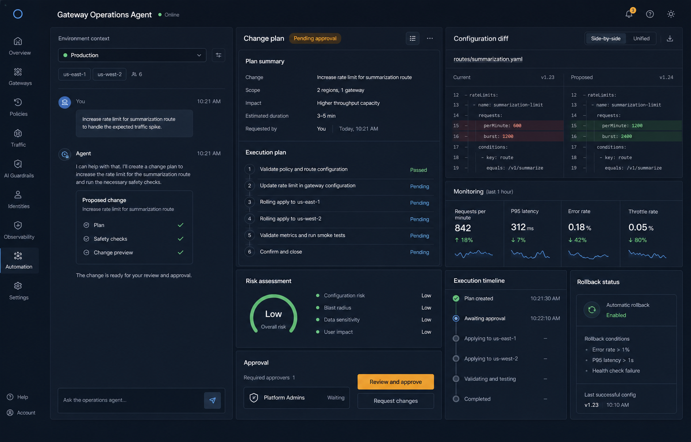

> 上图是 AI 生成的产品体验概念图，用于帮助理解“对话、计划、审批、执行证据在同一工作台中完成”。字段、按钮和布局不是本轮接口定义。

## 1. 用一个例子贯穿全文

假设用户想给 Higress 配置一条路由。

### 1.1 第一条消息：信息还不完整

用户说：

```text
帮我给订单服务配一条生产路由，域名是 api.example.com。
```

系统不能猜测路径、目标服务和端口，更不能直接修改生产网关。

这条消息产生：

```text
Chat 100
Task 501
Message 1001
Run 9001
Task Input v1
```

规范化结果：

```json
{
  "goal": "为订单服务配置生产环境网关路由",
  "constraints": [
    "host=api.example.com",
    "environment=production"
  ],
  "missing_information": [
    "gateway.route.path",
    "gateway.route.upstream.service",
    "gateway.route.upstream.port"
  ]
}
```

Task 进入 waiting_for_input。Agent 在 Chat 中追问缺失信息。

### 1.2 第二条消息：补齐信息

用户说：

```text
路径用 /orders，转发到 order-api.default.svc.cluster.local:8080，执行前先给我确认。
```

这条消息不会覆盖第一条消息，也不会创建另一个 Task，而是产生：

```text
Message 1003
Run 9002
Task Input v2
```

新的规范化结果由“Task Input v1 + 当前触发消息”生成：

```json
{
  "goal": "为订单服务配置生产环境网关路由",
  "constraints": [
    "host=api.example.com",
    "path=/orders",
    "upstream_service=order-api.default.svc.cluster.local",
    "upstream_port=8080",
    "environment=production",
    "approval_required=true"
  ],
  "missing_information": []
}
```

Task 进入 ready，后续才能进入意图识别、上下文构建、Plan、审批和执行。

### 1.3 为什么要分成这些对象

如果只保存聊天消息，系统知道“用户说过什么”，却不知道：

- 当前长期目标是什么；
- 哪一条消息触发了哪一次处理；
- 处理是否开始、完成或失败；
- 当前结构化需求是第几个版本；
- Worker 重启后应该从哪里继续；
- SSE 断线后应该补发哪些业务事实；
- Temporal 是否已经收到这次推进请求。

Task、Run、Task Input、Task Event 和 Outbox 分别回答这些问题。

## 2. 初学者概念地图


> 上图是 AI 生成的概念插图。可以把中间的智能节点理解为 Eino，把负责可靠推进的底层轨道理解为 Temporal 和 MySQL。

### 2.1 七个核心业务对象

| 概念 | 一句话解释 | 贯穿案例 |
|---|---|---|
| Chat | 用户看见的一段持续对话 | Chat 100 |
| Chat Message | 用户或 Agent 说的一句话 | “路径用 /orders” |
| Task | 一个需要多轮推进的长期业务目标 | 配置订单服务路由 |
| Agent Run | 一条新消息触发的一次 Agent 推进 | Run 9002 |
| Task Input | Agent 对当前目标和约束的结构化理解 | Input v2 |
| Task Event | 已经发生、可回放的业务事实 | task.ready |
| Outbox Message | 事务提交后必须可靠投递给 Temporal 的内部消息 | task.run_requested |

### 2.2 它们之间的关系

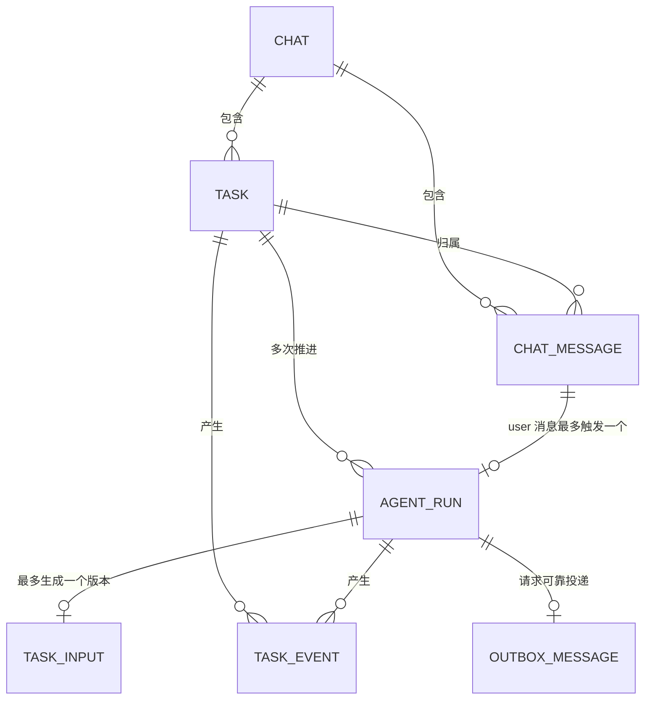

数据库暂不建立外键和 CHECK 约束，图中的关系由 Service 层在事务中校验。

只有 user Message 触发 Run；Assistant Message 不触发 Run。当前确定性回复通过 task.waiting_for_input 或 task.ready Event 的 run_id、message_id 关联生成它的 Run；未来流式回复通过 response.completed 的 run_id、response_id、message_id 关联。

### 2.3 Chat、Task、Run 最容易混淆

可以把它们类比为“项目群、工单、一次处理班次”：

```text
Chat：我和运维 Agent 的长期对话窗口
Task：这次要完成的具体目标，例如“配置订单路由”
Run：收到一条新信息后，Agent 本次上班处理到下一个等待点
```

一个 Chat 可以先讨论路由，再讨论模型限流，所以可以有多个 Task。一个 Task 可能需要用户补两次信息、审批一次、纠正一次，所以可以有多个 Run。

## 3. 产品范围与非目标

### 3.1 本轮真正交付的能力边界

本轮设计让系统具备：

- 一条用户消息始终原子创建 Message 和 Run；未传 task_id 时额外创建 Task；
- 同一个幂等键的网络重试返回第一次创建的 Message、Task 和 Run；
- 输入经过确定性清洗和模型语义规范化；
- 不完整需求能够形成 missing_information 并追问；
- 每次补充形成新的 Task Input 版本；
- MySQL 提交后可靠唤醒 Temporal；
- Worker 重启后继续领取尚未完成的 Run；
- 持久事件能够通过 Chat SSE 回放；
- 当前确定性回复在完成事务中一次写入 MySQL，不经过 Redis Streams；
- 为后续独立 Response Composer 和探索性 Agent 冻结模型流式输出协议；
- Redis 不可用时仍能保存最终结果。

### 3.2 本轮不提前实现

以下能力保留架构边界，但不在本轮创建对应业务表或实现完整闭环：

- 完整意图分类模型；
- Plan、Plan Step 和 Replan 数据模型；
- Approval 数据模型和审批 API；
- Tool Execution、补偿和回滚数据模型；
- Qdrant 索引与长期记忆；
- MCP Server 管理平台；
- Skill 在线编辑平台；
- 多 Agent 和 DeepAgent；
- 通用工作流设计器。

本轮的 Task 状态已经为后续 Plan、审批和执行保留语义，但字段和表不会为未来功能空占位。

## 4. 输入规范化到底是什么

输入规范化不是简单调用 strings.TrimSpace，也不是让模型把用户的话“写得更漂亮”。

它的目标是：

> 保留用户原话，同时生成一个稳定、受约束、可版本化的结构化任务输入，供后续意图识别和规划使用。

### 4.1 两层规范化

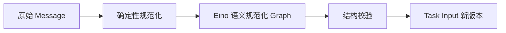

#### 第一层：确定性规范化

这一层不用模型，行为必须完全可预测。

| 检查 | 处理方式 | 为什么 |
|---|---|---|
| UTF-8 | 非法 UTF-8 在 HTTP 边界拒绝 | 避免数据库和模型收到不确定字节 |
| Unicode | 语义输入使用 NFC；原始 Message 不改写 | 避免视觉相同、编码不同的文本 |
| 换行 | 将 CRLF、CR 统一为 LF | 保证 Prompt 和摘要稳定 |
| 首尾空白 | 只用于判空和语义输入，不覆盖原文 | 保留审计原始消息 |
| 控制字符 | 允许 Tab 和换行；拒绝 NUL、其余 C0 控制字符和 DEL | 避免日志、终端和 Prompt 污染 |
| 长度 | HTTP Body 和 Message 内容分别限长 | 防止内存和模型成本失控 |
| 空输入 | 返回 INVALID_MESSAGE_CONTENT | 空消息不能触发 Agent |

原始 chat_messages.content 永远不覆盖。即使规范化后的文本不同，也必须能回到用户真正提交的原文。

#### 第二层：模型语义规范化

这一层使用 Eino 调用 ChatModel，把自然语言收敛成固定结构：

```json
{
  "goal": "...",
  "constraints": [],
  "missing_information": []
}
```

三个字段分别表示：

| 字段 | 含义 | 不应该包含 |
|---|---|---|
| goal | 用户最终想达成的结果 | 执行命令、Tool 调用 |
| constraints | 已明确的范围、资源、环境、限制和偏好 | 模型猜测的事实 |
| missing_information | 在不猜测的前提下仍必须补充的稳定字段 Code 数组 | 自由文本问题、模型临时发明的字段名 |

模型在这一阶段不能输出：

- Intent；
- Plan；
- Tool 名称或 Tool 参数；
- 可直接执行的 Gateway 命令；
- 审批结论；
- 模型私有思维链。

### 4.2 missing_information 为什么必须使用受控 Code

确定性 Response Composer 不能直接展示模型生成的 missing_information 字符串，否则模型仍然可以绕过边界，把任意自由文本塞进用户回复。

本轮把 missing_information 冻结为稳定 Code 数组，例如：

```json
{
  "missing_information": [
    "gateway.route.path",
    "gateway.route.upstream.service",
    "gateway.route.upstream.port"
  ]
}
```

Code 来自 Git 管理的 `configs/normalization-fields.yaml`。每个条目至少定义：

```yaml
fields:
  gateway.route.path:
    label: 路由路径
    question: 请提供路由路径，例如 /orders。
  gateway.route.upstream.service:
    label: 上游服务
    question: 请提供要转发到的上游服务。
  gateway.route.upstream.port:
    label: 上游服务端口
    question: 请提供上游服务端口。
  gateway.request.details:
    label: 更具体的需求信息
    question: 请补充希望操作的对象、目标环境和预期结果。
```

规则：

1. Normalizer Prompt 和结构校验器只接受 Catalog 中已经存在的 Code；
2. Composer 只读取 Catalog 中的 label/question，绝不回显未知 Code 或把 Code 当用户文案；
3. 未知 Code、重复 Code、空 Code 都属于业务校验失败；去重不能掩盖模型协议错误；
4. 第一次校验失败时，RepairOnce 获得允许的 Code 列表并只能修复格式或选择合法 Code；
5. 再次失败时让当前 Run 明确失败，不能把未知字符串展示给用户；
6. 无法归入具体字段时使用受控兜底 Code `gateway.request.details`，不能由模型临时创造问题；
7. Catalog 可以为新的 Gateway 资源持续增加 Code，因此不是只支持路由的封闭枚举；已有 Code 的语义和用户文案不得原地改变，需新增 Code 并通过 Git 评审；
8. 已经生成的 Assistant Message 持久化在 MySQL，历史展示不依赖后来更新的 Catalog。

这样既保留通用 Gateway Agent 的扩展能力，也保证用户看到的追问来自可评审配置，而不是模型自由文本。

### 4.3 为什么不让模型一步完成所有事情

如果一个 Prompt 同时负责理解、意图、计划、风险和执行，任何一步失败都会混在一段自由文本中，系统无法稳定校验，也无法知道应该重试哪一步。

拆分后每个组件只有一个职责：

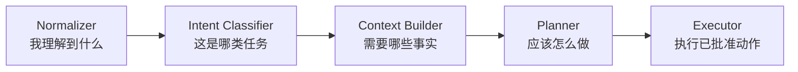

本轮只落地第一个组件，但边界从现在就保持清晰。

### 4.4 多轮输入如何合并

新的 Task Input 不重新把整个 Chat 塞给模型，而是使用：

```text
上一个 Task Input + 当前 Run 的 trigger message
```

原因：

- 输入长度稳定，不随 Chat 无限增长；
- 上一个 Task Input 已经是结构化的当前认知；
- 当前消息是本次变化量；
- 更容易判断用户是补充、纠正还是改变目标；
- 更容易重放和排查某个版本为何变化。

合并原则：

1. 用户明确纠正旧值时，以新值为准；
2. 用户补充新约束时，追加并去重；
3. 用户未提及的旧约束继续保留；
4. 模型不能自行删除生产环境、审批要求等重要约束；
5. 信息冲突无法安全解决时，进入 missing_information；
6. 每个 Run 最多生成一个 Task Input 版本。

### 4.5 未来有可靠行为识别后怎么办

当前闭环中，Task 的用户补充消息都会进入 Normalizer。

后续加入可靠的对话行为识别后：

| 用户行为 | 是否重新规范化 |
|---|---|
| 补充缺失信息 | 是 |
| 纠正已有信息 | 是 |
| 改变目标或约束 | 是 |
| 查询当前状态 | 否 |
| 取消任务 | 否 |
| 通过审批按钮批准 | 否 |
| 拒绝审批 | 否 |

这样可以避免把“批准”“现在到哪了”误当成新的业务需求。这个规则必须在后续意图识别设计中继续遵守。

### 4.6 Normalizer 与用户回复不是一个组件

Normalizer 只能生成 goal、constraints、missing_information，不能顺便生成面向用户的自由文本。

当前输入规范化闭环使用确定性 Response Composer：

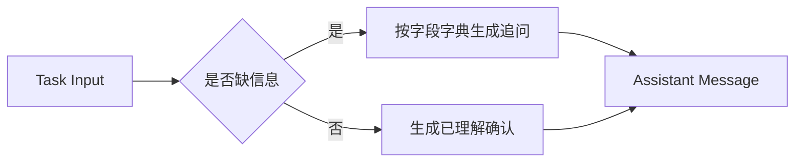

例如 missing_information 包含 gateway.route.path 和 gateway.route.upstream.port 时，模板从 Catalog 读取中文文案并生成：

```text
还需要确认两个信息：路由路径、上游服务端口。
```

这样不会让 Normalizer 的结构化边界被自由文本污染，也不需要为了很短的追问再调用一次模型。

Redis Streams 的流式输出边界是为后续独立的 Response Composer 和探索性 Agent 回复准备的。未来若使用模型生成用户回复，它必须是独立 Eino 节点：没有 Tool 权限，只接收已经审核过的结构化结果，只输出用户可见文本，并继续受敏感信息过滤约束。

当前 Normalizer 闭环没有模型流式回复的调用方：确定性 Response Composer 生成完整文本后，和 Assistant Message、Task Event、Run 终态一起提交到 MySQL。本轮实现不得因为下文已经冻结 Redis Streams、Response 和 SSE 协议，就提前创建没有真实调用方的空 Service、空 Store 或模拟流式代码。

## 5. Eino 初学者说明

### 5.1 Eino 是什么

Eino 是 CloudWeGo 开源的 Go LLM 应用开发框架。以 2026-07-21 核对的 v0.9.12 为准，它主要提供：

- ChatModel、Tool、Retriever、Embedding、ChatTemplate 等组件抽象；
- Graph 等可控编排能力；
- ChatModelAgent、ReAct、DeepAgent 等 Agent 能力；
- 流式数据传递；
- Callback 日志、追踪和指标切面；
- Checkpoint、Interrupt、Resume 等人机协同能力；
- eino-ext 中的模型和外部组件实现。

Eino 不是数据库，不是消息队列，也不是分布式任务系统。

### 5.2 Eino 中常见概念

| Eino 概念 | 初学者解释 | Gateway Agent 中的用途 |
|---|---|---|
| ChatModel | 对大模型调用的统一接口 | 访问通过 Higress AI Gateway 暴露的模型 |
| ChatTemplate | 把系统规则和业务输入组装成 Prompt | 构造 Normalizer Prompt |
| Lambda | 普通 Go 函数节点 | 确定性清洗、JSON 校验和结果转换 |
| Graph | 用节点和边描述明确流程 | 输入规范化、上下文构建等确定性流水线 |
| Tool | 模型可选择调用的外部能力 | 查询路由、校验配置、执行变更 |
| Retriever | 根据查询召回相关资料 | 未来从 Qdrant 召回历史细节和知识 |
| ChatModelAgent | 让模型在回答和调用 Tool 之间自主选择 | 未来只用于受控的探索性任务 |
| ReAct | 模型反复“选择动作—观察结果—继续判断” | 未来诊断和探索；不能绕过 Plan 和审批 |
| Runner | 启动或恢复 Agent 执行并消费事件 | Worker 内执行 Eino Agent |
| Streaming | 模型内容边生成边输出 | 合并后写入 Redis Streams |
| Callback | 统一注入日志、Trace、指标 | 记录模型耗时、Token、错误和节点路径 |
| Interrupt/Resume | 在某个节点暂停，收到外部输入后继续 | 可用于 Eino 内部人机交互，但不是业务事实来源 |

### 5.3 本轮为什么优先用 Graph，不直接上 DeepAgent

输入规范化的步骤是明确的：

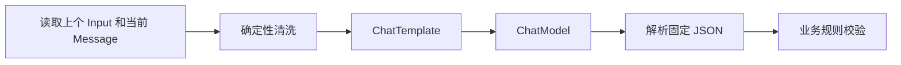

这里不需要模型自己决定“下一步做什么”，所以 Graph 比通用 Agent 更合适：

- 路径固定；
- 输入输出类型明确；
- 每个节点可观测；
- 失败位置清楚；
- 不会意外调用 Tool；
- 更容易限制一次模型调用和一次修复机会。

DeepAgent 适合长时间探索、拆分子任务和多 Agent 协同。当前需求没有证明必须引入它，过早使用只会增加不可控路径。

### 5.4 Normalizer Graph 的建议结构

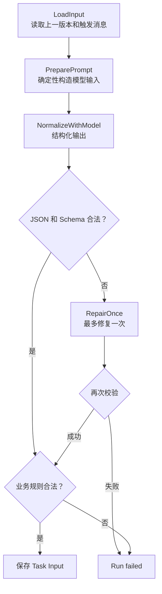

修复只针对输出格式，不允许借机改变用户语义。结构化输出连续失败时，Run 明确失败，不能用一段未经校验的自由文本继续执行。

### 5.5 Eino 的 Interrupt/Resume 为什么不替代 Temporal

Eino v0.9.12 的 Runner 可以配 CheckPointStore，并支持 Interrupt/Resume。这对 Agent 内部暂停很有用，但 Gateway Agent 仍然需要 Temporal。

| 问题 | Eino 重点 | Temporal 重点 |
|---|---|---|
| 模型和 Tool 如何编排 | 强 | 不是主要职责 |
| Graph 节点如何传递流 | 强 | 不是主要职责 |
| Agent 在哪里中断和恢复 | 支持 | 支持长期业务等待 |
| Worker 崩溃后的分布式任务恢复 | 需要应用自己设计存储和调度 | 核心能力 |
| 数小时或数天审批等待 | 不是业务调度系统 | 核心能力 |
| Activity 超时和重试策略 | 需要应用处理 | 核心能力 |
| Workflow 唯一 ID 和历史 | 不是其主要业务模型 | 核心能力 |
| 定时器、Signal、任务队列 | 不提供同等定位 | 核心能力 |

最终边界是：

```text
Temporal 决定：什么时候可靠地推进 Task
Eino 决定：这次推进内部如何调用模型、Retriever 和 Tool
MySQL 决定：用户可见的业务事实是什么
```

Eino Checkpoint 不是 Task 状态的权威来源，也不能替代 MySQL Task Event。

## 6. Task、Run 与 Temporal Workflow

### 6.1 最终定义

#### Task

Task 是长期业务目标，例如“为订单服务配置一条生产路由”。它可能跨越多条消息、多个 Run、一次或多次审批，持续几分钟到几天。

#### Agent Run

Agent Run 是 Agent 被一条用户消息唤醒并向前推进的一次运行。它运行到下一个稳定等待点后结束。

等待点可能是：

- 等待用户补充信息；
- 等待审批；
- 本次推进已完成；
- 本次推进失败；
- 任务最终完成。

#### Temporal Workflow

一个 Task 对应一个长期运行的 Temporal Workflow：

```text
Workflow ID = gateway-agent-task/{task_id}
```

Workflow 不等于 Run。Workflow 可以跨越很多个 Run 长期存在。

审批按钮、取消命令、Temporal Timer 等不是 Chat Message，因此不创建 message-triggered Agent Run。它们是 Task Command 或 Workflow Signal，由长期 Task Workflow 继续处理；这类事件的 task_events.run_id 可以为空。

如果未来支持用户直接在聊天中输入“批准”或“取消”，这句话本身仍先创建一个 Run，由可靠行为识别把它转换成对应 Task Command，但不调用 Normalizer。

### 6.2 为什么每条用户消息创建一个 Run

每条消息都可能改变 Task：

- 补充缺失字段；
- 纠正旧值；
- 改变目标；
- 请求取消；
- 查询状态；
- 对计划提出修改。

独立 Run 可以清楚记录“哪条消息触发了哪次处理”，并让失败和重试保持局部。

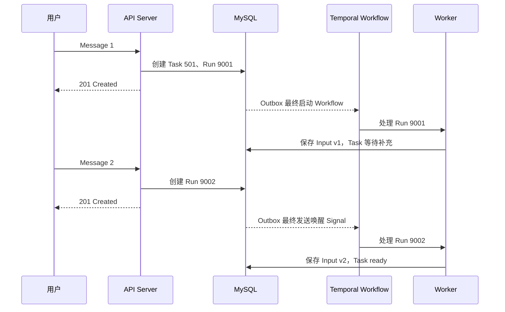

### 6.3 Run 顺序与并发

同一个 Task 的 Run 必须串行处理。

即使：

- 两条消息很快连续到达；
- Temporal Signal 重复；
- Signal 乱序；
- Outbox 因网络不确定性重复投递；

Workflow 也不按 Signal 到达顺序直接处理，而是通过 Activity 先恢复该 Task 已有的 running Run；不存在 running Run 时，才从 MySQL 按 Run ID 顺序领取 status=queued 的 Run。

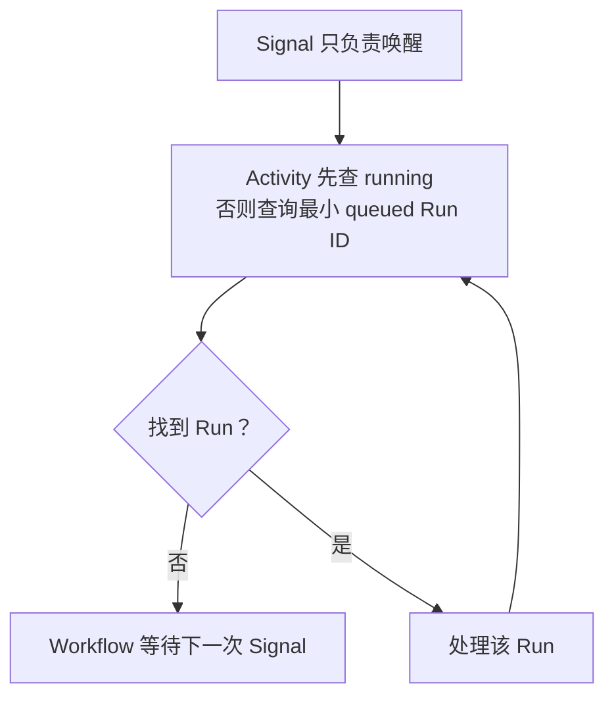

这个顺序成立的前提不是“自增 ID 天生等于提交顺序”，而是所有同 Chat 写事务遵守固定锁顺序：

```text
先锁 Chat
→ 再锁已有 Task
→ 再锁已有 Run
→ 然后才插入 Message、Run、Task Event
```

- 同一 Chat 的 Message 和 Task Event 在分配 ID 前已经串行；
- 同一 Task 的 Run 在分配 ID 前已经串行；
- 后一个事务只能在前一个事务提交或回滚后继续，因此该 Chat/Task 内的 ID 顺序就是提交可见顺序；
- 不同 Chat 仍然可以并发处理；
- 所有 API 和 Worker 写事务必须采用 Chat → Task → Run 的相同锁顺序，避免死锁。

因此，Signal 可以重复，真正的处理顺序由 MySQL 中已经提交并按上述规则分配的 Run ID 决定。

### 6.4 Claim 与 Process 的恢复边界

Workflow 使用两个清晰步骤，而不是每次重新领取 queued Run：

1. ClaimNextRun Activity 根据 task_id 读取 chat_id，然后按 Chat → Task 锁定；
2. 在 Task 锁内先查询 status=running 的 Run：恰好一个时直接返回它的 run_id，不重复修改 Task、不重复写 run.started；
3. 不存在 running Run 时，才找到最小 queued Run，把它条件更新为 running，首次记录 started_at，把 Task 转为 understanding，并写一次 run.started Event；
4. 如果发现多个 running Run，视为数据不变量损坏，记录告警并返回不可重试协议错误，不能任意选择一个；
5. Claim 事务提交后把固定 run_id 返回给 Workflow；即使提交成功后 Activity 响应丢失，Temporal 重试也会在第 2 步返回同一个 running run_id；
6. Workflow 把当前 run_id 记入自己的历史，然后调用 ProcessRun(run_id) Activity；
7. ProcessRun 的每次 Temporal 重试都使用同一个 run_id，不再查询“下一个 queued Run”；
8. 长模型调用定期发送 Activity Heartbeat，用于超时判断和取消；
9. ProcessRun 开始和提交结果时都锁定 Run 并读取状态。

Service 必须维护“同一个 Task 最多一个 running Run”的事务不变量。MySQL 没有为 status=running 建部分唯一索引，因此不能依赖数据库自动保证；所有 Claim 都必须先锁 Task，再执行上述检查和状态转换。

ProcessRun 的幂等规则：

| Run 当前状态 | 重试行为 |
|---|---|
| running | 继续处理同一个 run_id |
| completed | 说明上一次完成事务已经提交，直接按成功返回 |
| failed / canceled | 返回已经保存的终态，不重复写数据 |
| queued | 只允许 Claim 步骤转换，Process 视为协议错误 |

即使旧 Activity 在网络分区后迟到，最终完成事务也必须使用 WHERE status = running 的条件更新并先锁 Run。第一个提交者完成后，后到者看到 completed，只返回已有结果，不能重复写 Task Input、Assistant Message 或 Task Event。

### 6.5 Run 状态机

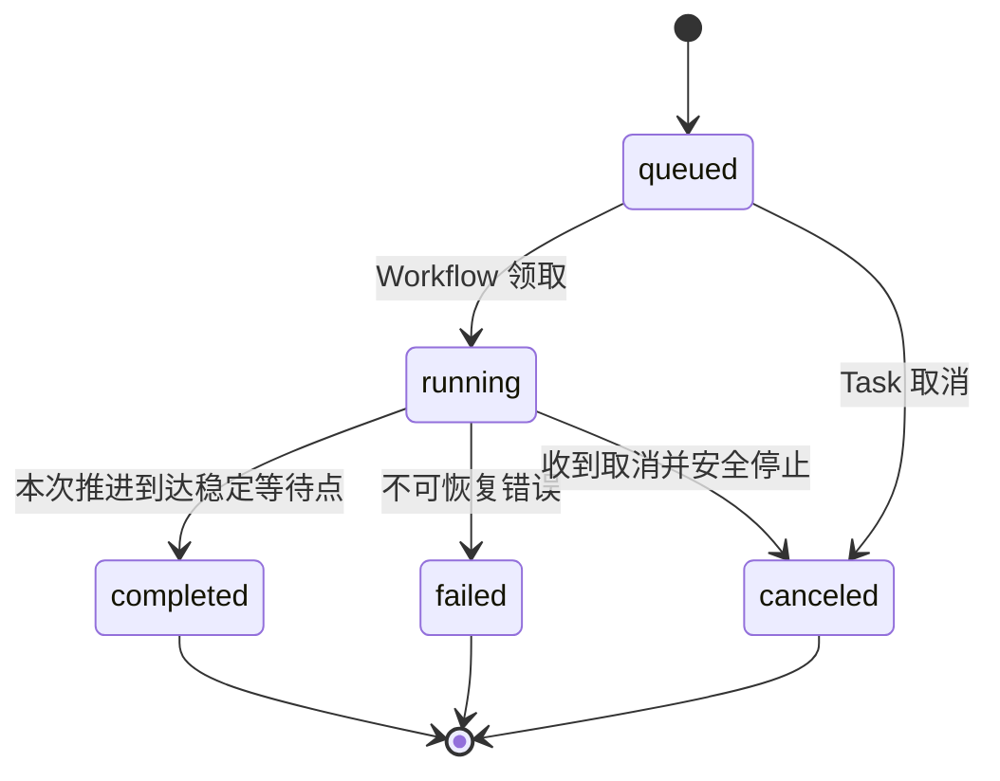

Run 状态只描述“一次推进”，不代表整个 Task 是否完成。

### 6.6 Task 状态机

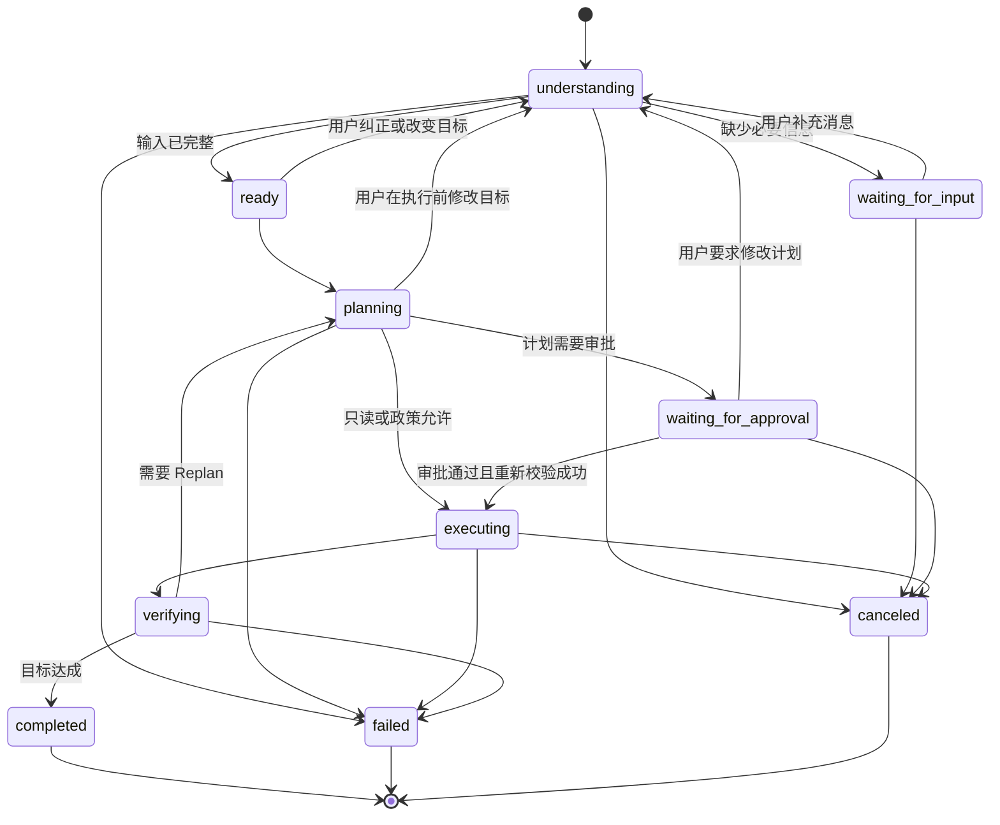

本轮真正执行到 ready 为止。planning 之后的状态为后续详细设计保留清晰语义，不代表本轮已经实现 Plan 和审批表。

## 7. MySQL 数据模型

### 7.1 为什么是七张表

本轮需要的业务表是：

```text
chats
tasks
chat_messages
agent_runs
task_inputs
task_events
outbox_messages
```

每张表只有一个主要职责，不创建 core、common_event 或万能 task_detail 大表。

### 7.2 chats

保存用户看到的持续对话。

| 字段 | 建议类型 | 含义 |
|---|---|---|
| id | BIGINT UNSIGNED | 对话唯一标识 |
| created_at | DATETIME(6) | 对话创建时间 |
| updated_at | DATETIME(6) | 对话最后活跃时间 |

### 7.3 tasks

保存长期业务目标的生命周期。

| 字段 | 建议类型 | 含义 |
|---|---|---|
| id | BIGINT UNSIGNED | 任务唯一标识 |
| chat_id | BIGINT UNSIGNED | 任务所属 Chat |
| status | VARCHAR(32) | 当前 Task 状态 |
| created_at | DATETIME(6) | 创建时间 |
| updated_at | DATETIME(6) | 状态最后更新时间 |

Task 不直接保存 normalized_input、intent、plan 或一组“以后可能用到”的字段。当前结构化输入在 task_inputs 中版本化保存。

### 7.4 chat_messages

保存不可变的用户和 Assistant 消息。

| 字段 | 建议类型 | 含义 |
|---|---|---|
| id | BIGINT UNSIGNED | 消息唯一标识 |
| chat_id | BIGINT UNSIGNED | 所属 Chat |
| task_id | BIGINT UNSIGNED | 所属 Task，不允许为空 |
| role | VARCHAR(16) | user 或 assistant |
| idempotency_key | VARBINARY(128) NULL | user Message 对应的 Idempotency-Key，按字节区分大小写；Assistant Message 为空 |
| request_fingerprint | BINARY(32) NULL | user Message 原始命令的 SHA-256 原始 32 字节指纹；Assistant Message 为空 |
| content | TEXT | 原始消息正文 |
| created_at | DATETIME(6) | 消息创建时间 |

消息一旦创建不修改，因此不增加 updated_at。Service 保证 user Message 的两个幂等字段非空，Assistant Message 的两个幂等字段为空；不使用 CHECK。

### 7.5 agent_runs

保存每条用户消息触发的一次推进。

| 字段 | 建议类型 | 含义 |
|---|---|---|
| id | BIGINT UNSIGNED | Run 唯一标识，也用于同 Task 内排序 |
| task_id | BIGINT UNSIGNED | 所属 Task |
| trigger_message_id | BIGINT UNSIGNED | 触发本次 Run 的用户消息 |
| status | VARCHAR(16) | queued、running、completed、failed、canceled |
| failure_code | VARCHAR(64) NULL | 稳定失败码 |
| failure_message | VARCHAR(512) NULL | 用户可理解的失败摘要，不保存堆栈 |
| created_at | DATETIME(6) | Run 创建时间 |
| started_at | DATETIME(6) NULL | 首次开始处理时间 |
| finished_at | DATETIME(6) NULL | 到达终态时间 |
| updated_at | DATETIME(6) | 状态最后更新时间 |

Run 会更新状态，因此需要 updated_at。

trigger_message_id 必须唯一，保证一条 user Message 最多触发一个 Run。

### 7.6 task_inputs

保存每次规范化成功后的不可变版本。

| 字段 | 建议类型 | 含义 |
|---|---|---|
| id | BIGINT UNSIGNED | Input 唯一标识 |
| task_id | BIGINT UNSIGNED | 所属 Task |
| run_id | BIGINT UNSIGNED | 生成该版本的 Run |
| version | BIGINT UNSIGNED | Task 内从 1 递增的版本 |
| goal | TEXT | 当前规范化目标 |
| constraints | JSON | 已确认约束数组 |
| missing_information | JSON | 仍缺失的受控 Catalog Code 数组 |
| created_at | DATETIME(6) | 版本创建时间 |

约束：

```text
UNIQUE(task_id, version)
UNIQUE(run_id)
```

它们保证同一 Task 不会有重复版本号，同一个 Run 最多生成一个 Input。

### 7.7 task_events

保存用户可见、可审计、可断线重放的业务事实。

| 字段 | 建议类型 | 含义 |
|---|---|---|
| id | BIGINT UNSIGNED | 全局递增事件 ID；在同 Chat 串行写规则下作为该 Chat 的 SSE 持久游标 |
| chat_id | BIGINT UNSIGNED | 事件所属 Chat，便于 SSE 查询 |
| task_id | BIGINT UNSIGNED | 事件所属 Task |
| run_id | BIGINT UNSIGNED NULL | 事件由某次 Run 产生时填写 |
| event_type | VARCHAR(64) | 稳定事件类型 |
| data | JSON | 用户可见的结构化事件数据 |
| created_at | DATETIME(6) | 事件发生时间 |

当前 Normalizer 闭环实际使用的事件：

```text
run.queued
run.started
task.waiting_for_input
task.ready
run.failed
run.canceled
```

确定性回复成功时只写一个业务状态 Event：

- task.waiting_for_input：data 至少包含 input_id、input_version、message_id 和 missing_information；
- task.ready：data 至少包含 input_id、input_version 和 message_id。

永久失败时，先创建用户可读 Assistant Message，再写 run.failed；其 data 至少包含 failure_code 和 message_id。这样前端收到任何终态事件时，都能定位到对应的最终消息。

未来独立 Response Composer 或探索性 Agent 真正接入模型流式回复后，再启用：

```text
response.started
response.failed
response.completed
```

流式成功必须在同一完成事务中同时写业务状态 Event 和 response.completed，不能用 response.completed 代替 Task 状态变化。永久失败时先写 run.failed；如果当时存在活动 Response，还要写对应 response.failed。

事件类型在实现时按真实前端消费场景逐个冻结，不创建一大批未使用的枚举。

response.started 的 data 至少包含：

```json
{
  "response_id": "run-9001-generation-1",
  "generation": 1
}
```

response.failed 的 data 至少包含：

```json
{
  "response_id": "run-9001-generation-1",
  "generation": 1,
  "reason": "generation_replaced"
}
```

response.completed 的 data 至少包含：

```json
{
  "response_id": "run-9001-generation-2",
  "generation": 2,
  "message_id": 1002,
  "final_sequence": 12
}
```

每次模型生成尝试必须分配新的 generation 和 response_id，sequence 从 1 重新开始；重试不能沿用旧 response_id 继续拼接。当前活动 Response 由该 Run 最新的 response.started Event 表示。开始新尝试时，在 Run 锁内把尚未终结的旧 Response 写为 response.failed，再写新 response.started。

完成事务按 Chat → Task → Run 锁定后，必须通过 idx_task_events_run_id_id 查询该 Run 最新 response.started，确认它仍等于本 Activity 的 response_id，才能写最终 Assistant Message 和 response.completed。迟到 Activity 只能携带自己的旧 response_id，不能完成或覆盖新 Response；SSE 收到旧 Response 的迟到 Delta 或终态时按 response_id 忽略。

SSE Server 读取 response.completed 时根据 message_id 加载最终 Assistant Message，并把最终 Message DTO 发送给前端。这样无需在 task_events.data 中复制完整正文，也能在 Redis 过期后从 Run 找回最终结果。本轮不创建 Response 表；如果未来事件查询无法满足生成历史、计费或审计需求，再由真实用例证明是否增加独立表。

### 7.8 outbox_messages

保存“业务事务已经提交，但还必须可靠通知 Temporal”的内部消息。

| 字段 | 建议类型 | 含义 |
|---|---|---|
| id | BIGINT UNSIGNED | Outbox 消息唯一标识 |
| run_id | BIGINT UNSIGNED | 对应的 Run |
| message_type | VARCHAR(64) | task.start 或 task.run_requested |
| payload | JSON | Temporal 启动或唤醒所需的最小数据 |
| attempt_count | INT UNSIGNED | 已尝试投递次数 |
| available_at | DATETIME(6) | 下次允许尝试时间 |
| locked_by | VARCHAR(128) NULL | 当前认领令牌，格式包含实例 ID 和每次认领生成的随机 token |
| locked_until | DATETIME(6) NULL | 认领租约到期时间 |
| last_error | VARCHAR(1024) NULL | 最近一次投递错误摘要 |
| created_at | DATETIME(6) | 创建时间 |
| published_at | DATETIME(6) NULL | 成功投递时间 |

Outbox 会更新重试和发布状态，因此不属于不可变表。

### 7.9 数据库约束取舍

遵循项目已确认的数据库风格：

- 不创建数据库外键；
- 不创建 CHECK；
- 不使用 MySQL ENUM；
- Service 在事务中校验 Chat、Task、Message 和 Run 的关联；
- 所有表和字段写中文数据库注释；
- 不可变表不机械增加 updated_at；
- JSON 只保存结构化但当前不需要按子字段高频查询的内容。

### 7.10 唯一约束与查询索引

以下约束和索引由已经确认的查询路径证明，不是“以后可能用到”的预建：

```text
tasks:
  INDEX idx_tasks_chat_id_id (chat_id, id)

chat_messages:
  UNIQUE uk_chat_messages_chat_id_idempotency_key (chat_id, idempotency_key)
  INDEX idx_chat_messages_chat_id_id (chat_id, id)
  INDEX idx_chat_messages_task_id_id (task_id, id)

agent_runs:
  UNIQUE uk_agent_runs_trigger_message_id (trigger_message_id)
  INDEX idx_agent_runs_task_id_id (task_id, id)
  INDEX idx_agent_runs_task_id_status_id (task_id, status, id)
  INDEX idx_agent_runs_status_updated_at_id (status, updated_at, id)

task_inputs:
  UNIQUE uk_task_inputs_task_id_version (task_id, version)
  UNIQUE uk_task_inputs_run_id (run_id)

task_events:
  INDEX idx_task_events_chat_id_id (chat_id, id)
  INDEX idx_task_events_task_id_id (task_id, id)
  INDEX idx_task_events_run_id_id (run_id, id)

outbox_messages:
  UNIQUE uk_outbox_messages_run_id (run_id)
  INDEX idx_outbox_messages_pending (published_at, available_at, locked_until, id)
```

MySQL 唯一索引允许多个 NULL，因此 chat_messages 的联合唯一索引不会阻止多个 Assistant Message；Service 仍负责角色与幂等字段的组合校验。

Outbox 的实际认领 SQL 和 EXPLAIN 在实施计划中验证。索引必须让 SKIP LOCKED 只扫描待投递候选范围，避免扩大锁范围。

idx_agent_runs_status_updated_at_id 服务 Reconciler 对长时间未推进的 queued/running Run 扫描；idx_task_events_run_id_id 服务 Response generation fencing 和按 Run 查询事件。正常 waiting_for_input 或 ready 的 Task 可能长期没有 Run，不属于 Reconciler 候选，因此不为 tasks 预建 status/updated_at 扫描索引。

### 7.11 Migration 命名

项目未发布、现有两张表无数据，可以清理本地数据并重写 Migration，不做历史兼容层。

```text
000001_create_chats_table
000002_create_tasks_table
000003_create_chat_messages_table
000004_create_agent_runs_table
000005_create_task_inputs_table
000006_create_task_events_table
000007_create_outbox_messages_table
```

上线后已经执行的 Migration 必须冻结，不能再用本轮“新项目可重写”的规则。

## 8. 写入事务

### 8.1 新建 Task 的第一条消息

不带 task_id 发送消息时，一个 MySQL 事务完成：

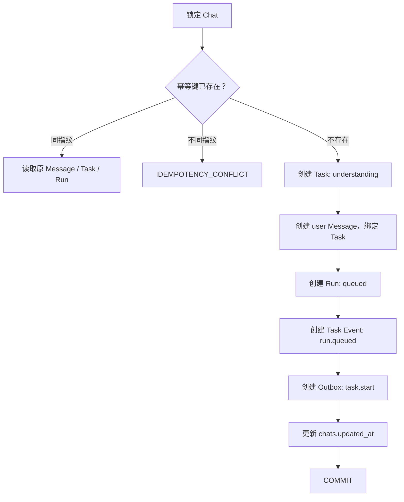

只有 COMMIT 成功，HTTP 才返回 201。命中同一幂等请求时，返回第一次已经创建的资源和同样的 201 语义，不再插入数据。Temporal 不在 HTTP 事务中同步等待。

### 8.2 继续已有 Task

带 task_id 发送消息时，一个 MySQL 事务完成：

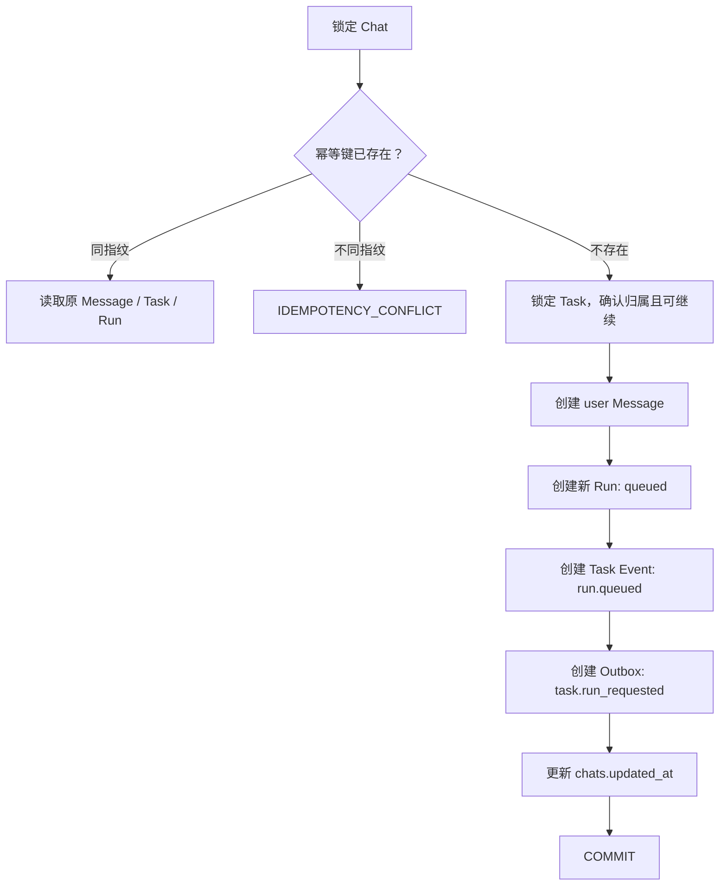

Task 在消息事务提交后可以暂时保持 waiting_for_input 或 ready，同时拥有 queued Run。ClaimNextRun 真正开始处理时，再把需要规范化的 Task 转为 understanding 并写 run.started Event，避免尚未开始处理就对用户宣称“正在理解”。

### 8.3 完成一次规范化

Worker Activity 在一个 MySQL 事务中完成：

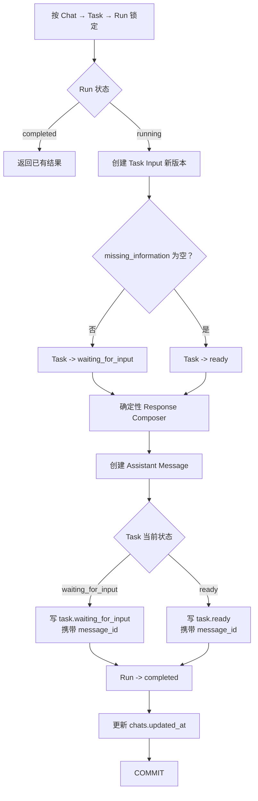

Assistant Message 可以是追问，也可以是“需求已经理解，准备进入规划”的确认。当前由确定性 Response Composer 生成，不让 Normalizer 输出自由文本。task.waiting_for_input 或 task.ready 的 data 必须携带 message_id；最终用户可见文本必须落 MySQL。当前事务不创建 response.started、response.delta 或 response.completed。

### 8.4 永久失败事务

Normalizer 在瞬态重试和一次格式修复后仍然失败时，使用一个事务落到稳定终态：

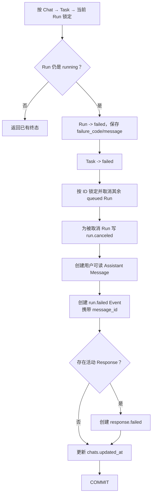

这样不会留下 Task=understanding、Run=failed 的半状态。Task 进入 failed 前，事务必须把同 Task 其余 queued Run 按 ID 升序锁定并转为 canceled，写 finished_at、updated_at 和 run.canceled Event；run.canceled 的 data 包含 reason=task_failed 和 failed_run_id。由于 Claim 不变量保证同 Task 最多一个 running Run，此时不应存在另一个 running Run；若存在则按数据损坏处理并告警，不能静默提交半套终态。

run.failed 的 data 至少包含 failure_code 和用户错误 Message ID；如果未来存在活动流式 Response，同一事务还要写 response.failed。这样 Workflow 看到终态 Task 后退出时，不会遗留永远 queued 的 Run，Reconciler 也不会反复唤醒。底层错误和堆栈只写服务端结构化日志，不进入 failure_message。

### 8.5 Message API 幂等协议

POST /api/v1/chats/{chat_id}/messages 必须携带 Idempotency-Key Header。

规则：

1. 请求中必须恰好存在一个 Idempotency-Key Header；缺失、重复或格式非法统一返回 HTTP 400 和 INVALID_IDEMPOTENCY_KEY；
2. Key 长度 1～128，只允许 ASCII 字母、数字和 . _ : -；
3. 作用域是 chat_id + idempotency_key；
4. request_fingerprint 是以下固定字段顺序规范化命令的 SHA-256 原始 32 字节：

```json
{
  "chat_id": 100,
  "task_id_present": true,
  "task_id": 501,
  "content": "用户提交的原始字符串"
}
```

5. 第一次请求在 user Message 中保存 Key 和 Fingerprint；
6. 同 Key、同 Fingerprint 的重试先于 Task 当前状态校验命中，读取原 Message，再通过 task_id 和 trigger_message_id 读取相同 Task/Run；
7. 重试仍返回 HTTP 201 和相同资源 ID，但 Task/Run 字段使用重试时的当前表示，并返回 Idempotency-Replayed: true；不承诺保存第一次响应快照；
8. 同 Key、不同 Fingerprint 返回 HTTP 409 和 IDEMPOTENCY_CONFLICT；
9. X-Request-ID 只用于 Trace，不能代替 Idempotency-Key。

对于未传 task_id 的首次消息，task_id_present=false 会进入 Fingerprint；重试时即使数据库中的 Message 已经绑定新建 Task，也能和原始命令正确比较。

## 9. Outbox 与 Temporal 的可靠通信

### 9.1 为什么不在 HTTP 事务里直接调用 Temporal

数据库提交和 Temporal 调用是两个不同系统，无法共享一个普通 MySQL 事务。

错误顺序一：

```text
先写 MySQL并提交
→ API 进程崩溃
→ 还没通知 Temporal
→ Run 永远 queued
```

错误顺序二：

```text
先通知 Temporal
→ Temporal 开始处理
→ MySQL 事务回滚
→ Workflow 找不到 Run
```

Outbox 把“必须通知 Temporal”与业务数据放在同一个 MySQL 事务中提交，解决这个双写问题。

### 9.2 Publisher 工作方式

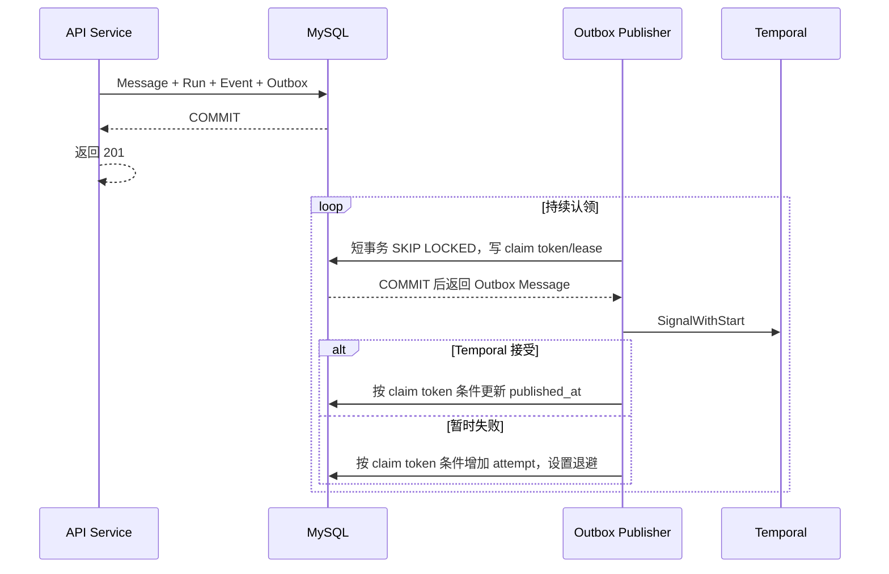

Publisher 协议：

1. 使用短 MySQL 事务和 FOR UPDATE SKIP LOCKED 选择候选；
2. locked_by 写入“实例 ID + 每次认领随机 token”，locked_until 写租约；
3. 提交认领事务后才调用 Temporal，不能持有数据库锁等待 RPC；
4. Temporal RPC timeout 必须小于租约；
5. 成功、失败更新都带 WHERE locked_by = claim_token AND published_at IS NULL；
6. 旧 Publisher 即使在租约过期后迟到，也不能覆盖新认领者的结果；
7. 瞬态错误采用有上限的指数退避和 jitter；
8. 不可重试的 Payload 或代码错误不自动丢弃，保留 last_error、降低重试频率并告警，等待人工修复；
9. published_at 只表示 Temporal 曾接受启动或唤醒，不表示 Workflow 永远不会异常关闭。

### 9.3 两种 Outbox 消息

#### task.start

新 Task 第一个 Run 使用。

```text
Workflow ID: gateway-agent-task/{task_id}
```

Publisher 使用稳定 Workflow ID 执行 SignalWithStart：不存在活动 Workflow 时启动，已存在时只发送唤醒 Signal。

#### task.run_requested

已有 Task 的新 Run 使用。Publisher 仍执行同一个 SignalWithStart，而不是假设长期 Workflow 一定还活着。

Signal 不携带完整用户原文，不负责决定顺序，只告诉 Workflow：“数据库可能有新的 queued Run，请去检查。”

Workflow 启动或恢复时先读取 MySQL：

1. Task 已 completed、failed、canceled：立即结束，不处理旧 Signal；
2. 存在 running Run：先用固定 run_id 恢复 ProcessRun；
3. 不存在 running Run：按顺序领取 queued Run；
4. 全部处理完后等待下一次 Signal。

Outbox Publisher 还包含轻量 Reconciler：只扫描长时间未推进的 queued/running Run，再读取其 Task 并重新执行 SignalWithStart。这样即使某条 Outbox 已 published 后 Workflow 异常关闭，也有恢复入口。

Reconciler 不能把“Task 很久没有 updated_at”直接当作故障：waiting_for_input 和 ready 都是正常稳定等待点，没有 queued/running Run 时不得反复唤醒 Workflow。若发现终态 Task 仍挂着 queued/running Run，说明终态事务不变量被破坏，应告警并进入数据修复路径，不继续发送 Signal。未来审批命令或 Timer 需要补偿时，必须由对应持久对象或 Temporal 自身历史提供待处理证据，不能重新扩大成“扫描所有非终态 Task”。

### 9.4 Outbox 不负责 Redis

Outbox 只解决可靠唤醒 Temporal。

它不负责：

- Redis Pub/Sub 通知；
- Redis Streams Token Chunk；
- SSE 心跳；
- Qdrant 索引。

Task Event 的 Redis 通知在 MySQL 事务提交后由 API 或 Worker 直接 best-effort Publish。通知丢失时，SSE 通过 MySQL 游标轮询补偿，所以无需再增加 Outbox 链路。

## 10. “状态事务、事件通知、Token Chunk”分别是什么

这三个词解决不同问题。

### 10.1 状态事务

状态事务是必须正确、不能丢的业务事实。

例子：

```text
Task 已经进入 waiting_for_input
Run 9001 已经 completed
Input v1 已经保存
Assistant 追问消息已经保存
```

这些内容写 MySQL，并在同一事务中保持一致。

### 10.2 事件通知

事件通知是告诉在线 SSE Server：“MySQL 里有新事件，快来读。”

例子：

```text
Chat 100 出现了 Task Event 7008
```

它使用 Redis Pub/Sub，追求低延迟，但允许丢失。因为即使通知丢了，事件 7008 仍在 MySQL，SSE 的 fallback poll 会找到它。

### 10.3 Token Chunk

模型通常不是等整段回答生成完再返回，而是不断产生小片段。

例子：

```text
Chunk 1: "我已经"
Chunk 2: "理解了你的"
Chunk 3: "路由需求，"
Chunk 4: "还需要确认..."
```

这些片段只为“打字机效果”服务，不值得每个片段都写 MySQL。Worker 合并到合理大小后写 Redis Streams，生成结束后再把完整 Assistant Message 一次写入 MySQL。

这是未来模型 Response Composer 或探索性 Agent 的协议说明。当前确定性 Response Composer 一次得到完整文本，直接随完成事务写 MySQL，不产生 Token Chunk，也不访问 Redis Streams。

## 11. Redis 设计

### 11.1 Redis 的两个用途

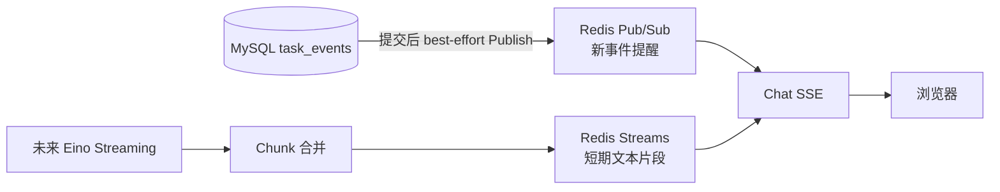

Pub/Sub 和 Streams 不能混为一谈：

| 能力 | Pub/Sub | Streams |
|---|---|---|
| 是否保存消息 | 否 | 短期保存 |
| 断线后能否读旧消息 | 否 | 在 TTL 内可以 |
| 本项目用途 | 提醒有新 Task Event | 保存当前模型输出片段 |
| 是否是业务事实来源 | 否 | 否 |

### 11.2 Token Stream Key

未来每个生成尝试使用独立 Stream：

```text
gateway-agent:run:{run_id}:response:{response_id}:output
```

每个 Stream Entry 至少包含：

```text
response_id
sequence
delta
created_at
```

约束：

- Stream 中的全部 Delta 可以重建完整回答，因此它按敏感正文对待，不以“分片”作为脱敏手段；
- 只有经过输出敏感信息过滤的用户可见文本才能写入；
- 凭证、Authorization、密钥和模型私有思维链禁止进入 Stream；
- 不写模型思维链；
- Worker 合并小片段后再写，避免一个 Token 一次 Redis 命令；
- 当前一个 Run 最多有一个活动 Response；
- 每次模型生成尝试使用新的 generation 和 response_id，不能复用旧 Stream 续写；
- 新尝试的 sequence 从 1 开始连续递增；
- 旧尝试先写 response.failed，新尝试再写 response.started；
- 迟到 Activity 只能写入自己旧 response_id 对应的 Stream，SSE 不把它合并到当前 Response；
- 最终完成事务必须确认自己仍是该 Run 当前活动 response_id；
- 默认近似 MAXLEN 为 8192 个 Entry；
- 生成期间每次写入把 TTL 刷新为 2 小时；
- Response 进入 completed 或 failed 后，把 TTL 收缩为 30 分钟；
- 异常 Run 由清理任务根据 MySQL 终态补设 TTL；
- sequence 让客户端按顺序合并并去重。

Redis 连接必须启用 ACL；跨主机或跨网络边界时启用 TLS。Redis Key 不能包含用户原文、域名、密钥等敏感数据。

MAXLEN 是内存保护，不是完整性保证。重放时必须检查首个 sequence 是否为 1、后续 sequence 是否连续；发现前缀被裁剪或中间缺段时，不能把剩余片段当作完整回答，而是发送 response.unavailable，等待 MySQL 最终 Message。

### 11.3 Redis 故障时会怎样

| 故障 | 用户影响 | 正确性 |
|---|---|---|
| Pub/Sub 暂时不可用 | 持久事件可能晚一点出现 | MySQL poll 补偿，不丢事件 |
| Streams 写入失败 | 暂时没有打字机效果 | 最终 Message 仍写 MySQL |
| Streams 已过 TTL | 重连时不能逐片重放 | 回退到最终 Assistant Message |
| Redis 整体重启 | 实时体验降级 | Task、Run、Input、Event 不丢 |

Redis 故障不能让 Run 失败，更不能阻止最终完整结果落 MySQL。

## 12. Chat 级 SSE

### 12.1 只有一条长期连接

接口：

```text
GET /api/v1/chats/{chat_id}/events
```

一个用户打开一个 Chat 页面时建立一条 SSE。当前它承载这个 Chat 中多个 Task、多个 Run 的持久事件；未来接入模型流式回复后，再在同一连接中增加临时文本片段。

Run 结束时 SSE 不关闭。用户离开 Chat 页面、浏览器主动断开或网络超时才关闭。

因此不会出现“每个 Run 开一条 SSE，Run 一结束就频繁断开重连”的问题。

SSE 与其他 Chat/Task 查询使用同一认证和授权策略。生产部署推荐同源 BFF/OIDC Session，原生 EventSource 通过 Secure、HttpOnly、SameSite Cookie 认证；如果前端必须使用 Bearer Token，则使用支持自定义 Header 的 fetch-based SSE Client。禁止把 Access Token 放在 URL Query 中。

长连接建立成功不代表权限永久有效。SSE Session 必须：

- 建流前校验 Session、Gateway Workspace 和 Group Mapping；
- 建流后至少每 60 秒重新校验一次 Session 与角色，实际间隔不得越过 Session 剩余有效期；
- 单条连接最大寿命不得超过 Session 有效期，到期前主动关闭并让客户端重新认证或重连；
- 登出、管理员撤销 Session 或 Group 权限变化时，通过现有会话失效通知主动关闭匹配连接；通知丢失时由周期校验兜底；
- 每次从 MySQL 或 Redis 向客户端发送业务数据前，连接仍需处于已授权状态。

apiserver 维护只存在于本实例内存中的 SSE Connection Registry，以 session_id 和 subject 作为索引，不保存 Access Token。登出、Session 撤销和 Group Mapping 变更通过 Redis Pub/Sub 发布不含凭证的失效通知；每个 apiserver 实例收到后关闭匹配连接。Pub/Sub 不是安全事实来源，真正授权结果仍由 Session/Group 校验组件给出，周期复查负责补偿通知丢失。

### 12.2 当前持久事件与未来临时文本

当前 Normalizer 闭环的 SSE 只读取 MySQL 持久事件，并使用 Redis Pub/Sub 做低延迟唤醒，不读取 Redis Streams。

#### 持久事件

来源于 MySQL task_events，带 SSE id：

```text
id: 7008
event: task.waiting_for_input
data: {"task_id":501,"run_id":9001,"input_id":3001,"input_version":1,"message_id":1002,"missing_information":["gateway.route.path","gateway.route.upstream.service","gateway.route.upstream.port"]}
```

id 用于浏览器断线后的 Last-Event-ID。

#### 未来临时文本片段

来源于 Redis Streams，不带 SSE id：

```text
event: response.delta
data: {"task_id":501,"run_id":9001,"response_id":"run-9001-generation-2","sequence":4,"delta":"还需要确认路径和上游服务。"}
```

临时片段不改变持久事件游标。只有独立模型 Response Composer 或探索性 Agent 真正进入实施时，才启用这类 Event。

### 12.3 未来完整流式响应时序

下面的时序在独立模型 Response Composer 或探索性 Agent 真正接入时启用，不属于当前确定性 Normalizer 回复的运行路径。

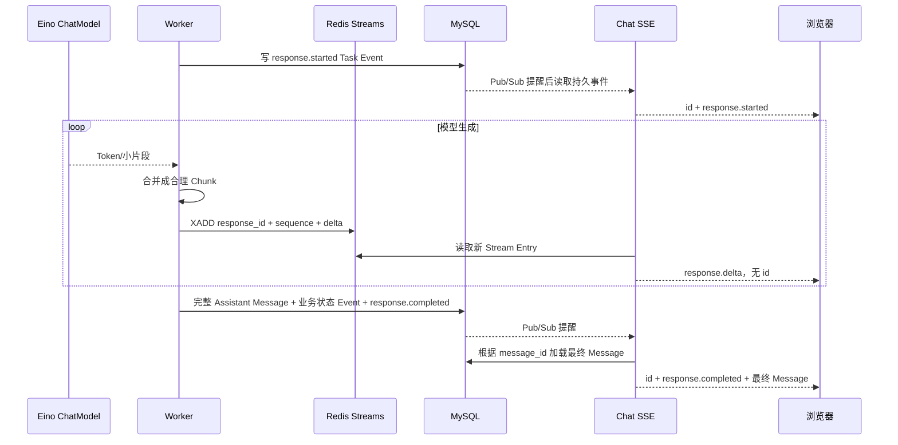

response.completed 是最终权威边界。前端收到后必须用最终 Message 覆盖正在显示的草稿，并忽略同 response_id 的迟到 Delta；SSE Server 也停止读取该 Response 的 Stream。这样 MySQL 完成事件即使和 Redis Delta 到达顺序不同，也不会让草稿覆盖最终正文。

### 12.4 为什么最终 Message 不能只放 Redis

用户刷新页面后需要看到完整历史；审计和上下文管理也需要稳定原文。Redis Stream 有 TTL，只是短期传输缓冲。

所以：

```text
Redis Streams = 正在生成时的临时片段
MySQL chat_messages = 已经完成的最终回答
```

### 12.5 断线重连

浏览器自动重连时发送 Last-Event-ID。首次连接没有 Last-Event-ID 时从 0 开始回放该 Chat 的持久 Task Event；后续可以在单独的 Chat Snapshot 设计中优化首次游标，但不能为了性能默默跳过历史事件。

当前确定性回复按以下顺序恢复：

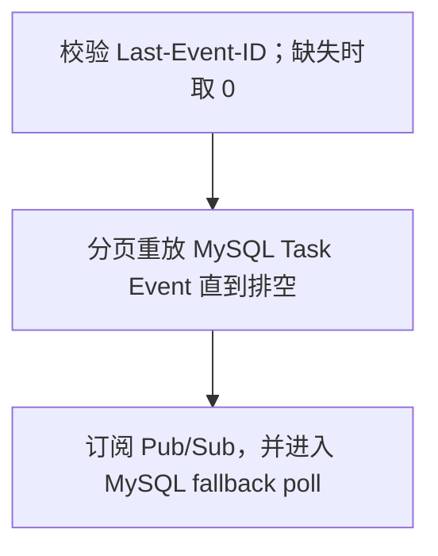

task.waiting_for_input、task.ready 或 run.failed 已携带 message_id；如果回复在断线期间完成，持久事件重放时直接加载 MySQL 最终 Assistant Message，不需要 Redis Streams。

未来模型流式回复启用后，在持久事件排空之后增加活动 Response 恢复：

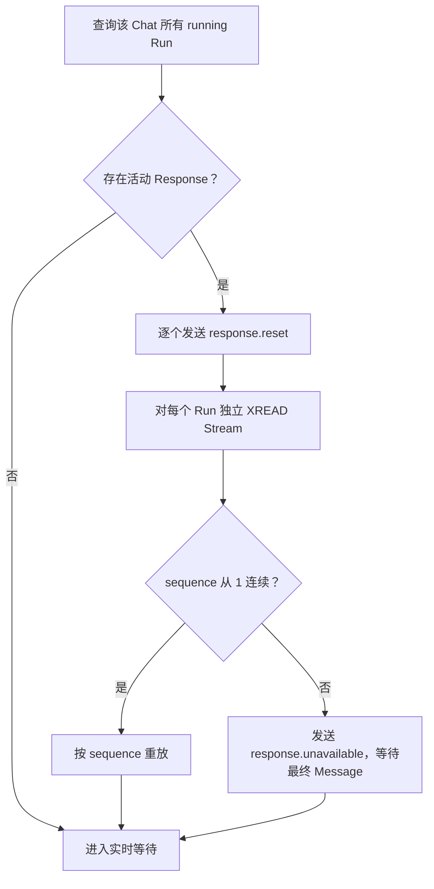

response.reset 告诉前端先清空当前未完成文本，再按 sequence 重建，避免重复拼接。

未来一个 Chat 可以同时有多个 Task 在生成，所以 SSE Connection 保存一个 active response map：

```text
run_id
response_id
redis_stream_id
last_sequence
state
```

启用流式回复后，每个浏览器连接使用独立 XREAD 游标读取所有活动 Stream，不使用 Consumer Group。Consumer Group 会把消息分摊给不同消费者，不适合“每个打开的浏览器都要看到同一输出”的场景。

如果 Response 在断线期间已经完成，持久 response.completed Event 携带 message_id；SSE Server 加载最终 Message 并发送，前端直接用它覆盖旧草稿，不依赖 Redis Stream 是否还存在。

### 12.6 SSE 如何发现遗漏事件

SSE Server 同时使用：

- Redis Pub/Sub：低延迟唤醒；
- MySQL cursor poll：兜底检查。

每次检查都使用：

```text
WHERE chat_id = ?
  AND id > last_event_id
ORDER BY id
LIMIT ?
```

- Last-Event-ID 必须是无符号整数；非法值或大于当前 Chat 最大 Event ID 的值在建流前返回 HTTP 400 和 INVALID_EVENT_CURSOR；
- 每页默认 200 条，必须循环查询直到当前已提交事件排空，才能进入实时等待；
- idx_task_events_chat_id_id 支撑该查询；
- fallback poll 默认 1 秒并加入正负 20% jitter，避免多实例同时打 MySQL；
- Chat 锁串行规则保证同一 Chat 内 Event ID 的分配顺序与提交可见顺序一致。

因此，即使：

- Pub/Sub 通知丢了；
- SSE 实例重启了；
- 客户端断线了一分钟；

只要 MySQL 事件仍在，就能按 ID 补回来。

心跳只用 SSE Comment 保持连接活跃，不创建数据库事件。

### 12.7 传输、慢客户端与背压

建流成功后必须设置：

```text
Content-Type: text/event-stream
Cache-Control: no-cache, no-transform
X-Accel-Buffering: no
```

HTTP/1.1 默认使用持久连接，不需要显式发送 Connection: keep-alive；HTTP/2 禁止 Connection 这类逐跳 Header，因此实现不能无条件写入该 Header。

每个 Frame 写完立即 Flush。默认每 15 秒发送一次 Comment Heartbeat；使用 Go 标准库 http.ResponseController 为每次写设置 10 秒 Deadline。

每条 SSE Connection 只有一个写协程，所有来源进入有界队列。默认上限是 256 个 Frame 或 1 MiB，任一达到即视为慢客户端：

1. 不阻塞共享 Pub/Sub 和 Stream 读取；
2. 关闭该 SSE Connection；
3. 浏览器重连后，持久事件按 Last-Event-ID 重放；
4. 未来启用流式回复后，临时 Delta 通过 response.reset + Stream 重放恢复；不连续时等待最终 Message。

apiserver 优雅停机时停止接受新 SSE，已有连接最多等待关闭期限；可以发送无持久 id 的 server.reconnect 后主动关闭，让客户端连接其他实例。

建流前发生的任何错误都返回 code、message、data JSON Envelope，包括参数、认证、授权、资源不存在、限流和服务器错误；只有成功写出 text/event-stream 响应头后，后续提示才使用 SSE Event。建流后的可恢复提示使用无持久 id 的 SSE Event；不可恢复服务器错误记录日志并关闭连接，由客户端重连。

### 12.8 实时链路小词典和断线例子

| 术语 | 初学者解释 |
|---|---|
| Last-Event-ID | 浏览器最后确认收到的 MySQL 持久事件编号 |
| fallback poll | Pub/Sub 没提醒时，SSE 定期自己去 MySQL 检查 |
| TTL | Redis 临时数据还能存活多久 |
| MAXLEN | Redis Stream 最多保留多少个 Entry 的内存保护 |
| sequence | 一个 Response 内 Chunk 的连续编号 |
| response.reset | 告诉前端丢掉当前草稿，重新按 sequence 拼接 |
| response.completed | 告诉前端 MySQL 最终 Message 已经可用，必须覆盖草稿 |

未来启用模型流式回复后，三个无持久 id 的控制事件使用固定 DTO：

response.reset：

```json
{
  "task_id": 501,
  "run_id": 9001,
  "response_id": "run-9001-generation-2",
  "reason": "reconnected"
}
```

response.unavailable：

```json
{
  "task_id": 501,
  "run_id": 9001,
  "response_id": "run-9001-generation-2",
  "reason": "stream_gap"
}
```

server.reconnect：

```json
{
  "reason": "server_shutdown",
  "retry_after_ms": 1000
}
```

reason 使用稳定英文枚举，不能把内部异常堆栈或敏感信息直接发送给浏览器。

例子：

```text
1. 浏览器已经收到持久 Event 7008。
2. 浏览器显示了 Response 的 Chunk 1、2、3，然后网络断开。
3. 如果生成仍在继续：
   - 浏览器带 Last-Event-ID=7008 重连；
   - Server 重放 7009 之后的持久事件；
   - 发送 response.reset；
   - Redis Stream 从 sequence=1 连续重放；
   - 如果发现缺少 sequence=1，就不显示残缺草稿，只显示“仍在生成”。
4. 如果断线期间已经生成完成：
   - Server 重放 response.completed；
   - 根据 message_id 读取 MySQL 最终 Message；
   - 前端用最终 Message 覆盖断线前的草稿；
   - Redis 是否过期已经不重要。
```

## 13. HTTP API

### 13.1 保留的 Chat API

```text
POST /api/v1/chats
GET  /api/v1/chats/{chat_id}
POST /api/v1/chats/{chat_id}/messages
GET  /api/v1/chats/{chat_id}/messages
```

### 13.2 新增的查询和实时接口

```text
GET /api/v1/chats/{chat_id}/events
GET /api/v1/tasks/{task_id}
GET /api/v1/tasks/{task_id}/runs
GET /api/v1/tasks/{task_id}/inputs
GET /api/v1/agent-runs/{run_id}
```

不增加 Run 级 SSE：

```text
不存在 GET /api/v1/agent-runs/{run_id}/stream
```

### 13.3 发送消息请求

Header：

```text
Idempotency-Key: 01JZ8Y7AJ7KQ0S4K7ZQ9M8F1P2
```

请求必须恰好携带一个 Idempotency-Key Header；缺失、重复或非法都返回 HTTP 400 和 INVALID_IDEMPOTENCY_KEY。

```json
{
  "content": "路径用 /orders，转发到 order-api.default.svc.cluster.local:8080",
  "task_id": 501
}
```

- 不带 task_id：创建新 Task、Message 和 Run；
- 带 task_id：继续已有 Task，创建新 Message 和新 Run；
- task_id 省略表示新 Task；显式 null、0、负数、浮点数或字符串都返回 INVALID_REQUEST；
- Task 不存在或不属于 URL 中的 Chat 时统一返回 404 TASK_NOT_FOUND，避免枚举其他 Chat；
- Task 已 completed、failed、canceled 时返回 409 TASK_NOT_CONTINUABLE；
- 无权访问当前 Gateway Workspace 时返回 403 FORBIDDEN；
- 返回 Message、Task 和 Run；
- HTTP 状态码使用 201 Created；
- Location Header 指向 /api/v1/agent-runs/{run_id}；
- 同一 Idempotency-Key 重试返回相同资源 ID 和当前 DTO，并带 Idempotency-Replayed: true；Key 冲突返回 409 IDEMPOTENCY_CONFLICT。

成功响应：

```json
{
  "code": "OK",
  "message": "success",
  "data": {
    "message": {
      "id": 1003,
      "chat_id": 100,
      "task_id": 501,
      "role": "user",
      "content": "路径用 /orders，转发到 order-api.default.svc.cluster.local:8080",
      "created_at": "2026-07-21T10:20:30.123456Z"
    },
    "task": {
      "id": 501,
      "chat_id": 100,
      "status": "waiting_for_input",
      "created_at": "2026-07-21T10:18:00.000000Z",
      "updated_at": "2026-07-21T10:18:00.000000Z"
    },
    "run": {
      "id": 9002,
      "task_id": 501,
      "trigger_message_id": 1003,
      "status": "queued",
      "failure_code": null,
      "failure_message": null,
      "created_at": "2026-07-21T10:20:30.123456Z",
      "started_at": null,
      "finished_at": null,
      "updated_at": "2026-07-21T10:20:30.123456Z"
    }
  }
}
```

GET Chat Message 列表也必须返回 task_id，让前端能把 Message、Task 卡片和 Task Event 关联起来。idempotency_key 和 request_fingerprint 是内部字段，不返回前端。

继续已有 Task 的消息事务只更新 chats.updated_at，不改变 Task 状态，所以示例中的 task.updated_at 仍是上一次状态变化时间；等 ClaimNextRun 真正把 Task 转为 understanding 时才更新。

JSON REST API 继续使用：

```json
{
  "code": "OK",
  "message": "success",
  "data": {}
}
```

SSE 遵循标准 id、event、data 格式，不包装 REST Envelope。

### 13.4 Run 与 Input 列表分页

以下两个接口统一使用游标分页：

```text
GET /api/v1/tasks/{task_id}/runs?after_id=9000&limit=50
GET /api/v1/tasks/{task_id}/inputs?after_id=3000&limit=50
```

规则：

- after_id 可省略，表示从头读取；提供时必须是无符号整数；
- limit 默认 50，最小 1，最大 200；
- 按 id 升序查询，条件为 id > after_id；
- 无数据时 items 必须是空数组，不能返回 null；
- next_after_id 有下一页时返回本页最后一条 id，否则返回 null；
- Store 使用 limit + 1 判断是否存在下一页，不执行昂贵的总数统计；
- Run DTO 的 failure_code、failure_message、started_at、finished_at 都是可空字段，JSON 中明确返回 null。

响应外形：

```json
{
  "code": "OK",
  "message": "success",
  "data": {
    "items": [],
    "next_after_id": null
  }
}
```

## 14. 代码职责与工程结构

继续采用用户确认的 Ingate 风格：apiserver 和 worker 各自拥有 Handler、Service、Store。

```text
internal/apiserver/
  handler/
  dto/
  service/
  store/mysql/
  store/redis/
  config/
  server/
  wire.go

internal/worker/
  handler/
  service/
  store/mysql/
  store/redis/
  agent/
  config/
  server/
  wire.go
```

最小跨程序协议包：

```text
internal/task
internal/realtime
internal/workflow
```

职责：

| 目录 | 职责 |
|---|---|
| apiserver/handler | HTTP、SSE 协议、参数和错误映射 |
| apiserver/service | Message/Task/Run 写事务、Outbox Publisher、SSE 会话 |
| apiserver/store/mysql | sqlc 查询和事务 |
| apiserver/store/redis | 当前读取 Pub/Sub；未来流式用例读取 Streams |
| worker/handler | Temporal Workflow 和 Activity 入口 |
| worker/service | Run 领取、状态推进、输入规范化用例 |
| worker/store/mysql | Worker 使用的 sqlc Query Set |
| worker/store/redis | 当前只做事件通知 Publish；未来流式用例写 Token Chunk |
| worker/agent | Eino Graph、ChatModel、Prompt、Callback 和未来 Agent |
| internal/task | Task、Run 状态等跨程序稳定协议 |
| internal/realtime | 事件和 Response Chunk 协议 |
| internal/workflow | Temporal Workflow 名称、Signal 和 Payload 协议 |

边界要求：

- Gin 只出现在 apiserver Handler/Server；
- sqlc 类型不离开各自 MySQL Store；
- Redis Client 不离开 Redis Store；
- Temporal 类型不扩散到业务 Service；
- Eino 只位于 worker/agent 及其内部适配边界；
- Service 接口不暴露 Gin、sqlc、Redis、Temporal 或 Eino 框架类型；
- internal/pkg 只放 errorsx、requestctx 等技术通用包；
- 不创建 bootstrap、core、platform、common、utils、apperror；
- 扩展型技术包使用 x 后缀；
- 注释中文，代码、JSON、事件名和错误码英文。

当前实施不得创建 Redis Streams 读写接口；表中的未来职责只冻结目录归属，不代表本轮需要生成空实现。

## 15. 失败与恢复

### 15.1 关键故障矩阵

| 故障时刻 | 系统行为 | 为什么不会丢 |
|---|---|---|
| MySQL 事务提交前 API 崩溃 | 整个事务回滚，客户端重试 | Message、Run、Outbox 不会半套存在 |
| MySQL 已提交但 201 响应丢失 | 客户端用同 Idempotency-Key 重试，收到相同资源 ID 和当前 DTO | 唯一键和 Fingerprint 阻止重复 Message/Run |
| MySQL 已提交，API 随后崩溃 | Outbox Publisher 后续继续投递 | Outbox 已和 Run 同事务保存 |
| Temporal 暂时不可用 | Outbox 延迟重试 | Run 保持 queued |
| Signal 重复或 Workflow 被重新启动 | Workflow 先读取 running/queued Run | MySQL 状态和固定 run_id 决定下一步 |
| Claim 事务已提交但 Activity 响应丢失 | ClaimNextRun 重试先发现已有 running Run，并返回同一 run_id | Task 锁和“最多一个 running Run”不变量阻止误领下一个 queued Run |
| Worker 在 Run=running 后崩溃 | Temporal 用同 run_id 重试 ProcessRun | 不重新领取下一个 Run |
| 完成事务已提交但 Activity 响应丢失 | 重试读取 completed 并按成功返回 | Run 锁和条件更新阻止重复输出 |
| 模型结构化输出错误 | 最多格式修复一次，仍失败则 Run failed | 不让非法结果进入后续阶段 |
| 当前 Run 永久失败且后面已有 queued Run | 同一事务将 Task failed，并取消其余 queued Run | Workflow 退出时不遗留永远无法处理的 queued Run |
| Redis Pub/Sub 丢通知 | SSE fallback poll MySQL | Task Event 已持久化 |
| Redis Streams 故障 | 失去打字机效果 | 最终 Message 写 MySQL |
| 浏览器断线 | Last-Event-ID 重放 | task_events.id 是持久游标 |
| Stream 已过期 | 展示最终 Message | chat_messages 是最终正文 |
| Stream 前缀被 MAXLEN 裁剪 | 不重放残缺正文，等待最终 Message | sequence 连续性检查发现缺口 |

### 15.2 模型调用的重试边界

要区分两类失败：

- 网络超时、上游限流等瞬态错误：由 Temporal Activity 按受控策略重试；
- 模型持续输出非法结构：不是网络瞬态故障，最多执行一次格式修复，然后明确失败。

不能因为“模型可能下次就对了”无限重试，否则会造成费用失控和重复文本。

### 15.3 不保存思维链

系统保存：

```text
规范化结果
决策摘要
计划
选择的 Tool
Tool 请求与 Observation
策略结果
验证证据
失败原因
```

系统不保存：

```text
模型隐藏推理
内部逐 Token 思维过程
未经处理的完整 Prompt
密钥和 Authorization
```

用户需要知道“系统为什么这么做”时，展示可审计的简短理由和证据，而不是模型私有思维链。

## 16. 可观测性

一次用户消息应能通过以下标识串起来：

```text
request_id
chat_id
task_id
message_id
run_id
workflow_id
response_id
trace_id
```

核心指标：

- queued Run 数量和等待时长；
- Run 各状态数量和耗时；
- Task 各状态数量；
- Normalizer 模型耗时、Token、格式修复率和失败率；
- Outbox 未发布数量、最老消息年龄和重试次数；
- Temporal Signal、Workflow、Activity 延迟与错误；
- SSE 当前连接数、重连率、重放事件数和推送延迟；
- Redis Pub/Sub 发布失败数；
- Redis Streams 写入失败数、长度和过期数；
- MySQL Event fallback poll 命中数；
- Idempotency 重放次数和冲突次数；
- SSE 慢客户端断开次数；
- Outbox Reconciler 唤醒次数。

日志不能打印完整用户正文、完整 Prompt、密钥、DSN 或未经处理的 Tool 输出。

## 17. 开源项目参考与借鉴边界

以下项目用于学习成熟做法，不照搬目录和全部抽象。

| 项目 | 参考内容 | 本项目不照搬的部分 |
|---|---|---|
| [CloudWeGo Eino](https://github.com/cloudwego/eino) | Go 组件抽象、Graph、ADK、ReAct、Streaming、Callback、Interrupt/Resume | 不让 Eino 成为业务状态数据库或生产写操作的最终权限边界 |
| [Eino Examples](https://github.com/cloudwego/eino-examples) | ChatModelAgent、GraphTool、Human-in-the-loop 的可运行示例 | 不直接复制 Demo 结构到企业代码 |
| [Temporal Go SDK](https://github.com/temporalio/sdk-go) / [samples-go](https://github.com/temporalio/samples-go) | Workflow ID、Signal、Activity、Retry、Continue-As-New | 不把用户可见状态只放 Temporal |
| [sqlc](https://github.com/sqlc-dev/sqlc) | 显式 SQL、强类型查询和事务 | 不让生成 Model 穿透 Service |
| [go-redis](https://github.com/redis/go-redis) | Pub/Sub、Streams、Consumer API | 不把 Redis 当业务事实来源 |
| [LangGraph](https://github.com/langchain-ai/langgraph) | 状态图、Checkpoint、Human-in-the-loop 的概念设计 | Python 技术栈和其持久层不作为本项目运行依赖 |
| [Higress](https://github.com/alibaba/higress) | AI Gateway、路由和插件的目标控制面 | Gateway Agent 不代理业务流量 |

Eino 版本在编写本文时核对为 v0.9.12。真正编码前仍要在实施计划中锁定依赖版本，并核对官方变更记录。

## 18. 安全边界

本产品是一套 Gateway 对应一个共享运维 Workspace，不提供个人私有 Chat。所有通过 OIDC 进入该 Workspace 的成员都能查看该 Gateway 的 Chat、Task 和事件，因此当前七张表不增加 owner_id。

角色边界：

| 角色 | 权限 |
|---|---|
| viewer | 读取 Chat、Message、Task、Run、Input 和 SSE |
| operator | viewer 权限 + 创建 Chat、发送 Message、发起受控 Task |
| admin | operator 权限 + 后续高风险审批和管理能力 |

生产环境启用 HTTP、SSE 和查询接口前必须完成 OIDC Session 与 Group Mapping；auth.disabled 只允许本地开发并且监听 loopback，不能以“后续再做”为由把无鉴权 API 暴露到企业网络。

- 所有 Chat/Task/Run/Input/SSE Handler 在查询业务数据前完成认证和角色校验；
- 原生 EventSource 使用同源 Secure、HttpOnly、SameSite Session Cookie；
- Bearer Token 场景使用 fetch-based SSE，不把 Token 放 URL；
- task_id 必须与 URL 中的 chat_id 匹配；
- 原始用户输入不直接成为 Tool 参数；
- 输入规范化不能直接触发写 Tool；
- 生产写操作后续必须经过 Plan、风险判断和对话审批；
- MCP Tool 和 Native Tool 进入同一权限、Schema、风险与审计边界；
- Redis Stream 按可重建完整回答的敏感正文保护，启用 ACL、必要时 TLS、严格 TTL 和输出过滤；
- Redis 永远不保存密钥、凭证、Authorization 和思维链；
- Task Event 只保存前端真正需要的用户可见数据；
- Temporal Payload 不放完整 Prompt、密钥和大型 Tool 结果。

## 19. 设计验收标准

进入实施计划前，这份规格必须满足：

- 能用贯穿案例解释 Message、Task、Run 和 Input 的关系；
- 明确 Task Workflow 长期运行、Run 每条消息一个；
- 明确 Signal 只唤醒，Run 按 MySQL ID 顺序领取；
- 明确 Chat → Task → Run 锁顺序保证 ID 与提交可见顺序一致；
- 明确 Idempotency-Key、Fingerprint、唯一约束和相同资源 ID 的 201 重放；
- 明确 running Run 使用固定 run_id 重试，completed 被视为幂等成功；
- 明确 ClaimNextRun 重试先返回已有 running Run，不能误领下一个 queued Run；
- 明确 Task 进入终态时取消其余 queued Run，不遗留永久排队任务；
- 明确 Eino 和 Temporal 的职责不重叠；
- 明确 Normalizer 只输出 goal、constraints、missing_information；
- 明确 missing_information 只能使用受控 Catalog Code，未知 Code 不得展示；
- 明确当前确定性回复不经过 Redis Streams，未来流式协议不产生无调用方代码；
- 明确每次模型生成尝试使用新的 generation/response_id，迟到 Activity 不能覆盖当前 Response；
- 明确 chat_messages.task_id 不允许为空；
- 明确七张表的用途和字段；
- 明确成功或失败终态 Event 都携带最终用户 Message ID；
- 明确 Outbox 只投递 Temporal；
- 明确 Reconciler 只扫描 queued/running Run，不唤醒正常空闲 Task；
- 文档中不存在 Outbox → Redis；
- 只有 Chat 级 SSE，不存在 Run 级 SSE；
- 明确持久事件带 SSE id，Token Delta 不带 id；
- 明确多活动 Response、sequence 连续性、最终 Message 覆盖和慢客户端背压；
- 明确 SSE Session 周期复查、最长寿命和撤权主动断开；
- 明确 Run/Input 列表的 after_id、limit、空数组和 next_after_id 语义；
- 明确 Redis 故障只降低实时体验，不破坏最终正确性；
- 明确不保存模型思维链；
- 所有新表和字段在 Migration 中必须有中文注释。

## 20. 后续实施顺序

用户确认本文后，下一步不是立刻同时编写七张表、Temporal、Eino、Redis 和 SSE。

下一步使用 writing-plans 形成可审查的文件级实施计划，按依赖顺序小步落地：

```text
重写 Migration 与 sqlc
→ Message/Task/Run 原子写入
→ Outbox Publisher 与 Temporal Task Workflow
→ Normalization Field Catalog + Eino Normalizer Graph
→ Task Input、确定性 Response Composer、Assistant Message 与 Task Event
→ Redis Pub/Sub + Chat SSE + MySQL Event 断线重放
→ 真实故障演练
```

当前闭环到此结束，不实现 Redis Streams、active response map、response.delta/reset/unavailable 或模型回复流。等独立模型 Response Composer 或探索性 Agent 成为已确认用例后，再单独设计和实施：

```text
Response generation 持久协议
→ Eino Streaming 与敏感输出过滤
→ Redis Streams
→ SSE active Response 恢复与控制事件
→ 流式故障演练
```

每一步都必须展示：

- 为什么需要；
- 修改哪些文件；
- 每个字段和接口如何使用；
- 完整 Diff；
- 编译和真实运行结果；
- 与本文设计是否一致。
