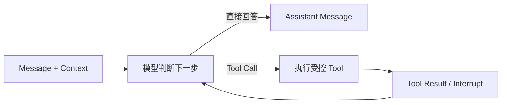

# 06 未实现能力与实现原则

## 1. 文档用途

本文是 Gateway Agent 的后续能力清单和工程约束。它解决两个问题：

1. 已经讨论过但尚未实现的能力不能随着对话变长而遗忘；
2. 后续开发不能因为某个概念看起来“企业级”，就提前引入没有真实调用方的组件、表和抽象。

本文不是分阶段路线图，也不表示列出的功能都必须实现。每项能力都写有引入条件；条件没有出现时，保持当前简单设计就是正确选择。

状态判断遵循以下规则：

- **已实现**：`main` 中存在真实调用方、完整链路和可验证结果；
- **已确定边界**：安全或架构方向已经明确，但代码还不存在；
- **待证实需求**：只能在真实使用中观察，不能凭想象提前实现。

开发某项能力时，应先重新核对当时的用户问题和参考项目最新源码。本文记录的是选择原则，不把第三方项目当前目录和内部类型当作永久契约。

## 2. 当前不能被后续设计破坏的决定

| 主题 | 当前决定 | 原因 |
|---|---|---|
| 产品范围 | 一套 Gateway Agent 对应一套逻辑 Gateway | 暂无共享数据库多租户和 Fleet Manager 需求 |
| 服务形态 | 只有 `chat-svc` | 当前 Agent 生命周期与一次 HTTP SSE 请求一致 |
| Agent Runtime | 直接使用 Eino ADK | 已提供模型、Tool Calling、流式事件、中断和 Checkpoint，不再自研第二套 Agent Loop |
| 持久化 | MySQL 是当前唯一持久事实源 | 只需保存 Chat、完整 Message、模型配置和 Approval |
| 流式输出 | 发送消息和决定审批直接返回 SSE | Token 分片只服务当前界面，不逐条写库 |
| 写操作安全 | 写 Tool 在自身执行边界中断，批准后才访问 Gateway Adapter | 模型、Prompt 和上层调用方都不能绕过审批 |
| 网关隔离 | Service 使用通用 Gateway 类型，Higress 协议只存在于 Adapter | 后续接第二种网关时不污染 Agent 和 HTTP 领域模型 |
| 外部领域模型 | 不出现 Eino、Checkpoint 等框架私有概念 | Eino 是依赖，不是产品语言 |
| 历史兼容 | 新项目无生产历史数据时直接重写 Migration | 不用无意义的 `ALTER` 和兼容字段累积错误设计 |
| 扩展组件 | 当前没有 Redis、Temporal、Qdrant、Outbox、Task、Run 和 Worker | 现有链路没有对应的通信、长任务或检索问题 |

## 3. 尚未实现能力总表

| 能力 | 当前现状 | 何时开始设计 | 最低验收结果 |
|---|---|---|---|
| 真实模型与 Higress 端到端验收 | 代码链路已完成，缺少真实环境验收 | 获得可用测试 Gateway 和模型凭证 | 查询来自真实数据；审批前零写入；批准后只执行一次；重启后可恢复 |
| Web 对话页和审批卡片 | 只有后端 API | 需要让非 API 用户试用当前链路 | 能创建 Chat、流式对话、查看历史、审批并展示执行结果 |
| 身份、RBAC、审批人和审计 | 未实现 | 接口准备离开受信网络或连接生产环境 | 每次读取、批准和执行都能关联真实身份并按权限拒绝 |
| 用户输入规范化 | 只有写 Tool 参数级规范化 | 真实对话频繁缺字段、歧义或表达不一致 | 输出可追溯的结构化需求；缺失信息先追问，不猜测 |
| 独立意图识别 | 当前由 ReAct 选择 Tool | 出现可复现的误调用、漏调用或意图冲突 | 有明确分类依据、置信度和追问/降级策略 |
| 上下文 Token 预算与压缩 | 固定读取最近 100 条 Message | 长对话实际超过模型窗口或成本不可接受 | 按 Token 构建上下文；摘要可追溯；重要操作信息不丢失 |
| 长期召回与智能检索 | 未实现 | 用户确实需要从大量历史、文档或指标中找信息 | 有离线评测集；召回结果包含来源；错误召回不会触发写操作 |
| Plan/Replan、Diff 和风险 | Approval 直接绑定一次 Tool 参数 | 操作扩展为多资源、多步骤或变更中途可能失效 | 用户批准确定版本的 Plan；变更后能识别旧审批并重新确认 |
| Skills | Tool 静态注册，无 Skill Registry | 同一组说明、流程和资源需要独立维护、按需加载 | Skill 有清晰作用域、版本和来源；不能绕过 Tool 与审批 |
| MCP | 没有 Client、Server 和配置表 | 需要接入一个已有 MCP Server，且本地 Tool 不适合重复实现 | 使用标准 SDK；能力发现稳定；写 Tool 仍受本项目审批策略控制 |
| SSE 断线续传 | 断开即取消当前 Agent | 真实网络环境中断线明显影响任务完成率 | 定义事件身份、保留时间和恢复语义；不重复执行写操作 |
| 同 Chat 并发输入 | 当前由客户端避免并发 | 产品允许多个页面或多人同时向同一 Chat 发送消息 | 明确定义拒绝、排队或分支语义；消息和上下文顺序一致 |
| Approval 高级控制 | 只有批准/拒绝和一次性决定 | 生产审批需要过期、撤销、转交或配置防漂移 | 审批对象、决定人、有效期和失效原因可解释且不可绕过 |
| 执行后验证 | 创建成功以 Higress 响应为准 | 网关 API 接受请求但最终状态可能异步或漂移 | 写入后读取真实状态并向用户报告验证结果 |
| 路由更新、删除和回滚 | 只有查询、创建 | 有明确运维场景和权限边界 | 展示变更前后 Diff；写入前审批；失败和回滚语义明确 |
| 第二种 Gateway Adapter | 只有 Higress | 确定一个真实目标网关 | 不修改 Agent Tool 业务语义即可接入；差异在 Adapter 边界处理 |
| OpenTelemetry 和 Prometheus | 未实现 | 进入共享测试或生产环境，需要定位延迟、错误和 Tool 行为 | 请求、模型、Tool、审批和外部调用可关联；指标不泄露 Prompt 和密钥 |
| 脱离 HTTP 的长任务 | 未实现 | 操作必须在用户断开后继续，或包含跨天等待、定时与补偿 | 明确任务所有权、幂等、取消、重试和结果查询，再选择 Worker/工作流引擎 |

## 4. 先把当前垂直链路验收完整

### 4.1 真实端到端验收

当前最重要的未完成工作不是再增加 Agent 概念，而是证明已经写好的链路在真实环境成立。验收时必须同时观察 Gateway Agent 和 Higress，不能只看模型回复。

至少覆盖：

1. 查询不存在、单条和多条路由；
2. 模型把自然语言转换为正确的 `create_route` 参数；
3. 前端收到 `approval_required` 时 Higress 尚未发生写入；
4. 服务重启后仍能查询并决定 Approval；
5. 拒绝不写入，批准只写入一次；
6. 重复决定返回冲突，不重复执行；
7. Higress 失败时 Approval 仍表达用户决定，SSE 明确报告执行失败；
8. Message 历史只包含用户消息和完整 Assistant 回复。

验收发现的问题应先归类为 Prompt、模型适配、Tool Schema、Adapter、审批恢复或接口体验问题，再决定修改哪一层，不能直接增加通用状态机。

### 4.2 Web 对话页

最小前端只需要服务当前链路：Chat 列表/创建、模型选择、Message 历史、SSE 文本、审批卡片和错误展示。它不需要先实现可视化工作流编辑器、通用 Agent Builder 或多 Agent 管理。

审批卡片必须按业务字段展示 Tool Arguments，不能要求用户阅读原始 JSON。批准按钮要明确表达“批准并执行”，执行失败不能把卡片重新显示为待审批。

参考当前 OpenAPI 和[《05 路由审批与恢复设计》](./05-路由审批与恢复设计.md)，不要让前端复制一套后端状态机。

### 4.3 身份、权限与审计

这是连接生产网关前的必要能力，但实现方式取决于实际部署环境的身份来源。开始设计前必须先确定：

- 身份来自企业 OIDC、反向代理还是已有平台；
- 谁可以查询，谁可以发起，谁可以审批；
- 发起人是否允许审批自己的操作；
- Gateway 环境和资源范围如何授权；
- 审计记录需要保存多久、由谁查询。

优先接入企业已有 IAM，不自研用户名密码、组织架构和权限后台。审计记录应保存“谁在何时对什么参数作了什么决定以及实际结果”，不保存模型隐藏思考过程。

### 4.4 SSE 断线与同 Chat 并发

这两个问题必须先定义产品语义，再选择技术：

- 断线后是取消、继续后台执行，还是允许从某个事件位置恢复；
- 同一 Chat 的第二条消息是拒绝、排队，还是创建对话分支；
- 写 Tool 已经批准但客户端断开时，结果如何查询；
- 多副本之间是否真的需要共享流式事件。

只有确定要跨实例保存和重放短生命周期事件时，才评估 Redis Stream。若使用 Stream，Consumer Group 适合后端消费者可靠处理，不等同于浏览器订阅模型；还需单独定义每个前端连接的读取位置和保留策略。

## 5. Agent 能力如何演进

### 5.1 ReAct/TAO 已经存在，不再写第二套循环

TAO 可以理解为 Thought/Action/Observation，ReAct 是模型在判断、调用 Tool、读取结果和继续回答之间循环。当前这部分由 Eino ADK Runner 驱动：



Agent 运行中会处理用户消息、Tool 参数、Tool 结果和最终回复；MySQL 当前只持久化完整 Message，以及写操作的审批参数和决定。系统不要求模型输出，也不持久化隐藏思考过程。后续需要解释性时，应生成可审计的事实依据和操作摘要，而不是暴露 Chain of Thought。

### 5.2 用户输入规范化

Tool 参数规范化只能保证一次具体调用合法，不能解决用户目标模糊。例如“把订单服务配到线上”缺少域名、路径、环境和后端端口。

只有真实样本证明通用 ReAct 追问不稳定时，才增加独立规范化步骤。实现时应：

1. 保留原始用户输入；
2. 区分用户明确提供、系统查询得到和模型推断的字段；
3. 对缺失或冲突字段追问；
4. 不把低置信度推断直接变成写 Tool 参数；
5. 使用结构化输出或 Tool Schema，不通过大量字符串解析拼装协议。

不要提前创建通用 `normalized_requests` 表。是否持久化取决于它是否成为审批、审计或跨请求恢复所需的业务事实。

### 5.3 意图识别

当前两个 Tool 足够由模型在 ReAct 中选择。独立意图分类器只有在它能解决已测量的问题时才有价值，例如：

- 查询和创建频繁误判；
- 一个请求包含互相冲突的操作；
- 权限策略需要在进入 Agent 前阻断某类意图；
- 成本要求先用小模型路由到不同专业 Agent。

届时先建立真实对话样本和期望标签，再比较规则、结构化大模型分类和专用小模型。没有离线数据时，不给“置信度 0.8”赋予虚假的精确含义。低置信度应触发追问或安全降级，不能默认执行写操作。

### 5.4 上下文管理

MySQL 中的完整 Message 是会话事实；发送给模型的 Context 只是一次运行需要的投影。后续实现顺序应从简单且可解释的策略开始：

1. 使用模型 Tokenizer 或可靠估算建立 Token 预算；
2. 保留 System Prompt、最近对话、当前未完成目标和关键 Tool 结果；
3. 超出预算时压缩较早内容，并保存摘要来源范围；
4. 对查询得到的大对象裁剪无关字段；
5. 只有单纯摘要仍无法召回时，再增加长期检索。

上下文压缩不是删除历史。原 Message 仍保存在 MySQL，摘要只用于构建模型输入。必须用长对话样本验证关键信息没有被摘要改写。

### 5.5 智能检索和长期召回

不同数据应使用不同检索方式：

| 数据 | 首选方式 | 原因 |
|---|---|---|
| 当前网关配置 | Gateway Tool 实时查询 | 不能用旧向量结果代替真实状态 |
| Chat 历史 | MySQL 条件查询、摘要和必要的文本检索 | 原始数据已经结构化保存 |
| 运维文档和知识库 | 先评估关键词/全文检索，再评估向量 + 重排 | 需要引用来源和离线召回评测 |
| 指标和日志 | 专用可观测性 Tool | 不应复制进 Agent 会话库 |

Qdrant、Elasticsearch 或其他检索组件都不是默认答案。只有数据规模、查询方式和评测结果证明 MySQL/现有搜索服务不足时才引入。每条召回内容必须携带来源、时间和权限信息；检索文本本身不能绕过写 Tool 审批。

### 5.6 Plan 和 Replan

一个 `create_route` Tool 调用不需要额外 Plan 表。Plan 在以下场景才成为独立产品对象：

- 一次请求修改多个资源；
- 用户需要先查看完整变更顺序和 Diff；
- 计划生成后，Gateway 当前状态可能变化；
- 某一步失败后需要停止、重算或补偿。

真正实现时，Approval 必须绑定用户看到的确定版本，而不是绑定一个会被原地修改的“当前 Plan”。版本、内容 Hash、基线资源版本、Diff、风险和失效原因都要有明确语义。Replan 产生新版本，并要求用户重新确认发生变化的内容。

优先使用 Eino 已有编排能力或成熟 Runtime 的模式；不要新建一个自己驱动所有节点的通用 `for` 循环，也不要先创建 Task、Run、Step 表再寻找使用场景。

### 5.7 Skills

Skill 适合封装可版本化、可按需加载的专业说明、流程和资源，例如“创建生产路由前的检查规范”。它不是 Tool 的别名：

- Skill 告诉 Agent 如何完成一类工作；
- Tool 提供可执行能力；
- MCP 是发现和调用外部能力的标准协议。

实现前先验证至少有两个真实 Skill，并参考 [Agent Skills 规范](https://agentskills.io/specification)。加载 Skill 后，所有外部操作仍必须经过 Tool Schema、权限和审批；Skill 文件不能携带或读取不属于其权限的密钥。

### 5.8 MCP

出现真实 MCP Server 接入需求时，优先使用 [MCP Go SDK](https://github.com/modelcontextprotocol/go-sdk)，不自行实现 JSON-RPC 和能力协商。需要先设计：

- Server 来源和配置由谁管理；
- 每次 Agent 运行看到的是哪个 Tool Snapshot；
- Tool 名称冲突和 Schema 变化如何处理；
- 外部 Tool 的只读/写入风险如何标记；
- 用户审批的是稳定参数还是运行时再次生成的参数；
- MCP Server 返回内容如何进入上下文且不泄露敏感信息。

MCP Tool 也必须进入统一的安全边界。不能因为 Tool 来自标准协议就默认可信；涉及网关写入时，仍然不能绕过 Gateway Adapter 和写操作审批。

## 6. 网关操作能力如何扩展

### 6.1 执行后验证

当 Higress 写接口的成功响应不足以证明最终状态时，创建 Tool 应在写入后重新查询目标资源并比较关键字段。验证结果应进入 Tool Result 和最终回复；不一致必须明确报告，不能让模型概括成成功。

只有执行需要脱离当前 HTTP 请求、持续轮询时，才设计独立执行状态和后台运行机制。

### 6.2 更新、删除和回滚

每种写操作都要单独定义输入、风险和验收，不能用一个 `manage_route(action, payload)` 通用 Tool 隐藏差异。最低安全要求包括：

- 更新前读取当前资源并生成结构化 Diff；
- 删除展示准确资源标识和影响范围；
- Approval 绑定确定参数和基线版本；
- 执行前检测关键状态是否已变化；
- 回滚说明恢复到什么状态、哪些副作用不能撤销。

如果 Gateway 本身支持版本或事务，优先使用其能力；不要在 Agent 内复制一套配置中心。

### 6.3 第二个 Gateway Adapter

只有真实接入第二种网关才能验证当前抽象是否足够。接入时保持三层边界：

```text
Agent Tool 业务语义
        ↓
service/gateway 通用类型和接口
        ↓
store/<gateway> 协议、认证和错误转换
```

不同网关无法自然对齐的能力应显式表达或分别提供 Tool，不要为了统一接口丢失关键语义。Higress 仍以其官方仓库和 Console API 为事实来源。

## 7. 可观测性与运行组件

### 7.1 OpenTelemetry 和 Prometheus

进入共享环境后，优先建立以下可观测关联：

- HTTP Request ID、Chat ID 和 Approval ID；
- 模型 Provider、模型名、首 Token 延迟、总耗时和 Token 用量；
- Tool 名称、结果、耗时和审批等待时间；
- Higress 请求耗时、状态类别和错误类型；
- MySQL 操作耗时与连接池状态。

Trace 和日志不得记录 API Key、Higress 密码、完整 Checkpoint 或未经脱敏的 Prompt。指标名称和属性应参考 OpenTelemetry 语义约定；不要创建大量包含 Chat ID、用户输入等高基数字段的 Prometheus Label。

### 7.2 何时才增加基础组件

| 组件 | 当前不用它解决什么 | 只有出现什么问题才重新评估 |
|---|---|---|
| Redis | 不作为“企业级标配”，不保存当前 Chat 事实 | 多实例共享短期状态、限流或可证明需要事件重放 |
| Redis Stream | 不转发当前请求内 Token 分片 | 后端有可恢复的异步事件消费者，并定义了保留和消费语义 |
| Temporal | 不替代 Eino Agent Loop，也不处理一次短请求 | 跨天、多步骤、定时等待、可靠重试和补偿成为真实需求 |
| Qdrant | 不存当前 Gateway 配置 | 大规模语义检索经过评测，现有搜索能力不足 |
| Outbox | 不为未来消息系统预建表 | 同一业务事务必须可靠发布到外部消息系统 |
| Worker | 不复制 `chat-svc` 逻辑 | 用户断线后任务仍必须继续，且已有结果查询和取消协议 |

选择组件前必须先写清：它解决的现有故障是什么、谁生产、谁消费、权威状态在哪里、重复和丢失分别如何处理。答不出来就不引入。

## 8. 开源实现参考

### 8.1 参考矩阵

| 项目 | 当前直接复用 | 后续重点参考 | 明确不照搬 |
|---|---|---|---|
| [CloudWeGo Eino](https://github.com/cloudwego/eino) / [eino-ext](https://github.com/cloudwego/eino-ext) | ADK Runner、ChatModel、Provider、Tool Calling、流式事件、Stateful Interrupt、Checkpoint | 上下文处理、编排、更多 Provider 和 Tool 集成 | 第二套 Agent Loop、只为改名的 Wrapper |
| [Google ADK Go](https://github.com/google/adk-go) | 当前没有同时引入 | Agent、Tool、Session、状态和人工介入边界 | 与 Eino 并存的第二套 Runtime、框架私有类型进入业务表 |
| [pi-mono](https://github.com/badlogic/pi-mono) | 当前没有依赖其 TypeScript 包 | transient delta/finalized message、上下文压缩、Tool 生命周期 | TypeScript Runtime、JSONL Session、本地 CLI 交互模型 |
| [OpenAI Codex](https://github.com/openai/codex) | 当前没有复制其 Rust Runtime | Tool Registry、审批策略、MCP Tool Snapshot、Skill 加载、上下文投影 | Rust Agent Loop、Shell/CLI Tool、本地会话存储格式 |
| [kagent](https://github.com/kagent-dev/kagent) | 当前没有引入 | MCP、审批、OpenTelemetry 和 Kubernetes 场景实践 | A2A Task、中央多 Agent Controller、当前不需要的宽泛 RBAC |
| [MCP Go SDK](https://github.com/modelcontextprotocol/go-sdk) | 尚未使用 | MCP Client/Server、能力协商和协议类型 | 自研 MCP 协议栈 |
| [Higress](https://github.com/alibaba/higress) | Console API 语义和 Gateway Adapter 目标 | 路由字段、错误、版本与后续网关能力 | 把 Higress 私有结构泄漏到 Agent、Service 和 OpenAPI |
| [Agent Skills](https://agentskills.io/specification) | 尚未使用 | Skill 文件结构、渐进加载和元数据 | 没有真实 Skill 时预建 Registry 和数据库 |
| [OpenTelemetry Go](https://github.com/open-telemetry/opentelemetry-go) / [Prometheus Go Client](https://github.com/prometheus/client_golang) | 尚未使用 | 标准埋点、Trace/Metrics 输出 | 自研追踪协议、高基数 Label |

### 8.2 阅读源码的规则

开始实现一项复杂能力前：

1. 拉取或更新对应开源仓库，在本地搜索真实调用链，不只看架构图和二手文章；
2. 找到入口、核心接口、状态保存、错误与取消路径，以及项目自己的测试/示例；
3. 记录参考的仓库、Commit 和源码路径，避免以后上游变化后无法解释；
4. 判断是直接依赖、复制小段成熟实现、借鉴边界，还是完全不适用；
5. 直接复制时改成当前领域命名和目录规范，删除不适用的兼容层，不能把上游整套架构搬进来；
6. 上游实现与当前简单需求冲突时，保留必要语义，不保留它为更大场景准备的组件。

“参考开源”必须能指向实际代码；只有概念名称、博客图或模型生成的伪代码不能作为实现依据。

## 9. 项目级实现原则

### 9.1 从一个可验收场景开始

新增能力必须先写清用户、输入、期望结果和失败表现，再设计接口、表和包。没有调用方的接口、空目录、占位表和“以后也许会用”的中间结构不进入仓库。

### 9.2 优先复用，避免自造概念

能够被 Eino、Gin、Wire、sqlc、标准库或目标 Gateway 官方 SDK 直接满足的能力优先复用。只有领域需要且现有项目没有合适表达时才增加新概念。Task、Run、Workflow、Event、Outbox 等词不能先出现再寻找用途。

### 9.3 只做决定必要的封装

函数、接口和包要么隔离真实变化，要么提高一段核心流程的可读性。只转发一次调用、只改错误名字、没有第二个实现的预留接口和无行为的中间 DTO 都不增加。错误和重试按真实调用方需求设计，不建立无人消费的错误分类状态机。

### 9.4 保持 Go 代码简单一致

- 使用 Go 1.26 和适合的新标准库能力；
- HTTP 使用 Gin 绑定，DTO 放在 `internal/chatsvc/dto/<domain>`，请求通过 `Validate` 完成接口参数校验；
- Handler 负责协议，Service 负责业务流程，Store 负责 MySQL 和外部系统；
- 依赖注入使用 Wire，SQL 使用 sqlc；
- 公共扩展包使用清晰的 `x` 后缀，例如 `errorsx`，但不能把业务类型塞进工具包；
- 英文标识符和英文日志；中文注释解释导出定义、核心流程和不直观的原因；
- 常量替代重复的协议字符串和魔法数字，但不为只出现一次且含义清楚的值制造常量；
- 文件按类型、构造、公开方法、私有方法的阅读顺序组织。

### 9.5 数据模型按真实需要生长

新增表前必须回答：它保存的业务事实是什么、谁写、谁读、生命周期是什么、为什么现有表不能表达。框架名不进入表名；数据库不保存模型隐藏思考过程。当前项目没有历史生产数据时，错误 Migration 直接重写，不增加兼容 ALTER。

### 9.6 瞬时事件和持久事实分开

Token Delta 是当前 SSE 的瞬时展示数据；完整 Message、Approval 参数和用户决定才是持久事实。未来 Event、队列或 Stream 也必须先明确消费者和恢复语义，不能因为数据在流动就全部落库。

### 9.7 写 Tool 默认不可信

Prompt 不是安全边界。所有有副作用的 Tool 都要在服务端做确定性校验、权限判断和审批中断；审批必须展示真实 Tool 参数；恢复时执行的必须是用户批准的那份参数。Skill、MCP 和未来 Gateway Adapter 都不能绕过这一规则。

### 9.8 不记录模型内部思考过程

系统可记录原始输入、结构化意图、Plan、Tool Call、Tool Result、审批和最终回复，用于解释和审计；不要求模型输出或保存隐藏 Chain of Thought。需要解释时生成基于事实的摘要。

### 9.9 失败和重试保持可解释

当前模型或 Higress 失败就结束本次请求，由用户选择是否重试。只有存在明确的瞬时错误、幂等边界和自动重试价值时才增加有限重试。写操作不能在结果未知时自动重放。

### 9.10 不用测试代码代替真实验收

按当前项目约定不新增单元测试、Mock 和 Fake。提交前至少执行与改动匹配的格式化、生成、静态契约、编译或真实接口验证；涉及模型、审批和 Gateway 写入的能力，必须用真实环境完成端到端验收。

### 9.11 文档和代码只有一套当前事实

代码、Migration、OpenAPI、README 和 `.codex/docs` 必须同步。被撤销的设计直接删除，历史交给 Git；不保留“旧版兼容说明”混淆当前读者。大改时重写原文档，不追加互相矛盾的补丁章节。

## 10. 新能力进入开发前的检查表

每次准备新增能力时逐项回答：

- [ ] 哪个真实用户在什么场景下遇到了什么问题？
- [ ] 当前实现为什么解决不了，有没有可复现样本或数据？
- [ ] 最小可验收结果是什么，失败时用户看到什么？
- [ ] Eino、标准库、官方 SDK 或开源项目是否已有适用实现？
- [ ] 已阅读哪个仓库、Commit 和源码路径？选择直接依赖、复制还是只借鉴边界？
- [ ] 新增概念是否有真实写入方和读取方？
- [ ] 权威状态保存在哪里，瞬时数据是否被误当成持久事实？
- [ ] 写操作如何校验、授权、审批、检测并发变化和报告结果？
- [ ] 是否增加新组件？它的故障、重复、丢失、取消和运维语义是否明确？
- [ ] 有没有多余的接口、包装、错误转换、重试、防御性分支、兼容 Migration 或空目录？
- [ ] OpenAPI、配置、Migration、README 和设计文档需要同步哪些内容？
- [ ] 用什么真实命令或端到端场景证明完成？

只要前六项仍答不清，就继续做需求和源码研究，不开始铺代码。

## 11. 维护方式

当某项能力开始实现时，不为它创建一份孤立的过程性 Plan 文档。应根据影响范围更新：

1. `01` 中的产品需求与验收；
2. `02` 中的架构和数据流；
3. `03`、OpenAPI 和 Migration 中的真实契约；
4. `04` 或 `05` 中对应的 Agent/审批细节；
5. 本文中的状态、触发条件、参考源码和仍未完成项；
6. README 的当前能力与运行方式。

能力只有在代码、调用方、文档和真实验证都存在后，才从本文的“未实现”状态移除。实现方案被证明不合适时直接重写当前文档，Git 保留历史。
