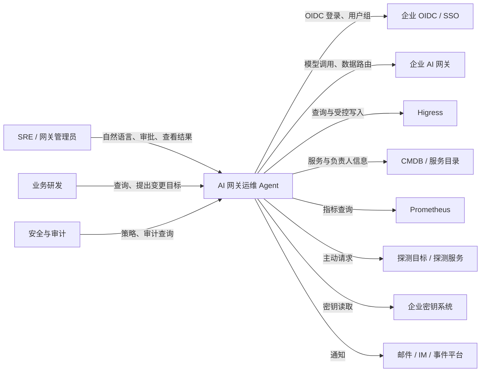
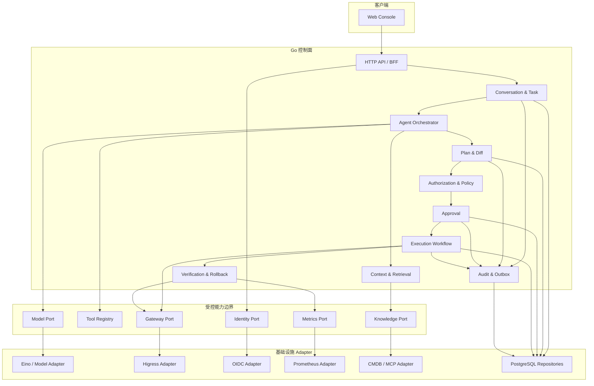
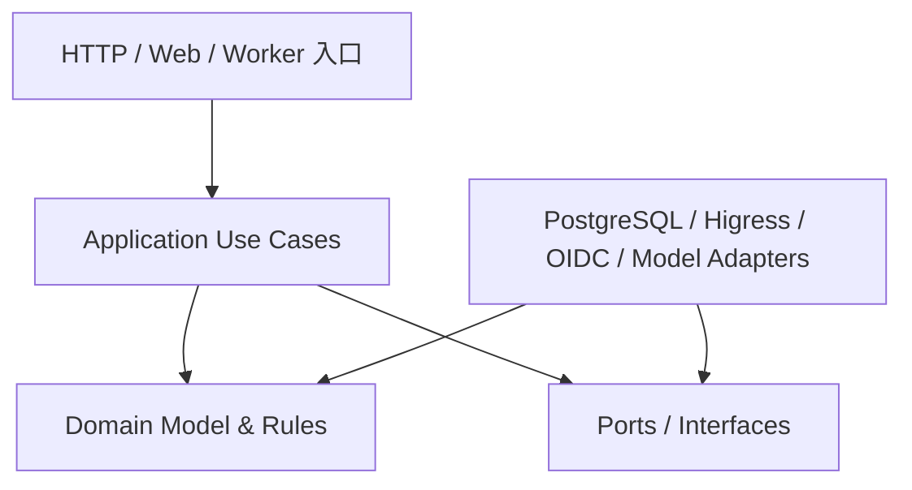
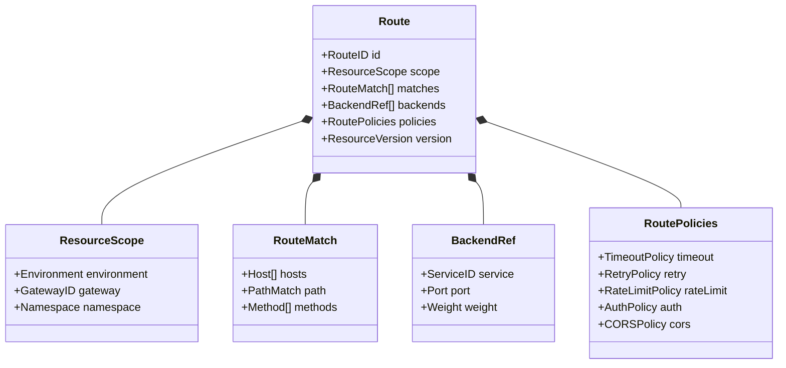
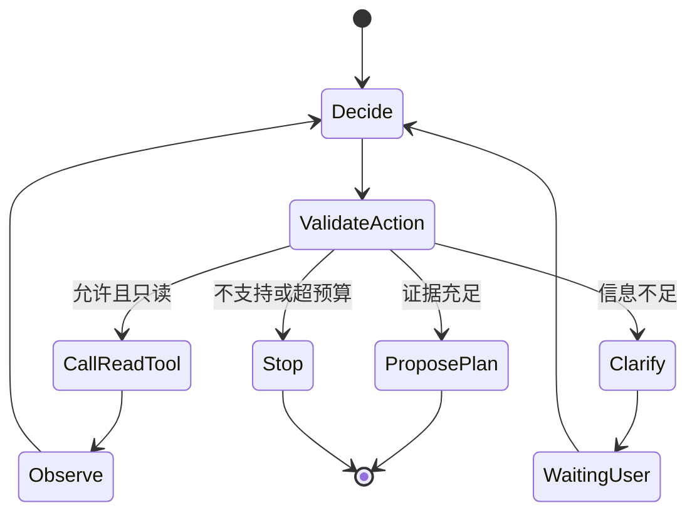
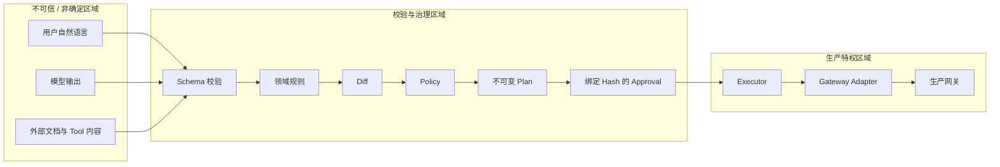
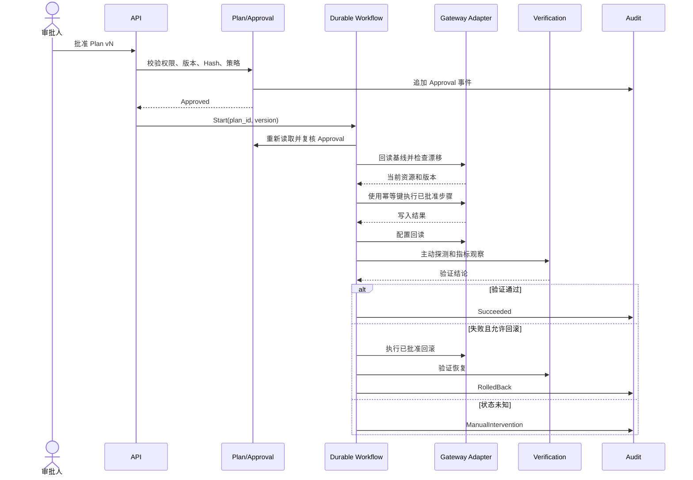
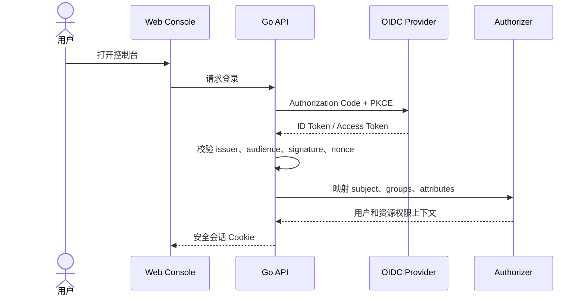
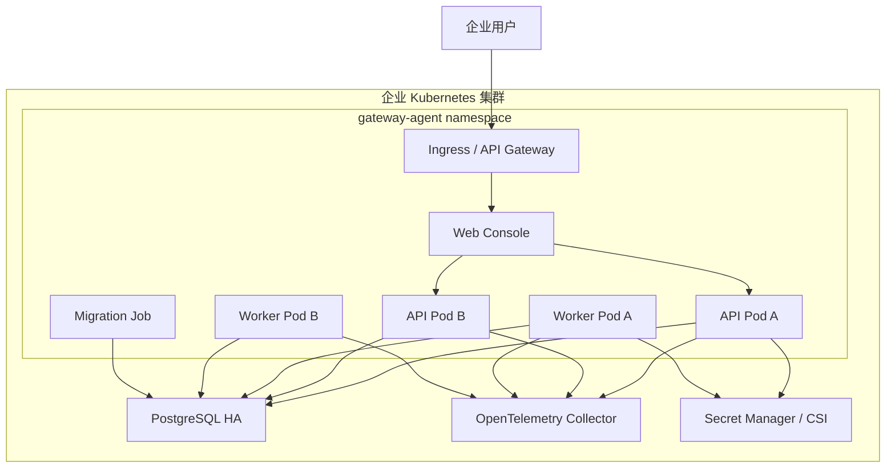
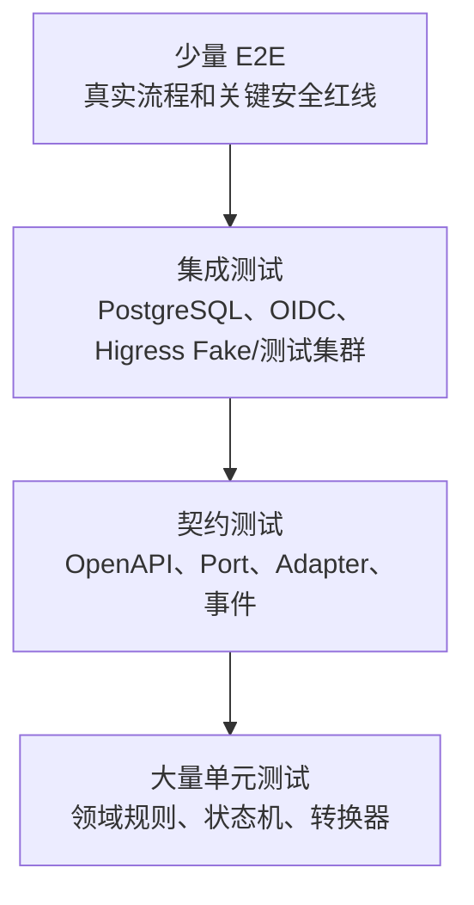

# 企业级 AI 网关运维 Agent 总体架构设计

> 历史文档：已被 `../02-网关智能体目标产品与架构设计.md` 替代，不得作为新代码实现依据。

> [!WARNING]
> **本文档保留为历史架构基线。** 其中的技术和实施结论均已失效；当前设计以 [02-网关智能体目标产品与架构设计](../02-网关智能体目标产品与架构设计.md) 为准。

> 文档版本：v0.1
> 文档状态：历史架构基线，部分内容已被 v0.2 替代
> 更新日期：2026-07-16
> 需求参考：[01-企业级AI网关运维智能体产品需求文档](../01-企业级AI网关运维智能体产品需求文档.md)
> 目标读者：第一次参与 Agent 项目的开发者、架构师、SRE、安全人员、产品与交付团队
> 后端语言：Go 1.24.x


---

## 1. 先给第一次做 Agent 的开发者讲清楚

这个项目不是“调用一次大模型，然后把回答展示出来”。它由两类性质完全不同的系统组成：

1. **带不确定性的智能部分**：理解用户表达、寻找信息、归纳证据、提出方案；
2. **必须确定的生产控制部分**：生成不可变 Plan、计算 Diff、审批、执行、验证、回滚和审计。

最重要的架构边界是：**大模型可以提出生产变更，但不能直接执行生产变更。**

可以把系统理解成一家规范的施工公司：

| 系统概念 | 通俗类比 |
|---|---|
| 用户输入 | 客户描述“想怎么改” |
| Agent | 负责沟通和勘察的方案工程师 |
| Tool | 测量、查询、探测等单项工具 |
| Skill | 一套标准施工流程 |
| Change Plan | 带版本号的正式施工方案 |
| Diff | 施工前后会发生什么变化 |
| Policy | 安全规范和施工禁区 |
| Approval | 对某一版施工方案的正式签字 |
| Executor | 只按已签字图纸施工的执行团队 |
| Verification | 完工验收和观察 |
| Rollback | 按预案恢复施工前状态 |
| Audit | 全程留档 |

如果只记住一件事，请记住：**聊天记录不是生产状态，模型回答不是执行指令，Plan 才是审批与执行之间的合同。**

---

## 2. 架构目标

### 2.1 业务目标

- 支持 SRE 从自然语言目标开始，完成网关查询和受控变更；
- 把输入澄清、实时查询、风险检查、审批、验证和回滚连成一个闭环；
- 首期适配 Higress，同时避免核心模型与 Higress CRD 绑定；
- 从路由查询和变更逐步扩展到 TLS、插件、WAF、全局策略和实例管理；
- 在企业内网单租户环境部署，接入现有 OIDC、Prometheus、CMDB 和 AI 网关。

### 2.2 工程目标

- 关键领域对象强类型、版本化、可测试；
- 所有生产写路径经过同一审批与执行门禁；
- 任务状态持久化，服务重启后能够恢复；
- 写操作幂等、可重试、可回读、可审计；
- 组件之间通过稳定接口通信，便于后续拆分服务；
- 从第一条只读链路开始建立日志、指标、Trace、错误码和测试金字塔；
- 让新成员可以按模块逐步理解，不要求一次读懂整个系统。

### 2.3 明确不做的事

- 不建立一个能够执行任意 Shell 的“万能 Agent”；
- 不把权限校验交给前端或提示词；
- 不把所有逻辑塞进一个巨大的 Agent Prompt；
- 不在项目第一天拆成十几个微服务；
- 不为了追求“智能”而跳过确定性状态机；
- 不在 Slice 1 引入暂时没有实际用途的消息队列、缓存和向量数据库。

---

## 3. 关键架构决策摘要

| 编号 | 决策 | 结论 | 原因 |
|---|---|---|---|
| ADR-001 | 初始部署形态 | 模块化单体，后台 Worker 可独立进程运行 | 保持开发和部署简单，同时用包边界为未来拆分做准备 |
| ADR-002 | 核心语言 | Go 1.24.x | 符合项目要求，适合网关、并发、基础设施和长期运行服务 |
| ADR-003 | HTTP 框架 | Gin + REST + OpenAPI 3.1，契约优先 | Gin 生态成熟；OpenAPI 继续作为外部契约，不让 Handler 定义取代接口设计 |
| ADR-004 | 核心存储 | PostgreSQL | 承载任务、Plan、审批、审计索引和幂等状态，事务语义可靠 |
| ADR-005 | 长任务 | 先定义 Workflow Port；Slice 3 前评审是否落地 Temporal | Slice 1 无需承担 Temporal 复杂度，但执行闭环需预留持久化工作流边界 |
| ADR-006 | Agent 框架 | 采用 CloudWeGo Eino 作为 Agent/Model Adapter，核心领域不绑定 Eino | 利用 Go Agent 生态，同时避免业务状态被框架 Session 锁定 |
| ADR-007 | 策略 | Authorizer/Policy Port；初期使用版本化策略，评估 OPA | 权限与风险策略需要独立、可解释、可替换 |
| ADR-008 | 网关接入 | 统一 Gateway Adapter + Capability Discovery | 支持 Higress 首发和后续多网关扩展 |
| ADR-009 | 前端 | 独立 Web Console；API 与 UI 分离 | 满足复杂 Diff、指标和审批工作台需求 |
| ADR-010 | 可观测性 | OpenTelemetry + Prometheus + 结构化日志 | 从第一天形成跨 Agent、Tool 和 Adapter 的证据链 |
| ADR-011 | 审计 | 追加写 Audit Event + 业务状态表 | 兼顾查询效率与完整行为时间线 |
| ADR-012 | 事件 | PostgreSQL Transactional Outbox 起步 | 保证业务状态与待发布事件同事务，后续可接消息系统 |
| ADR-013 | 依赖注入 | Google Wire，只在 Composition Root 使用 | 编译期生成、无运行时容器；业务包不感知 Wire |
| ADR-014 | SQL 访问 | sqlc + pgx | SQL 可审查、生成代码类型安全，Repository 隔离生成类型 |
| ADR-015 | Protobuf/gRPC | 有 gRPC 需求时采用 Buf + grpc-go | Buf 管理 lint、breaking 和 generate；grpc-go 提供运行时 |
| ADR-016 | 工程目录 | `apiserver + worker + controlplane + internal/pkg` | 参考 OneX：部署单元独立装配，核心业务集中，共享技术能力受控复用 |

### 3.1 为什么不是一开始就做微服务

微服务解决的是独立扩缩容、团队边界和故障隔离问题，也会带来网络调用、分布式事务、部署、观测和调试成本。当前项目还在验证领域边界，一开始拆成很多服务，容易把尚未稳定的设计固化为远程接口。

因此 V1 采用模块化单体：一个代码仓库、少量部署单元，内部模块禁止随意跨层访问。等某个模块出现独立扩缩容、隔离或团队所有权需求时，再沿既有 Port 拆分。

### 3.2 为什么不是只有一个 Agent 服务

一个服务可以是部署单元，但不能只有一个逻辑模块。若所有逻辑都写在 Agent 中，会产生三个问题：

- 审批和执行规则依赖模型上下文，无法证明确定性；
- Higress 细节渗透到 Prompt 和 Plan，后续无法支持其他网关；
- 测试只能做大而慢的端到端测试，难以验证安全边界。

所以我们保留简单的初始部署形态，但建立清晰的领域与 Adapter 边界。

---

## 4. 系统上下文



系统不替代这些企业系统，而是把它们组织成一个可控任务流程。任何外部系统都可能慢、失败或返回冲突信息，因此所有接入都要有超时、错误分类、权限和降级规则。

---

## 5. 逻辑容器架构



### 5.1 初始部署单元

| 部署单元 | 包含模块 | 是否对外暴露 | 说明 |
|---|---|---|---|
| `gateway-agent-apiserver` | HTTP、Task、Agent、Plan、Approval、查询服务 | 是 | 面向 Web 和集成方 |
| `gateway-agent-worker` | 执行、验证、回滚、Outbox | 否 | Slice 1 可暂时同进程运行 |
| `gateway-agent-web` | Web Console 静态资源 | 是 | 独立前端服务或静态托管 |
| PostgreSQL | 业务、任务状态、审计索引、Outbox | 仅内网 | 生产采用客户标准高可用方案 |

Slice 1 为降低门槛，可以让 API 与 Worker 使用同一个 Go 二进制的不同启动模式；从代码第一天开始仍保持模块分离。

---

## 6. 分层与依赖方向

项目采用“领域核心 + 应用用例 + Port + Adapter”的结构。领域层不依赖数据库、HTTP、Higress SDK 或大模型 SDK。



依赖规则：

- `cmd/gateway-agent-apiserver` 只负责调用 `internal/apiserver`；
- `cmd/gateway-agent-worker` 只负责调用 `internal/worker`；
- `apiserver` 与 `worker` 不能互相导入；
- `apiserver`、`worker` 可以依赖 `controlplane` 和 `internal/pkg`；
- `controlplane` 保存产品业务语义，不依赖 Gin、Wire 或服务启动代码；
- `internal/pkg` 只保存跨组件共享的技术能力，不保存 Task、Plan、Approval 等业务逻辑；
- HTTP Handler 只做协议转换、鉴权上下文读取和错误映射；
- 不允许 Higress 原始对象直接成为 API 返回或 Change Plan 的核心对象。

### 6.1 推荐代码结构

```text
.
├── cmd/
│   ├── gateway-agent-apiserver/
│   │   └── main.go
│   └── gateway-agent-worker/
│       └── main.go
├── api/
│   ├── openapi/
│   └── proto/                       # 有明确 gRPC 需求后再创建
├── internal/
│   ├── apiserver/                   # API 部署单元
│   │   ├── app.go
│   │   ├── options/
│   │   ├── config.go
│   │   ├── server.go
│   │   ├── httpserver.go
│   │   ├── handler/
│   │   ├── middleware/
│   │   ├── wire.go
│   │   └── wire_gen.go
│   ├── worker/                      # 后台任务部署单元
│   │   ├── app.go
│   │   ├── options/
│   │   ├── config.go
│   │   ├── server.go
│   │   ├── runner/
│   │   ├── wire.go
│   │   └── wire_gen.go
│   ├── controlplane/                # 产品核心业务
│   │   ├── task/
│   │   ├── agent/
│   │   ├── gateway/
│   │   │   ├── query/
│   │   │   ├── fake/
│   │   │   └── higress/
│   │   ├── plan/
│   │   ├── approval/
│   │   ├── execution/
│   │   ├── verification/
│   │   └── store/                   # sqlc/PostgreSQL Adapter
│   └── pkg/                         # 仓库内部共享技术能力
│       ├── contextx/
│       ├── errors/
│       ├── health/
│       ├── id/
│       ├── log/
│       ├── middleware/
│       ├── requestid/
│       ├── server/
│       ├── transaction/
│       └── validation/
├── db/
│   ├── query/                       # sqlc 输入 SQL
│   └── schema/                      # sqlc 使用的 Schema 来源
├── gen/proto/                       # Buf 生成的 Protobuf/gRPC 代码
├── migrations/
├── policies/
├── web/
├── deploy/
├── test/
├── docs/
├── Makefile
├── go.mod
└── README.md
```

这不是要求第一天创建所有目录。目录随着垂直切片出现，只创建当前任务真正需要的部分。`pkg/` 暂不创建；只有出现需要被仓库外部 Go 程序稳定引用的 SDK 或公共 API 时才创建。

`internal/pkg` 准入规则：至少被两个内部组件使用；不包含产品业务语义；包名必须描述具体职责；禁止新建 `util`、`common`、`helpers`、`global`；禁止保存可变全局状态；禁止反向依赖 `apiserver`、`worker` 或 `controlplane`。

### 6.2 框架使用边界

| 框架/工具 | 允许出现的位置 | 禁止渗透的位置 |
|---|---|---|
| Gin | `internal/apiserver` | `worker`、`controlplane`、Gateway Adapter |
| Wire | `internal/apiserver`、`internal/worker` 的 Composition Root | `controlplane` 业务包、运行时服务定位 |
| sqlc | `internal/controlplane/store`、`db/query` | 业务对象、HTTP 响应模型 |
| Buf / grpc-go | `api/proto`、`gen/proto`、gRPC Adapter | 领域核心和无 gRPC 需求的 Slice |
| Eino | `internal/controlplane/agent` 的 Adapter | Plan、Approval、Execution 的事实状态 |

Wire 只做每个部署单元的依赖装配，不做 Service Locator。所有业务对象仍使用普通 Go 构造函数，因此即使未来替换 Wire，`controlplane` 业务代码也无需变化。

### 6.3 OneX 工程模式的采用边界

采用：极简 `main.go`；`Options → Complete → Validate → Config → Server → Run` 启动链；服务独立 Wire 图；生成代码提交仓库；编译期接口断言；结构化 Makefile；工具版本固定；API、配置、部署和开发规范分目录管理。

不采用：一开始建立大量 `cmd` 组件；全局 Store 单例；把 Wire ProviderSet 放入业务包；同时启动 HTTP 和 gRPC；创建庞大的 `internal/pkg/util`；为内部用例提前复制 `v1/v2` 目录；在日志中记录完整用户请求或 Agent 输入。

---

## 7. 核心模块职责

| 模块 | 负责 | 明确不负责 |
|---|---|---|
| HTTP API / BFF | 协议转换、身份上下文、错误映射、任务事件流 | 业务状态机、Higress 转换 |
| Conversation & Task | Task 生命周期、结构化上下文、恢复 | 直接执行网关操作 |
| Agent Orchestrator | 规范化、意图、只读 Tool 调度、决策摘要 | 审批状态和生产写入 |
| Context & Retrieval | 实时配置、知识、证据排序与冲突 | 把文档当系统指令 |
| Plan & Diff | 不可变 Plan、版本、哈希、Diff、Replan | 调用生产写 API |
| Authorization & Policy | 权限与风险决策、原因、策略版本 | 仅用一个 `isAdmin` 判断全部权限 |
| Approval | 绑定 Plan 版本和 Hash 的正式审批 | 依赖聊天中的“可以”作为授权 |
| Execution Workflow | 复核、幂等、步骤、重试、补偿 | 让模型决定下一条写命令 |
| Verification & Rollback | 回读、探测、指标、回滚和人工介入 | 把 API 2xx 当业务成功 |
| Gateway Adapter | 能力发现、统一模型转换、错误归一化 | 对话和用户体验逻辑 |
| Audit & Outbox | 追加事件、事务内 Outbox、外部投递 | 保存明文凭证和原始思维链 |

授权与策略是两件事：Authorization 回答“这个人能不能做”，Policy 回答“这个方案是否符合企业规则”。两者都要返回允许/拒绝、原因和版本。

---

## 8. 统一网关领域模型

核心模型描述网关业务语义，不复制某个网关的 CRD。



建模规则：

- ID 使用专用类型，避免把 gateway ID、route ID 和 task ID 混用；
- 枚举拒绝未知值，不用任意字符串代表环境和动作；
- 权重、超时、重试次数等在构造时校验；
- `ResourceVersion` 和 `ObservedAt` 是判断漂移的必要字段；
- 未识别的 Adapter 字段可进入只读扩展，但不能自动进入写 Plan；
- 敏感值使用引用，不保存明文凭证。

能力发现示意：

```go
type GatewayCapabilities struct {
	ReadRoutes        bool
	CreateRoutes      bool
	UpdateRoutes      bool
	DeleteRoutes      bool
	SupportedMatches  []MatchType
	SupportedPolicies map[PolicyKind]PolicyCapability
	OptimisticLocking bool
	IdempotentWrite   bool
}
```

Plan 生成前先检查能力，不能让执行器在最后一刻才发现目标网关不支持某个功能。

---

## 9. Agent、Tool 与 Skill 架构

### 9.1 Agent 的允许动作

Agent 每一步只能从当前状态允许的动作集合中选择：

```text
Clarify
NormalizeInput
ResolveResource
CallReadOnlyTool
SummarizeEvidence
ProposePlanDraft
ExplainResult
StopWithReason
```

`ApprovePlan`、`WriteGateway`、`RollbackGateway` 不属于通用 Agent 动作。

### 9.2 Tool Contract

每个 Tool 都要定义名称、版本、输入输出 Schema、读写属性、所需权限、超时、重试、敏感级别、错误码、审计策略、Owner 和弃用时间。

```go
type Tool[I any, O any] interface {
	Name() string
	Version() string
	Execute(ctx context.Context, input I) (O, error)
}
```

生产实现需要 Tool Registry。每轮只向模型暴露当前 Skill 和当前状态真正允许的少量 Tools。

### 9.3 Skill Contract

Skill 是产品能力，不只是 Prompt 文件。一个 Skill 需要声明：

- 支持的业务目标；
- 输入 Schema 和澄清规则；
- 允许使用的 Tools；
- 确定性状态机；
- 风险策略；
- Plan、验证和回滚模板；
- 评测集；
- 版本、Owner 和兼容性。

### 9.4 模型 Adapter

核心应用只依赖最小模型接口：

```go
type Model interface {
	GenerateStructured(ctx context.Context, req StructuredRequest, out any) error
}
```

模型 Adapter 负责经过企业 AI 网关选择模型、结构化输出、超时重试、限额、数据分级、脱敏和模型调用审计。CloudWeGo Eino 将用于模型调用、Tool 编排和可观测集成，但 Task、Plan、Approval 等领域对象不能被框架 Session 代替。

### 9.5 TAO/ReAct 安全循环



循环必须有最大步骤数、总耗时、Token、同类 Tool 重复次数和数据源速率限制。达到上限时返回已获得证据和未决问题，不编造答案。

---

## 10. Plan、审批与执行安全架构

### 10.1 信任边界



只有结构化、校验通过、策略允许并完成正式审批的 Plan 才能跨入生产特权区域。

### 10.2 Plan 哈希

哈希前进行规范化序列化：字段顺序固定、Map Key 排序、时间和数值格式统一、不包含随机展示字段，并包含执行、验证、回滚和关键证据版本。

```text
content_hash = SHA-256(canonical-json-v1(plan_content))
```

执行器从数据库重新读取 Plan 和 Approval 后自行验证，不能信任 Agent 或前端传入的“已批准”布尔值和哈希。

### 10.3 写操作时序



---

## 11. 数据架构

### 11.1 PostgreSQL 是事实来源

Task、Plan、Approval、Execution 等关键状态存储在 PostgreSQL。模型 Session、前端状态和日志都不能成为生产状态的唯一来源。

### 11.2 核心表

| 表 | 用途 | 关键约束 |
|---|---|---|
| `users` | 稳定用户映射 | `issuer + subject` 唯一 |
| `conversations` | 会话元数据 | 不存生产状态真相 |
| `tasks` | 任务状态和当前焦点 | 状态版本用于乐观并发 |
| `task_messages` | 用户与系统可见消息 | 敏感数据分类和保留策略 |
| `normalized_requests` | 结构化目标版本 | 追加版本，不原地覆盖历史 |
| `evidence` | 引用证据和哈希 | 来源、时间、权限、有效期 |
| `resource_snapshots` | 网关资源基线 | 环境、实例、资源版本 |
| `change_plans` | 不可变 Plan | `plan_id + version` 唯一 |
| `policy_evaluations` | 策略结果 | 保存策略版本和输入摘要 |
| `approvals` | 正式审批 | 绑定 Plan 版本和 Hash |
| `executions` | 执行实例 | 幂等键唯一 |
| `execution_steps` | 执行步骤状态 | 步骤幂等与尝试次数 |
| `verifications` | 验证结论 | 保存规则和证据引用 |
| `audit_events` | 追加写审计 | 业务接口不可更新 |
| `outbox_events` | 可靠异步事件 | 与业务变更同事务写入 |

### 11.3 事务边界

- 创建 Plan 与追加 `PlanCreated` 审计事件同事务；
- 批准 Plan、创建 Approval、更新状态和追加审计同事务；
- 外部 Gateway API 调用不放在长数据库事务中；
- 外部调用前记录 Intent，调用后记录 Result；
- 通过幂等键和回读解决“请求超时但外部可能已成功”的不确定状态；
- Outbox Publisher 在事务提交后发送通知和外部事件。

### 11.4 数据保留

- 普通对话、审计和指标证据使用不同保留策略；
- 密钥和 Token 不落库；
- 大体积原始探测结果可存对象存储，数据库保存引用和哈希；
- 删除用户可见会话不自动删除法定审计记录；
- 所有状态表包含版本号和更新时间。

---

## 12. API 架构

### 12.1 API 原则

- 契约优先：先改 OpenAPI，再改实现；
- URL 表达资源，状态变化使用明确动作端点；
- 写请求支持 `Idempotency-Key`；
- 响应包含 `request_id`，任务响应包含 `task_id`；
- 错误使用稳定业务错误码，不依赖中文文本判断；
- 分页使用游标；
- 时间使用 RFC 3339 UTC；
- API 从 `/api/v1` 起步。

Gin 负责路由、中间件和 HTTP Context；Handler 必须立即将 `gin.Context` 转换为普通 Go 输入。应用用例不接收 `*gin.Context`，而是接收标准 `context.Context` 和强类型 Request。

### 12.2 Slice 1 API 草案

```text
POST /api/v1/tasks
GET  /api/v1/tasks/{task_id}
POST /api/v1/tasks/{task_id}/messages
GET  /api/v1/tasks/{task_id}/events
POST /api/v1/route-queries
GET  /api/v1/route-queries/{query_id}
GET  /api/v1/gateways
GET  /api/v1/gateways/{gateway_id}/capabilities
GET  /api/v1/audit-events
GET  /health/live
GET  /health/ready
GET  /metrics
```

### 12.3 错误格式

```json
{
  "error": {
    "code": "ROUTE_AMBIGUOUS",
    "message": "匹配到多条路由，请选择目标资源",
    "request_id": "req_01...",
    "retryable": false,
    "details": {"candidate_count": 2}
  }
}
```

`details` 只返回当前用户有权查看的信息。

### 12.4 gRPC 与 Buf

当前 Slice 1 使用 REST，不为“可能需要”而提前引入 gRPC。出现独立 Worker、内部高频流式通信或明确跨服务契约后，再增加 gRPC。

引入时采用：

- Buf CLI 管理 `buf.yaml`、`buf.gen.yaml` 和依赖锁定；
- `buf lint` 保证 Protobuf 风格；
- `buf breaking` 阻止不兼容接口进入主干；
- `buf generate` 生成 Go Message 和 grpc-go Stub；
- grpc-go 负责服务端和客户端运行时；
- 生成代码仅位于 `gen/proto`，通过 Adapter 转换为领域对象。

Buf 是 Protobuf 工具链，不是 gRPC Server 框架；二者需要组合使用。

---

## 13. Higress Adapter 设计

### 13.1 Adapter Port

```go
type Gateway interface {
	Capabilities(ctx context.Context, gatewayID gateway.GatewayID) (gateway.Capabilities, error)
	FindRoutes(ctx context.Context, query gateway.RouteQuery) ([]gateway.Route, error)
	GetRoute(ctx context.Context, ref gateway.RouteRef) (gateway.Route, error)
	PreviewChange(ctx context.Context, change gateway.ChangeSet) (gateway.NativePreview, error)
	ApplyChange(ctx context.Context, cmd gateway.ApplyCommand) (gateway.ApplyResult, error)
	RestoreSnapshot(ctx context.Context, cmd gateway.RestoreCommand) (gateway.ApplyResult, error)
}
```

Slice 1 只实现只读方法；写方法返回明确的 `ErrCapabilityUnsupported`，不能保留会误执行的空实现。

### 13.2 实施前 Discovery Spike

Higress 部署形态可能不同，真实 Adapter 开发前必须确认：

- 客户通过 Kubernetes API、Higress Console API 还是其他管理 API 管理路由；
- 路由主要使用 Kubernetes Ingress、Gateway API HTTPRoute 还是 Higress 特有资源；
- 超时、重试、限流、认证和跨域分别存储在哪些资源或注解中；
- 是否存在多集群、多网关实例和命名空间映射；
- 哪个字段可以作为可靠资源版本；
- 查询权限如何与用户资源范围对应。

Adapter 内部分为 Client、Native Reader、Translator 三层。Reader 获取原始资源，Translator 变成统一领域模型。Translator 使用静态 Fixture 做测试，不依赖真实集群。

### 13.3 错误归一化

| 底层情况 | 统一错误 |
|---|---|
| 401/403 | `GATEWAY_ACCESS_DENIED` |
| 404 | `GATEWAY_RESOURCE_NOT_FOUND` |
| 请求超时 | `GATEWAY_TIMEOUT`，可重试 |
| 连接失败 | `GATEWAY_UNAVAILABLE`，可重试 |
| ResourceVersion 冲突 | `GATEWAY_BASELINE_DRIFTED` |
| 不支持字段 | `GATEWAY_CAPABILITY_UNSUPPORTED` |
| 响应无法解析 | `GATEWAY_RESPONSE_INVALID` |

详细底层响应进入受控诊断日志并脱敏，不直接返回给模型或普通用户。

---

## 14. 身份与权限架构

### 14.1 OIDC 登录



授权请求至少包含 Subject、Action、Environment、Gateway、Namespace、Resource 和 Risk。返回 `Allowed`、`ReasonCode`、`PolicyVersion` 和决策摘要。

### 14.2 开发模式

本地可使用 Dev Authenticator，但必须满足：

- 只有 `APP_ENV=local` 才能启用；
- 启动日志醒目标记；
- 生产配置检测到 Dev Auth 时直接启动失败；
- Dev 身份和权限 Fixture 进入仓库；
- 不提供通过请求 Header 随意伪造管理员的生产路径。

---

## 15. 安全架构

### 15.1 信任等级

| 内容 | 风险 | 控制 |
|---|---|---|
| 用户输入 | 注入、越权目标、敏感数据 | 长度、类型、权限和敏感数据检查 |
| 检索内容 | 提示注入、过期和伪造事实 | 作为数据隔离，来源、版本和权限标记 |
| 模型输出 | 幻觉、未知字段、错误动作 | JSON Schema、领域规则和策略校验 |
| 生产命令 | 真实业务影响 | 仅由执行器根据已审批 Plan 构造 |

### 15.2 凭证隔离

- 模型 Adapter 和 Agent Orchestrator 无网关写凭证；
- API 进程默认不持有生产写凭证；
- Worker 按环境获取短期凭证；
- 凭证通过 Secret Manager/Vault 读取，不进入配置文件；
- 数据库账号按 API、Worker、迁移任务分权；
- 审计写权限与查询权限分离。

### 15.3 Web 与供应链

- OIDC Authorization Code + PKCE；
- Secure、HttpOnly、SameSite Cookie、CSRF 和 CSP；
- API 限流、请求体限制和服务端权限校验；
- Go Module 版本锁定、依赖漏洞扫描、SBOM、Secret 扫描；
- 容器非 Root、只读根文件系统、镜像签名；
- 第三方 Skill、MCP Server 和 Adapter 需要登记、Owner 和版本审核。

---

## 16. 可观测性架构

### 16.1 三类信号

- **Log**：发生了什么，使用 `slog` 输出 JSON；
- **Metric**：系统总体是否健康，由 Prometheus 拉取；
- **Trace**：一次任务跨模块和外部系统经历了什么，用 OpenTelemetry 串联。

统一关联字段包括 `request_id`、`trace_id`、`task_id`、`plan_id`、`approval_id`、`execution_id`、`gateway_id` 和 `environment`。敏感数据、完整 Token 和路由认证信息不能作为普通日志字段或 Metric Label。

### 16.2 关键指标

| 模块 | 指标示例 |
|---|---|
| HTTP | 请求量、P95/P99、错误码、活跃连接 |
| Agent | 规范化成功率、澄清率、步数、模型延迟、Schema 失败 |
| Tool | 调用量、超时、错误、循环阻断 |
| Gateway Adapter | 查询延迟、写延迟、错误类型、漂移率 |
| Plan | 生成时间、Replan 原因、风险分布 |
| Approval | 等待时间、自审率、失效率 |
| Execution | 成功、回滚、人工介入、步骤重试 |
| Audit/Outbox | 写入失败、积压、投递延迟 |

### 16.3 健康检查

- `/health/live` 只表示进程存活，不访问外部依赖；
- `/health/ready` 判断是否可接收流量；
- 外部依赖健康通过指标单独展示，避免短暂异常触发无意义重启；
- Worker 和 API 使用不同的就绪条件。

---

## 17. 可靠性与故障模型

### 17.1 外部调用原则

- 每个调用都有超时；
- 只对明确可重试错误重试；
- 使用指数退避和抖动；
- 不对非幂等写操作盲目重试；
- 超时后通过回读确认真实状态；
- 熔断用于保护持续失败的外部服务，但不能掩盖数据缺失；
- 所有降级结果必须在用户界面说明。

### 17.2 典型故障处理

| 故障 | Slice 1 | 写操作阶段 |
|---|---|---|
| 模型不可用 | 使用结构化查询或规则解析，明确无法理解的部分 | 已审批执行不受影响 |
| Higress 查询超时 | 有限重试，返回不可确认实时状态 | 执行前阻断或回读判断 |
| PostgreSQL 不可用 | Readiness 失败，不接受新任务 | Worker 保持任务不丢失，恢复后继续 |
| Prometheus 不可用 | 只读查询可继续并标注 | 强制指标验证时阻断或回滚 |
| API 重启 | Task 从数据库恢复 | Workflow 从检查点恢复 |
| 前端断线 | 重新订阅任务事件 | 不影响后台执行 |
| 审计写入失败 | 关键动作失败关闭 | 不允许生产写继续 |

安全关键路径采用失败关闭：权限、审批、基线、回滚快照或强制审计不确定时，禁止生产写。只读体验可以有限降级，例如 CMDB 不可用但 Higress 实时查询可用时，返回网关事实并明确负责人信息缺失。

---

## 18. 部署拓扑



### 18.1 生产要求

- API 至少两个副本，无本地会话依赖；
- Worker 使用数据库锁或工作流引擎避免重复执行；
- PostgreSQL 使用客户标准高可用和备份方案；
- Migration 由独立 Job 执行；
- 配置 PodDisruptionBudget、反亲和、资源限制和 NetworkPolicy；
- 配置与 Secret 分离；
- 滚动升级前验证数据库 Schema 向后兼容；
- 生产和非生产使用不同凭证和数据边界。

### 18.2 本地开发

本地通过 Docker Compose 启动 PostgreSQL、模拟 OIDC 和必要的可观测组件。Higress 适配开发优先使用 Fixture 和 Kubernetes Fake Client；真实联调通过受控测试集群进行，不要求初学者第一天搭完整网关集群。

---

## 19. 测试架构



### 19.1 必测安全性质

- 任意未审批 Plan 都无法调用写 Adapter；
- Plan 变化后旧 Approval 无效；
- 执行 Plan Hash 与审批 Hash 一致；
- 无权限用户无法通过不同 API 路径获取同一资源；
- 超时后的未知写结果先回读，不重复写；
- 回滚只影响批准范围内资源；
- 关键审计失败时生产写失败关闭；
- 模型输出未知字段不能进入 Plan 或 Adapter。

### 19.2 测试分类

| 测试 | 工具 | 运行时机 |
|---|---|---|
| Go 单元测试 | `go test` | 每次提交 |
| Race | `go test -race` | CI 和发布前 |
| 静态检查 | `go vet`、`staticcheck`、`golangci-lint` | CI |
| PostgreSQL 集成 | Testcontainers-Go | PR 与主干 |
| OpenAPI 契约 | Schema 校验和生成代码差异 | PR |
| Adapter Fixture | Golden files | 每次 Adapter 变更 |
| Kubernetes 集成 | fake client / envtest / 测试集群 | 分层执行 |
| E2E | Playwright + API 测试 | 发布候选 |
| 安全测试 | SAST、依赖、Secret、镜像扫描 | CI 与发布 |
| Agent 评测 | 固定输入集、结构化输出和工具选择 | 模型或 Prompt 变更 |

模型评测不能替代确定性单元测试。审批哈希、权限和执行状态机必须通过普通 Go 测试证明。

---

## 20. Go 工程质量基线

### 20.1 编码规则

- 包名表达职责，避免 `utils`、`common` 大杂烩；
- 导出类型和函数有 GoDoc；
- 错误使用 `%w` 包装，应用边界映射稳定错误码；
- `context.Context` 作为长调用第一个参数，不存入结构体；
- 时间、随机数、ID 生成通过小接口注入；
- 领域构造函数校验不变量；
- 不在 Handler 中写 SQL；
- 不在 Repository 中写业务状态跳转规则；
- 并发有明确所有者、取消和关闭策略；
- 不使用 `panic` 处理可预期业务错误。

### 20.2 质量门禁

```text
gofmt
go test ./...
go test -race ./...
go vet ./...
staticcheck ./...
golangci-lint run
govulncheck ./...
wire ./internal/apiserver
wire ./internal/worker
sqlc generate
git diff --exit-code -- internal/controlplane/store
buf lint
buf breaking --against '.git#branch=main'
```

只运行当前仓库已经引入的工具：Slice 1A 使用 Wire，不运行 sqlc/Buf；Slice 1B 引入 sqlc；首次出现 Protobuf 后再启用 Buf。CI 基线确定后不能随意跳过。

### 20.3 代码评审关注点

- 是否跨越既定模块边界；
- 是否新增隐式生产写路径；
- 是否有明确超时、幂等和错误分类；
- 是否记录必要审计且没有泄露敏感信息；
- 是否有失败测试证明功能不是“碰巧通过”；
- 是否需要更新 ADR、OpenAPI、Runbook 或指标；
- 新依赖是否真的必要。

---

## 21. 开源组件采用策略

| 能力 | 首选/候选 | 当前结论 |
|---|---|---|
| Agent 编排 | [CloudWeGo Eino](https://github.com/cloudwego/eino) | 采用为 Agent/Model Adapter，不让领域绑定框架 |
| 模型协议 | 企业 AI 网关的 OpenAI-compatible API | 通过 Model Port 隔离 |
| 持久化工作流 | [Temporal Go SDK](https://github.com/temporalio/sdk-go) | Slice 3 前做决策 Spike，接口先预留 |
| 策略 | [OPA/Rego](https://github.com/open-policy-agent/opa) | 授权与风险策略候选，按切片逐步引入 |
| 可观测性 | [OpenTelemetry Go](https://github.com/open-telemetry/opentelemetry-go) | 采用 |
| HTTP | [Gin](https://github.com/gin-gonic/gin) | 采用，仅位于 HTTP Adapter |
| 依赖注入 | [Wire](https://github.com/google/wire) | 采用，仅位于 Composition Root；生成代码提交仓库 |
| 数据库 | PostgreSQL + pgx + [sqlc](https://github.com/sqlc-dev/sqlc) | 采用，生成查询实现由 Repository 隔离 |
| DB Migration | goose / golang-migrate 二选一 | Slice 1A 选定并写 ADR |
| OpenAPI 生成 | oapi-codegen | 候选，契约优先 |
| gRPC 工具链 | [Buf](https://github.com/bufbuild/buf) + grpc-go | 有明确 gRPC 需求时采用，不提前引入 |
| Kubernetes | client-go + Gateway API 类型 | Higress Discovery 后确定 |
| 集成测试 | Testcontainers-Go | 采用 |
| 前端 | React + TypeScript | 独立于 Go 后端 |

每个新依赖必须说明解决的问题、标准库为何不足、许可证、维护状态、替换边界、升级风险和测试方式。

---

## 22. 从小白开始的开发顺序

以下顺序刻意从确定性能力开始，再逐步加入 AI 和生产写入。

### 第 0 步：建立工程地基

学习：Go Module、包、接口、HTTP Server、测试和配置。
交付：能启动服务、访问健康检查、运行单元测试；建立 Makefile、CI 和日志。

### 第 1 步：纯领域路由模型

学习：为什么领域对象不能直接使用 Higress CRD。
交付：Route、Backend、Scope、Policy、ResourceVersion 及校验测试。

### 第 2 步：Fake Gateway 的只读查询

学习：Port、Adapter、依赖倒置和应用用例。
交付：通过内存 Fake 查询路由，HTTP API 返回结构化结果。

### 第 3 步：查询权限与审计

学习：认证与授权的区别、为什么关键动作必须审计。
交付：Dev 身份、资源范围授权、拒绝场景、Audit Event。

### 第 4 步：Higress 真实只读 Adapter

学习：外部 SDK、资源转换、超时和错误归一化。
交付：查询真实测试 Higress，使用 Fixture 和契约测试保证转换正确。

### 第 5 步：输入规范化与意图识别

学习：模型输出不是可信对象，必须经过 Schema 和领域校验。
交付：自然语言查询、资源消歧、确定性回退、模型评测集。

### 第 6 步：Web 查询工作台

学习：API 与前端状态、SSE、错误和证据展示。
交付：登录、对话查询、候选选择、结构化路由结果和任务时间线。

### 第 7 步：Change Plan 与 Diff

学习：不可变、版本、哈希、快照和 Replan。
交付：模拟写入前的完整 Plan、Diff 和风险，不连接生产写能力。

### 第 8 步：正式审批

学习：授权对象、事务和并发。
交付：对话审批卡片、自审策略、审批失效和审计。

### 第 9 步：Higress 受控写入

学习：幂等、乐观锁、结果未知和配置回读。
交付：在测试环境执行已审批 Plan；生产仍受功能开关和范围限制。

### 第 10 步：验证与自动回滚

学习：业务成功与 API 成功不同、补偿和人工介入。
交付：配置回读、主动探测、Prometheus、回滚和恢复验证。

每一步都必须满足：有设计、有失败测试、有最小实现、有验证命令、有文档、有可演示结果。没有通过当前门槛，不进入下一步。

---

## 23. 垂直切片与架构演进


### 23.1 何时拆服务

只有满足以下至少一项才考虑拆成独立服务：

- 需要显著不同的扩缩容方式；
- 需要更强的凭证或网络隔离；
- 发布节奏和 Owner 已经独立；
- 模块故障必须与 API 隔离；
- 单体部署已经成为经过度量的瓶颈。

可能优先拆出 Execution Worker、Model Adapter 和 Audit Publisher，而不是领域核心。

### 23.2 何时引入 Temporal

进入真实多步骤写入前评审：工作流是否跨分钟、是否必须精确恢复、是否有复杂重试和观察窗口、团队能否承担 Temporal 运维、客户是否允许新增基础设施、自研状态机复杂度是否已更高。多数答案为“是”时采用 Temporal，否则保留经过可靠性评审的 PostgreSQL 状态机。

---

## 24. 架构验收标准

### 24.1 边界

- 核心领域包不依赖 Higress、模型、数据库和 HTTP SDK；
- Agent 无生产写凭证且无写 Tool；
- 执行器只接收已审批 Plan 引用；
- Gateway Adapter 通过统一 Port 接入；
- Web 刷新不影响任务真实状态。

### 24.2 安全

- 任意生产写能证明 Plan、Approval 与实际执行 Hash 一致；
- 权限、审批、基线或审计不确定时失败关闭；
- L4 数据不进入模型、普通日志和 Trace；
- 检索内容不能改变系统策略或工具权限；
- Dev Auth 不能在生产启动。

### 24.3 可靠性与演进

- 外部调用有超时和错误分类；
- 写操作有幂等键和回读；
- 任务状态持久化；
- 审计与业务关键状态具备事务一致性；
- 第二个 Gateway Adapter 不修改核心 Route 和 Plan 语义；
- 模型供应商替换不修改用例层；
- OPA、Temporal、MCP 等组件可通过 Port 增量引入。

---

## 25. 当前阶段的明确结论

1. 采用 Go 1.24.x 和模块化单体起步；
2. 核心围绕 Task、Route、Plan、Approval、Execution 五组领域对象；
3. Slice 1 先从只读路由查询开始，不接生产写凭证；
4. 先实现 Fake Gateway 的完整查询链，再实现 Higress Adapter；
5. 自然语言理解放在确定性查询用例之后接入；
6. PostgreSQL 是任务和治理状态的事实来源；
7. OpenAPI、OpenTelemetry、审计和权限从第一条链路建立；
8. Eino、Gin、Wire、sqlc 已确定；Temporal、OPA、Buf 按对应切片和需求引入；
9. 每个阶段提供小白说明、测试、运行命令和验收场景；
10. 下一份实施计划只规划 Slice 1，不一次规划全部生产写能力。

---

## 26. 下一步

Slice 1 拆成五个里程碑：

1. `1A`：Go 工程地基、Route 领域模型、Fake Gateway、查询 API；
2. `1B`：PostgreSQL Task/Audit、Dev Auth、查询 RBAC；
3. `1C`：Higress Discovery、真实只读 Adapter、契约测试；
4. `1D`：自然语言规范化、意图识别、资源消歧；
5. `1E`：Web 查询工作台、SSE 任务状态和端到端验收。

实施时一次只推进一个任务，遵循测试驱动：先写失败测试，再写最小实现，运行验证后再进入下一任务。
