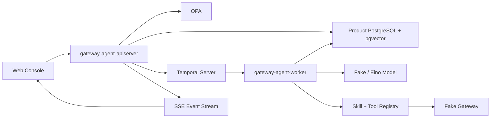
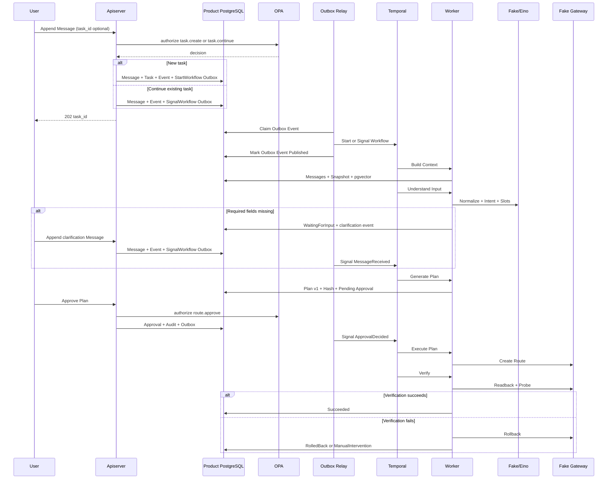
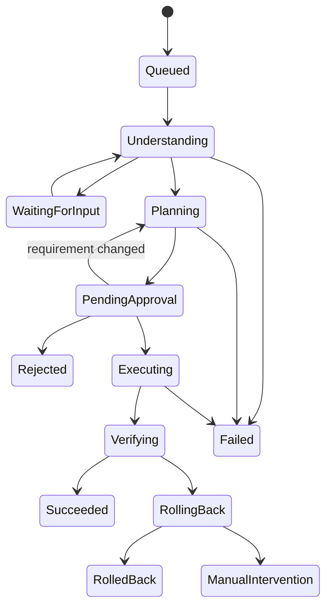
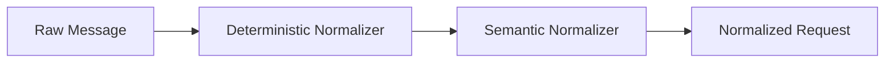

# 企业级 AI Gateway Agent 首个垂直切片设计 v0.2

> 历史文档：其中 PostgreSQL、pgvector 和 Slice 设计已被 `../02-网关智能体目标产品与架构设计.md` 替代。

> 状态：已确认，进入 Slice 1A 实施计划
> 初稿日期：2026-07-17
> 确认日期：2026-07-20
> 适用仓库：github.com/lgc202/gateway-agent
> 本文档替代旧的只读 Route Query Slice 1A 方向。

## 1. 设计结论

首个切片从用户真实使用 Agent 的主链出发：

```text
Conversation
→ Message
→ Task
→ Context Build
→ Input Normalization
→ Intent Recognition
→ Clarification
→ Plan
→ In-Conversation Approval
→ Fake Gateway Execution
→ Readback / Probe
→ Success / Rollback / Manual Intervention
```

第一版只支持一个写操作 Intent：

```text
CreateHTTPRoute
```

第一版执行目标是 Fake Gateway，不连接真实 Higress。模型不能绕过 Plan、OPA 和 Approval 直接执行写 Tool。

## 2. 目标与非目标

### 2.1 产品目标

- 用户在 Web 对话中提交自然语言需求；
- Agent 规整输入并识别 Intent；
- 关键字段缺失时继续追问；
- 信息完整后生成强类型 Plan；
- 用户在对话中审批 Plan；
- 审批后执行 Fake Gateway Tool；
- 完成配置回读和主动探测；
- 验证失败时自动回滚；
- 全流程通过 SSE 向前端反馈；
- 服务重启后仍能恢复等待审批和执行流程。

### 2.2 工程目标

- Go 1.24.x；
- Gin 只用于 apiserver；
- Wire 只用于各部署单元 Composition Root；
- PostgreSQL、pgx、sqlc 保存产品事实；
- pgvector 提供语义召回；
- Temporal 管理耐久工作流；
- Eino 承载模型、Retriever 和 Agent 运行适配；
- OPA/Rego 承载多维授权；
- OpenAPI 3.1 作为 HTTP 契约；
- OpenTelemetry、Prometheus 提供可观测性；
- 注释使用中文，代码标识符和协议使用英文；
- 参考 OneX 的启动链和工程入口；
- 参考 Ingate 的服务内 handler/service/store 分层。

### 2.3 非目标

第一版不包含：

- 真实 Higress 写操作；
- 多个 Gateway Adapter；
- 真实 MCP Server；
- Kafka、NATS、Redis、OpenSearch；
- 多租户；
- 任意模型生成并执行 Gateway 私有 JSON；
- 未经审批的写操作；
- 多个写操作 Intent。

## 3. 已确认的关键决策

| 主题 | 决策 |
|---|---|
| 产品入口 | Conversation-first Web 对话 |
| 对话模型 | Conversation → Message → Task → Plan → Approval |
| 首个 Intent | CreateHTTPRoute |
| 通信 | HTTP Command + SSE |
| 工作流 | Temporal |
| 产品存储 | PostgreSQL + JSONB + pgvector |
| Temporal 存储 | 独立 PostgreSQL |
| 模型 | local Fake；非本地 Eino + OpenAI-compatible Provider |
| 网关 | 第一版 Fake Gateway |
| 认证 | local Dev Auth；test/prod 强制 OIDC |
| 授权 | OPA/Rego |
| 审批 | 对话内审批；有权限的发起人允许自审 |
| 审批绑定 | Plan ID + Version + Content Hash |
| Replan | 新 Plan 使旧审批失效 |
| 验证 | Config Readback + Active Probe |
| 回滚 | 审批包含限定范围内自动回滚授权 |
| Context | Raw Message + Snapshot + pgvector Retrieval |
| Skills | 第一版实现 Built-in Skill Registry |
| Tools | 第一版实现 Native Tool Registry |
| MCP | 第一版只保留 Tool Provider 边界 |
| 目录 | apiserver、worker 各自拥有 handler/service/store |

## 4. 总体架构

采用模块化单体仓库，部署为两个进程。



### 4.1 apiserver

负责：

- HTTP Server 生命周期；
- OIDC / Dev Auth；
- OPA 授权；
- Conversation、Message、Approval 命令；
- Task、Plan、Execution 查询；
- SSE 事件续传；
- Transactional Outbox；
- Start 或 Signal Temporal Workflow。

不负责：

- 运行 Eino Agent；
- 执行 Gateway Tool；
- 在 Handler 内生成 Plan；
- 完成验证或回滚。

### 4.2 worker

负责：

- Temporal Worker 生命周期；
- Workflow 和 Activity Handler；
- Context Build；
- Fake/Eino 模型调用；
- Intent、Clarification、Plan；
- Skill、Tool 选择；
- Fake Gateway 执行；
- Readback、Probe、Rollback；
- Agent Run/Step；
- Task 和 Execution 状态更新。

### 4.3 PostgreSQL 与 Temporal

- Product PostgreSQL 是业务事实来源；
- Temporal History 是编排事实来源；
- Workflow 不直接访问数据库；
- Activity 通过 Worker Service 访问 Product PostgreSQL；
- 业务代码不读取 Temporal 数据库；
- 两套数据库使用独立凭据；
- Plan、Approval、Execution 不能只存在 Temporal Payload 中。

## 5. 目录结构

```text
.
├── cmd/
│   ├── gateway-agent-apiserver/
│   │   └── main.go
│   └── gateway-agent-worker/
│       └── main.go
│
├── internal/
│   ├── apiserver/
│   │   ├── app/
│   │   │   ├── app.go
│   │   │   ├── options.go
│   │   │   ├── config.go
│   │   │   ├── wire.go
│   │   │   └── wire_gen.go
│   │   ├── server/
│   │   │   ├── server.go
│   │   │   ├── router.go
│   │   │   └── middleware/
│   │   ├── handler/
│   │   │   ├── conversation/
│   │   │   ├── approval/
│   │   │   ├── task/
│   │   │   ├── eventstream/
│   │   │   └── health/
│   │   ├── service/
│   │   │   ├── conversation/
│   │   │   ├── approval/
│   │   │   ├── task/
│   │   │   ├── eventstream/
│   │   │   ├── idempotency/
│   │   │   └── outbox/
│   │   └── store/
│   │       ├── conversation.go
│   │       ├── approval.go
│   │       ├── task.go
│   │       ├── eventstream.go
│   │       ├── idempotency.go
│   │       ├── outbox.go
│   │       └── postgres/
│   │           └── sqlc/
│   │
│   ├── worker/
│   │   ├── app/
│   │   │   ├── app.go
│   │   │   ├── options.go
│   │   │   ├── config.go
│   │   │   ├── wire.go
│   │   │   └── wire_gen.go
│   │   ├── handler/
│   │   │   ├── workflow/
│   │   │   └── activity/
│   │   ├── service/
│   │   │   ├── task/
│   │   │   ├── context/
│   │   │   ├── retrieval/
│   │   │   ├── agent/
│   │   │   ├── skill/
│   │   │   ├── tool/
│   │   │   ├── plan/
│   │   │   ├── execution/
│   │   │   └── verification/
│   │   └── store/
│   │       ├── task.go
│   │       ├── context.go
│   │       ├── plan.go
│   │       ├── execution.go
│   │       ├── verification.go
│   │       └── postgres/
│   │           └── sqlc/
│   │
│   ├── agent/
│   │   ├── agent.go
│   │   ├── fake/
│   │   └── eino/
│   ├── gateway/
│   │   ├── gateway.go
│   │   └── fake/
│   ├── authz/
│   │   ├── evaluator.go
│   │   └── opa/
│   ├── audit/
│   └── pkg/
│       ├── errors/
│       ├── health/
│       ├── id/
│       ├── log/
│       ├── requestid/
│       └── transaction/
│
├── skills/
│   └── gateway/
│       └── create-http-route/
│           ├── skill.yaml
│           ├── SKILL.md
│           ├── input.schema.json
│           ├── plan.schema.json
│           └── prompts/
│
├── db/
│   ├── migrations/
│   ├── apiserver/queries/
│   ├── worker/queries/
│   └── sqlc.yaml
├── api/openapi/
├── deploy/
└── scripts/make-rules/
```

### 5.1 分层职责

- Handler：协议绑定、参数校验、调用 Service、结果转换；
- Service：业务用例、状态迁移、事务边界；
- Store Contract：部署单元需要的窄数据能力；
- PostgreSQL Store：pgx/sqlc 实现和类型转换；
- Agent：Fake/Eino 适配边界；
- Gateway：统一 Tool 与 Gateway Adapter 边界；
- Authz：OPA 输入、决策和审计边界。

### 5.2 禁止的依赖

- apiserver 不导入 worker service/store；
- worker 不导入 apiserver service/store；
- Handler 不导入 sqlc；
- Service 不导入 Gin；
- Workflow 不导入 pgx/sqlc；
- Eino 类型不进入 Plan、Task、HTTP 或 Store；
- Gateway SDK 类型不进入 Plan、HTTP 或 Agent；
- internal/pkg 不保存产品业务模型；
- 不创建全局巨大 Store 或 Service Locator。

## 6. Conversation、Message 与 Task

Conversation 是持续对话空间。一个 Conversation 可以先后产生多个 Task。

```text
Conversation
├── Message
├── Task
├── Plan 展示
├── Approval 卡片
├── Execution 进度
└── Context Snapshot
```

Message 是不可变的单条消息。Task 是一次具体工作。Plan 是 Task 的版本化执行方案。

## 7. 第一条业务流程



## 8. Task 状态机



最终状态：

- Succeeded；
- RolledBack；
- ManualIntervention；
- Rejected；
- Failed；
- Canceled。

## 9. 核心智能能力

### 9.1 输入规范化

分为确定性规范化和语义规范化。



确定性处理：

- 空白与 Unicode 规整；
- Host 小写化；
- Path 格式化；
- 环境别名映射；
- 端口、权重和时间单位转换；
- 保留原始 Message。

语义处理：

- 指代消解；
- 业务同义词映射；
- 省略信息理解；
- Slot 提取；
- 记录字段来源 Message ID。

### 9.2 意图识别

第一版 Intent Registry 只注册 CreateHTTPRoute。

结构化输出：

```json
{
  "intent": "CreateHTTPRoute",
  "confidence": 0.96,
  "slots": {},
  "missingFields": [],
  "evidenceMessageIds": []
}
```

规则：

- 置信度不足时追问；
- 多个意图冲突时追问；
- 未注册意图返回 UnsupportedIntent；
- 模型不能自行发明 Intent；
- Intent 结果写 Agent Step。

### 9.3 关键字段与追问

CreateHTTPRoute 必需字段：

```text
environment
gateway_id
namespace
host
path
backend_service
backend_port
```

关键资源字段缺失时必须追问。低风险默认值可以使用，但必须写入 Plan Assumptions，例如单 Backend 权重默认 100。

用户回复追问时，Message 必须显式携带原 `task_id`。第一版不依赖“猜测当前活跃任务”来续接流程，避免一个 Conversation 中存在多个 Task 时把消息投递给错误的 Workflow。

### 9.4 智能检索


检索来源：

- Conversation 历史；
- Context Snapshot；
- 长期 Memory；
- 企业知识库；
- Gateway 实时状态；
- 后续 Prometheus 指标。

模型不能生成 SQL，只能产生强类型 Retrieval Request。

### 9.5 Context 管理

Context Builder 组合：

```text
System Policy
Skill Instructions
Current Task
Current Plan / Approval
Context Snapshot
Relevant Historical Messages
Recent Messages
Realtime Gateway Observation
Current User Message
```

规则：

- Raw Message 是事实来源；
- Snapshot 是压缩和索引；
- pgvector 负责定位；
- 检索后回读原始 Message；
- Plan、Approval、Permission、Execution 使用精确查询；
- 当前 Gateway 状态实时读取；
- 每部分有 Token Budget。

### 9.6 Plan 与 Replan

Plan 是强类型对象：

```text
Plan
├── id
├── task_id
├── version
├── intent
├── target
├── desired_change
├── steps
├── verification
├── rollback
├── risk
├── assumptions
└── content_hash
```

规则：

- 模型只产生 Draft；
- Skill Schema 和确定性代码完成最终校验；
- Plan Hash 只覆盖执行内容；
- 新 Plan 使旧 Approval 失效；
- 展示文案变化不导致 Replan；
- Execution 只接受批准的 ID、Version、Hash。

### 9.7 ReAct / TAO

ReAct 只运行在 Eino Activity 内部。

```text
Private Thought
→ Read-only Action
→ Observation
→ Decision Summary
```

持久化 Decision Summary、Action 和 Observation，不持久化原始 Chain-of-Thought。

约束：

- 最大步骤数；
- 最大 Token；
- 最大 Tool 调用次数；
- 只允许授权的 Read-only Tool；
- Write Tool 只能进入 Plan；
- 审批后按固定 Plan 执行；
- 模型不能临时增加写步骤。

## 10. Skills、Tools 与 MCP

### 10.1 Skill

第一版实现 gateway.create-http-route Built-in Skill。

Skill 包含：

- Intent；
- Input Schema；
- Plan Schema；
- Required Tools；
- Required Permissions；
- Verification；
- Rollback；
- Prompt Version。

Task 和 Agent Run 保存 Skill Name、Version。

### 10.2 Tool

第一版 Native Tools：

```text
gateway.get_capabilities
gateway.get_route
gateway.create_route
gateway.readback_route
gateway.delete_route
http.probe
memory.search
```

写 Tool 只能由 Execution Service 在审批后执行。

### 10.3 MCP

第一版只定义 Tool Provider 边界。不得创建没有调用方的 MCP Client 或 Transport 实现。

未来 MCP Tool 仍必须经过：

- Tool Allowlist；
- OPA；
- Plan；
- Approval；
- Schema；
- Audit；
- Timeout；
- Output Limit。

## 11. HTTP API

```text
POST /api/v1/conversations
GET  /api/v1/conversations/{conversation_id}

POST /api/v1/conversations/{conversation_id}/messages
GET  /api/v1/conversations/{conversation_id}/events

GET  /api/v1/tasks/{task_id}
GET  /api/v1/tasks/{task_id}/plans
GET  /api/v1/tasks/{task_id}/plans/{version}

POST /api/v1/approvals/{approval_id}/decisions
POST /api/v1/tasks/{task_id}/cancel

GET  /healthz
GET  /readyz
```

追加 Message 的命令语义：

- 不传 `task_id`：创建新 Task，并通过 Outbox 启动 Workflow；
- 传入 `task_id`：继续该 Conversation 中的既有 Task，并通过 Outbox 发送 Message Signal；
- 只有允许接收输入的非最终状态可以继续，其他状态返回 HTTP 409；
- `task_id` 不属于当前 Conversation 时返回 HTTP 404，避免泄露其他 Conversation 的资源存在性。

所有写命令要求：

- 身份认证；
- Idempotency-Key；
- X-Request-ID；
- 严格 JSON；
- 请求体限制；
- 稳定错误码。

错误采用 application/problem+json。

SSE 使用 Product PostgreSQL 的 Event Offset 作为 Last-Event-ID，审批命令不走 SSE。

## 12. 数据模型

数据模型使用常见关系表和 JSONB，不把模型输出的每个字段展开成数据库列。

### 12.1 conversations

```text
id
title
created_by
created_at
updated_at
```

### 12.2 messages

```text
id
conversation_id
task_id NULL
sequence
role
content
metadata JSONB
created_at
```

约束：UNIQUE(conversation_id, sequence)。

新任务的首条 Message 同时被 `tasks.trigger_message_id` 引用；追问回复通过 `messages.task_id` 关联既有 Task。

### 12.3 tasks

```text
id
conversation_id
trigger_message_id
workflow_id
intent
status
created_by
error_code
error_message
created_at
updated_at
```

### 12.4 plans

```text
id
task_id
version
status
spec JSONB
content_hash
created_at
```

约束：UNIQUE(task_id, version)。

### 12.5 approvals

```text
id
task_id
plan_id
plan_version
plan_hash
status
requested_by
decided_by
comment
created_at
decided_at
updated_at
version
```

审批通过使用 status、plan_hash、version 条件更新，防止并发覆盖。

### 12.6 executions

```text
id
task_id
plan_id
status
result JSONB
error JSONB
started_at
finished_at
created_at
```

### 12.7 execution_steps

```text
id
execution_id
sequence
name
status
input JSONB
output JSONB
started_at
finished_at
```

Readback、Probe 和 Rollback 分别写入独立 Execution Step。其 `input`、`output` 必须通过 Tool Schema 校验，作为验证与回滚证据保存，不另建含义重复的 Evidence 表。

### 12.8 context_snapshots

```text
id
conversation_id
task_id
through_message_sequence
summary
metadata JSONB
embedding VECTOR
created_at
```

### 12.9 memory_items

```text
id
conversation_id
content
metadata JSONB
embedding VECTOR
source_message_id
created_at
```

### 12.10 conversation_events

```text
id BIGINT IDENTITY
conversation_id
task_id
type
data JSONB
created_at
```

### 12.11 agent_runs

```text
id
task_id
status
provider
model
prompt_version
skill_name
skill_version
started_at
finished_at
usage JSONB
error JSONB
```

### 12.12 agent_steps

```text
id
agent_run_id
sequence
type
status
input JSONB
output JSONB
started_at
finished_at
```

Agent Step 保存 Decision Summary、Tool Call、Tool Result，不保存原始 Chain-of-Thought。

### 12.13 audit_logs

```text
id
actor_id
action
resource_type
resource_id
result
detail JSONB
created_at
```

### 12.14 outbox_events

```text
id
topic
event_key
payload JSONB
status
attempts
available_at
last_error
created_at
published_at
```

约束：UNIQUE(topic, event_key)。

### 12.15 idempotency_keys

```text
id
subject_id
operation
idempotency_key
request_hash
response_status
response_body JSONB
resource_type
resource_id
expires_at
created_at
```

约束：UNIQUE(subject_id, operation, idempotency_key)。同一 Key 和相同请求返回已保存结果；同一 Key 对应不同请求返回 HTTP 409。

## 13. 事务边界

### 13.1 Append Message

创建新 Task 时，同一事务写入：

```text
Message
Task
Conversation Event
Audit Log
Outbox StartWorkflow
```

继续既有 Task 时，同一事务写入：

```text
Message(task_id)
Conversation Event
Audit Log
Outbox SignalWorkflow
```

Idempotency Record 与业务数据在同一事务中写入，重试请求不得重复创建 Message、Task 或 Outbox Event。

### 13.2 Approval Decision

同一事务：

```text
Approval
Conversation Event
Audit Log
Outbox SignalWorkflow
```

### 13.3 Plan 与 Approval Request

生成或 Replan 时，同一事务写入：

```text
Plan
旧 Approval 失效
新 Pending Approval
Task Status
Conversation Event
Audit Log
```

### 13.4 Outbox Relay

- Outbox Relay 运行在 apiserver 进程内，但拥有独立 Service 和 Store；
- 使用 PostgreSQL 行锁安全认领待发布事件；
- Temporal Workflow ID 和 Signal ID 使用稳定业务幂等键；
- 发布成功后更新 `published_at`，临时失败按退避时间更新 `available_at`；
- 临时失败回到 `pending`，永久 Payload 错误进入终态 `failed`；
- Relay 重启后继续处理未发布事件，不依赖 HTTP 请求存活。

### 13.5 Store 边界

- apiserver 和 worker 使用独立 sqlc Query Set；
- sqlc 类型不跨部署单元；
- 第一版连接同一个 Product PostgreSQL；
- Service 不访问另一部署单元 Store 包；
- Workflow 不直接访问 Store。

## 14. 认证和授权

### 14.1 AuthN

- local 使用 Dev Auth；
- test/prod 强制 OIDC；
- 非 local 开启 Dev Auth 时启动失败；
- Subject 写入 Message、Task、Approval 和 Audit。

### 14.2 OPA

授权输入包含：

- Subject；
- Action；
- Environment；
- Gateway ID；
- Namespace。

写操作在发起和批准时分别授权。每次决策保存 OPA Decision ID。

### 14.3 审批

- 允许有权限的发起人自审；
- Approval 绑定 Plan ID、Version、Hash；
- Replan 后旧 Approval 失效；
- 原审批包含限定范围内自动回滚授权。

## 15. Temporal 设计

Workflow 负责：

- 流程状态；
- 等待 Message Signal；
- 等待 Approval Signal；
- Retry、Timeout、Compensation；
- 选择下一 Activity。

Activity 负责：

- 读取业务事实；
- 调用模型；
- 调用 Tool；
- 写状态、Event、Audit；
- Gateway 执行、验证和回滚。

约束：

- Activity 必须幂等；
- Workflow Payload 只传 ID 和小型稳定结构；
- Execution 使用稳定幂等键；
- 业务错误不无限重试；
- Rollback 失败转 ManualIntervention。

## 16. 错误与结果

| 场景 | 行为 |
|---|---|
| 输入缺失 | WaitingForInput |
| 请求非法 | HTTP 400 |
| 未认证 | HTTP 401 |
| OPA 拒绝 | HTTP 403 + Audit |
| Plan 失效 | HTTP 409 STALE_PLAN |
| 模型临时错误 | 有限重试 |
| 模型输出持续非法 | Task Failed |
| Gateway 临时错误 | 指数退避 |
| Gateway 业务错误 | 不重试 |
| 验证失败 | RollingBack |
| 回滚失败 | ManualIntervention |

错误使用 errors.Is/As 分类，禁止依赖字符串判断。

## 17. 可观测性与决策轨迹

数据库保存业务轨迹：

- Agent Run；
- Agent Step；
- Task Event；
- Approval；
- Execution Step；
- Execution Step 中的 Verification Evidence；
- Audit Log。

OpenTelemetry 保存技术链路：

- HTTP Span；
- Temporal Workflow Span；
- Activity Span；
- Model Call Span；
- Tool Call Span；
- Database Span。

统一关联：

```text
request_id
trace_id
conversation_id
task_id
agent_run_id
execution_id
```

日志不记录完整 Prompt、Authorization、Cookie、Secret 和敏感配置。

## 18. 实施切片

### Slice 1A：Conversation 与可靠 Task 入口

- apiserver / worker 生命周期；
- PostgreSQL、Migration、sqlc；
- Conversation、Message、Task；
- SSE；
- Outbox；
- Temporal Workflow 启动；
- local Dev Auth 和 OIDC 边界。

验收：提交 Message 后返回 Task，并从 SSE 看到 Workflow 状态。

### Slice 1B：Context、Agent 与 Plan

- Context Snapshot；
- pgvector；
- Context Builder；
- Retrieval；
- Fake/Eino 双模式；
- Input Normalization；
- Intent、Slot、Clarification；
- Skill/Tool Registry；
- Plan Version/Hash；
- Agent Run/Step。

验收：自然语言经过追问后生成 Plan。

### Slice 1C：OPA、Approval 与 Fake Execution

- OPA；
- Approval；
- Temporal Signal；
- Native Fake Gateway Tools；
- Readback；
- Active Probe；
- Rollback；
- Audit。

验收：批准后完成 Succeeded、RolledBack 或 ManualIntervention 闭环。

## 19. 质量门禁

按当前约定，第一阶段不专门编写测试文件，但每个 Slice 必须完成：

```text
go fmt
go vet
Wire generation drift check
sqlc generation drift check
OpenAPI validation
Migration validation
apiserver build
worker build
Docker Compose startup
real HTTP + SSE + Temporal demonstration
```

接入真实 Higress 前必须补齐 Plan、Approval、Execution 状态机、并发审批、Activity 幂等和回滚测试。

## 20. 编码规则

- 代码直接、可读；
- 只在真实边界定义接口；
- 不创建没有调用方的预留实现；
- Handler 不写业务逻辑；
- Service 不依赖传输和生成类型；
- Store 不承载产品用例；
- 注释使用中文并解释约束和原因；
- 代码、协议、错误码使用英文；
- 一个文件一个主要职责；
- 一个提交只完成一类变化；
- 生成代码提交仓库；
- 禁止日志记录敏感原文。

## 21. 下一步

本设计最终审阅后，只为 Slice 1A 编写新的文件级实施计划。旧 Route Query 实现和旧 Slice 1A 计划不得继续使用。
