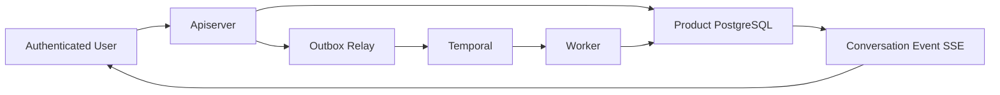

# Slice 1A Conversation 与可靠 Task 入口实施计划 v0.2

> 历史实施计划：不得继续执行。新的实施计划必须以 `../02-网关智能体目标产品与架构设计.md` 为基线。

> **For agentic workers:** REQUIRED SUB-SKILL: Use `superpowers:executing-plans` to implement this plan task-by-task. Do not dispatch subagents unless the user explicitly authorizes delegation. Steps use checkbox (`- [ ]`) syntax for tracking.

**Goal:** 从空仓库建立可运行的 `gateway-agent-apiserver` 和 `gateway-agent-worker`，完成 Conversation、Message、Task、PostgreSQL、Transactional Outbox、Temporal Workflow 与 SSE 的第一条可靠业务链。

**Architecture:** 采用两个部署单元的模块化单体仓库。apiserver 负责 HTTP、认证、业务命令、查询、SSE 和 Outbox Relay；worker 负责 Temporal Workflow、Activity 和 Task 状态推进。Product PostgreSQL 保存业务事实，Temporal 使用独立 PostgreSQL；HTTP 请求不直接调用 Temporal，所有 Start/Signal 都经过事务性 Outbox。

**Tech Stack:** Go 1.24.x、Gin、Google Wire、PostgreSQL 16、pgx/v5、sqlc、Temporal Go SDK、OpenAPI 3.1、OIDC、OpenTelemetry、Prometheus、Docker Compose、Make。

---

## 0. 执行约束

本计划依据：

- [历史首个垂直切片设计 v0.2](./91-历史-首个垂直切片设计-v0.2.md)；
- `/Users/guangcaili/workplace/code/onex` 的启动链、Wire 和 Makefile 组织；
- `/Users/guangcaili/workplace/code/lgc202/ingate/AGENTS.md` 的直接代码、边界校验和服务内分层规范；
- `/Users/guangcaili/workplace/code/lgc202/ingate` 的 `handler/service/store` 组织方式。

必须遵守：

- 正式仓库是 `/Users/guangcaili/workplace/code/lgc202/gateway-agent`；
- 按用户最新指令直接在正式仓库 `main` 分支开发，不创建新分支或 worktree；
- 不复用、不合并旧 Route Query 实验工作树和旧 `feat/slice-1a-foundation` 实现；
- 不修改 OneX 和 Ingate；
- Go 版本固定为 1.24.x，因此 Gin 使用 1.11.x、pgx 使用 5.7.x，不引入要求 Go 1.25 的版本；
- 注释使用中文，代码标识符、JSON 字段、事件类型和错误码使用英文；
- 第一阶段不创建 `*_test.go`，不为了测试定义生产接口；
- 每个任务完成后执行对应构建或真实接口验证；
- 不自动提交 Git commit，除非用户明确授权；
- 不引入 gRPC，因此不引入 Buf；
- Slice 1A 不引入 Eino、pgvector 表、OPA、Skills、Tools、MCP、Plan、Approval 和 Fake Gateway；
- 不创建只有“未来可能会用”的空目录或空实现。

## 1. Slice 1A 交付边界

### 1.1 本 Slice 完成的链路



真实验收流程：

```text
Create Conversation
→ Append Message
→ Persist Message + Task + Event + Audit + Outbox in one transaction
→ Relay starts Temporal Workflow
→ Worker moves Task from Queued to Understanding
→ SSE observes task.queued and task.understanding
→ Append follow-up Message with task_id
→ Relay signals the existing Workflow
→ Cancel Task
→ Worker moves Task to Canceled
```

### 1.2 Slice 结束时允许的 Task 状态

- `queued`：Message 事务已经创建 Task，Workflow 尚未开始处理；
- `understanding`：Workflow 已启动，等待 Slice 1B 接入 Context 和 Agent；
- `canceled`：用户取消，Workflow 已完成取消；
- `failed`：Workflow 或 Activity 遇到不可恢复错误。

其他状态在共享 `task.Status` 中提前定义，因为它们已经是 v0.2 状态机的一部分，但本 Slice 不产生这些状态。

### 1.3 Slice 结束时不做的事情

- 不调用模型；
- 不识别 Intent；
- 不生成 Clarification 或 Plan；
- 不创建 Approval；
- 不执行网关变更；
- 不做向量检索；
- 不接真实 Higress；
- 不做前端页面；
- 不实现通用 MCP Client；
- 不加入 Redis、Kafka、NATS 或 Elasticsearch。

## 2. 最终文件地图

计划只创建下列文件。实施过程中如确需增加文件，必须先说明它解决的真实职责。

```text
.
├── .github/
│   └── workflows/
│       └── ci.yml
├── .gitignore
├── Makefile
├── README.md
├── go.mod
├── go.sum
│
├── api/
│   └── openapi/
│       └── gateway-agent.v1.yaml
│
├── cmd/
│   ├── gateway-agent-apiserver/
│   │   └── main.go
│   └── gateway-agent-worker/
│       └── main.go
│
├── db/
│   ├── migrations/
│   │   ├── 000001_create_conversation_task_tables.up.sql
│   │   ├── 000001_create_conversation_task_tables.down.sql
│   │   ├── 000002_create_audit_logs_table.up.sql
│   │   ├── 000002_create_audit_logs_table.down.sql
│   │   ├── 000003_create_idempotency_keys_table.up.sql
│   │   ├── 000003_create_idempotency_keys_table.down.sql
│   │   ├── 000004_create_outbox_events_table.up.sql
│   │   └── 000004_create_outbox_events_table.down.sql
│   ├── apiserver/
│   │   └── queries/
│   │       ├── conversation.sql
│   │       ├── message.sql
│   │       ├── task.sql
│   │       ├── event.sql
│   │       ├── audit.sql
│   │       ├── idempotency.sql
│   │       └── outbox.sql
│   ├── worker/
│   │   └── queries/
│   │       ├── task.sql
│   │       ├── event.sql
│   │       └── audit.sql
│   └── sqlc.yaml
│
├── internal/
│   ├── task/
│   │   ├── status.go
│   │   └── event.go
│   ├── workflow/
│   │   └── task.go
│   │
│   ├── apiserver/
│   │   ├── app/
│   │   │   ├── app.go
│   │   │   ├── options.go
│   │   │   ├── config.go
│   │   │   ├── wire.go
│   │   │   └── wire_gen.go
│   │   ├── server/
│   │   │   ├── server.go
│   │   │   ├── router.go
│   │   │   ├── response/
│   │   │   │   └── problem.go
│   │   │   └── middleware/
│   │   │       ├── request_id.go
│   │   │       ├── recovery.go
│   │   │       ├── access_log.go
│   │   │       ├── authn.go
│   │   │       ├── authn_dev.go
│   │   │       └── authn_oidc.go
│   │   ├── handler/
│   │   │   ├── handler.go
│   │   │   ├── health/
│   │   │   │   └── handler.go
│   │   │   ├── conversation/
│   │   │   │   ├── handler.go
│   │   │   │   └── types.go
│   │   │   ├── task/
│   │   │   │   ├── handler.go
│   │   │   │   └── types.go
│   │   │   └── eventstream/
│   │   │       └── handler.go
│   │   ├── service/
│   │   │   ├── service.go
│   │   │   ├── conversation/
│   │   │   │   ├── service.go
│   │   │   │   └── types.go
│   │   │   ├── task/
│   │   │   │   ├── service.go
│   │   │   │   └── types.go
│   │   │   ├── eventstream/
│   │   │   │   ├── service.go
│   │   │   │   └── notifier.go
│   │   │   ├── idempotency/
│   │   │   │   └── request.go
│   │   │   └── outbox/
│   │   │       ├── relay.go
│   │   │       └── publisher.go
│   │   └── store/
│   │       ├── conversation.go
│   │       ├── task.go
│   │       ├── eventstream.go
│   │       ├── idempotency.go
│   │       ├── outbox.go
│   │       └── postgres/
│   │           ├── store.go
│   │           ├── provider.go
│   │           ├── conversation.go
│   │           ├── task.go
│   │           ├── eventstream.go
│   │           ├── outbox.go
│   │           ├── notifier.go
│   │           └── sqlc/
│   │               └── generated files
│   │
│   ├── worker/
│   │   ├── app/
│   │   │   ├── app.go
│   │   │   ├── options.go
│   │   │   ├── config.go
│   │   │   ├── health.go
│   │   │   ├── wire.go
│   │   │   └── wire_gen.go
│   │   ├── handler/
│   │   │   ├── workflow/
│   │   │   │   └── task.go
│   │   │   └── activity/
│   │   │       └── task.go
│   │   ├── service/
│   │   │   └── task/
│   │   │       └── service.go
│   │   └── store/
│   │       ├── task.go
│   │       └── postgres/
│   │           ├── store.go
│   │           ├── provider.go
│   │           ├── task.go
│   │           └── sqlc/
│   │               └── generated files
│   │
│   └── pkg/
│       ├── apperror/
│       │   └── error.go
│       ├── log/
│       │   └── log.go
│       ├── requestctx/
│       │   └── context.go
│       └── telemetry/
│           └── telemetry.go
│
├── deploy/
│   ├── Dockerfile
│   └── docker-compose.yaml
│
├── scripts/
│   ├── demo-slice-1a.sh
│   └── make-rules/
│       ├── common.mk
│       ├── golang.mk
│       ├── generate.mk
│       ├── verify.mk
│       └── docker.mk
```

`internal/task` 和 `internal/workflow` 是仅有的两个共享产品契约包：前者统一 Task 状态与事件，后者统一 Temporal 名称和 Payload。它们不是通用 domain 层，不放 Service、Store、数据库模型或框架类型。

## 3. 关键契约

### 3.1 HTTP 契约

| Method | Path | Slice 1A 行为 |
|---|---|---|
| POST | `/api/v1/conversations` | 创建 Conversation |
| GET | `/api/v1/conversations/{conversation_id}` | 查询 Conversation |
| POST | `/api/v1/conversations/{conversation_id}/messages` | 创建新 Task 或继续既有 Task |
| GET | `/api/v1/conversations/{conversation_id}/events` | SSE 回放与实时事件 |
| GET | `/api/v1/tasks/{task_id}` | 查询 Task |
| POST | `/api/v1/tasks/{task_id}/cancel` | 请求取消 Task |
| GET | `/healthz` | 进程存活，不访问外部依赖 |
| GET | `/readyz` | 检查 Product PostgreSQL 和 Temporal |
| GET | `/metrics` | Prometheus 指标 |

所有 POST：

- 必须有 `Idempotency-Key`；
- 必须有 `X-Request-ID`；
- 请求体最大 1 MiB；
- JSON 禁止未知字段；
- 业务错误返回 `application/problem+json`；
- 同一 Idempotency Key、同一请求返回之前保存的响应；
- 同一 Idempotency Key、不同请求返回 HTTP 409 和 `IDEMPOTENCY_KEY_REUSED`。

### 3.2 Task Workflow 契约

`internal/workflow/task.go` 只保存跨部署单元必须共享的稳定结构：

```go
const (
    TaskWorkflowName = "gateway-agent.task"
    TaskQueueName     = "gateway-agent.task"
    MessageSignalName = "message.received"
    CancelSignalName  = "task.cancel_requested"
)

type StartTaskInput struct {
    TaskID string
}

type MessageSignal struct {
    EventKey string
    TaskID   string
    MessageID string
}

type CancelSignal struct {
    EventKey string
    TaskID   string
}
```

要求：

- Workflow Payload 只传 ID 和小型稳定结构；
- Signal 使用 `EventKey` 去重；
- Workflow 不导入 pgx、sqlc、Gin；
- Workflow 不直接读写 PostgreSQL；
- Activity 名称使用稳定常量；
- Workflow ID 固定为 `gateway-agent-task/{task_id}`。

### 3.3 事件类型

`internal/task/event.go` 第一阶段定义：

```text
conversation.created
message.appended
task.queued
task.understanding
task.message_received
task.cancel_requested
task.canceled
task.failed
```

事件名进入数据库和 SSE 协议后不得随意重命名。

## 4. 实施任务

### Task 1：确认 main 实施基线

> 状态：已完成（2026-07-20）

**Files:**

- Inspect: `/Users/guangcaili/workplace/code/lgc202/gateway-agent`
- Do not modify: `/Users/guangcaili/Documents/Codex/2026-07-15/zhi-d/gateway-agent-slice-1a`

- [ ] 确认正式仓库当前分支为 `main`，开始实施前只有 README，工作区没有用户已有改动。
- [ ] 全程直接在 `main` 开发，不创建或切换新分支，不创建新的 worktree。
- [ ] 不得复用旧实验工作树；旧 worktree 的文件变化不能复制或合并到正式仓库。
- [ ] 记录基线 commit `99ac422`；如果正式仓库已前进，以执行时的 `origin/main` 为准并重新检查差异。
- [ ] 不删除旧分支或旧 worktree；清理由用户另行授权。

**Verify:**

```bash
git status --short --branch
git log -1 --oneline
```

Expected：

- 当前分支为 `main`；
- 工作区干净；
- 没有 Route Query 文件。

### Task 2：建立 Go Module、Makefile 和工具约束

> 状态：已完成（2026-07-20）

**Files:**

- Create: `go.mod`
- Create: `go.sum`
- Create: `.gitignore`
- Create: `Makefile`
- Create: `scripts/make-rules/common.mk`
- Create: `scripts/make-rules/golang.mk`
- Create: `scripts/make-rules/generate.mk`
- Create: `scripts/make-rules/verify.mk`
- Create: `scripts/make-rules/docker.mk`
- Modify: `README.md`

- [ ] 初始化 module `github.com/lgc202/gateway-agent`，`go.mod` 使用 `go 1.24.0`。
- [ ] 运行时依赖在首次被生产代码或生成代码导入时锁定，不提前把后续 Slice 依赖写入 `go.mod`；版本必须兼容 Go 1.24 且不使用 `latest`：
  - Gin 1.11.x；
  - pgx 5.7.x；
  - Wire 0.7.x；
  - go-oidc 3.14.x；
  - Temporal Go SDK 选择声明支持 Go 1.24 的稳定版本；
  - sqlc、golang-migrate、OpenTelemetry、Prometheus 同样固定版本。
- [ ] Wire、sqlc、migrate 的版本固定在 `scripts/make-rules/generate.mk`，安装到 `_output/tools`，不得写入业务 `go.mod`。
- [ ] 业务 `go.mod` 只保留生产代码或生成代码实际导入的运行时依赖，避免 CLI 工具依赖污染服务依赖图。
- [ ] Makefile 只做目标编排，具体规则放 `scripts/make-rules`。
- [ ] 提供以下目标：

```text
make help
make tools
make fmt
make vet
make generate
make verify-generated
make verify-openapi
make verify-migrations
make verify
make build
make docker-up
make docker-down
make migrate-up
make migrate-down
make demo-slice-1a
```

- [ ] `make build` 同时构建 apiserver 和 worker 到 `_output/bin`。
- [ ] `.gitignore` 忽略 `_output/`、本地环境文件、IDE 文件和 Go 缓存，不忽略生成的 Wire/sqlc 文件。
- [ ] README 先写项目定位、两个二进制、依赖和开发命令，禁止继续描述 Route Query。

**Verify:**

```bash
go version
go mod tidy
make help
```

Expected：

- Go 为 1.24.x；
- Makefile 可正确列出目标；
- `go.mod` 中没有要求 Go 1.25 的直接依赖。

### Task 3：定义共享 Task 状态、事件和 Workflow 协议

> 状态：已完成（2026-07-20）

**Files:**

- Create: `internal/task/status.go`
- Create: `internal/task/event.go`
- Create: `internal/workflow/task.go`
- Create: `internal/pkg/apperror/error.go`
- Create: `internal/pkg/requestctx/context.go`

- [ ] 在 `task.Status` 中定义 v0.2 完整状态集合。
- [ ] 只为真实使用的方法实现 `IsFinal()` 和 `CanAcceptMessage()`，不写 Getter。
- [ ] `CanAcceptMessage()` 第一阶段允许 `understanding`、`waiting_for_input`、`planning`、`pending_approval`。
- [ ] 定义稳定事件类型，不散落字符串。
- [ ] 定义 Workflow、Activity、Signal 名称和 Payload。
- [ ] `apperror.Error` 只承载稳定 `Code`、安全 `Message` 和内部 `Cause`；HTTP 状态映射留在 apiserver response 层。
- [ ] 第一阶段错误码至少包含：

```text
INVALID_REQUEST
UNAUTHENTICATED
NOT_FOUND
CONFLICT
TASK_NOT_ACCEPTING_INPUT
TASK_ALREADY_FINAL
IDEMPOTENCY_KEY_REUSED
DEPENDENCY_UNAVAILABLE
INTERNAL_ERROR
```

- [ ] `requestctx` 保存 request ID 和 authenticated subject，不保存 Gin Context。

**Verify:**

```bash
gofmt -w internal/task internal/workflow internal/pkg/apperror internal/pkg/requestctx
go test ./internal/task ./internal/workflow ./internal/pkg/apperror ./internal/pkg/requestctx
```

Expected：包可编译。虽然没有测试文件，`go test` 仍作为包级编译验证。

### Task 4：创建 Slice 1A PostgreSQL Schema

> 状态：已完成（2026-07-20，四组 Migration up/down/up 与数据库注释已验证）

**Files:**

- Create: `db/migrations/000001_create_conversation_task_tables.up.sql`
- Create: `db/migrations/000001_create_conversation_task_tables.down.sql`
- Create: `db/migrations/000002_create_audit_logs_table.up.sql`
- Create: `db/migrations/000002_create_audit_logs_table.down.sql`
- Create: `db/migrations/000003_create_idempotency_keys_table.up.sql`
- Create: `db/migrations/000003_create_idempotency_keys_table.down.sql`
- Create: `db/migrations/000004_create_outbox_events_table.up.sql`
- Create: `db/migrations/000004_create_outbox_events_table.down.sql`

- [ ] 建立以下表：

```text
conversations
messages
tasks
conversation_events
audit_logs
outbox_events
idempotency_keys
```

- [ ] Migration 按稳定职责拆分，不在永久文件名中使用 Slice、阶段或“core”这类含糊词：
  - Conversation、Message、Task、Conversation Event 因外键和业务链紧密放在 000001；
  - Audit、Idempotency、Outbox 各自使用独立 Migration。

- [ ] 使用 UUID 业务主键；UUID 在 Go 中生成，不依赖数据库扩展。
- [ ] 时间统一使用 `TIMESTAMPTZ` 和 UTC。
- [ ] JSON 字段统一 `JSONB NOT NULL DEFAULT '{}'::jsonb`。
- [ ] 每张业务表和每个字段都使用 PostgreSQL `COMMENT ON TABLE/COLUMN` 写入中文说明，确保数据库工具可直接查看语义。
- [ ] `conversation_events.id` 使用 `BIGINT GENERATED ALWAYS AS IDENTITY`，作为 SSE offset。
- [ ] `messages.sequence` 在单个 Conversation 内唯一。
- [ ] `tasks.workflow_id` 唯一。
- [ ] `outbox_events(topic, event_key)` 唯一。
- [ ] `idempotency_keys(subject_id, operation, idempotency_key)` 唯一。
- [ ] Task status CHECK 使用 v0.2 完整状态集合。
- [ ] Message role CHECK 使用 `user`、`assistant`、`system`、`tool`。
- [ ] Outbox status CHECK 使用 `pending`、`processing`、`published`、`failed`。
- [ ] `outbox_events.last_error` 使用可空 TEXT，只保存安全错误摘要。
- [ ] 创建索引：

```sql
messages(conversation_id, sequence)
tasks(conversation_id, created_at DESC)
conversation_events(conversation_id, id)
outbox_events(status, available_at) WHERE published_at IS NULL
idempotency_keys(expires_at)
```

- [ ] 处理 Message 与 Task 的双向关系：
  1. 先创建 `messages.task_id`，暂不加 FK；
  2. 创建 `tasks.trigger_message_id -> messages.id`；
  3. 再添加 `messages.task_id -> tasks.id`；
  4. 新任务事务先插 Message，再插 Task，最后回填 Message.task_id。
- [ ] Down migration 按外键依赖反向删除，不能使用模糊的 `DROP ... CASCADE`。
- [ ] Migration 不创建 pgvector extension；留到 Slice 1B。

**Verify:**

```bash
make docker-up
make migrate-up
make migrate-down
make migrate-up
```

Expected：up、down、再次 up 均成功。

### Task 5：建立 sqlc 双 Query Set

> 状态：已完成（2026-07-20）

**Files:**

- Create: `db/sqlc.yaml`
- Create: `db/apiserver/queries/conversation.sql`
- Create: `db/apiserver/queries/message.sql`
- Create: `db/apiserver/queries/task.sql`
- Create: `db/apiserver/queries/event.sql`
- Create: `db/apiserver/queries/audit.sql`
- Create: `db/apiserver/queries/idempotency.sql`
- Create: `db/apiserver/queries/outbox.sql`
- Create: `db/worker/queries/task.sql`
- Create: `db/worker/queries/event.sql`
- Create: `db/worker/queries/audit.sql`
- Generate: `internal/apiserver/store/postgres/sqlc/*`
- Generate: `internal/worker/store/postgres/sqlc/*`

- [ ] sqlc engine 使用 PostgreSQL，Go SQL package 使用 `pgx/v5`。
- [ ] apiserver 和 worker 生成到不同包，不共享生成类型。
- [ ] Query 名称使用业务动作，不使用 `Query1` 或含糊的 `Update`。
- [ ] apiserver Query 至少包括：

```text
InsertConversation
GetConversation
LockConversation
NextMessageSequence
InsertMessage
AttachMessageToTask
InsertTask
GetTask
LockTask
InsertConversationEvent
ListConversationEventsAfter
InsertAuditLog
GetIdempotencyKey
InsertIdempotencyKey
InsertOutboxEvent
ClaimOutboxEvents
MarkOutboxPublished
MarkOutboxRetry
MarkOutboxFailed
```

- [ ] Worker Query 至少包括：

```text
GetTask
MoveTaskToUnderstanding
MoveTaskToCanceled
MoveTaskToFailed
InsertConversationEvent
InsertAuditLog
```

- [ ] `ClaimOutboxEvents` 使用短事务和 `FOR UPDATE SKIP LOCKED`：
  - 只认领到期的 pending 或 lease 已过期的 processing；
  - terminal failed 不再自动认领；
  - 将记录更新为 `processing`；
  - `attempts = attempts + 1`；
  - `available_at = now() + lease`；
  - 网络发布发生在事务提交后；
  - 进程崩溃后，lease 到期可以重新认领。
- [ ] 插入 Conversation Event 后执行 `pg_notify('conversation_events', conversation_id::text)`；数据库记录是事实，Notify 只负责唤醒。
- [ ] 生成代码必须提交，不允许运行时生成。

**Verify:**

```bash
make generate
make verify-generated
```

Expected：连续运行两次生成命令，第二次无差异。

### Task 6：实现 apiserver PostgreSQL Store

**Files:**

- Create: `internal/apiserver/store/conversation.go`
- Create: `internal/apiserver/store/task.go`
- Create: `internal/apiserver/store/eventstream.go`
- Create: `internal/apiserver/store/idempotency.go`
- Create: `internal/apiserver/store/outbox.go`
- Create: `internal/apiserver/store/postgres/store.go`
- Create: `internal/apiserver/store/postgres/provider.go`
- Create: `internal/apiserver/store/postgres/conversation.go`
- Create: `internal/apiserver/store/postgres/task.go`
- Create: `internal/apiserver/store/postgres/eventstream.go`
- Create: `internal/apiserver/store/postgres/outbox.go`
- Create: `internal/apiserver/store/postgres/notifier.go`

- [ ] Store contract 使用面向原子持久化命令的窄方法，不暴露 sqlc、pgx Row 或数据库事务。
- [ ] `postgres.Store` 持有 `*pgxpool.Pool`，一个具体类型实现多个窄 Store contract。
- [ ] Store 方法返回普通 Go struct，sqlc 类型只存在 PostgreSQL 包内部。
- [ ] Service 决定状态、事件类型、Audit 内容、Outbox topic 和 payload，并把完整 command 交给 Store；Store 不自行选择业务状态或生成产品事件。
- [ ] Service 决定哪些写入必须原子完成；PostgreSQL Store 负责在一个物理事务中执行该原子命令。
- [ ] 依赖当前数据库状态的并发约束通过条件 SQL 执行；允许状态集合由 Service 传入，Store 不硬编码状态机。
- [ ] 实现 `CreateConversation` 原子事务：
  - 查询 Idempotency Record；
  - 创建 Conversation；
  - 写 `conversation.created` Event；
  - 写 Audit Log；
  - 写 Idempotency Record。
- [ ] 实现 `AppendMessageAndCreateTask` 原子事务：
  - 锁 Conversation；
  - 检查 Idempotency；
  - 计算下一个 Message sequence；
  - 插入 Message；
  - 插入 queued Task；
  - 回填 Message.task_id；
  - 写 `message.appended` 和 `task.queued`；
  - 写 Audit；
  - 写 `temporal.start_task` Outbox；
  - 写 Idempotency Record。
- [ ] 实现 `AppendMessageAndSignalTask` 原子事务：
  - 锁 Conversation 和 Task；
  - 校验 Task 属于 Conversation；
  - 校验状态可以接收输入；
  - 插入 Message；
  - 写 Event、Audit、`temporal.signal_message` Outbox；
  - 写 Idempotency Record。
- [ ] 实现 `RequestTaskCancel` 原子事务：
  - 锁 Task；
  - 已 canceled 时返回稳定结果；
  - 其他最终状态返回 `TASK_ALREADY_FINAL`；
  - 写 `task.cancel_requested`、Audit、`temporal.signal_cancel` Outbox；
  - 写 Idempotency Record。
- [ ] Idempotency 并发策略：
  - 两个请求同时看不到记录时都可尝试事务；
  - 唯一键冲突导致后一个事务整体回滚；
  - 回滚后重新读取 Idempotency Record并返回 replay 或 409；
  - 不允许业务数据成功但 Idempotency Record 失败。
- [ ] Notifier 使用单独 pgx connection 执行 LISTEN；断线后退避重连。
- [ ] 不在 Store 中拼 HTTP 错误或日志文案。

**Verify:**

```bash
gofmt -w internal/apiserver/store
go test ./internal/apiserver/store/...
```

Expected：Store 包和两套 sqlc 生成包可编译。

### Task 7：实现 apiserver 启动链、Wire 与生命周期

**Files:**

- Create: `cmd/gateway-agent-apiserver/main.go`
- Create: `internal/apiserver/app/app.go`
- Create: `internal/apiserver/app/options.go`
- Create: `internal/apiserver/app/config.go`
- Create: `internal/apiserver/app/wire.go`
- Generate: `internal/apiserver/app/wire_gen.go`
- Create: `internal/apiserver/server/server.go`
- Create: `internal/pkg/log/log.go`
- Create: `internal/pkg/telemetry/telemetry.go`

- [ ] 入口参考 Ingate：

```go
func main() {
    if err := app.Run(os.Args[1:], os.Stdout, os.Stderr); err != nil {
        fmt.Fprintln(os.Stderr, err)
        os.Exit(1)
    }
}
```

- [ ] `app.Run` 完成 `Options -> Complete -> Validate -> Config -> Wire -> Run`。
- [ ] 使用 `pflag`，不引入复杂 CLI 框架。
- [ ] 敏感配置从环境变量读取；PostgreSQL DSN 不作为默认日志字段。
- [ ] apiserver Options 至少包括：

```text
listen-address
environment
postgres-dsn
temporal-address
temporal-namespace
temporal-task-queue
auth-mode
dev-subject
oidc-issuer-url
oidc-client-id
shutdown-timeout
outbox-poll-interval
outbox-batch-size
outbox-lease
log-level
otel-endpoint
```

- [ ] 非 local 环境配置 `auth-mode=dev` 时启动失败。
- [ ] `auth-mode=oidc` 时 issuer 和 client ID 必填。
- [ ] Wire 只出现在 `internal/apiserver/app` Composition Root。
- [ ] `server.Server.Run` 使用 `errgroup.WithContext` 同时管理：
  - Gin HTTP Server；
  - Outbox Relay；
  - PostgreSQL Event Notifier。
- [ ] 任一关键组件异常退出时取消其他组件并返回错误。
- [ ] 收到 SIGTERM 后：
  - 停止接收新 HTTP；
  - 给 SSE 客户端发送 context cancel；
  - 停止 Relay 认领新事件；
  - 等待正在发布的事件结束；
  - 关闭 Temporal client、pgx pool 和 telemetry provider。
- [ ] `telemetry` 在未配置 OTLP endpoint 时使用本地 no-op exporter，但仍生成 Trace Context。
- [ ] 日志使用 `log/slog` JSON Handler；禁止记录 DSN、Authorization、Cookie 和完整 Message content。

**Verify:**

```bash
make generate
go build ./cmd/gateway-agent-apiserver
```

Expected：Wire 生成成功，apiserver 可构建。

### Task 8：实现 OpenAPI、HTTP 中间件、认证与健康检查

**Files:**

- Create: `api/openapi/gateway-agent.v1.yaml`
- Create: `internal/apiserver/server/router.go`
- Create: `internal/apiserver/server/response/problem.go`
- Create: `internal/apiserver/server/middleware/request_id.go`
- Create: `internal/apiserver/server/middleware/recovery.go`
- Create: `internal/apiserver/server/middleware/access_log.go`
- Create: `internal/apiserver/server/middleware/authn.go`
- Create: `internal/apiserver/server/middleware/authn_dev.go`
- Create: `internal/apiserver/server/middleware/authn_oidc.go`
- Create: `internal/apiserver/handler/handler.go`
- Create: `internal/apiserver/handler/health/handler.go`

- [ ] 先写 OpenAPI 3.1 契约，再注册 Gin 路由。
- [ ] Gin 使用 ReleaseMode 和 `gin.New()`，不使用带默认日志的 `gin.Default()`。
- [ ] 开启：

```go
binding.EnableDecoderDisallowUnknownFields = true
binding.EnableDecoderUseNumber = true
```

- [ ] Middleware 顺序固定：

```text
Recovery
Request ID
Trace
Access Log
Authentication
Body Limit / Route Handler
```

- [ ] POST 缺少 `Idempotency-Key` 或 `X-Request-ID` 返回 400。
- [ ] local Dev Auth 从 `X-Dev-Subject` 读取 Subject；未提供时使用配置的 dev subject。
- [ ] OIDC Auth 校验 Bearer Token 的 issuer、audience/client ID、expiry 和 signature，Subject 使用 `sub`。
- [ ] 认证失败返回 RFC 9457 风格 Problem Details：

```json
{
  "type": "https://gateway-agent.dev/problems/unauthenticated",
  "title": "Unauthenticated",
  "status": 401,
  "code": "UNAUTHENTICATED",
  "detail": "authentication is required",
  "request_id": "..."
}
```

- [ ] Handler 参数错误不记 Error 日志；Service/Internal 错误记录 Error，并只返回安全 detail。
- [ ] `/healthz` 永远不访问外部依赖。
- [ ] `/readyz` 并行检查 pgx pool Ping 与 Temporal CheckHealth，超时 2 秒。
- [ ] `/metrics` 使用 Prometheus handler。
- [ ] `/healthz`、`/readyz`、`/metrics` 不要求身份认证；业务 API 和 SSE 必须认证。

**Verify:**

```bash
make verify-openapi
go test ./internal/apiserver/server/... ./internal/apiserver/handler/health
```

Expected：OpenAPI 合法，HTTP 基础包可编译。

### Task 9：实现 Conversation Service 与 HTTP API

**Files:**

- Create: `internal/apiserver/service/service.go`
- Create: `internal/apiserver/service/conversation/service.go`
- Create: `internal/apiserver/service/conversation/types.go`
- Create: `internal/apiserver/service/idempotency/request.go`
- Create: `internal/apiserver/handler/conversation/handler.go`
- Create: `internal/apiserver/handler/conversation/types.go`

- [ ] `CreateConversationReq` 只有 `title`，去首尾空格，最大 200 字符，允许空标题。
- [ ] Handler 只做：
  - JSON 绑定；
  - DTO Validate；
  - 读取 Subject、Request ID、Idempotency Key；
  - 调用 Service；
  - 转换响应。
- [ ] `idempotency.RequestHash` 使用标准 JSON 编码后的已规整请求计算 SHA-256；operation 单独参与唯一范围，不拼进请求体。
- [ ] Service 生成 UUID，构造 Store command，保存 created_by。
- [ ] Service 同时构造 Conversation Event、Audit 和 Idempotency Record；Store 只负责原子写入。
- [ ] 创建成功返回 HTTP 201；Idempotency replay 返回相同状态和响应体。
- [ ] `GET /conversations/{id}` 使用严格 UUID 校验，不存在返回 404。
- [ ] Response 不暴露 metadata、数据库实现或 sqlc 类型。

**Verify:**

```bash
go test ./internal/apiserver/service/conversation ./internal/apiserver/service/idempotency ./internal/apiserver/handler/conversation
go build ./cmd/gateway-agent-apiserver
```

Expected：Conversation API 链路可构建。

### Task 10：实现 Append Message、Task 查询与取消

**Files:**

- Create: `internal/apiserver/service/task/service.go`
- Create: `internal/apiserver/service/task/types.go`
- Create: `internal/apiserver/handler/task/handler.go`
- Create: `internal/apiserver/handler/task/types.go`
- Modify: `internal/apiserver/handler/conversation/handler.go`
- Modify: `internal/apiserver/handler/conversation/types.go`
- Modify: `internal/apiserver/server/router.go`

- [ ] Append Message request：

```json
{
  "task_id": "optional UUID",
  "content": "required user message"
}
```

- [ ] Content 去首尾空格后不能为空，最大 16 KiB。
- [ ] 不传 `task_id`：
  - 创建 Message；
  - 创建 queued Task；
  - Service 构造 `message.appended`、`task.queued`、Audit 和 Outbox payload；
  - 写 StartWorkflow Outbox；
  - 返回 HTTP 202。
- [ ] 传 `task_id`：
  - 必须属于 path 中的 Conversation；
  - Task 状态必须允许接收 Message；
  - Service 构造 `message.appended`、`task.message_received`、Audit 和 Signal payload；
  - 写 Message 和 SignalWorkflow Outbox；
  - 返回 HTTP 202。
- [ ] 返回：

```json
{
  "message": {
    "id": "...",
    "conversation_id": "...",
    "task_id": "...",
    "sequence": 1,
    "role": "user",
    "content": "...",
    "created_at": "..."
  },
  "task": {
    "id": "...",
    "conversation_id": "...",
    "status": "queued",
    "created_at": "...",
    "updated_at": "..."
  }
}
```

- [ ] `GET /tasks/{task_id}` 返回稳定 Task DTO。
- [ ] `POST /tasks/{task_id}/cancel` 写 cancel requested 事务，返回 HTTP 202。
- [ ] 取消已 canceled Task 返回相同结果；取消其他最终状态返回 409。
- [ ] 不在 Handler 内判断状态迁移。

**Verify:**

```bash
go test ./internal/apiserver/service/task ./internal/apiserver/handler/task ./internal/apiserver/handler/conversation
go build ./cmd/gateway-agent-apiserver
```

Expected：Message、Task API 可构建。

### Task 11：实现可靠 SSE Event Stream

**Files:**

- Create: `internal/apiserver/service/eventstream/service.go`
- Create: `internal/apiserver/service/eventstream/notifier.go`
- Create: `internal/apiserver/handler/eventstream/handler.go`
- Modify: `internal/apiserver/server/router.go`

- [ ] 请求必须先验证 Conversation 存在。
- [ ] `Last-Event-ID` 为空时从 0 开始；非法或负数返回 400。
- [ ] 每次最多回读 100 条 Event，按 ID 升序。
- [ ] SSE 输出格式：

```text
id: 123
event: task.understanding
data: {"id":123,"conversation_id":"...","task_id":"...","type":"task.understanding","data":{},"created_at":"..."}

```

- [ ] 连接流程：
  1. 先从 PostgreSQL 回读 `id > Last-Event-ID`；
  2. 再订阅共享 Notifier；
  3. 收到 Notify 后重新查询数据库；
  4. 每 2 秒 fallback poll，防止 Notify 丢失；
  5. 每 15 秒发送 SSE comment heartbeat。
- [ ] Notify 只传 Conversation ID，不传完整事件和敏感内容。
- [ ] 客户端慢或写超时后主动断开，不无限缓存。
- [ ] 设置 `Cache-Control: no-cache`、`X-Accel-Buffering: no` 和正确 Content-Type。
- [ ] Handler 只管理 HTTP stream；查询和等待逻辑在 Eventstream Service。

**Verify:**

```bash
go test ./internal/apiserver/service/eventstream ./internal/apiserver/handler/eventstream
go build ./cmd/gateway-agent-apiserver
```

Expected：SSE 包可编译，断线逻辑响应 request context。

### Task 12：实现 Worker PostgreSQL Store 和 Task Service

**Files:**

- Create: `internal/worker/store/task.go`
- Create: `internal/worker/store/postgres/store.go`
- Create: `internal/worker/store/postgres/provider.go`
- Create: `internal/worker/store/postgres/task.go`
- Create: `internal/worker/service/task/service.go`
- Create: `internal/worker/handler/activity/task.go`

- [ ] Worker Store 不导入 apiserver Store。
- [ ] 实现幂等状态迁移：
  - `queued -> understanding`；
  - 非 queued 但已 understanding 时视为重复成功；
  - 可取消的非最终状态 `-> canceled`；
  - Activity 永久失败时 `-> failed`。
- [ ] 每次状态迁移与 Conversation Event、Audit Log 在同一事务。
- [ ] 使用条件 UPDATE 防止并发覆盖。
- [ ] Activity 方法只做参数检查、调用 Task Service、分类错误。
- [ ] Activity 不吞掉 context cancellation。
- [ ] 日志只记录 task_id、workflow_id、activity 和错误，不记录 Message content。

**Verify:**

```bash
gofmt -w internal/worker/store internal/worker/service internal/worker/handler/activity
go test ./internal/worker/store/... ./internal/worker/service/... ./internal/worker/handler/activity
```

Expected：Worker 持久化链路可编译。

### Task 13：实现 Temporal Workflow 与 Worker 生命周期

**Files:**

- Create: `cmd/gateway-agent-worker/main.go`
- Create: `internal/worker/app/app.go`
- Create: `internal/worker/app/options.go`
- Create: `internal/worker/app/config.go`
- Create: `internal/worker/app/health.go`
- Create: `internal/worker/app/wire.go`
- Generate: `internal/worker/app/wire_gen.go`
- Create: `internal/worker/handler/workflow/task.go`

- [ ] Worker 使用与 apiserver 相同的 `Run(args, stdout, stderr)` 风格。
- [ ] Worker Options：

```text
health-listen-address
postgres-dsn
temporal-address
temporal-namespace
temporal-task-queue
shutdown-timeout
log-level
otel-endpoint
```

- [ ] Wire 只在 worker app Composition Root。
- [ ] 注册 Task Workflow 和 Task Activities，名称来自 `internal/workflow`。
- [ ] Workflow 步骤：
  1. 调用 StartTask Activity，将 Task 迁移到 understanding；
  2. 等待 Message Signal 或 Cancel Signal；
  3. 使用 EventKey map 去重 Signal；
  4. Message Signal 在 Slice 1A 只记录接收，不推进智能步骤；
  5. Cancel Signal 调用 CancelTask Activity并完成 Workflow。
- [ ] EventKey 去重集合达到 256 条时通过 Continue-As-New 保持 History 和内存有界，并携带必要去重状态。
- [ ] Activity 设置：
  - StartToClose timeout 10 秒；
  - 最大重试 5 次；
  - 非重试错误明确分类；
  - 不为整个长期 Workflow 设置很短的 Run Timeout。
- [ ] Worker 健康端口使用标准库 `net/http`，不使用 Gin。
- [ ] Worker `/healthz` 只表示进程存活；`/readyz` 检查 Product PostgreSQL、Temporal 连接和 Worker 是否已启动。
- [ ] SIGTERM 时先停止接收新 Task，再等待当前 Activity 安全结束。

**Verify:**

```bash
make generate
go build ./cmd/gateway-agent-worker
```

Expected：Wire 生成成功，worker 可构建。

### Task 14：实现 Transactional Outbox Relay

**Files:**

- Create: `internal/apiserver/service/outbox/relay.go`
- Create: `internal/apiserver/service/outbox/publisher.go`
- Modify: `internal/apiserver/app/wire.go`
- Modify: `internal/apiserver/server/server.go`

- [ ] Relay 周期性认领 batch，不在数据库事务中进行 Temporal 网络调用。
- [ ] Publisher 只接受 allowlist topic：

```text
temporal.start_task
temporal.signal_message
temporal.signal_cancel
```

- [ ] `temporal.start_task`：
  - Workflow ID 使用 `gateway-agent-task/{task_id}`；
  - Duplicate Workflow Execution Already Started 视为成功；
  - 其他错误按 Temporal 类型分类。
- [ ] Signal payload 包含 EventKey；Workflow 负责重复 Signal 去重。
- [ ] 发布成功更新 `published_at` 和 `status=published`。
- [ ] 临时失败：
  - `status=pending`；
  - 更新 `available_at`；
  - 指数退避，最大 30 秒；
  - 保留最后错误的安全摘要，不保存 Token 或敏感配置。
- [ ] 永久 payload 错误设置 `status=failed`，不再自动认领；记录 Error 和指标，并保持可人工定位。
- [ ] Relay 暴露：

```text
gateway_agent_outbox_pending
gateway_agent_outbox_publish_total
gateway_agent_outbox_publish_failures_total
gateway_agent_outbox_failed
gateway_agent_outbox_oldest_age_seconds
```

- [ ] Relay 停止时不丢失已认领事件；lease 到期可恢复。

**Verify:**

```bash
go test ./internal/apiserver/service/outbox
go build ./cmd/gateway-agent-apiserver
```

Expected：Outbox Relay 与 apiserver 构建成功。

### Task 15：完成 Docker Compose、本地环境和真实演示脚本

**Files:**

- Create: `deploy/Dockerfile`
- Create: `deploy/docker-compose.yaml`
- Create: `scripts/demo-slice-1a.sh`
- Modify: `Makefile`
- Modify: `README.md`

- [ ] Dockerfile 使用多阶段构建，一次构建两个二进制，运行时镜像使用非 root 用户。
- [ ] Compose 使用固定镜像版本，不使用 `latest`。
- [ ] Compose 服务：

```text
product-postgres
temporal-postgres
temporal
temporal-ui
gateway-agent-apiserver
gateway-agent-worker
```

- [ ] Product PostgreSQL 使用 pgvector PostgreSQL 16 镜像，为 Slice 1B 保持一致；本 Slice 不创建 vector extension。
- [ ] Temporal 使用独立数据库、用户和 volume。
- [ ] apiserver、worker 使用各自 healthcheck。
- [ ] 数据库 migration 作为显式命令执行，不在应用启动时自动迁移。
- [ ] `demo-slice-1a.sh`：
  1. 等待 apiserver 和 worker ready；
  2. 创建 Conversation；
  3. 使用返回 ID 追加 Message；
  4. 打开带超时的 SSE；
  5. 等待 `task.understanding`；
  6. 追加带 task_id 的 follow-up Message；
  7. 请求 cancel；
  8. 等待 `task.canceled`；
  9. 重复第一次 POST，验证 Idempotency replay；
  10. 用同 Key 和不同 body 请求，验证 HTTP 409。
- [ ] 脚本使用 `jq`；缺少时明确报错，不静默解析。
- [ ] README 写清楚：
  - 架构图；
  - 端口；
  - 启动命令；
  - migration 命令；
  - demo 命令；
  - Slice 1A 的非目标；
  - 数据清理方式。

**Verify:**

```bash
make docker-up
make migrate-up
make demo-slice-1a
```

Expected：演示脚本完整通过并退出 0。

### Task 16：增加 CI 和最终质量门禁

**Files:**

- Create: `.github/workflows/ci.yml`
- Modify: `scripts/make-rules/verify.mk`
- Modify: `README.md`

- [ ] CI 使用 Go 1.24.x。
- [ ] CI 不运行不存在的单元测试套件，只运行：

```text
go fmt drift check
go vet ./...
go test ./... as compile check
Wire generation drift check
sqlc generation drift check
OpenAPI validation
Migration up/down/up validation
apiserver build
worker build
Docker Compose startup
real demo-slice-1a
```

- [ ] 生成漂移检查只能读取 diff，不自动修改并提交。
- [ ] CI 日志不打印 PostgreSQL DSN、OIDC Token 或 Authorization。
- [ ] Docker Compose 验证结束后始终清理容器和 volume。

**Final Verify:**

```bash
make fmt
make vet
make generate
make verify-generated
make verify-openapi
make verify-migrations
make build
make docker-up
make migrate-up
make demo-slice-1a
make docker-down
```

Expected：

- 所有命令退出 0；
- 两个二进制构建成功；
- OpenAPI、Wire、sqlc 无漂移；
- Migration 可重复 up/down/up；
- SSE 能看到 queued、understanding、message_received、cancel_requested、canceled；
- 重复请求不产生重复 Message、Task 或 Outbox Event；
- apiserver 和 worker 重启后仍能继续处理数据库与 Temporal 中的状态。

## 5. 实施顺序和检查点

不得一次性把所有文件堆完。按以下检查点执行：

| Checkpoint | Tasks | 可演示结果 |
|---|---|---|
| A | 1-5 | ✅ 已完成：Go 工程、Migration、sqlc 可生成 |
| B | 6-10 | apiserver API 可写入 Conversation、Message、Task、Outbox |
| C | 11 | SSE 可回放并等待数据库事件 |
| D | 12-14 | Temporal Worker 和 Outbox Relay 可推进 Task |
| E | 15-16 | Docker Compose 与真实端到端演示通过 |

每个 Checkpoint 完成后：

- 回读实际目录，确认没有偏离文件地图；
- 检查是否产生未计划的接口、Getter、manager、factory 或空包；
- 检查 Handler 是否出现业务状态判断；
- 检查 Service 是否导入 Gin、sqlc 或 pgx；
- 检查 Workflow 是否导入数据库包；
- 检查日志是否可能输出 Message 原文或 Secret；
- 向用户报告实际运行结果，再进入下一 Checkpoint。

## 6. Slice 1A 完成定义

只有同时满足以下条件，才能声明 Slice 1A 完成：

- 正式仓库没有旧 Route Query API；
- apiserver 和 worker 是两个可独立运行的二进制；
- Product PostgreSQL 与 Temporal PostgreSQL 物理或逻辑隔离；
- 写命令有认证、Request ID、Idempotency 和严格 JSON；
- Message、Task、Event、Audit、Outbox、Idempotency 在正确事务中；
- HTTP 请求不直接 Start/Signal Temporal；
- Outbox Relay 可在崩溃后重试；
- Workflow 和 Activity 满足确定性与幂等约束；
- SSE 支持 Last-Event-ID、数据库回放和断线恢复；
- healthz、readyz 语义正确；
- OpenAPI 与真实路由一致；
- 没有 Eino、OPA、MCP、Gateway Tool 等 Slice 1B/1C 的空实现；
- 最终质量门禁和真实 demo 全部通过。

完成后才进入 Slice 1B：Context、Retrieval、Input Normalization、Intent、Clarification、Skill/Tool Registry、Plan Version/Hash 和 Agent Run/Step。
